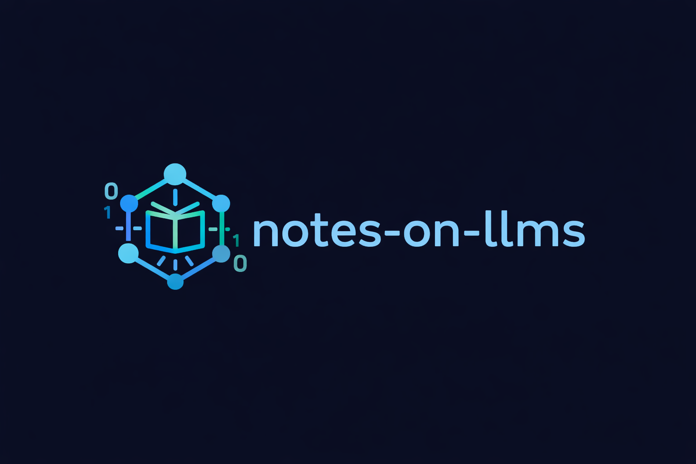

<p align="center">
  
</p>

<p align="center">
  <strong>一份面向工程实践的 LLM 系统学习手册</strong>
</p>

<p align="center">
  <a href="https://likebeans.github.io/notes-on-llms/">
    
  </a>
  <a href="https://github.com/likebeans/notes-on-llms/stargazers">
    
  </a>
  <a href="https://github.com/likebeans/notes-on-llms/blob/main/LICENSE">
    
  </a>
</p>

<p align="center">
  从 Prompt、RAG、Agent、MCP 到训练微调与多模态，系统整理大语言模型从原理到落地的关键知识。<br>
  目标不是堆概念，而是帮你建立可以反复复用的技术判断框架。
</p>

---

## 项目定位

LLM 相关资料很多，但常见问题也很明显：

- 只讲 API 调用，不讲系统边界；
- 只讲单篇论文，不讲工程取舍；
- 只讲模型能力，不讲评估、监控、成本和失败恢复；
- 内容分散，缺少从入门到生产实践的连续路径。

**notes-on-llms** 希望成为一份可持续更新的 LLM 技术手册：既能作为学习路线，也能作为做项目、准备面试和复盘工程方案时的参考资料。

在线阅读：

👉 [https://likebeans.github.io/notes-on-llms/](https://likebeans.github.io/notes-on-llms/)

## 内容地图

| 模块 | 关注问题 | 适合阅读阶段 |
| --- | --- | --- |
| [Prompt](https://likebeans.github.io/notes-on-llms/llms/prompt/) | 如何组织指令、上下文、结构化输出与安全边界 | 入门到进阶 |
| [RAG](https://likebeans.github.io/notes-on-llms/llms/rag/) | 如何让模型基于外部知识回答，并能评估与追溯 | 进阶 |
| [Agent](https://likebeans.github.io/notes-on-llms/llms/agent/) | 如何让模型规划、调用工具、处理状态和长任务 | 进阶到生产 |
| [MCP](https://likebeans.github.io/notes-on-llms/llms/mcp/) | 如何用协议连接模型、工具、资源和应用上下文 | 进阶 |
| [Training](https://likebeans.github.io/notes-on-llms/llms/training/) | 如何理解数据、SFT、RLHF、DPO、LoRA、评估与推理 | 深入 |
| [Multimodal](https://likebeans.github.io/notes-on-llms/llms/multimodal/) | 如何理解视觉编码、多模态连接、生成模型和部署评测 | 拓展 |

辅助栏目：

- [学习路径](https://likebeans.github.io/notes-on-llms/guide/)：按阶段安排阅读顺序。
- [实践项目](https://likebeans.github.io/notes-on-llms/practice/)：把知识点转成可验收的工程练习。
- [面试专区](https://likebeans.github.io/notes-on-llms/interviews/)：整理系统设计、RAG、Agent、训练微调等常见问题。
- [速查手册](https://likebeans.github.io/notes-on-llms/reference/)：术语、Checklist、指标和模板。
- [资源库](https://likebeans.github.io/notes-on-llms/resources/)：论文、官方文档、博客、视频和开源项目。

## CSDN 全文镜像

站内已同步作者 CSDN 博客最新 30 篇公开文章，并按本站知识体系重新归类：

- Agent：运行时、长任务、SSE 状态恢复、Agent UI、多智能体、评估体系、工具调用适配等；
- Prompt：GEO、结构化输出稳定性、Prompt 到工程治理；
- RAG：文档分块、知识图谱与检索增强；
- MCP：LSP / MCP / ACP / Agent 协议体系；
- Training：QPS、TPM、并发、对象存储与 AI 训练；
- Multimodal：实时 3D 数字人与大模型接入；
- 工程实践：Playwright、Celery、连接池、文件上传、权限、SSRF 等。

入口：

👉 [CSDN 全文镜像](https://likebeans.github.io/notes-on-llms/resources/csdn)

每篇镜像文章都保留原文链接和发布时间。正文主体保持原文内容，站内只补充元数据、来源说明和主题分类，方便在学习手册里连续阅读。

## 推荐学习顺序

如果你刚开始系统学习 LLM，可以按这个顺序走：

1. [前置知识](https://likebeans.github.io/notes-on-llms/guide/prerequisites)：补齐 Transformer、概率、向量检索和基础工程概念。
2. [Prompt](https://likebeans.github.io/notes-on-llms/llms/prompt/)：理解模型交互、上下文工程和结构化输出。
3. [RAG](https://likebeans.github.io/notes-on-llms/llms/rag/)：把模型接到外部知识，理解检索、重排、引用和评估。
4. [Agent](https://likebeans.github.io/notes-on-llms/llms/agent/)：学习工具调用、规划、记忆、人机协同、异常恢复和监控。
5. [Training](https://likebeans.github.io/notes-on-llms/llms/training/)：理解数据、微调、对齐、部署和推理优化。
6. [MCP](https://likebeans.github.io/notes-on-llms/llms/mcp/) 与 [Multimodal](https://likebeans.github.io/notes-on-llms/llms/multimodal/)：扩展到协议生态与多模态系统。

更完整的阶段安排见 [学习路线图](https://likebeans.github.io/notes-on-llms/guide/roadmap)。

## 仓库结构

```text
docs/
├── index.md                  # 首页
├── guide/                    # 学习路径与前置知识
├── llms/
│   ├── prompt/               # Prompt 与上下文工程
│   ├── rag/                  # RAG 核心组件、优化与生产实践
│   ├── agent/                # Agent 设计模式、运行时与工程治理
│   ├── mcp/                  # Model Context Protocol
│   ├── training/             # 训练、对齐、评估与推理部署
│   └── multimodal/           # 多模态模型与系统
├── practice/                 # 实践项目与工程主题
├── interviews/               # 面试题与系统设计
├── reference/                # 术语、指标、模板和 Checklist
├── resources/                # 论文、博客、视频、开源项目与 CSDN 镜像
└── .vitepress/               # VitePress 配置、主题与内容索引
```

## 本地开发

本项目使用 VitePress 与 pnpm。

```bash
git clone https://github.com/likebeans/notes-on-llms.git
cd notes-on-llms

pnpm install
pnpm docs:dev
```

常用命令：

| 命令 | 说明 |
| --- | --- |
| `pnpm docs:dev` | 启动本地开发服务器 |
| `pnpm test` | 运行单元测试 |
| `pnpm content:check` | 检查公开 Markdown 元数据、占位符和基础链接规则 |
| `pnpm docs:build` | 构建生产站点 |
| `pnpm site:check` | 检查构建后的 HTML 输出 |
| `pnpm quality` | 依次运行测试、内容检查、构建和站点检查 |

> 提示：由于站内包含 CSDN 全文镜像，生产构建会比普通文档站更慢，并可能出现 Rollup chunk 体积提示。只要 `pnpm quality` 最终通过即可。

## 内容维护原则

1. **标明状态**：区分已核验、待复核、观点、历史资料和草稿。
2. **保留来源**：重要事实优先链接论文、官方文档、官方博客或原始项目。
3. **承认时效性**：模型 API、框架和工具链变化很快，过时内容不假装“永远正确”。
4. **面向工程判断**：不仅解释是什么，也说明什么时候用、风险在哪里、如何评估。
5. **避免碎片化**：新增文章尽量放回 Prompt、RAG、Agent、MCP、Training、Multimodal 或实践路径中。

## 贡献方式

欢迎大家一起来优化整个网站。这里不只是一个人的学习笔记，也希望逐步变成一份更清晰、更可靠、更适合中文开发者阅读的 LLM 技术手册。

你可以通过 Issue 或 Pull Request 参与共建：

- 修正文档中的错误、失效链接或过时 API；
- 补充论文、官方文档、工程案例或评估方法；
- 改进 Mermaid 图、表格、Checklist 和模板；
- 增加真实项目中的失败案例与复盘经验。
- 优化网站的信息架构、视觉体验、导航路径和阅读节奏。

## License

本项目采用 [MIT License](./LICENSE)。
