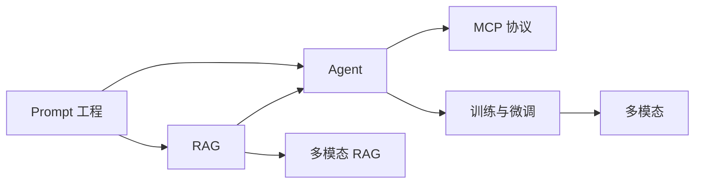

# 学习路线图

## 🎯 本篇目标

> 帮助你规划大模型应用开发的学习路径，从基础到进阶，循序渐进。

## 📊 技能树总览

```
大模型应用开发
├── 基础能力（前置知识）
│   ├── Python 编程
│   ├── HTTP/API 基础
│   └── 机器学习基础
│
├── 核心应用模块
│   ├── ✨ Prompt 工程 ⭐
│   │   ├── Zero-shot / Few-shot
│   │   ├── 思维链 (CoT)
│   │   ├── 提示优化
│   │   └── 安全防御
│   │
│   ├── 🔍 RAG 检索增强 ⭐⭐
│   │   ├── 文档处理与切分
│   │   ├── Embedding 技术
│   │   ├── 向量数据库
│   │   ├── 检索与重排序
│   │   └── 评估与优化
│   │
│   ├── 🤖 Agent 智能体 ⭐⭐⭐
│   │   ├── 工具调用 (Function Calling)
│   │   ├── 规划与推理 (ReAct/ToT)
│   │   ├── 记忆机制
│   │   └── 多智能体协作
│   │
│   └── 🔌 MCP 协议 ⭐⭐
│       ├── 协议基础
│       ├── 上下文管理
│       └── 高级特性
│
└── 深度技术模块
    ├── ⚙️ 训练与微调 ⭐⭐⭐⭐
    │   ├── 数据处理
    │   ├── SFT / LoRA / QLoRA
    │   ├── DPO / RLHF 对齐
    │   └── 推理优化
    │
    └── 👁️ 多模态 ⭐⭐⭐
        ├── 视觉编码器
        ├── 多模态 RAG
        └── 统一架构
```

## 🛤️ 推荐路径

### 路径一：应用开发者（3-6 个月）

**目标**：能够使用现有模型构建 RAG 和 Agent 应用

| 阶段 | 学习内容 | 对应模块 | 时间 | 难度 |
|------|---------|---------|------|------|
| **阶段 1：基础入门** | 前置知识 + LLM API 调用<br/>掌握基本交互方式 | [✨ Prompt 工程](/llms/prompt/) | 2 周 | ⭐ |
| **阶段 2：RAG 应用** | 文档检索、向量数据库<br/>构建知识库问答系统 | [🔍 RAG 检索增强](/llms/rag/) | 4 周 | ⭐⭐ |
| **阶段 3：Agent 开发** | 工具调用、规划推理<br/>构建自动化智能体 | [🤖 Agent 智能体](/llms/agent/)<br/>[🔌 MCP 协议](/llms/mcp/) | 4 周 | ⭐⭐⭐ |
| **阶段 4：生产部署** | 性能优化、监控评估<br/>实际项目落地 | 综合应用 | 2 周 | ⭐⭐ |

**学习顺序建议**：
```
Prompt 工程 → RAG → Agent → MCP (可选)
    ↓         ↓      ↓
  基础     进阶    高级
```

### 路径二：算法工程师（6-12 个月）

**目标**：能够进行模型微调和优化，深度定制模型

| 阶段 | 学习内容 | 对应模块 | 时间 | 难度 |
|------|---------|---------|------|------|
| **阶段 1：应用基础** | 完成应用开发者路径<br/>理解模型行为与能力边界 | [Prompt](/llms/prompt/)<br/>[RAG](/llms/rag/)<br/>[Agent](/llms/agent/) | 3 个月 | ⭐-⭐⭐⭐ |
| **阶段 2：数据处理** | 数据清洗、标注、构建<br/>质量评估与优化 | [⚙️ 训练与微调 - 数据](/llms/training/data) | 2 周 | ⭐⭐ |
| **阶段 3：高效微调** | SFT、LoRA、QLoRA<br/>参数高效微调实践 | [⚙️ 训练与微调 - LoRA](/llms/training/lora)<br/>[⚙️ 训练与微调 - SFT](/llms/training/sft) | 4 周 | ⭐⭐⭐ |
| **阶段 4：对齐优化** | RLHF、DPO<br/>人类偏好对齐 | [⚙️ 训练与微调 - RLHF](/llms/training/rlhf)<br/>[⚙️ 训练与微调 - DPO](/llms/training/dpo) | 4 周 | ⭐⭐⭐⭐ |
| **阶段 5：部署优化** | 推理优化、量化压缩<br/>生产环境部署 | [⚙️ 训练与微调 - Serving](/llms/training/serving)<br/>[⚙️ 训练与微调 - Eval](/llms/training/eval) | 4 周 | ⭐⭐⭐ |

**可选进阶**：
- **多模态方向**：[👁️ 多模态](/llms/multimodal/)（视觉理解、图文融合）- 4-6 周
- **研究探索**：新架构研究（Mamba、MoE）、前沿对齐技术

### 路径三：快速入门（1-2 个月）

**目标**：快速上手，构建简单应用

| 阶段 | 学习内容 | 对应模块 | 时间 | 难度 |
|------|---------|---------|------|------|
| **第 1 周** | Prompt 工程基础<br/>API 调用实践 | [✨ Prompt 工程](/llms/prompt/) | 1 周 | ⭐ |
| **第 2-3 周** | RAG 基础实现<br/>简单问答系统 | [🔍 RAG 检索增强](/llms/rag/) | 2 周 | ⭐⭐ |
| **第 4 周** | 综合项目实践 | 综合应用 | 1 周 | ⭐⭐ |

### 模块依赖关系



**依赖说明**：
- **Prompt 工程** 是基础，建议最先学习
- **RAG** 和 **Agent** 可以并行学习，但建议先掌握 RAG 基础
- **MCP 协议** 在掌握 Agent 后学习效果更佳
- **训练与微调** 需要较强的机器学习基础
- **多模态** 可以独立学习，但了解 RAG/Agent 有助于理解应用场景

## 💻 实践项目建议

### 入门项目（1-2 周）

1. **智能问答助手**
   - 技术栈：[Prompt 工程](/llms/prompt/)
   - 功能：基于 API 的对话机器人
   - 学习点：Zero-shot、Few-shot、Temperature 调优

2. **简单 RAG 系统**
   - 技术栈：[RAG 检索增强](/llms/rag/) 基础
   - 功能：文档检索 + LLM 生成回答
   - 学习点：文档切分、Embedding、向量检索

### 进阶项目（1-2 个月）

3. **企业知识库 RAG 系统**
   - 技术栈：[RAG 检索增强](/llms/rag/) 全链路
   - 功能：多文档索引、混合检索、重排序、引用溯源
   - 学习点：分块策略、检索优化、评估体系

4. **工具调用 Agent**
   - 技术栈：[Agent 智能体](/llms/agent/) - 工具调用
   - 功能：天气查询、计算器、数据库操作
   - 学习点：Function Calling、错误处理、工具编排

5. **智能规划 Agent**
   - 技术栈：[Agent 智能体](/llms/agent/) - 规划与推理
   - 功能：复杂任务分解、多步执行、自我反思
   - 学习点：ReAct、ToT、Reflexion

### 高级项目（2-3 个月）

6. **多工具 Agent 系统**
   - 技术栈：[Agent](/llms/agent/) + [MCP 协议](/llms/mcp/)
   - 功能：搜索引擎、代码执行、API 调用、多轮对话
   - 学习点：多工具协调、状态管理、MCP 协议

7. **多模态 RAG Agent**
   - 技术栈：[RAG](/llms/rag/) + [Agent](/llms/agent/) + [多模态](/llms/multimodal/)
   - 功能：图文检索、视觉问答、多模态推理
   - 学习点：视觉编码、多模态检索、Agent 规划

8. **自定义微调模型**
   - 技术栈：[训练与微调](/llms/training/)
   - 功能：领域数据微调、指令遵循优化、对齐训练
   - 学习点：LoRA/QLoRA、SFT、DPO、评估部署

### 综合项目（3-6 个月）

9. **生产级 AI 应用**
   - 技术栈：全栈技术整合
   - 功能：完整产品、性能优化、监控告警、A/B 测试
   - 学习点：系统设计、工程实践、运维部署

**项目选择建议**：
- 初学者：从项目 1-2 开始，循序渐进
- 应用开发者：重点完成项目 3-5，掌握核心应用技术
- 算法工程师：深入项目 6-8，掌握模型定制能力

## 📚 延伸阅读

### 指南文档

- [前置知识](/guide/prerequisites) - 查看所需的基础知识要求

### 核心技术模块导航

<div class="custom-card-grid" style="display: grid; grid-template-columns: repeat(auto-fit, minmax(250px, 1fr)); gap: 1rem; margin: 1rem 0;">

  <a href="/llms/prompt/" class="custom-card" style="padding: 1rem; border: 1px solid #e1e4e8; border-radius: 6px; text-decoration: none; color: inherit;">
    <h3 style="margin: 0 0 0.5rem 0; font-size: 1.1rem;">✨ Prompt 工程</h3>
    <p style="margin: 0 0 0.5rem 0; font-size: 0.9rem; color: #586069;">Zero-shot、Few-shot、CoT、ToT 等提示技术</p>
    <span style="font-size: 0.85rem; color: #0366d6;">难度：⭐ | 建议：第 1 阶段</span>
  </a>

  <a href="/llms/rag/" class="custom-card" style="padding: 1rem; border: 1px solid #e1e4e8; border-radius: 6px; text-decoration: none; color: inherit;">
    <h3 style="margin: 0 0 0.5rem 0; font-size: 1.1rem;">🔍 RAG 检索增强</h3>
    <p style="margin: 0 0 0.5rem 0; font-size: 0.9rem; color: #586069;">文档处理、向量检索、重排序、评估优化</p>
    <span style="font-size: 0.85rem; color: #0366d6;">难度：⭐⭐ | 建议：第 2 阶段</span>
  </a>

  <a href="/llms/agent/" class="custom-card" style="padding: 1rem; border: 1px solid #e1e4e8; border-radius: 6px; text-decoration: none; color: inherit;">
    <h3 style="margin: 0 0 0.5rem 0; font-size: 1.1rem;">🤖 Agent 智能体</h3>
    <p style="margin: 0 0 0.5rem 0; font-size: 0.9rem; color: #586069;">工具调用、规划推理、记忆机制、多智能体</p>
    <span style="font-size: 0.85rem; color: #0366d6;">难度：⭐⭐⭐ | 建议：第 3 阶段</span>
  </a>

  <a href="/llms/mcp/" class="custom-card" style="padding: 1rem; border: 1px solid #e1e4e8; border-radius: 6px; text-decoration: none; color: inherit;">
    <h3 style="margin: 0 0 0.5rem 0; font-size: 1.1rem;">🔌 MCP 协议</h3>
    <p style="margin: 0 0 0.5rem 0; font-size: 0.9rem; color: #586069;">Model Context Protocol，标准化上下文协议</p>
    <span style="font-size: 0.85rem; color: #0366d6;">难度：⭐⭐ | 建议：第 3-4 阶段</span>
  </a>

  <a href="/llms/training/" class="custom-card" style="padding: 1rem; border: 1px solid #e1e4e8; border-radius: 6px; text-decoration: none; color: inherit;">
    <h3 style="margin: 0 0 0.5rem 0; font-size: 1.1rem;">⚙️ 训练与微调</h3>
    <p style="margin: 0 0 0.5rem 0; font-size: 0.9rem; color: #586069;">SFT、LoRA、DPO、RLHF、推理优化</p>
    <span style="font-size: 0.85rem; color: #0366d6;">难度：⭐⭐⭐⭐ | 建议：算法工程师路径</span>
  </a>

  <a href="/llms/multimodal/" class="custom-card" style="padding: 1rem; border: 1px solid #e1e4e8; border-radius: 6px; text-decoration: none; color: inherit;">
    <h3 style="margin: 0 0 0.5rem 0; font-size: 1.1rem;">👁️ 多模态</h3>
    <p style="margin: 0 0 0.5rem 0; font-size: 0.9rem; color: #586069;">视觉编码、多模态 RAG、统一架构</p>
    <span style="font-size: 0.85rem; color: #0366d6;">难度：⭐⭐⭐ | 建议：进阶探索</span>
  </a>

</div>

### 学习建议

1. **按顺序学习**：Prompt → RAG → Agent → MCP，循序渐进
2. **理论结合实践**：每学习一个模块，完成对应的实践项目
3. **及时复习**：新模块会用到之前的知识，定期回顾
4. **关注最新动态**：大模型技术发展迅速，关注最新研究和实践
