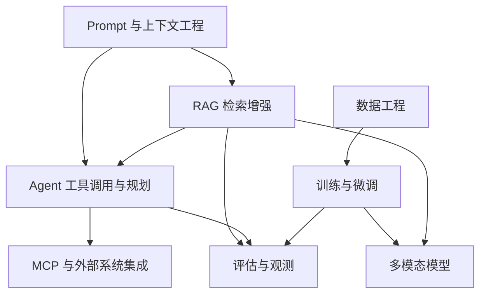

# 学习路线图

这里保留更细的时间表和项目建议。若你还没决定走哪条路，先读 [学习路径总览](/guide/)；如果已经有目标，可以直接跳到对应路线。

## 技能树总览

```mermaid
flowchart TB
    P[Prompt 与上下文工程] --> R[RAG 检索增强]
    P --> A[Agent 工具调用与规划]
    R --> A
    A --> M[MCP 与外部系统集成]
    R --> E[评估与观测]
    A --> E
    D[数据工程] --> T[训练与微调]
    T --> E
    T --> V[多模态模型]
    R --> V
```

## 路径一：应用开发者（3-6 个月）

回到总览：[应用开发者路径](/guide/#路径一-应用开发者-3-6-个月)。

| 阶段 | 时间 | 学习重点 | 产出 |
| --- | --- | --- | --- |
| 1. Prompt 与 API | 1-2 周 | 结构化提示、上下文、函数/工具调用、失败样本记录 | 一个可配置的问答脚本 |
| 2. RAG 基础 | 3-5 周 | 文档切分、Embedding、向量库、召回与引用 | 一个带来源引用的知识库问答 |
| 3. Agent 工具调用 | 3-5 周 | 工具 schema、任务分解、错误恢复、人机确认 | 一个能调用 2-3 个工具的工作流助手 |
| 4. MCP 与集成 | 1-3 周 | Host/Client/Server、权限边界、上下文注入 | 一个可复用的 MCP server 或 client demo |
| 5. 生产实践 | 持续 | 评估、监控、成本、延迟、灰度发布 | 一份 release checklist 与评估集 |

建议项目：

1. 个人知识库 RAG：支持 Markdown/PDF，答案必须带引用。
2. 文档审查助手：按 checklist 输出风险、证据和建议改法。
3. 工具型 Agent：连接搜索、数据库或 GitHub issue，加入失败重试和审批。
4. 小型 MCP 服务：把本地文件、浏览器或业务 API 封装为工具。

## 路径二：算法工程师（6-12 个月）

回到总览：[算法工程师路径](/guide/#路径二-算法工程师-6-12-个月)。

| 阶段 | 时间 | 学习重点 | 产出 |
| --- | --- | --- | --- |
| 1. 前置补齐 | 4-8 周 | Transformer、tokenization、优化器、验证集 | 能复述训练/推理链路 |
| 2. 数据工程 | 2-4 周 | 数据清洗、去重、合成、质量抽检 | 一份数据卡和清洗脚本 |
| 3. SFT/LoRA | 4-6 周 | 指令数据、参数高效微调、显存估算 | 一个小模型 LoRA 实验 |
| 4. DPO/RLHF | 4-8 周 | 偏好数据、奖励模型、直接偏好优化 | 一组偏好优化实验记录 |
| 5. 评估与部署 | 4-8 周 | 离线评估、红队、量化、推理服务 | 一份模型评估报告 |
| 6. 多模态扩展 | 可选 4-8 周 | 视觉编码器、连接器、多模态 RAG | 一个图文问答或检索 demo |

建议项目：

1. 指令数据质量评估：抽样标注、去重、分桶统计。
2. LoRA 微调实验：比较不同 rank、学习率和数据规模。
3. 偏好数据实验：构造 chosen/rejected，对比 SFT 与 DPO。
4. 推理服务压测：记录吞吐、延迟、显存和成本。

## 路径三：面试冲刺（2-6 周）

回到总览：[面试冲刺路径](/guide/#路径三-面试冲刺-2-6-周)。

| 阶段 | 时间 | 学习重点 | 产出 |
| --- | --- | --- | --- |
| 1. 术语速查 | 2-3 天 | Token、Embedding、RAG、Agent、LoRA、DPO | 一页个人术语卡 |
| 2. 高频问答 | 1-2 周 | RAG、Agent、训练与微调的核心题 | 每题 2 分钟口述答案 |
| 3. 系统设计 | 1-2 周 | 知识库问答、客服 Agent、评估平台 | 2-3 张架构草图 |
| 4. 代码题 | 3-7 天 | 文本切分、Top-k、缓存、重试、评估脚本 | 可运行的小题模板 |
| 5. 项目复盘 | 3-7 天 | 指标、失败案例、权衡与迭代 | STAR 格式项目叙述 |

建议顺序：[面试专区](/interviews/) → [术语表](/reference/glossary) → [Checklist](/reference/checklists) → 系统设计与代码题。

## 模块依赖说明

- Prompt 是所有模块的入口：它训练你描述任务、约束输出和观察失败。
- RAG 是应用落地的核心：它把模型能力和外部知识连接起来。
- Agent 需要先理解工具调用，再谈规划、记忆和多智能体。
- MCP 是 Agent 工具生态的协议化补充，适合在有集成需求后学习。
- 训练与微调要先有数据和评估，否则很容易把问题“训练坏”。
- 多模态既可作为算法方向，也可作为 RAG/Agent 的输入扩展。

## 怎么判断可以进入下一阶段

| 当前阶段 | 可以进入下一阶段的信号 |
| --- | --- |
| Prompt | 能稳定复现同一任务的输入、输出和失败样本 |
| RAG | 能解释一次错误答案是召回、重排、上下文还是生成问题 |
| Agent | 能处理工具失败、权限确认、重试和中途停止 |
| MCP | 能说清 Host、Client、Server 各自保存什么状态 |
| 微调 | 能证明数据/提示/RAG 不能解决，再选择训练 |
| 评估 | 能把“感觉变好”转成样本、指标和对照实验 |

## 延伸入口

- [前置知识](/guide/prerequisites)：补齐学习前的最低基础。
- [知识体系](/llms/)：查看六个技术模块如何连接。
- [实践项目](/practice/)：从项目反推应该学哪一章。
