# AI Agent 全景

> 人工智能正经历从"对话式 AI"向"**代理式 AI（Agentic AI）**"的历史性跨越。AI Agent 通过将 LLM 视为核心认知控制器，并挂载规划、记忆、工具使用等模块，实现了从**被动推理到主动行动**的质变。

---

## 核心公式

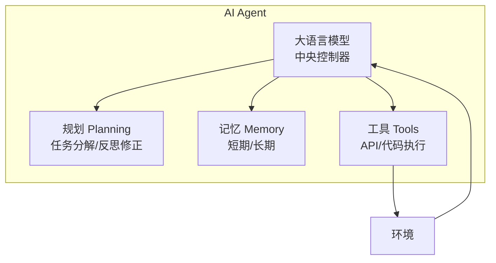

$$\text{Agent} = \text{LLM} + \text{Planning} + \text{Memory} + \text{Tools}$$

| 组件 | 职责 |
| :--- | :--- |
| **LLM** | "大脑"，处理自然语言、逻辑推理、生成行动指令 |
| **Planning** | 任务分解（Decomposition）+ 反思修正（Reflection） |
| **Memory** | 短期（上下文窗口）+ 长期（向量数据库） |
| **Tools** | 调用外部 API、代码解释器、搜索引擎等 |

---

## 1. 规划能力（Planning）

规划是区分"聊天机器人"与"智能体"的分水岭。

### 1.1 思维链（Chain of Thought）

**CoT** 通过提示模型"一步步思考"，诱导生成中间推理步骤。

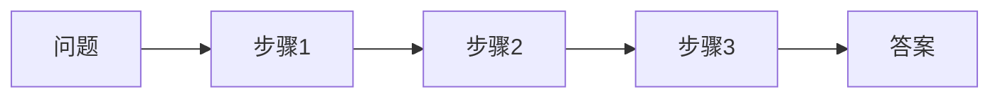

**原理**：利用更多的测试时计算（Test-time Computation）换取准确率。

**局限**：线性推理，中间一步错则全盘崩塌。

### 1.2 思维树（Tree of Thoughts）

**ToT** 将推理建模为树结构，支持分支探索与回溯。

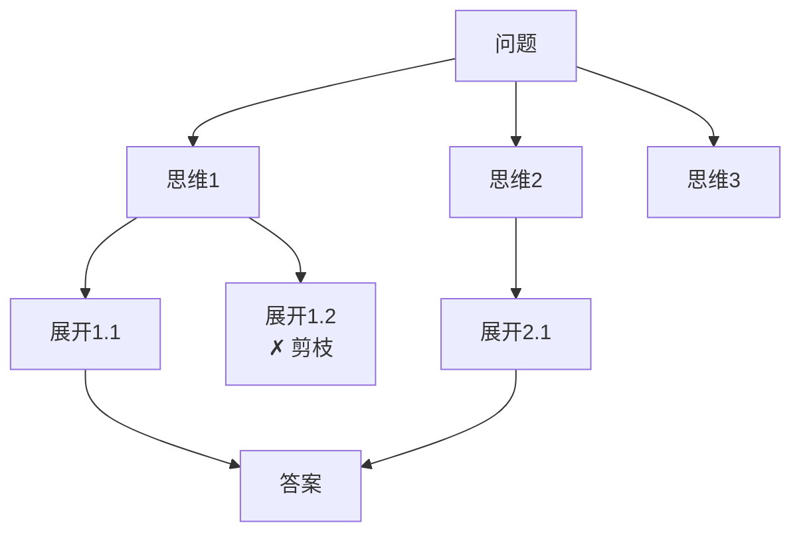

**核心机制**：
- **搜索算法**：BFS/DFS 遍历
- **自我评估**：模型评估每条路径的潜力
- **回溯**：低分路径被剪枝，选择另一分支

**效果**：24 点游戏中，CoT 成功率 **4%** → ToT 成功率 **74%**

### 1.3 ReAct：推理 + 行动

**ReAct** 框架交织推理与行动，解决纯推理易幻觉、纯行动缺目标的问题。

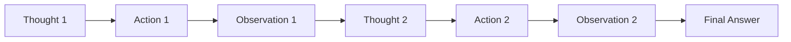

**示例**：
```
问题：亚里士多德的老师是谁的老师？

Thought 1: 需要先查亚里士多德的老师
Action 1: Search("亚里士多德 老师")
Observation 1: 柏拉图

Thought 2: 再查柏拉图的老师
Action 2: Search("柏拉图 老师")
Observation 2: 苏格拉底

Final Answer: 苏格拉底
```

### 1.4 Reflexion：从错误中学习

**Reflexion** 在 ReAct 基础上引入长期记忆维度的反思。

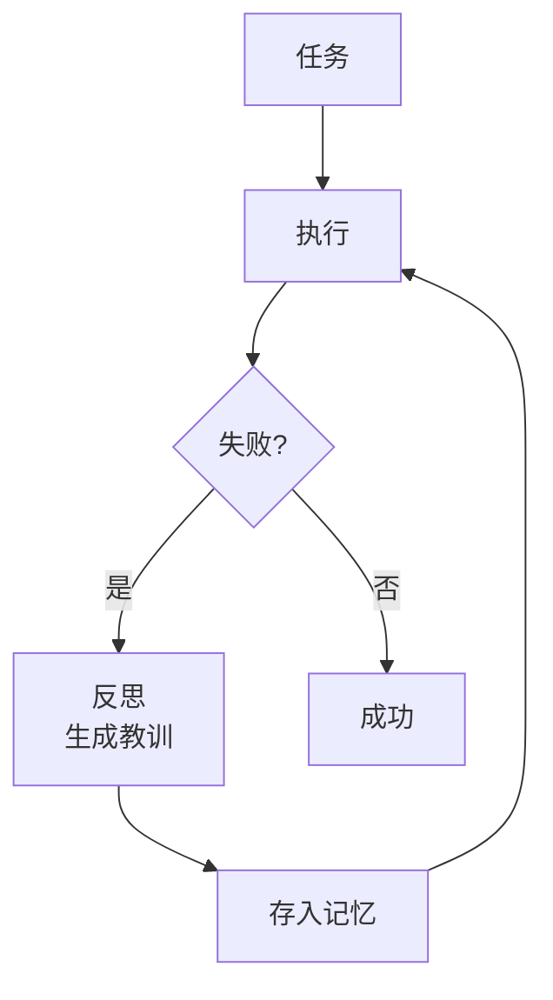

**特点**：将"教训"存入内存作为下次上下文，实现**无需微调的自我进化**。

### 1.5 规划技术对比

| 技术 | 结构 | 特点 | 适用场景 |
| :--- | :--- | :--- | :--- |
| **CoT** | 线性 | 简单有效 | 数学/逻辑推理 |
| **ToT** | 树状 | 可回溯 | 探索性/创意任务 |
| **ReAct** | 循环 | 边想边做 | 信息检索/多步任务 |
| **Reflexion** | 循环+记忆 | 从错误学习 | 长周期任务 |

---

## 2. 记忆系统（Memory）

记忆解决了 LLM "即用即忘"的特性，是构建持续性 Agent 的关键。

### 2.1 认知分层

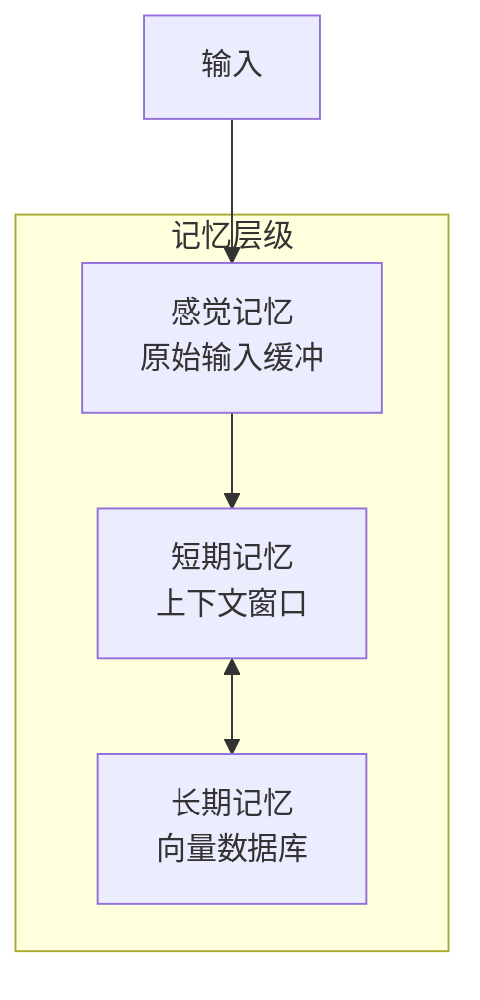

| 层级 | 类比 | 实现 |
| :--- | :--- | :--- |
| **感觉记忆** | 瞬时缓冲 | Image/Audio Embedding |
| **短期记忆** | RAM | LLM 上下文窗口 |
| **长期记忆** | 硬盘 | 向量数据库（Pinecone, Milvus） |

### 2.2 向量检索机制

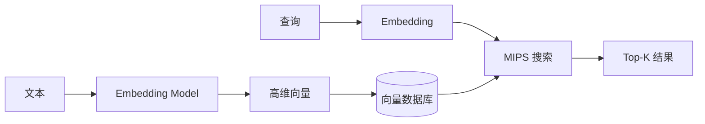

**常用算法**：HNSW、LSH（亿级数据毫秒级检索）

### 2.3 生成式记忆流（Generative Agents）

斯坦福"AI 小镇"提出的记忆架构：

**检索评分公式**：

$$\text{Score} = \alpha_{\text{recency}} \cdot R + \alpha_{\text{importance}} \cdot I + \alpha_{\text{relevance}} \cdot S$$

| 维度 | 含义 | 计算方式 |
| :--- | :--- | :--- |
| **Recency** | 新近性 | 指数衰减函数 |
| **Importance** | 重要性 | LLM 打分（1-10） |
| **Relevance** | 相关性 | 余弦相似度 |

**反思机制**：定期从碎片记忆中提炼高层概括（如"我是一个注重健康的人"）。

---

## 3. 工具使用（Tool Use）

工具是 Agent 连接数字世界的桥梁。

### 3.1 从 MRKL 到 Toolformer

| 方法 | 机制 | 特点 |
| :--- | :--- | :--- |
| **MRKL** | 路由分发 | 将查询路由到专家模块 |
| **Toolformer** | 自监督学习 | 模型自主探索何时调用工具 |

**Toolformer 训练**：如果 API 调用能降低后续 Perplexity，则保留该调用。

### 3.2 Gorilla：检索感知训练

解决 API 调用的**幻觉**和**滞后性**问题。

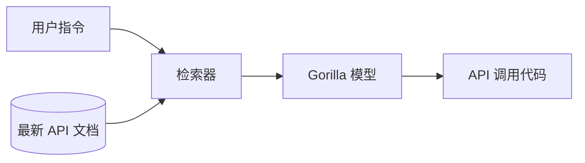

**RAT（Retriever-Aware Training）**：模型基于"指令 + 检索到的最新文档"生成代码，适应 API 快速迭代。

---

## 4. 多智能体系统（Multi-Agent）

当任务复杂度超过单 Agent 上限时，多智能体协作成为必然。

### 4.1 协作架构

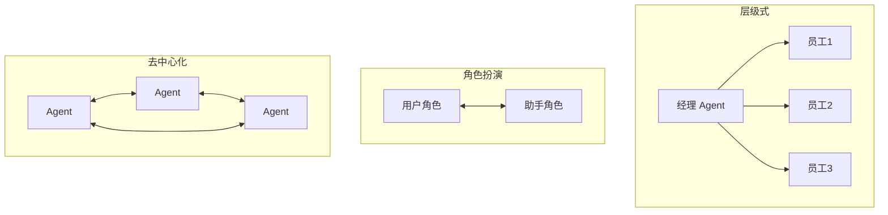

| 架构 | 描述 | 优缺点 |
| :--- | :--- | :--- |
| **层级式** | 经理分发任务给员工 | 控制力强，但中心易成瓶颈 |
| **角色扮演** | 平等交互，多轮对话 | 灵活，但易死循环 |
| **去中心化** | 点对点通信 | 扩展性强，但难保证全局最优 |

### 4.2 主流框架对比

| 框架 | 核心理念 | 特点 | 适用场景 |
| :--- | :--- | :--- | :--- |
| **AutoGen** | Conversable Agent | 灵活配置，支持代码执行 | 快速原型、代码生成 |
| **MetaGPT** | SOP 标准作业程序 | 明确职能角色、交付物标准 | 软件工程项目 |
| **LangGraph** | 图论与状态机 | 显式循环、精确控制流 | 生产环境、企业 RAG |

### 4.3 交互协议

| 协议 | 提出方 | 目的 |
| :--- | :--- | :--- |
| **MCP** | Anthropic | Agent 连接数据源标准 |
| **Agent Protocol** | 开放标准 | Agent 对外 REST API |
| **A2A** | Google | Agent 间服务发现与通信 |

---

## 5. 安全与评测

### 5.1 提示词注入攻防

| 攻击类型 | 方式 | 示例 |
| :--- | :--- | :--- |
| **直接注入** | 在输入中加入恶意指令 | "忽略之前的指令..." |
| **间接注入** | 在网页/邮件中隐藏指令 | 白色字体写在白色背景 |

**防御机制**：
- **指令层级化**：系统指令与用户数据严格隔离
- **Constitutional AI**：独立监督者 Agent 审查行动
- **Human-in-the-Loop**：敏感操作强制人类确认

### 5.2 评测基准

| 基准 | 特点 |
| :--- | :--- |
| **AgentBench** | 8 个环境（OS、DB、游戏等），综合评估多轮交互 |
| **GAIA** | "对人简单，对 AI 极难"的多步任务（人类 92% vs GPT-4 15%） |

### 5.3 可观测性（LangSmith）

**Trace 链路追踪**：
- 输入 Prompt
- 检索到的 Chunks
- CoT 中间思考
- 工具调用与返回
- 最终输出

---

## 6. 标杆应用

### 6.1 Devin：AI 软件工程师

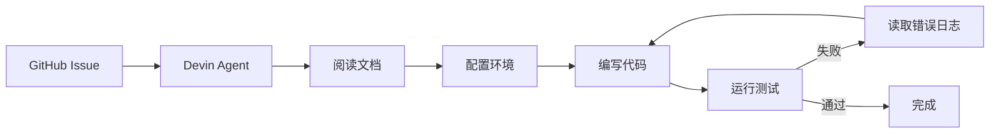

**核心架构**：
- **沙箱环境**：隔离 Linux 容器，完整 Shell + 浏览器 + 编辑器
- **长期规划器**：动态任务列表，逐步打勾

**效果**：SWE-bench 解决率 **13.86%**（此前最好模型 < 2%）

### 6.2 Voyager：终身学习 Agent

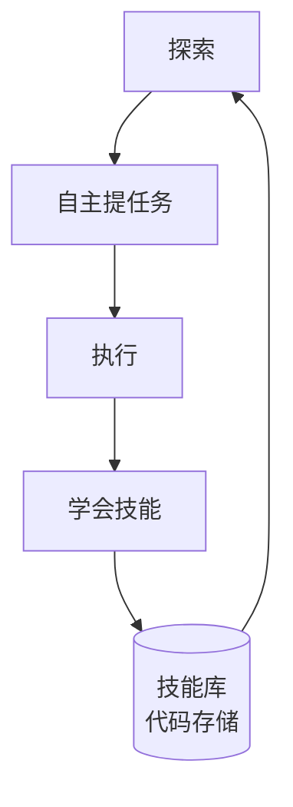

**创新点**：
- **自动课程**：根据状态自己给自己提任务
- **技能库**：将经验固化为可执行代码，检索复用

---

## 7. 前沿趋势

### 7.1 端侧 Agent

| 技术 | 要点 |
| :--- | :--- |
| **MobileLLM** | Deep and Thin 架构、Embedding Sharing |
| **Gemini Nano** | 植入 Android，离线处理 |

### 7.2 Agent OS

> LLM 取代 CPU 成为新内核，Context Window 成为新 RAM。

| 能力 | 说明 |
| :--- | :--- |
| **资源调度** | 管理 Agent 对推理算力和上下文的争夺 |
| **权限管理** | 控制 Agent 对摄像头、支付接口的访问 |
| **互操作性** | A2A 协议实现端侧与云端 Agent 协作 |

---

## 📚 学习路线

<div class="learning-path">
  <div class="path-step step-1">
    <div class="step-num">1</div>
    <div class="step-title">基础概念</div>
    <ul>
      <li><a href="/llms/agent/tool-calling">工具调用</a></li>
      <li><a href="/llms/agent/planning">规划与推理</a></li>
      <li><a href="/llms/agent/memory">记忆系统</a></li>
    </ul>
  </div>
  <div class="path-arrow">→</div>
  <div class="path-step step-2">
    <div class="step-num">2</div>
    <div class="step-title">框架实战</div>
    <ul>
      <li>LangGraph</li>
      <li>AutoGen</li>
      <li><a href="/llms/agent/multi-agent">多智能体</a></li>
    </ul>
  </div>
  <div class="path-arrow">→</div>
  <div class="path-step step-3">
    <div class="step-num">3</div>
    <div class="step-title">生产部署</div>
    <ul>
      <li><a href="/llms/agent/safety">安全与沙箱</a></li>
      <li><a href="/llms/agent/evaluation">评估方法</a></li>
      <li>可观测性</li>
    </ul>
  </div>
</div>

---

## 🔗 章节导航

| 章节 | 内容 | 状态 |
| :--- | :--- | :--- |
| [工具调用](/llms/agent/tool-calling) | Function Calling、MCP 协议 | 📝 |
| [规划与推理](/llms/agent/planning) | CoT、ToT、ReAct、Reflexion | 📝 |
| [记忆系统](/llms/agent/memory) | 短期/长期记忆、向量检索 | 📝 |
| [多智能体](/llms/agent/multi-agent) | AutoGen、MetaGPT、LangGraph | 📝 |
| [安全与沙箱](/llms/agent/safety) | 提示注入防御、权限控制 | 📝 |
| [评估方法](/llms/agent/evaluation) | AgentBench、GAIA | 📝 |

---

## 📚 深度系列文章

### Agent 原理与架构

| 文章 | 简介 |
| :--- | :--- |
| [Function Calling 与 ReAct 深度对决](https://dd-ff.blog.csdn.net/article/details/153210207) | 两大核心策略对比 |
| [12-Factor Agent 方法论](https://dd-ff.blog.csdn.net/article/details/154185674) | 生产级开发原则 |
| [深入剖析自主 AI 研究智能体](https://dd-ff.blog.csdn.net/article/details/150217636) | 认知架构 |

### LangGraph 系列

| 文章 | 简介 |
| :--- | :--- |
| [LangGraph 深度解析（一）](https://dd-ff.blog.csdn.net/article/details/151024355) | 核心原理到生产级工作流 |
| [LangGraph 多智能体系统](https://dd-ff.blog.csdn.net/article/details/151153365) | 多 Agent 协作架构 |
| [LangGraph 内存机制](https://dd-ff.blog.csdn.net/article/details/151118407) | 短期/长期记忆管理 |

### AutoGen 系列

| 文章 | 简介 |
| :--- | :--- |
| [AutoGen 快速入门](https://dd-ff.blog.csdn.net/article/details/149055083) | 工具调用型代理 |
| [AutoGen 多智能体团队](https://dd-ff.blog.csdn.net/article/details/149090900) | Teams 协作 |

---

## 🌐 核心资源

### 重要论文

| 论文 | 主题 |
| :--- | :--- |
| [LLM Powered Autonomous Agents](https://lilianweng.github.io/posts/2023-06-23-agent/) | Lilian Weng 经典博文 |
| [ReAct](https://arxiv.org/abs/2210.03629) | 推理 + 行动框架 |
| [Tree of Thoughts](https://arxiv.org/abs/2305.10601) | 思维树 |
| [Generative Agents](https://arxiv.org/abs/2304.03442) | 斯坦福 AI 小镇 |
| [Toolformer](https://arxiv.org/abs/2302.04761) | 自主工具使用 |
| [Voyager](https://arxiv.org/abs/2305.16291) | Minecraft 终身学习 |

### 开发框架

| 框架 | 说明 |
| :--- | :--- |
| [LangGraph](https://langchain-ai.github.io/langgraph/) | LangChain Agent 框架 |
| [AutoGen](https://microsoft.github.io/autogen/) | 微软多 Agent 框架 |
| [MetaGPT](https://github.com/geekan/MetaGPT) | SOP 驱动软件开发 |

---

> **展望**：一个由数十亿 AI Agent 构成的协作网络正在地平线上浮现。随着端侧模型优化和互操作协议标准化，Agent 将从"任务执行者"进化为"自主协作者"。
