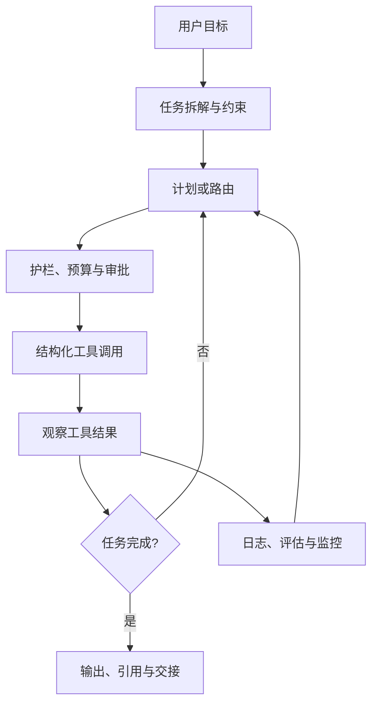

# AI Agent 全景

<LearningObjectives :items="[
  '能够区分工作流、工具调用型应用和真正需要循环决策的 Agent，避免为简单任务引入不必要自治性。',
  '能够设计一个带工具 schema、状态、预算、异常恢复、人机审批与日志追踪的 Agent 主循环。',
  '能够为 Agent 建立覆盖任务成功率、工具调用正确性、安全边界、成本延迟和人工接管质量的评估方案。'
]" />

## 这个模块解决什么问题

Agent 的核心不是“让模型自己想办法”，而是让模型在受控环境中选择行动、调用工具、观察结果，并在必要时继续规划或交给人。ReAct 论文把 reasoning 与 acting 放在同一循环里：模型不只输出最终答案，还可以把中间推理转化成搜索、查表、执行代码等动作；Toolformer 则说明模型可以学习何时使用外部工具。今天的生产 Agent 通常把这些思想落到结构化工具调用、状态机、审批流、监控和评估上。

一个清醒的判断是：多数业务场景先需要可靠工作流，再需要 Agent。固定步骤、稳定输入输出、错误成本高的任务，往往适合确定性编排加少量模型节点；只有当任务需要动态选择工具、处理不完整信息、跨多步观察环境、或者在失败后尝试替代路径时，Agent 才真正有价值。Agent 不是魔法自动化，而是一种把“不确定决策”显式封装、可追踪、可限制的系统设计。

本模块把 Agent 看成一个“受控行动循环”。它由任务意图、上下文状态、计划器、工具集合、观察结果、记忆、护栏、评估与人类协作组成。你会看到很多模式：提示链、路由、并行化、反思、工具调用、规划、多智能体、记忆、人机协同、异常处理和资源优化。它们不是越多越好，而是用来回答同一个问题：怎样让模型的每一步行动都可解释、可回放、可停止、可改进？

旧稿里的核心公式仍然值得保留，但现在要给它加上工程边界：`Agent = LLM + Planning + Memory + Tools`。LLM 是认知控制器，负责理解目标、生成候选计划和解释观察；Planning 负责拆解任务、选择下一步或判断是否停止；Memory 负责保留短期状态、长期偏好和历史教训；Tools 负责连接外部世界。真正的生产系统还要在这个公式外面包一层 runtime：权限、预算、日志、审批、评估和回滚。没有 runtime 的 Agent 只是一个会调用工具的 prompt，有了 runtime 才能成为可运营的软件。

## 核心工作流


```mermaid
flowchart TB
  User[用户目标] --> Intent[任务拆解与约束]
  Intent --> Plan[计划或路由]
  Plan --> Guard[护栏、预算与审批]
  Guard --> Tool[结构化工具调用]
  Tool --> Observe[观察工具结果]
  Observe --> Decide{任务完成?}
  Decide -- 否 --> Plan
  Decide -- 是 --> Answer[输出、引用与交接]
  Observe --> Trace[日志、评估与监控]
  Trace --> Plan
```

这条循环里最重要的是边界。模型可以选择工具，但工具 schema 要明确；模型可以规划，但最大步数、预算和超时要明确；模型可以写入外部系统，但高风险动作要有人审或沙箱执行；模型可以记忆，但记忆要有来源、过期策略和删除机制；模型可以反思，但反思不能替代可量化评估。

生产 Agent 的工程质量常常取决于“失败路径”而不是成功 demo。工具报错怎么办？搜索没有结果怎么办？模型多次调用同一工具怎么办？两个工具返回冲突信息怎么办？用户要求越权操作怎么办？成本超过预算怎么办？如果这些路径没有明确设计，Agent 很快会变成一个昂贵、不可复现、偶尔惊艳但难以信任的黑箱。

旧稿里用 ReAct 解释“边想边做”，这个例子可以保留成 trace 视角。现在不建议把中间推理原样暴露给终端用户，但系统内部仍应记录足够的行动轨迹，方便调试和评估：

```text
用户问题：亚里士多德的老师是谁的老师？
plan: 需要先查亚里士多德的老师，再查这个人的老师。
tool_call_1: search("亚里士多德 老师")
observation_1: 柏拉图
tool_call_2: search("柏拉图 老师")
observation_2: 苏格拉底
final: 苏格拉底
```

这个 trace 的重点不是让模型“自言自语”，而是让每个外部行动都能被审计：为什么调用这个工具，参数是什么，观察结果是什么，最终答案是否真的依赖这些观察。后续做反思、自检或多智能体互审时，也应该围绕这条轨迹增量增强，而不是让多个 Agent 在没有共享状态和停止条件的情况下互相聊天。

## 关键概念

| 概念 | 它解决什么 | 使用时要警惕 |
| --- | --- | --- |
| 工作流 vs Agent | 工作流适合稳定步骤；Agent 适合动态决策、观察环境和多轮行动。 | 不要把可确定编排的问题伪装成自治系统。 |
| 工具调用 | 用 schema 把模型输出约束为可执行动作，并让系统层负责执行与校验。 | schema 过宽会放大风险；工具结果必须进入 trace，不能只拼回 prompt。 |
| 规划与路由 | 把复杂任务拆成子任务，或选择最合适的模型、工具和路径。 | 计划并不天然正确，需要预算、停止条件和失败恢复。 |
| 记忆 | 保存用户偏好、任务状态、历史决策或长期知识。 | 记忆要可解释、可删除、可过期；不要把隐私数据随意注入上下文。 |
| 反思与自检 | 让模型在输出前检查遗漏、冲突和工具结果一致性。 | 自评容易同源偏差，应配合独立 grader、规则校验或人工抽检。 |
| 多智能体 | 用角色分工、并行探索或互审处理复杂任务。 | 协调成本、上下文膨胀和责任边界可能抵消收益。 |
| 人机协同 | 在高风险、低置信度或不可逆动作前引入人工审批。 | 审批点太多会拖慢系统，太少会把风险外包给模型。 |
| 评估与监控 | 用数据集、轨迹、grader 和线上指标持续发现退化。 | 只看最终成功率不够；还要看工具选择、步骤数、成本、延迟和安全事件。 |

## 从最小闭环开始选型

先把一个业务任务写成“输入、可用动作、成功证据、停止条件”。例如订单查询的成功证据是订单服务返回的状态和更新时间；退款任务的成功证据是可核验的退款记录，不能用模型一句“已退款”替代。

| 任务表现 | 先尝试的结构 | 增加复杂度前的证据 |
| --- | --- | --- |
| 一次检索即可回答 | RAG + 引用校验 | 多轮检索确实改善遗漏问题 |
| 步骤和分支稳定 | 提示链、规则路由 | 固定流程覆盖不了真实输入 |
| 下一步依赖环境反馈 | 有预算的工具循环 | 工具结果可验证，失败可停止 |
| 多个子任务互相独立 | 有界并行；必要时再拆 Agent | 端到端延迟或成功率有收益 |

这是一套工程选型顺序，不是能力等级。工作流和动态 Agent 的边界可参考 [Anthropic 对两类系统的定义](https://www.anthropic.com/engineering/building-effective-agents)。先保留简单基线，才能判断规划、反思和多 Agent 是否值得。

每次运行至少记录 `run_id`、任务状态、工具调用与结果标识、已用预算、最终产物和结束原因。把“等待用户”“预算耗尽”“执行失败”与“完成”分开，后续章节的规划、记忆和恢复才能围绕同一份状态协作。

## 推荐学习顺序

1. 先读 [提示链](/llms/agent/prompt-chain)、[路由](/llms/agent/routing)、[并行化](/llms/agent/parallelization) 与 [反思](/llms/agent/reflection)，建立比单次 prompt 更可靠的工作流基础。
2. 再读 [工具调用](/llms/agent/tool-calling) 与 [规划](/llms/agent/planning)，理解 Agent 循环如何从“生成文本”升级成“选择行动”。
3. 接着读 [多智能体协作](/llms/agent/multi-agent)、[记忆管理](/llms/agent/memory) 与 [推理技术](/llms/agent/reasoning)，学习在复杂任务里拆角色、保状态和控制上下文。
4. 然后读 [异常处理与恢复](/llms/agent/exception-handling)、[人机协同](/llms/agent/human-in-the-loop) 与 [智能体间通信](/llms/agent/a2a)，把系统从 demo 推向可运营。
5. 最后读 [资源感知优化](/llms/agent/resource-optimization)、[护栏与安全](/llms/agent/safety)、[评估与监控](/llms/agent/evaluation-monitoring)、[优先级排序](/llms/agent/prioritization)、[探索与发现](/llms/agent/exploration) 和 [评估方法](/llms/agent/evaluation)，补齐生产环境中的成本、风险和持续改进闭环。

如果你刚开始做 Agent，推荐先实现一个窄任务：例如“读取一个工单、检索相关知识、生成处理建议、必要时请求人工确认”。先把工具 schema、trace、异常恢复和评估集做好，再决定是否加入长期记忆、多智能体或复杂规划。

旧稿提到的 21 个智能体设计模式，可以理解为从这个窄任务逐步加能力的菜单，而不是一次性全上。提示链、路由和并行化通常属于“工作流强化”；工具调用、规划和记忆才开始接近 Agent；异常恢复、人机协同、护栏和监控则决定系统能否上线。一个常见的演进顺序是：先把单 Agent 的工具调用做稳定，再加入任务路由；当单任务耗时过长时再做并行化；当失败样本显示需要历史经验时再加记忆；当风险动作出现时再加审批。这样每一项能力都有对应失败样本，不会为了架构好看而膨胀。

## 实践检查点

- 是否能用一句话说明：这个任务为什么不能用确定性工作流解决，而需要 Agent 循环？
- 每个工具是否都有最小权限、输入 schema、输出 schema、超时、重试和错误分类？
- 是否保存了完整轨迹：用户目标、计划、每次工具调用、观察结果、模型中间决策、最终输出和人工干预？
- 是否设置了最大步数、最大成本、最大执行时间，以及低置信度或高风险动作的审批规则？
- 是否有失败样本集，覆盖工具返回空结果、权限不足、外部系统异常、用户意图冲突和提示注入？
- 是否把评估拆成任务成功率、工具选择准确率、参数正确率、答案忠实度、安全事件率、人工接管率和单位成本？

如果要把练习落成代码，先写一个最小工具 schema，而不是直接接真实生产 API。比如 `search_docs(query, top_k)`、`create_ticket(summary, priority)` 和 `request_approval(action, reason)` 三个假工具已经足够覆盖“检索、写入、审批”三类动作。评估时故意让 `search_docs` 返回空结果、让 `create_ticket` 抛出权限错误、让 `request_approval` 返回拒绝，观察 Agent 是否停止、重试、改写问题或转人工。能处理这些朴素失败路径，再考虑接入真实数据库、浏览器、代码执行器或多 Agent 协作。

## 从能运行到能恢复

阅读主线时，增加三个验收问题：工具失败后能否识别真实副作用状态，跨上下文窗口后能否核对原始目标，多次独立运行是否保持约束。接口格式、可恢复状态和业务评估要一起设计；只提高模型能力不能替代它们。

本轮资料入口：[Responses 函数调用](https://developers.openai.com/api/docs/guides/function-calling)、[长任务执行环境实践](https://www.anthropic.com/engineering/effective-harnesses-for-long-running-agents)、[Agent 评估指南](https://www.anthropic.com/engineering/demystifying-evals-for-ai-agents)。具体实现分别见 [工具调用](/llms/agent/tool-calling)、[记忆系统](/llms/agent/memory)、[评估方法](/llms/agent/evaluation)。

## 场景自测

<details>
<summary>工具 JSON 完全合法，但重复创建了一笔订单，应该先改 prompt 吗？</summary>

先修执行器的幂等键、操作回执和未知状态恢复。Schema 只约束参数形状；模型 call_id 也不是订单的业务去重键。补一个“服务端已提交、响应丢失”的回归用例。参见 [工具调用](/llms/agent/tool-calling)。

</details>

<details>
<summary>长任务压缩后说“全部完成”，怎样判断能否交付？</summary>

按需求清单核对当前产物和对应验证结果，恢复未完成项及外部操作状态。摘要是上下文材料，不能替代验收记录；恢复后还需确认权限与环境没有变化。参见 [记忆系统](/llms/agent/memory)。

</details>

<details>
<summary>三次尝试至少成功一次的分数很高，能宣称每次运行都可靠吗？</summary>

不能。pass@k 描述候选中至少一个成功，pass^k 才描述 k 次均成功；还需报告单次成功率、尝试成本和环境隔离条件。生产不能自动挑选正确答案时，多候选优势未必可兑现。参见 [Agent 评估](/llms/agent/evaluation)。

</details>

## 版本与边界

2026-10-08 本轮核验覆盖工具调用、长任务恢复和重复评测；子页分别注明文档复核与代码运行的范围。Agent 工程的稳定核心是结构化工具调用、可回放轨迹、明确护栏和持续评估；具体平台、SDK 与评估产品仍在快速变化。OpenAI 的函数调用、Structured Outputs、Agents SDK 和 agent evals 文档可以作为当前接口参考，但系统设计最好保持厂商中立：把工具 schema、任务状态、评估数据集和审批规则沉淀在自己的应用层，而不是绑死在某个临时 API 形态上。

Agent 的边界同样重要。它不应该默认拥有写权限，不应该在没有证据时伪造观察结果，不应该把长期记忆当成事实数据库，也不应该把“模型反思了一遍”当成安全证明。越靠近金融、医疗、法律、招聘、权限管理和生产运维，越需要最小权限、人类确认、审计日志和可回滚设计。一个好 Agent 的目标不是显得自主，而是在不确定环境里尽可能可靠地完成任务，并在不能可靠完成时及时停下来。

<SourceList :items="[
  { title: 'ReAct: Synergizing Reasoning and Acting in Language Models', href: 'https://arxiv.org/abs/2210.03629', note: 'Agent 推理-行动循环的经典论文。' },
  { title: 'ReAct project page', href: 'https://react-lm.github.io/', note: '论文作者维护的项目页，包含方法说明与示例。' },
  { title: 'Toolformer: Language Models Can Teach Themselves to Use Tools', href: 'https://arxiv.org/abs/2302.04761', note: '理解模型学习工具使用的代表论文。' },
  { title: 'OpenAI Function calling', href: 'https://developers.openai.com/api/docs/guides/function-calling', note: '当前工具调用接口与 schema 约束参考。' },
  { title: 'OpenAI Structured Outputs', href: 'https://developers.openai.com/api/docs/guides/structured-outputs', note: '结构化输出约束，对可靠工具参数和任务状态很重要。' },
  { title: 'A practical guide to building agents', href: 'https://openai.com/business/guides-and-resources/a-practical-guide-to-building-ai-agents/', note: 'OpenAI 面向业务 Agent 设计的实践指南。' },
  { title: 'OpenAI Agents SDK', href: 'https://openai.github.io/openai-agents-python/', note: '官方 SDK 文档，适合参考 Agent、工具、handoff 与 tracing 抽象。' },
  { title: 'OpenAI Agent evals', href: 'https://developers.openai.com/api/docs/guides/agent-evals', note: 'Agent 评估指南，强调轨迹、工具调用和任务级指标。' },
  { title: 'OpenAI evaluation best practices', href: 'https://developers.openai.com/api/docs/guides/evaluation-best-practices', note: '评估数据、grader 与回归检查的通用实践。' },
  { title: 'LangSmith evaluation', href: 'https://docs.langchain.com/langsmith/evaluation', note: 'LangChain 官方评估文档，可参考 trace 与 dataset 工作流。' }
]" />
