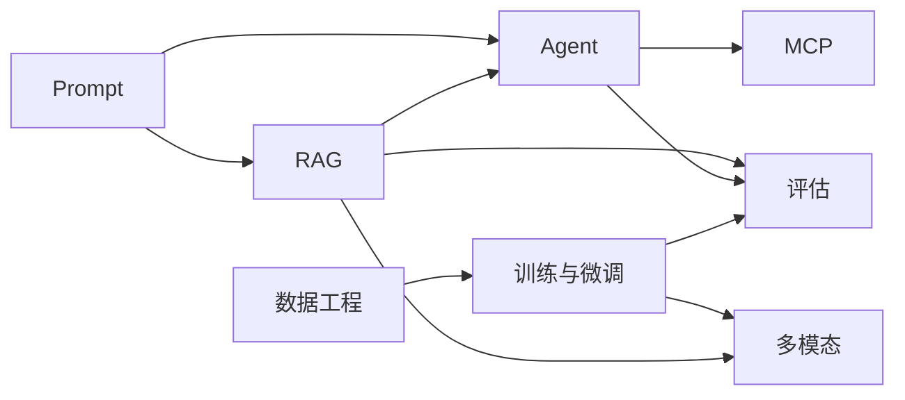

# LLMs 技术专区

这里是整站的知识骨架。六个模块不是平行孤岛，而是一条从“会用模型”到“能构建系统”再到“理解训练和评估”的路径。

一个实用读法是：先用 Prompt 和 RAG 做出可观察的应用，再用 Agent/MCP 扩展系统边界，最后用训练、多模态和评估去理解能力从哪里来、如何稳定。不要把模块看成目录，而要看成一组问题分解工具。

## 阅读一个模块时看四件事

1. **输入是什么**：用户问题、文档、图像、工具结果、训练样本还是偏好数据？
2. **模型负责什么**：理解、生成、选择工具、重排证据、判断偏好，还是做跨模态对齐？
3. **系统边界在哪里**：哪些事情由检索、规则、权限、缓存、人工确认或评估平台承担？
4. **失败如何定位**：输出错了以后，能否判断问题来自数据、上下文、模型、工具还是评估指标？

带着这四个问题读，技术名词会自然落到系统设计里。

## 六个模块

| 模块 | 解决的问题 | 建议入口 | 依赖 |
| --- | --- | --- | --- |
| [Prompt](/llms/prompt/) | 如何让模型稳定理解任务、利用上下文并输出可用结果 | [提示工程基础](/llms/prompt/basics) | 无 |
| [RAG](/llms/rag/) | 如何把外部知识接入生成过程，并让答案可引用、可更新 | [RAG 技术全景](/llms/rag/) | Prompt |
| [Agent](/llms/agent/) | 如何让模型使用工具、规划任务、处理多步工作流 | [AI Agent 全景](/llms/agent/) | Prompt、RAG |
| [MCP](/llms/mcp/) | 如何用统一协议连接模型应用与外部系统 | [MCP 快速入门](/llms/mcp/quickstart) | Agent 工具调用 |
| [训练与微调](/llms/training/) | 如何用数据、SFT/LoRA、DPO/RLHF 定制模型行为 | [训练数据](/llms/training/data) | ML/DL、评估 |
| [多模态](/llms/multimodal/) | 如何处理图像、文本、音频或视频等多种模态 | [多模态全景](/llms/multimodal/) | Transformer、RAG/Agent |

## 推荐依赖图

## 按目标选择入口

| 目标 | 先读 | 接着读 | 做什么项目 |
| --- | --- | --- | --- |
| 快速做出 AI 功能 | [Prompt](/llms/prompt/) | [RAG](/llms/rag/) | 文档问答、摘要、信息抽取 |
| 做可靠知识库 | [RAG](/llms/rag/) | [RAG 评估](/llms/rag/evaluation) | 带引用的企业知识库 |
| 做自动化助手 | [Agent 工具调用](/llms/agent/tool-calling) | [Agent 安全](/llms/agent/safety) | 可中断的工具调用 Agent |
| 做系统集成 | [MCP 概念](/llms/mcp/concepts) | [MCP 高级功能](/llms/mcp/advanced) | 封装一个业务 MCP server |
| 做模型定制 | [训练数据](/llms/training/data) | [LoRA](/llms/training/lora) | 小模型领域微调实验 |
| 做图文任务 | [视觉编码器](/llms/multimodal/vision-encoder) | [多模态 RAG 与 Agent](/llms/multimodal/rag-agent) | 图文问答或多模态检索 |

## 内容状态说明

| 状态 | 含义 |
| --- | --- |
| `verified` | 已按当前资料复核，适合作为主线阅读材料 |
| `needs-review` | 已完成整理，但可能需要根据最新模型/API 继续复核 |
| `opinion` | 包含作者判断或经验归纳 |
| `historical` | 保留历史背景，不代表当前最佳实践 |

如果你是第一次来，建议先走 [学习路径](/guide/)；如果你已经有项目，可以直接到 [实践项目](/practice/) 反向选择模块。
