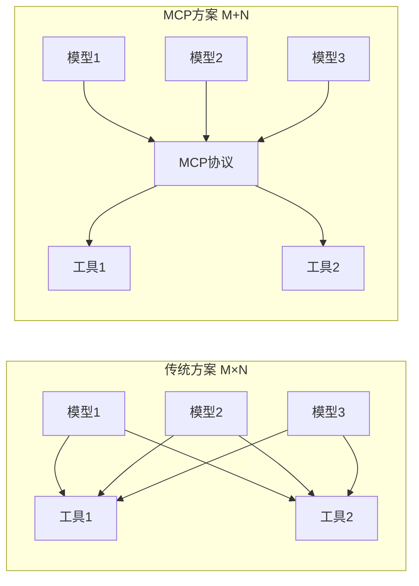
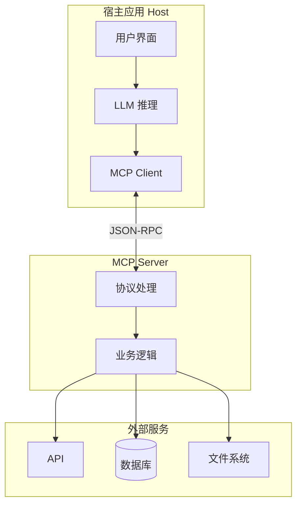
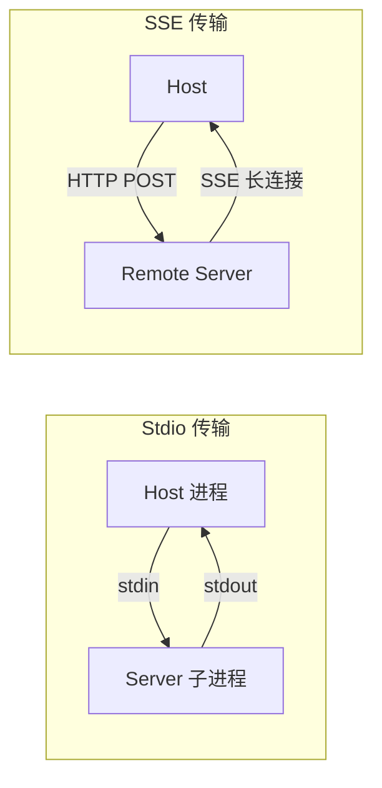
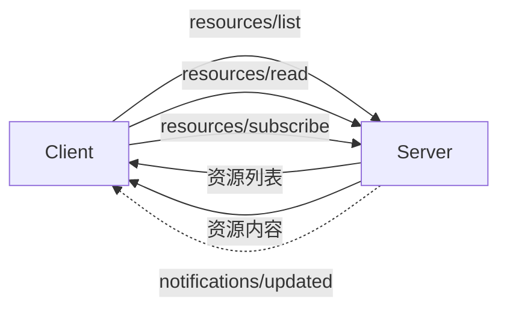
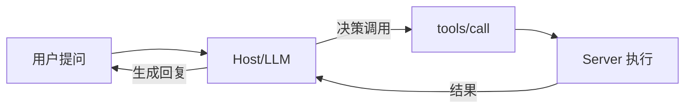
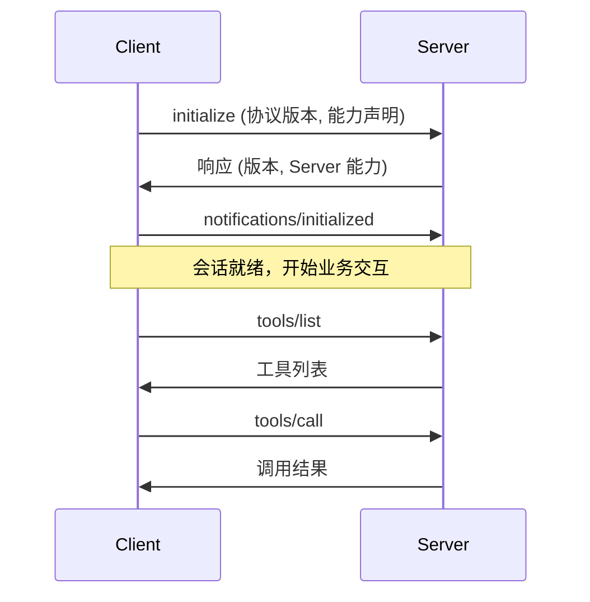
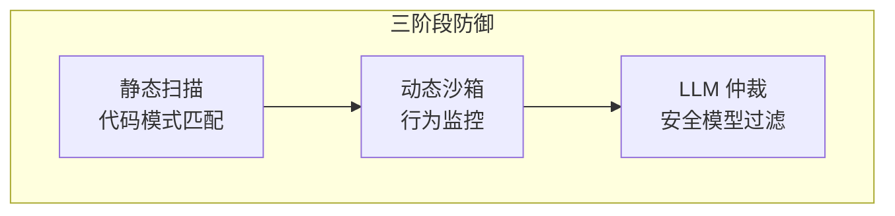
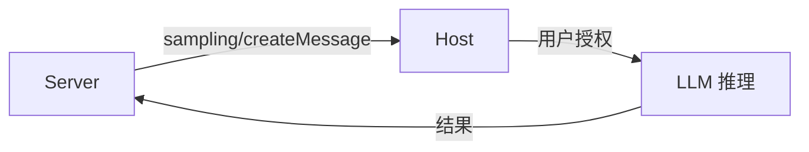

# MCP 协议全景

> **模型上下文协议（MCP）** 是一种开放标准，旨在解决 AI 模型与外部数据源/工具之间的互操作性危机。MCP 被广泛比喻为 **"AI 时代的 USB-C 接口"**——通过统一协议，任何支持 MCP 的 AI 应用都可以无缝连接任何 MCP 服务器。

---

## MCP 解决的核心问题

想象一个强大的AI助手，可以帮助编程、数据分析或客户支持。但这个助手被**锁在一个房间里**——它很聪明，却无法直接访问你的数据库、文件或工具。如果你想让它使用某些信息，必须手动传递。这就是许多LLM面临的困境。

虽然RAG可以检索信息，各种Agent框架允许工具使用，但存在更深层问题：**每个集成都需要定制代码、特殊提示和专属解决方案**。

| 问题 | 传统方案 | MCP方案 |
| :--- | :--- | :--- |
| **集成方式** | 每个数据源需要专属连接器 | 统一标准接口 |
| **维护成本** | N个数据源 × M个模型 = N×M个适配 | N+M（通过协议连接） |
| **安全检查** | 每个连接器独立实现 | 协议级统一安全框架 |
| **可移植性** | 绑定特定模型/厂商 | 模型无关，可自由切换 |

::: tip MCP的本质
MCP就像AI应用的USB-C接口——正如USB-C为各种设备提供标准连接方式，MCP为AI模型提供连接各种数据源和工具的标准协议。
:::

---

## 核心价值



| 维度 | 传统点对点集成 | MCP 统一协议 |
| :--- | :--- | :--- |
| **复杂度** | M×N（每对都需适配） | M+N（通过协议连接） |
| **维护成本** | API 变更需重构所有集成 | 仅更新 Server 实现 |
| **可移植性** | 绑定特定模型/厂商 | 一次编写，多处复用 |
| **生态** | 碎片化 | 标准化互通 |

---

## 1. 架构体系

### 1.1 三层实体模型



| 角色 | 职责 | 典型示例 |
| :--- | :--- | :--- |
| **Host（宿主）** | AI 应用容器，运行 LLM，管理 UI，决定何时请求外部上下文 | Claude Desktop, Cursor, VS Code, Zed |
| **Client（客户端）** | 嵌入 Host 的协议网关，负责连接管理、消息序列化 | mcp-client 库 |
| **Server（服务器）** | 独立进程，持有数据或执行操作，暴露原语 | mcp-server-git, mcp-server-postgres |

### 1.2 解耦优势

| 角色 | 关注点 |
| :--- | :--- |
| **Server 开发者** | 仅关注如何获取数据并转化为 MCP 格式，无需了解调用者是哪个模型 |
| **Host 开发者** | 仅关注模型推理和用户体验，无需为每个工具编写集成插件 |
| **用户** | 配置好的 Server 集可在不同 AI 应用间复用 |

---

## 2. 协议分层

### 2.1 数据层：JSON-RPC 2.0

MCP 强制使用 **JSON-RPC 2.0** 作为应用层协议，支持有状态的双向通信。

**请求示例**：
```json
{
  "jsonrpc": "2.0",
  "id": 1,
  "method": "tools/call",
  "params": {
    "name": "get_weather",
    "arguments": { "city": "Shanghai" }
  }
}
```

**响应示例**：
```json
{
  "jsonrpc": "2.0",
  "id": 1,
  "result": {
    "content": [{ "type": "text", "text": "Shanghai: 25°C, Sunny" }],
    "isError": false
  }
}
```

**消息类型**：
- **Request/Response**：Client 请求，Server 返回结果
- **Notification**：Server 主动推送（如资源变更通知）

### 2.2 传输层

| 传输方式 | 机制 | 适用场景 | 优势 |
| :--- | :--- | :--- | :--- |
| **Stdio** | 父子进程通过 stdin/stdout 通信 | 本地环境 | 零配置、安全、低延迟 |
| **SSE + HTTP** | POST 发请求，SSE 推响应 | 远程/微服务 | 网络穿透、多路复用 |



---

## 3. 核心原语（Primitives）

MCP 定义三种能力原语，标准化 AI 与外部世界的交互模式。

### 3.1 资源（Resources）：被动上下文

**定义**：Server 持有的可读取数据，由唯一 URI 标识。



| 操作 | 说明 |
| :--- | :--- |
| **list** | 查询可用资源列表 |
| **read** | 根据 URI 获取内容（支持文本/二进制） |
| **subscribe** | 订阅资源变更，Server 主动推送更新 |

**典型应用**：
- 读取 IDE 当前文件
- 获取数据库 Schema
- 实时尾随日志

### 3.2 工具（Tools）：主动代理行为

**定义**：AI 可调用的可执行函数，是实现代理（Agentic）行为的核心。



**工具定义**：
- **Name**：工具名称
- **Description**：自然语言描述
- **Input Schema**：JSON Schema 定义参数类型

**调用流程**：
1. 用户：*"帮我查苹果股价"*
2. LLM 决策：调用 `get_stock_price(ticker="AAPL")`
3. Host 通过 MCP 转发给 Server
4. Server 执行并返回 `{"price": 150.00}`
5. LLM 生成：*"苹果当前股价为 150 美元"*

::: warning 人机回环（HITL）
工具可能产生副作用（修改数据、发送邮件）。MCP 强调敏感工具调用应经过**用户显式确认**。
:::

### 3.3 提示词（Prompts）：标准化模板

**定义**：Server 提供的预定义交互模板，简化用户输入。

| 用途 | 示例 |
| :--- | :--- |
| **工作流标准化** | `git_commit` 模板自动组装符合规范的 Commit Message |
| **复杂任务封装** | `code_review` 模板内含精调的 System Prompt |

### 3.4 原语对比

| 特性 | Resources | Tools | Prompts |
| :--- | :--- | :--- | :--- |
| **用途** | 提供上下文 | 执行操作 | 提供模板 |
| **数据流** | Server → Client | 双向 | Server → LLM |
| **副作用** | 无（只读） | 有 | 无 |
| **触发方式** | 用户/自动选择 | 模型自主决策 | 用户选择 |

---

## 4. 协议生命周期



**关键阶段**：
1. **初始化**：Client 发送 `initialize`，声明协议版本和能力
2. **能力协商**：双方就版本和功能达成一致
3. **会话就绪**：Client 发送 `notifications/initialized`
4. **业务交互**：列出工具、调用工具、读取资源等

---

## 5. 开发实战

### 5.1 Python SDK（FastMCP）

```bash
uv add "mcp[cli]"
```

```python
from mcp.server.fastmcp import FastMCP, Context
import httpx

mcp = FastMCP("WeatherService")

# 定义工具
@mcp.tool()
async def get_weather(city: str) -> str:
    """Get current weather for a city."""
    async with httpx.AsyncClient() as client:
        resp = await client.get(f"https://api.weather.com/{city}")
        return resp.text

# 定义资源
@mcp.resource("config://{env}/settings")
def get_config(env: str) -> str:
    """Get settings for an environment."""
    return f'{{"environment": "{env}", "debug": true}}'

# 带上下文的工具
@mcp.tool()
async def long_task(ctx: Context):
    """Execute a long running task."""
    await ctx.info("Task started")
    for i in range(10):
        await ctx.report_progress(i, 10)
    return "Done"

if __name__ == "__main__":
    mcp.run()
```

### 5.2 TypeScript SDK

```typescript
import { McpServer } from "@modelcontextprotocol/sdk/server/mcp.js";
import { StdioServerTransport } from "@modelcontextprotocol/sdk/server/stdio.js";
import { z } from "zod";

const server = new McpServer({
  name: "ts-demo-server",
  version: "1.0.0"
});

server.tool(
  "calculate_bmi",
  {
    height: z.number().describe("Height in meters"),
    weight: z.number().describe("Weight in kg")
  },
  async ({ height, weight }) => {
    const bmi = weight / (height * height);
    return { content: [{ type: "text", text: `BMI: ${bmi.toFixed(1)}` }] };
  }
);

const transport = new StdioServerTransport();
await server.connect(transport);
```

### 5.3 Claude Desktop 配置

```json
{
  "mcpServers": {
    "weather": {
      "command": "python",
      "args": ["path/to/weather_server.py"]
    },
    "docker-server": {
      "command": "docker",
      "args": ["run", "-i", "--rm", "mcp/server-image:latest"]
    }
  }
}
```

### 5.4 MCP Inspector 调试

```bash
npx @modelcontextprotocol/inspector node build/index.js
```

**功能**：
- 模拟 Host 手动调用工具
- 查看 JSON-RPC 请求/响应报文
- 排查 Schema 错误

---

## 6. MCP vs OpenAI Function Calling

| 特性 | OpenAI Function Calling | MCP |
| :--- | :--- | :--- |
| **本质** | 厂商私有 API 特性 | 开放互操作协议 |
| **架构** | Client 包含工具执行代码 | Server 封装实现，Client 仅转发 |
| **状态** | 无状态 | 有状态会话 |
| **可移植** | 绑定 OpenAI | 支持 Claude, Cursor, Gemini 等 |
| **生态** | 插件模式 | **操作系统级集成** |

::: tip 关键区别
Function Calling 将"执行"负担留给开发者（在代码中写 `if tool_name == 'x': ...`）。MCP 将逻辑封装到独立 Server，可**像微服务一样独立部署、独立升级**。
:::

---

## 7. 安全架构

### 7.1 威胁模型

| 威胁 | 描述 |
| :--- | :--- |
| **间接提示注入** | 恶意数据（邮件/网页）中嵌入隐藏指令 |
| **数据渗漏** | 恶意 Server 诱导模型传递敏感信息 |

### 7.2 防御体系



| 层面 | 措施 |
| :--- | :--- |
| **协议级** | 权限协商、人机回环（HITL） |
| **传输级** | OAuth 2.1 认证、最小权限 Token |
| **应用级** | MCP-Guard 三阶段防御框架 |

### 7.3 指令层级

| 层级 | 来源 | 优先级 | 说明 |
| :--- | :--- | :--- | :--- |
| **Φ₀** | 系统指令 | 最高 | 定义行为边界 |
| **Φ₁** | 用户指令 | 次级 | 在 Φ₀ 约束下执行 |
| **Φ₂** | 数据 | 最低 | 仅作处理对象，禁止执行 |

---

## 8. 生态系统

### 8.1 治理与开放

MCP 由 Anthropic 于 2024 年底开源发布，已捐赠给 **Linux 基金会 Agentic AI Foundation**，成为中立开放标准。

**支持厂商**：Google Cloud, Microsoft, Block, Apollo, Zed, Replit, Sourcegraph

### 8.2 广泛采用（2025年）

到 2025 年初，MCP 已被广泛采用：

| 平台 | 集成状态 |
| :--- | :--- |
| **Cursor** | 原生支持 |
| **Replit** | 原生支持 |
| **Zed** | 原生支持 |
| **Sourcegraph** | 原生支持 |
| **Claude Desktop** | 原生支持 |
| **Block/Apollo** | 企业集成 |

::: tip 模型无关性
MCP 的一大优势是**模型无关**——你可以在不同 LLM 提供商之间切换，而不会丢失对数据源的访问权限，因为协议是标准化的。
:::

### 8.3 主流 Server

| Server | 功能 |
| :--- | :--- |
| **mcp-server-filesystem** | 文件读写 |
| **mcp-server-git** | Git 操作 |
| **mcp-server-postgres** | 数据库查询 |
| **mcp-server-github** | GitHub API |
| **mcp-server-slack** | Slack 消息 |

### 8.4 操作系统集成

| 平台 | 状态 |
| :--- | :--- |
| **Windows** | Copilot 已支持调用本地 MCP Server |
| **macOS/iOS** | 预期集成到 Shortcuts/Siri |

---

## 9. 采样（Sampling）：反向智能调用

MCP 最具前瞻性的特性之一：**Server 可以"反向"调用 Host 的 LLM 能力**。



**场景**：IDE 插件 Server 发现复杂代码，希望调用 Host 的高级模型生成注释。

**意义**：Server 不再是"哑"工具，可利用宿主的推理能力增强自身逻辑。

---

## 📚 学习路线

<div class="learning-path">
  <div class="path-step step-1">
    <div class="step-num">1</div>
    <div class="step-title">快速入门</div>
    <ul>
      <li><a href="/llms/mcp/quickstart">5分钟创建 Server</a></li>
      <li>Claude Desktop 配置</li>
      <li>Inspector 调试</li>
    </ul>
  </div>
  <div class="path-arrow">→</div>
  <div class="path-step step-2">
    <div class="step-num">2</div>
    <div class="step-title">核心概念</div>
    <ul>
      <li><a href="/llms/mcp/concepts">Tools/Resources/Prompts</a></li>
      <li>协议生命周期</li>
      <li>传输层选择</li>
    </ul>
  </div>
  <div class="path-arrow">→</div>
  <div class="path-step step-3">
    <div class="step-num">3</div>
    <div class="step-title">高级功能</div>
    <ul>
      <li><a href="/llms/mcp/advanced">采样与反向调用</a></li>
      <li>安全防御</li>
      <li>生产部署</li>
    </ul>
  </div>
</div>

---

## 🔗 章节导航

| 章节 | 内容 | 状态 |
| :--- | :--- | :--- |
| [快速入门](/llms/mcp/quickstart) | 5 分钟创建 MCP Server | 📝 |
| [核心概念](/llms/mcp/concepts) | Tools/Resources/Prompts 详解 | 📝 |
| [高级功能](/llms/mcp/advanced) | 采样、认证、代理模式 | 📝 |

---

## 🌐 核心资源

### 官方资源

| 资源 | 说明 |
| :--- | :--- |
| [MCP 官方文档](https://modelcontextprotocol.io/) | 协议规范 |
| [Python SDK](https://github.com/modelcontextprotocol/python-sdk) | Python 实现 |
| [TypeScript SDK](https://github.com/modelcontextprotocol/typescript-sdk) | TS 实现 |
| [MCP Inspector](https://github.com/modelcontextprotocol/inspector) | 调试工具 |
| [官方 Server 集合](https://github.com/modelcontextprotocol/servers) | 预置 Server |

### FastMCP 资源

| 资源 | 说明 |
| :--- | :--- |
| [FastMCP 官方文档](https://gofastmcp.com/) | FastMCP 2.0 文档 |
| [FastMCP GitHub](https://github.com/jlowin/fastmcp) | 源码仓库 |
| [FastMCP Cloud](https://fastmcp.cloud) | 云托管服务 |

### 参考论文

| 论文 | 主题 |
| :--- | :--- |
| [MCP-Guard](https://arxiv.org/html/2508.10991v1) | 安全防御框架 |

---

## 🔮 未来展望

MCP 正在改变我们构建 AI 应用的方式：

| 趋势 | 说明 |
| :--- | :--- |
| **标准化** | 成为 AI 集成的事实标准 |
| **生态繁荣** | 社区贡献大量现成 Server |
| **能力共享** | 开发者可以共享自定义 MCP Server，为 AI 代理添加新"技能" |
| **开发效率** | 连接新数据库或 API 从周级工作变为小时级 |

::: tip 核心价值
MCP 让 AI 从"被动回答问题"转变为"主动使用工具和数据"，真正释放 AI 的潜力。
:::

> **展望**：MCP 将成为未来 AI 互联网的基础协议，构建起一个**万物互联的智能体新世界**。随着 Google、Microsoft、Anthropic 等巨头推动，MCP 正迅速成为行业事实标准。
