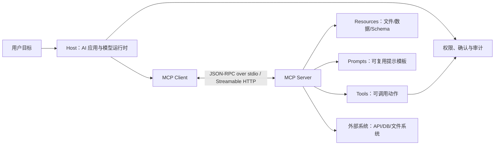

# MCP 协议全景

::: info 版本范围
本模块同时标明两条版本线：2026-10-08 已核验的 MCP 2026-07-28 新规范，以及 MCP 2025-06-18 / FastMCP 2.12.5 固定教学基线。下文初始化和 JSON 示例属于旧基线；新版请求的元数据与兼容边界见“版本与边界”。
:::

<LearningObjectives :items="[
  '能够区分 Host、Client、Server 三个角色，并解释 MCP 如何通过 JSON-RPC 把模型应用和外部上下文解耦。',
  '能够判断一个能力应该建成 resource、prompt 还是 tool，并知道它们如何通过 capabilities 暴露给客户端。',
  '能够为本地 stdio 与远程 Streamable HTTP 场景设计授权、用户确认、最小权限和审计边界。'
]" />

## 这个模块解决什么问题

MCP（Model Context Protocol）解决的不是“让模型更聪明”，而是“让模型应用以标准方式连接外部上下文和能力”。可以把 MCP 理解为一层统一的能力接口：Host 不必为每个工具写一次专属插件，Server 也不必知道背后是哪家模型。它们通过协议交换能力、资源、提示模板和工具调用结果，降低了 N 个应用 × M 个数据源之间的集成复杂度。

但 MCP 不是 Agent 框架，也不是 RAG 的替代品。RAG 关注“如何把证据检索进上下文”，Agent 关注“如何在多步任务里选择行动”，MCP 关注“外部系统怎样以可发现、可调用、可授权的方式接入模型应用”。一个 MCP Server 可以暴露数据库 schema、文件、业务 API、固定 prompt、甚至长任务入口；Host 仍然要决定什么时候把这些能力交给模型、怎样展示给用户、哪些操作需要确认。

在本文采用的 2025-06-18 规范中，系统分为三类参与者：Host 是用户真正交互的 AI 应用；Client 是 Host 内部为每个 Server 建立的协议连接；Server 是提供上下文和能力的独立服务。这个三分法很重要：Server 不应该直接越过 Host 去操控用户体验，Client 不应该把所有安全责任推给模型，Host 也不应该把不可信 Server 暴露成无边界工具箱。

## 核心工作流


```mermaid
flowchart LR
  User[用户目标] --> Host[Host：AI 应用与模型运行时]
  Host --> Guard[权限、确认与审计]
  Host --> Client[MCP Client]
  Client <-->|JSON-RPC over stdio / Streamable HTTP| Server[MCP Server]
  Server --> Resources[Resources：文件/数据/Schema]
  Server --> Prompts[Prompts：可复用提示模板]
  Server --> Tools[Tools：可调用动作]
  Server --> External[外部系统：API/DB/文件系统]
  Tools --> Guard
```

在 **2025-06-18 教学基线**中，一个典型连接先从初始化开始：Client 和 Server 交换协议版本、实现信息与 capabilities。Server 声明自己支持 resources、prompts、tools 等能力；Client 再按需发出 `resources/list`、`prompts/list`、`tools/list`，把可用能力放进 Host 的上下文选择器、工具面板或模型可见工具列表。真正执行时，读资源通常是应用驱动的，调用工具通常是模型控制但由 Host/Client 代为执行的。

下面的 JSON-RPC 请求展示工具调用的消息边界。一个工具调用不是“模型直接访问数据库”，而是 Client 向 Server 发请求，Server 返回结构化结果，Host 再决定怎样把结果交给模型或用户：

```json
{
  "jsonrpc": "2.0",
  "id": 2,
  "method": "tools/call",
  "params": {
    "name": "get_weather",
    "arguments": { "location": "Shanghai" }
  }
}
```

这个例子看起来像普通 API，但差别在于 MCP 明确了发现、schema、能力协商、通知、传输和授权边界。工具参数必须有 schema；工具列表可以分页、缓存和变更通知；HTTP 传输要考虑 OAuth 2.1 风格授权；本地 stdio 更像父子进程通信，凭据通常来自环境变量或本地配置。

能力协商是 MCP 比“把 API 描述塞给模型”更稳的地方。Client 不应该硬编码 Server 一定支持某个方法，而应先看初始化结果和 list 响应；Server 也不应该用自然语言暗示“我还能做更多”，而要把能力显式放进 protocol surface。比如一个 Git Server 可以先只暴露只读资源 `repo://diff`、`repo://files`，等 Host 支持审批后再暴露 `create_branch` 或 `apply_patch`。这样模型看到的不是一个无边界 shell，而是一组可枚举、可禁用、可审计的能力。

远程 Server 还要多考虑“谁在代表谁调用”。用户在 Host 里授权了某个 MCP Server，不等于这个 Server 可以拿着 token 去访问所有上游资源；Server 调另一个服务时也可能出现 confused deputy：攻击者诱导 Host 请求一个看似无害的 Server，再让它代表用户访问不该访问的资源。因此授权设计要包含 audience、scope、redirect URI、token 生命周期和用户可见的 consent 文案。MCP 让工具发现标准化，但不替你完成 OAuth、权限模型或租户隔离。

## 关键概念

| 概念 | 它解决什么 | 使用时要警惕 |
| --- | --- | --- |
| Host | 管理用户体验、模型上下文、工具展示和审批。 | Host 才是安全边界中心，不能把风险全推给 Server。 |
| Client | Host 内部的协议连接器，一个 Client 通常连接一个 Server。 | 聚合多个 Server 时要处理命名冲突、缓存和权限差异。 |
| Server | 暴露资源、提示和工具，并连接真实外部系统。 | Server 返回的描述和注解不天然可信，Host 需要信任策略。 |
| Capabilities | 按协议版本，通过初始化或逐请求元数据声明支持的能力。 | 不要假设所有 Server 都支持同一组功能；按能力降级。 |
| Resources | 以 URI 暴露上下文，如文件、数据库 schema、项目状态。 | 资源通常应由应用或用户选择，不等于模型可任意读取。 |
| Prompts | 暴露可复用提示模板，可带参数。 | prompt 是工作流资产，不应携带越权指令或隐藏策略。 |
| Tools | 暴露可调用动作、API、计算或写入能力。 | 副作用工具需要最小权限、审计，并按业务风险和已有授权决定确认流程。 |
| Transports | stdio 适合本地子进程；Streamable HTTP 适合远程服务，旧 HTTP+SSE 用于兼容。 | HTTP 需要认证授权；stdio 也要管理本地凭据和进程隔离。 |

## 推荐学习顺序

1. 先读 [快速入门](/llms/mcp/quickstart)，把一个本地 Server 跑起来，理解 Host 如何启动子进程并建立 Client。
2. 再读 [核心概念](/llms/mcp/concepts)，把 Host、Client、Server、resources、prompts、tools 和 JSON-RPC 消息流说清楚。
3. 接着读 [高级功能](/llms/mcp/advanced)，重点看远程传输、能力扩展、通知、授权和调试。
4. 如果你希望把协议落到项目里，可以把 [实践示例](/llms/mcp/practice) 当作补充材料阅读；它是现有子页，但不在当前主导航学习进度里。

学习时不要急着写“大而全”的 Server。先做一个只读 resource server，例如暴露 `repo://summary` 或 `db://schema`；再增加一个无副作用 tool，例如 `search_docs(query)`；最后才接写入类工具，例如 `create_ticket` 或 `run_sql`。每增加一种能力，都要补 UI 展示、权限、日志和失败处理。

## 实践检查点

- Server 是否在初始化时只声明真实支持的 capabilities，而不是为了好看全部打开？
- 每个 tool 是否有明确 `name`、描述、输入 schema、输出结构、错误语义和副作用说明？
- Host 是否向用户展示当前暴露给模型的 Server、tool 和权限范围？
- 本地 stdio Server 是否只读取必要环境变量？远程 HTTP Server 是否实现 OAuth/令牌校验和作用域最小化？
- 是否记录了每次 `tools/call` 的调用者、参数、结果、用户确认和外部系统响应？
- 是否用 MCP Inspector 或等价脚本在 CI 中跑过 list/read/call 的 smoke test？

一个最小验收脚本可以只检查三件事：`tools/list` 返回包含预期工具且符合 schema 的列表（测试按名称比较，不依赖顺序）；一个只读 tool 在正常输入下返回结构化结果；一个危险写入 tool 在缺少确认或权限时拒绝执行。这样比只看 demo 中模型能不能“叫出工具”更可靠。

如果要判断统一接口是否值得引入，可以问三件事。第一，这个能力会被几个 Host 复用？如果只服务一个应用、一个模型，普通内部 API 可能更简单；如果要在 Claude Desktop、编辑器、内部 Agent 平台之间复用，MCP 的标准接口价值就会上升。第二，这个能力是否需要用户选择上下文？只读 resources 很适合让 Host 做上下文选择；而写入 tools 必须有审批和日志。第三，Server 的部署边界在哪里？本地 stdio 适合访问本机文件、Git 仓库和开发工具；远程 HTTP 适合组织级数据源，但要补认证、限流、审计和跨租户隔离。

一个实用的 Server 设计草案可以这样开始：

```text
server: company-knowledge
resources:
  - kb://policy/{id}        # 只读政策文档
  - kb://schema/ticketing   # 工单字段说明
prompts:
  - summarize_policy(policy_id, audience)
tools:
  - search_policy(query, top_k)          # 只读
  - draft_ticket(summary, evidence_ids)  # 生成草稿，无外部副作用
  - submit_ticket(ticket_id)             # 写入动作，需要用户确认
security:
  - search_policy 需要 read:kb
  - submit_ticket 需要 write:ticket + explicit_consent
```

这份草案把不同权限级别的能力分开定义。越是高风险能力，越应该拆成低权限工具、草稿工具和最终提交工具，让 Host 有机会在关键节点展示差异并请求确认。

## 场景自测

<details>
<summary>把 FastMCP 2.12.5 示例的版本字符串改成 2026-07-28，是否完成升级？</summary>

没有。新版逐请求携带版本和能力元数据，旧版使用初始化握手。先确认双方 SDK 实现与兼容范围，再验证发现、正常调用和不支持版本错误；教学示例仍固定原基线。参见 [核心概念](/llms/mcp/concepts)。

</details>

<details>
<summary>工具返回 HTTP 200，参数和 token 也有效，是否可以认定业务成功？</summary>

还不能。有效 token 不代表有目标资源的权限；成功传输也不代表工具或业务成功。检查工具错误语义、租户 ACL、实际写入结果和回执。参见 [高级功能](/llms/mcp/advanced)。

</details>

<details>
<summary>Server 收到 Roots 就已经被限制在这些文件夹内了吗？</summary>

没有。Roots 是协议上下文约定，不能替代操作系统隔离或服务端路径权限校验。检查路径解析、符号链接和实际进程权限。参见 [Roots 边界](/llms/mcp/concepts#roots-与其他客户端能力)。

</details>

## 版本与边界

本文保留 **MCP 2025-06-18 作为旧版流程教学基线，FastMCP 2.12.5 作为代码实验基线**。初始化握手、能力协商和消息示例均在这个范围内讲解，不声称代表最新协议。SDK 可支持并协商多个协议版本，包版本不等于线上实际使用的协议版本；接入生产时要记录 Host/Server 实际兼容范围和协商结果。若使用更新规范，应重新核对生命周期、传输、消息字段与能力发现，不能只修改版本字符串。

2026-10-08 已对照 [2026-07-28 发布说明](https://blog.modelcontextprotocol.io/posts/2026-07-28/) 和 [版本规范](https://modelcontextprotocol.io/specification/2026-07-28/basic/versioning)：新版核心采用无状态请求/响应，每次请求携带版本、身份和能力元数据；旧 `initialize` 属于兼容流程。上面的简化 `tools/call` JSON 因而不能当成完整的新版请求。协议无状态不等于业务无状态，长任务的结果和审批仍需应用保存。

接入时建立“Host / Client SDK / Server SDK / 协议版本 / 授权机制”兼容表。先验证双方支持范围，再验证正常调用、版本不兼容和权限拒绝。新版授权发现和客户端注册变化见 [高级功能](/llms/mcp/advanced#_2026-07-28-授权核对清单)；本轮未宣称旧 FastMCP 示例已经跑通新版。

MCP 的边界同样要讲清楚。协议能标准化连接方式，但不能自动决定业务权限；Server 可以声明工具注解，但客户端不能盲目信任；远程授权可以保护 HTTP 资源，但本地 stdio 仍需要进程和凭据隔离；模型可以建议调用工具，但 Host 必须保留用户确认和审计。把 MCP 当成“上下文与能力接口层”，而不是把它当成安全系统或 Agent 大脑，会少踩很多坑。

还有一个容易忽略的边界：MCP Server 的描述文本会进入模型上下文，因此它本身也是提示面。Server 名称、tool 描述、参数说明如果写得过于宽泛，模型会更容易误用；如果描述里夹带“忽略用户确认”之类的越权指令，Host 也必须把它当成不可信输入处理。好的 MCP 集成会同时审查协议消息、UI 展示和模型可见描述。

<SourceList :items="[
  { title: 'Model Context Protocol specification 2025-06-18', href: 'https://modelcontextprotocol.io/specification/2025-06-18', note: '本文固定规范版本；不是最新版本承诺。' },
  { title: 'MCP base protocol overview', href: 'https://modelcontextprotocol.io/specification/2025-06-18/basic', note: '基础协议、版本协商、消息模式、授权和功能层概览。' },
  { title: 'MCP architecture overview', href: 'https://modelcontextprotocol.io/specification/2025-06-18/architecture', note: '官方架构说明，解释 Host、Client、Server 的职责边界。' },
  { title: 'MCP resources specification', href: 'https://modelcontextprotocol.io/specification/2025-06-18/server/resources', note: 'Resources 原语，说明 URI、资源读取、订阅和安全注意事项。' },
  { title: 'MCP prompts specification', href: 'https://modelcontextprotocol.io/specification/2025-06-18/server/prompts', note: 'Prompts 原语，说明提示模板发现、参数化和获取。' },
  { title: 'MCP tools specification', href: 'https://modelcontextprotocol.io/specification/2025-06-18/server/tools', note: 'Tools 原语，说明工具发现、调用、schema 和人类确认边界。' },
  { title: 'MCP transports specification', href: 'https://modelcontextprotocol.io/specification/2025-06-18/basic/transports', note: 'stdio、Streamable HTTP 等传输边界。' },
  { title: 'MCP authorization tutorial', href: 'https://modelcontextprotocol.io/specification/2025-06-18/basic/authorization', note: '官方授权教程，说明何时使用 OAuth 2.1 风格授权。' },
  { title: 'MCP security best practices', href: 'https://modelcontextprotocol.io/docs/2025-11-25/tutorials/security/security_best_practices', note: '官方安全实践，覆盖 confused deputy、scope minimization 等风险。' },
  { title: 'MCP TypeScript SDK', href: 'https://ts.sdk.modelcontextprotocol.io/', note: '官方 TypeScript SDK 文档。' },
  { title: 'MCP Python SDK', href: 'https://py.sdk.modelcontextprotocol.io/', note: '官方 Python SDK 文档；与独立 FastMCP 包分开核对版本。' }
]" />
