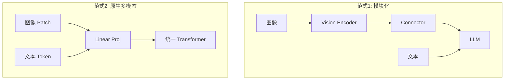
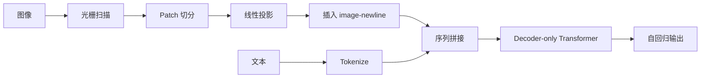
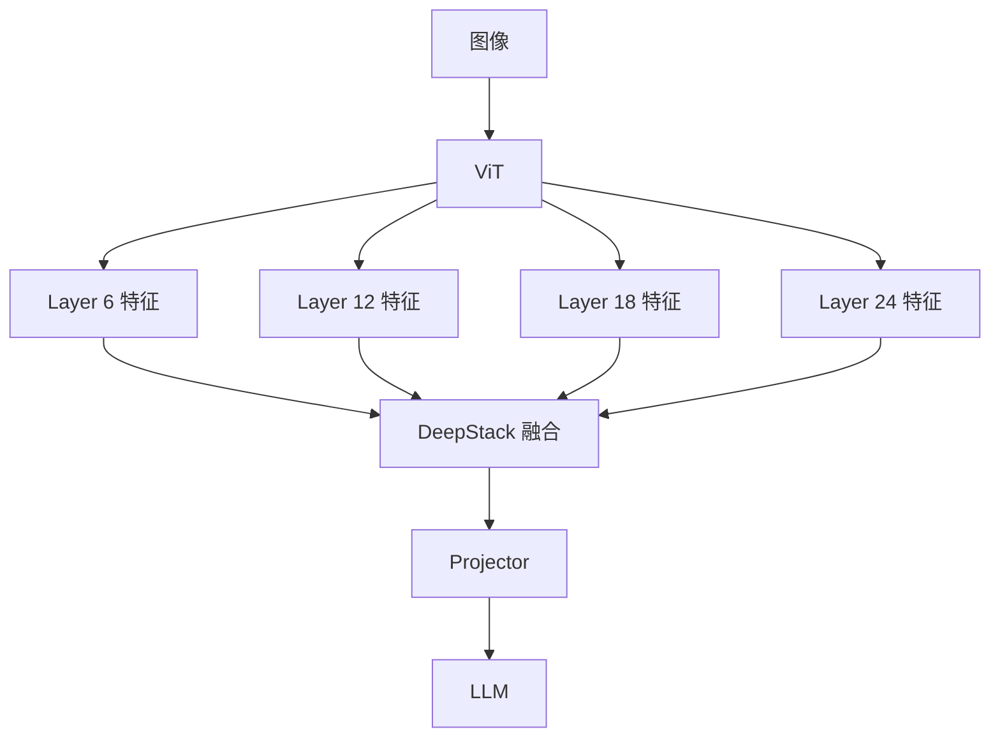
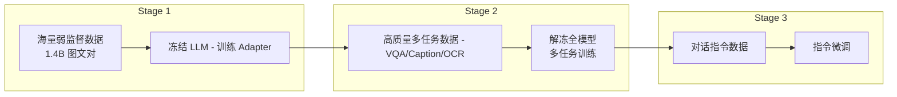
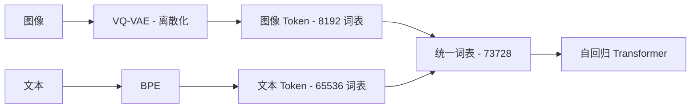
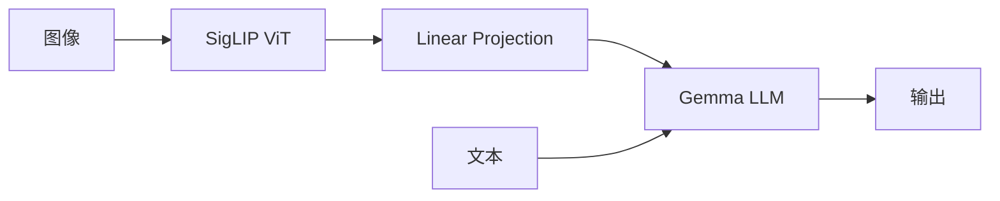

# 多模态架构演进

> 从"编码器-连接器-LLM"的模块化设计，到原生多模态的深度融合，架构范式正在经历根本性变革。

---

## 架构范式对比



| 范式 | 代表模型 | 优势 | 劣势 |
| :--- | :--- | :--- | :--- |
| **模块化** | LLaVA, BLIP-2 | 复用预训练组件 | 模态割裂 |
| **原生多模态** | Fuyu, Chameleon | 深度融合 | 训练成本高 |

---

## Fuyu-8B：纯 Decoder 架构

Fuyu 代表了向原生多模态迈进的重要一步，**完全摒弃独立视觉编码器**。

### 核心设计



### image-newline 机制

**问题**：Transformer 如何理解图像的二维空间结构？

**解决方案**：引入特殊 Token `<image-newline>`

```
[patch_1] [patch_2] ... [patch_14] <image-newline>
[patch_15] [patch_16] ... [patch_28] <image-newline>
...
[patch_183] [patch_184] ... [patch_196] <image-newline>
[文本 Token 序列]
```

**效果**：
- 模型像处理换行符一样理解图像行结构
- 天然支持任意分辨率和宽高比
- 无需复杂的位置编码插值

### 架构优势

| 特性 | 传统架构 | Fuyu |
| :--- | :--- | :--- |
| **组件数量** | ViT + Connector + LLM | 仅 LLM |
| **分辨率支持** | 需要调整 | 任意分辨率 |
| **部署复杂度** | 需维护多个模型 | 单一模型 |
| **训练统一性** | 多阶段 | 端到端 |

### 局限性

::: warning 计算成本
由于没有视觉编码器的压缩，高分辨率图像会产生大量 Token，显著增加推理成本。
:::

---

## Qwen-VL：多阶段特征融合

Qwen-VL 在"编码器-连接器-LLM"框架内进行深度优化。

### DeepStack 融合

**传统方法**：仅使用 ViT 最后一层输出

**Qwen-VL**：融合多层特征



**优势**：
- 低层特征：纹理、边缘细节
- 高层特征：语义、对象概念
- 对 OCR 和文档理解尤为重要

### 三阶段训练管线



| 阶段 | 数据规模 | 训练目标 | LLM 状态 |
| :--- | :--- | :--- | :--- |
| **预训练** | 1.4B 图文对 | 视觉-语言对齐 | 冻结 |
| **多任务微调** | ~100M 样本 | 任务能力 | 解冻 |
| **指令微调** | ~1M 样本 | 对话交互 | 解冻 |

### 特殊能力

| 能力 | 实现方式 |
| :--- | :--- |
| **细粒度 OCR** | 高分辨率输入 + DeepStack |
| **目标定位** | Bounding Box Token 化 |
| **多图理解** | 图像分隔符 Token |

---

## InternLM-XComposer：交织生成

InternLM-XComposer 系列专注于**图文交织生成**。

### 架构特点

```mermaid
flowchart TB
    IMG[图像] --> VIT[ViT]
    VIT --> PA[Partial LoRA (Adapter)]
    PA --> LLM[InternLM]
    TXT[文本] --> LLM
    LLM --> OUT[图文交织输出]
```

**Partial LoRA**：
- 仅在部分 LLM 层插入 LoRA
- 平衡视觉适配与语言能力保持

### 图文交织能力

```
用户：请介绍一下这座建筑的历史
模型：这是埃菲尔铁塔，建于1889年...
      [生成的历史图片]
      它最初是为巴黎世博会建造的...
      [生成的世博会场景图片]
```

---

## Chameleon：原生混合模态

Meta 的 Chameleon 实现了**真正的原生多模态**。

### 统一 Token 空间



### 关键技术

| 技术 | 作用 |
| :--- | :--- |
| **VQ-VAE** | 将图像离散化为 Token |
| **统一词表** | 图像/文本 Token 无差别处理 |
| **QK-Norm** | 稳定多模态训练 |
| **Dropout 复用** | 防止模态偏向 |

### 优势与挑战

| 优势 | 挑战 |
| :--- | :--- |
| ✅ 真正的端到端 | ❌ VQ-VAE 重建损失 |
| ✅ 任意模态组合生成 | ❌ 训练极其昂贵 |
| ✅ 统一架构简洁 | ❌ 图像生成质量受限 |

---

## PaliGemma：Google 的多模态方案

### 架构设计



### 特点

| 特性 | 说明 |
| :--- | :--- |
| **视觉编码器** | SigLIP（改进的 CLIP） |
| **LLM** | Gemma 2B |
| **连接器** | 简单线性投影 |
| **训练数据** | WebLI 多语言数据 |

---

## 架构选型指南

### 按需求选择

| 需求 | 推荐架构 | 理由 |
| :--- | :--- | :--- |
| **快速部署** | LLaVA | 简单有效 |
| **OCR/文档** | Qwen-VL | DeepStack 细节 |
| **任意分辨率** | Fuyu | 原生支持 |
| **图文交织** | XComposer | 专门优化 |
| **统一生成** | Chameleon | 原生多模态 |

### 性能-效率权衡

```
性能 ↑
│
│    ★ Qwen-VL-Max
│  ★ GPT-4V
│    ★ Chameleon
│  ★ LLaVA-1.6
│ ★ Fuyu-8B
│★ LLaVA-1.5
│
└──────────────────→ 效率 ↑
```

---

## 参考资源

| 论文/项目 | 主题 |
| :--- | :--- |
| [Fuyu-8B](https://www.adept.ai/blog/fuyu-8b) | 纯 Decoder 架构 |
| [Qwen-VL](https://arxiv.org/abs/2308.12966) | 多阶段融合 |
| [InternLM-XComposer](https://arxiv.org/abs/2309.15112) | 图文交织 |
| [Chameleon](https://arxiv.org/abs/2405.09818) | 原生多模态 |
| [PaliGemma](https://arxiv.org/abs/2407.07726) | Google 方案 |

