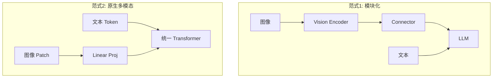
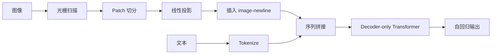
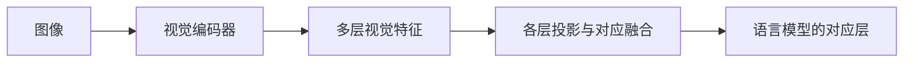
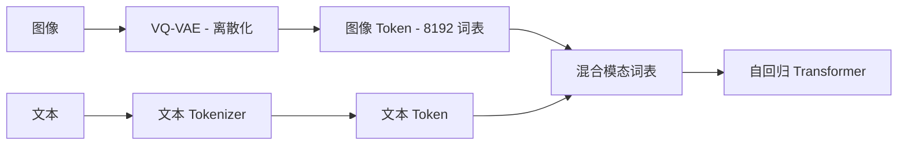
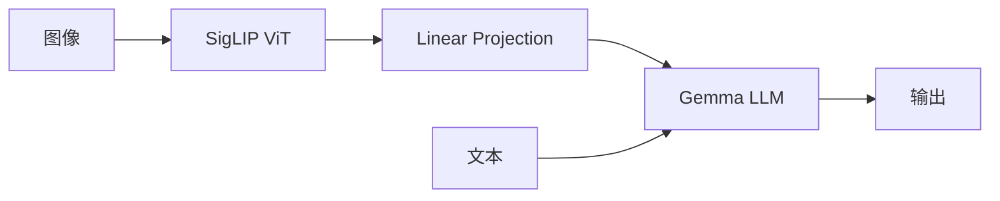

# 多模态架构演进

> 选型时分别看视觉如何编码、在哪里融合、输出哪种模态，以及哪些参数被训练。“原生多模态”不是统一的技术规格，也不自动代表效果更好。

---

## 架构范式对比


```mermaid
flowchart TB
    subgraph "范式1: 模块化"
        I1[图像] --> E1[Vision Encoder]
        E1 --> C1[Connector]
        C1 --> L1[LLM]
        T1[文本] --> L1
    end
    
    subgraph "范式2: 原生多模态"
        I2[图像 Patch] --> P2[Linear Proj]
        T2[文本 Token] --> L2
        P2 --> L2[统一 Transformer]
    end
```

| 范式 | 代表模型 | 优势 | 劣势 |
| :--- | :--- | :--- | :--- |
| **模块化** | LLaVA, BLIP-2 | 复用预训练组件，便于分阶段排障 | 连接器可能形成信息瓶颈 |
| **早期融合等路线** | Fuyu, Chameleon | 在主干内联合处理模态序列 | 二者输入表示与输出能力不同，不能直接等同 |

---

## Fuyu-8B：纯 Decoder 架构

Fuyu 代表了向原生多模态迈进的重要一步，**完全摒弃独立视觉编码器**。

### 核心设计


```mermaid
flowchart LR
    IMG[图像] --> RS[光栅扫描]
    RS --> PATCH[Patch 切分]
    PATCH --> PROJ[线性投影]
    PROJ --> NL[插入 image-newline]
    TXT[文本] --> TOK[Tokenize]
    NL --> CAT[序列拼接]
    TOK --> CAT
    CAT --> DEC[Decoder-only Transformer]
    DEC --> OUT[自回归输出]
```

### image-newline 机制

**问题**：Transformer 如何理解图像的二维空间结构？

**解决方案**：引入特殊 Token `<image-newline>`

```
[patch_1] [patch_2] ... [patch_14] <image-newline>
[patch_15] [patch_16] ... [patch_28] <image-newline>
...
[patch_183] [patch_184] ... [patch_196] <image-newline>
[文本 Token 序列]
```

**效果**：
- 模型像处理换行符一样理解图像行结构
- 无需把所有图像强制缩成同一方形，但受预处理、上下文和显存预算限制
- 无需复杂的位置编码插值

### 架构优势

| 特性 | 传统架构 | Fuyu |
| :--- | :--- | :--- |
| **组件数量** | ViT + Connector + LLM | Patch 投影 + Decoder，无独立 ViT |
| **分辨率支持** | 取决于编码器/动态处理策略 | 可变分辨率，仍有 token 上限 |
| **部署复杂度** | 需维护多个模型 | 单一模型 |
| **训练统一性** | 多阶段 | 端到端 |

### 局限性

::: warning 计算成本
由于没有视觉编码器的压缩，高分辨率图像会产生大量 Token，显著增加推理成本。
:::

---

## Qwen-VL：多阶段特征融合

这一系列跨越多代，必须先区分版本。[Qwen-VL（2023）](https://arxiv.org/abs/2308.12966)使用视觉编码器、位置感知的适配器与语言模型；不能把后续系列的模块倒写到初代架构。

### DeepStack 融合

[Qwen3-VL 官方实现](https://github.com/QwenLM/Qwen3-VL)介绍了将多层视觉特征接入语言模型的 DeepStack。它不是初代 Qwen-VL 的特征。工程上应检查具体 checkpoint 的视觉特征层、投影维度与注入位置，而非复制未经来源支持的“第 6/12/18/24 层”配置。


```mermaid
flowchart LR
    I[图像] --> V[视觉编码器]
    V --> F[多层视觉特征]
    F --> P[各层投影与对应融合]
    P --> L[语言模型的对应层]
```

### 视频时序：帧序列之外还要保留时间

**2026-10-08 复核 [Qwen3-VL 官方实现说明](https://github.com/QwenLM/Qwen3-VL)**：该代架构同时介绍 Interleaved-MRoPE、DeepStack 和文本时间戳对齐。它们分别涉及时间/空间位置、多层视觉特征与事件时间定位，不能只用“更多图像 token”概括视频能力。

工程上固定 checkpoint 与配套 processor，记录抽帧率、实际帧时间戳、帧顺序与总视觉 token。变帧率视频要保留实际时间映射；单纯传几张图并不能保证“事件发生在第几秒”正确。用相同帧但不同顺序、相同事件但不同时间间隔的对照，检查模型是否使用时序证据。此处只核验架构与输入设计，未实跑视频推理。


### 三阶段训练管线

初代 Qwen-VL 的预训练、多任务训练和指令微调说明了逐步建立能力的路线。各阶段到底冻结什么、分辨率是多少、用多少数据，应以该代论文和配置为准；视觉编码器并不等于始终冻结。

| 阶段目的 | 工程检查 |
| --- | --- |
| 对齐视觉与语言 | 连接器有梯度，视觉特征与文本语义能对应 |
| 扩充多任务能力 | OCR、定位、问答分开统计，控制任务配比 |
| 改善指令交互 | chat template、图像占位符、回答监督 mask 正确 |

### 特殊能力

OCR 依赖输入中可辨的小字、视觉分辨率和训练数据；定位依赖坐标编码及归一化约定；多图理解依赖图像顺序、分隔符与训练覆盖。任何一项都不能只从“用了 DeepStack”推导出来。

---

## InternLM-XComposer：交织生成

InternLM-XComposer 系列研究图文交织创作；下面的 PLoRA 特指 [InternLM-XComposer2](https://arxiv.org/abs/2401.16420)。

### 架构特点

```mermaid
flowchart TB
    IMG[图像] --> VIT[ViT]
    VIT --> PA[Partial LoRA (Adapter)]
    PA --> LLM[InternLM]
    TXT[文本] --> LLM
    LLM --> OUT[图文交织输出]
```

**Partial LoRA**：
- 额外 LoRA 分支作用于图像 token，文本 token 保持原语言路径；“Partial”不是仅挑部分层
- 平衡视觉适配与语言能力保持

### 图文交织能力

文章中插图的位置规划与选图，不等于模型直接生成像素。需核对具体系统是否使用外部检索或图像生成器；下面只展示组合形式。

```
用户：请介绍一下这座建筑的历史
模型：这是埃菲尔铁塔，建于1889年...
      [插入提供或检索到的历史图片]
      它最初是为巴黎世博会建造的...
      [插入提供或检索到的世博会场景图片]
```

---

## Chameleon：原生混合模态

[Chameleon](https://arxiv.org/abs/2405.09818)采用图像与文本离散 token 的早期融合、自回归建模。它与 Fuyu 的连续 patch 输入不同，也不能仅凭模型名称推断公开权重包含论文的所有输出能力。

### 统一 Token 空间

原论文的总词表为 65,536，已包含 8,192 个图像码本 token，不能再将二者相加。参见 [Chameleon 的 Tokenization 小节](https://arxiv.org/html/2405.09818v1#S2.SS1)。


```mermaid
flowchart LR
    IMG[图像] --> VQ[VQ-VAE - 离散化]
    VQ --> IT[图像 Token - 8192 词表]
    TXT[文本] --> BPE[文本 Tokenizer]
    BPE --> TT[文本 Token]
    IT --> MERGE[混合模态词表]
    TT --> MERGE
    MERGE --> AR[自回归 Transformer]
```

### 关键技术

| 技术 | 作用 |
| :--- | :--- |
| **VQ-VAE** | 将图像离散化为 Token |
| **统一词表** | 图像/文本 Token 无差别处理 |
| **QK-Norm** | 稳定多模态训练 |
| **归一化与训练稳定性设计** | 控制多模态 logit / attention 数值规模 |

### 优势与挑战

| 优势 | 挑战 |
| :--- | :--- |
| ✅ 主干联合建模图文序列 | ❌ 图像 tokenizer 的重建损失 |
| ✅ 论文展示图文混合生成 | ❌ 发布权重与推理接口可能限制任务 |
| ✅ 统一架构简洁 | ❌ 图像生成质量受限 |

---

## PaliGemma：Google 的多模态方案

### 架构设计


```mermaid
flowchart LR
    IMG[图像] --> SIGLIP[SigLIP ViT]
    SIGLIP --> PROJ[Linear Projection]
    PROJ --> GEMMA[Gemma LLM]
    TXT[文本] --> GEMMA
    GEMMA --> OUT[输出]
```

### 特点

下面特指初代 PaliGemma，后续型号的主干与规模需另查模型卡。

| 特性 | 说明 |
| :--- | :--- |
| **视觉编码器** | SigLIP（改进的 CLIP） |
| **LLM** | Gemma 2B |
| **连接器** | 简单线性投影 |
| **训练数据** | WebLI 多语言数据 |

---

## 架构选型指南

### 按需求选择

| 需求 | 推荐架构 | 理由 |
| :--- | :--- | :--- |
| **快速部署** | LLaVA | 简单有效 |
| **OCR/文档** | 支持高分辨率的具体视觉语言 checkpoint | 用小字、表格与坐标任务验证 |
| **任意分辨率** | Fuyu | 原生支持 |
| **图文交织** | XComposer | 专门优化 |
| **统一生成** | Chameleon | 原生多模态 |

### 性能-效率权衡

没有统一数据、硬件和输入分辨率的二维“性能排名图”没有比较意义。先固定业务输入上限与输出类型，再对候选运行同一组 OCR、图表、空间关系和无法判断样本，记录正确率、视觉 token、TTFT、峰值显存与许可证约束。

### 最小架构验证

1. 检查 processor 的缩放、裁剪与图片顺序，打印视觉 token 数和输入尺寸。
2. 在同一问题上对比原图、低分辨率图、空白/错图，确认模型确实依赖图像。
3. 对理解与生成分别验收；能够描述图像不代表能够输出图像，能插入图片不代表能生成像素。
4. 小字失败先查预处理；图像置换后答案不变先查占位符/模态连接与语言先验；只有混合输入失败再查融合和 mask。

产物应包含准确的模型代际、权重 revision、processor、架构配置及分任务报告。演进图用来理解设计空间，不用来宣称后出现的路线必然取代前者。

---

## 参考资源

| 论文/项目 | 主题 |
| :--- | :--- |
| [Fuyu-8B](https://www.adept.ai/blog/fuyu-8b) | 纯 Decoder 架构 |
| [Qwen-VL](https://arxiv.org/abs/2308.12966) | 多阶段融合 |
| [InternLM-XComposer](https://arxiv.org/abs/2309.15112) | 图文交织 |
| [Chameleon](https://arxiv.org/abs/2405.09818) | 原生多模态 |
| [PaliGemma](https://arxiv.org/abs/2407.07726) | Google 方案 |

