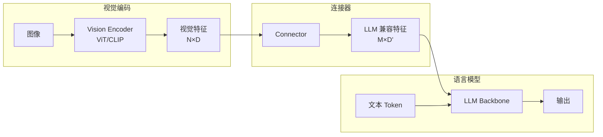
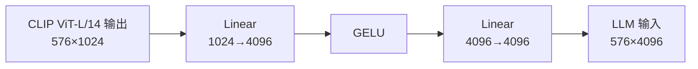
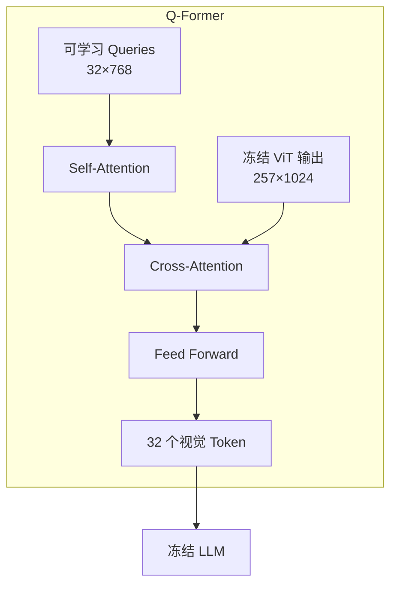
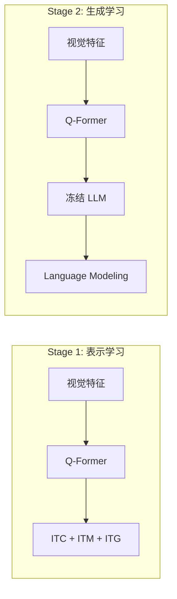
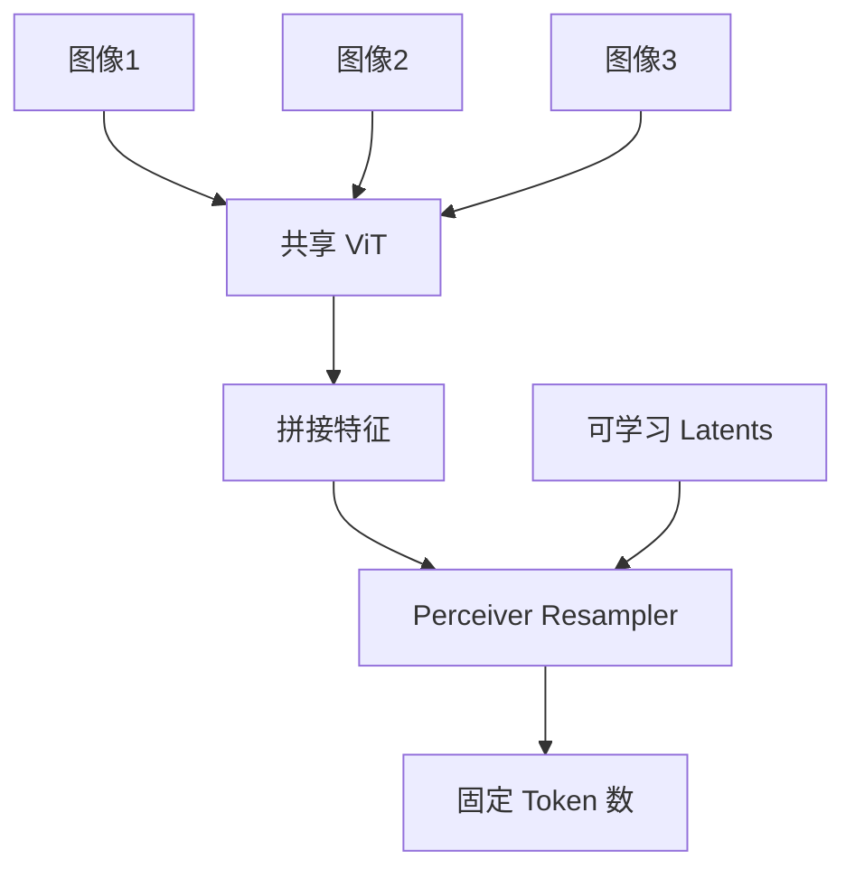
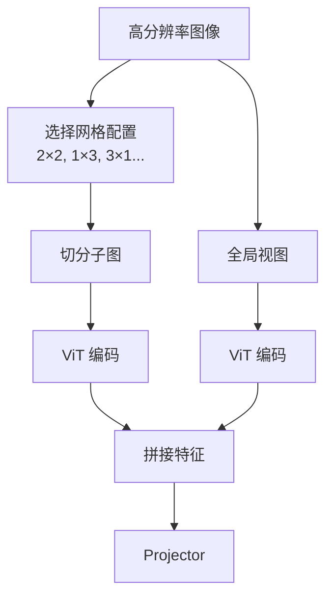

# 模态连接器：LLM 与视觉的桥梁

> 连接器（Connector/Projector）负责将视觉编码器输出的特征适配到 LLM 的输入空间，其设计直接影响模型的参数效率和语义理解深度。

---

## 架构总览



---

## 主流方案对比

| 特性 | LLaVA (Linear) | BLIP-2 (Q-Former) | Flamingo (Perceiver) |
| :--- | :--- | :--- | :--- |
| **核心机制** | 两层 MLP | Transformer 查询器 | Cross-Attention |
| **输出 Token 数** | 取决于 Patch 数 | 固定（如 32） | 固定（如 64） |
| **信息保留** | 完整视觉细节 | 压缩提取关键特征 | 选择性压缩 |
| **训练复杂度** | 低 | 高（两阶段） | 中 |
| **LLM 是否冻结** | 可选 | 通常冻结 | 冻结 |
| **优势场景** | OCR、细粒度 | 高效推理 | 多图交织 |

---

## LLaVA 线性投影

LLaVA 采用极简设计哲学：**简单但有效**。

### 架构设计



### 实现细节

```python
class LLaVAProjector(nn.Module):
    def __init__(self, vision_dim=1024, llm_dim=4096):
        super().__init__()
        self.projector = nn.Sequential(
            nn.Linear(vision_dim, llm_dim),
            nn.GELU(),
            nn.Linear(llm_dim, llm_dim)
        )
    
    def forward(self, vision_features):
        # vision_features: [B, N, vision_dim]
        return self.projector(vision_features)
        # output: [B, N, llm_dim]
```

### 优势与代价

| 优势 | 代价 |
| :--- | :--- |
| ✅ 保留完整视觉信息 | ❌ Token 数量多（576 个） |
| ✅ 训练简单快速 | ❌ 推理成本高 |
| ✅ OCR/细节任务表现好 | ❌ 显存占用大 |
| ✅ 参数量极少 | ❌ 长文本上下文受限 |

### LLaVA 训练策略

| 阶段 | 数据 | 训练模块 | 目的 |
| :--- | :--- | :--- | :--- |
| **Stage 1** | 558K 图文对 | 仅 Projector | 特征对齐 |
| **Stage 2** | 665K 指令数据 | Projector + LLM | 指令微调 |

---

## BLIP-2 Q-Former

BLIP-2 引入 **Q-Former（Querying Transformer）** 作为视觉与语言的瓶颈层。

### 架构设计



### 核心机制

**可学习查询向量（Learnable Queries）**：
- 初始化 32 个查询向量，每个维度 768
- 通过 Cross-Attention 与视觉特征交互
- 强制从海量视觉信息中"提炼"关键特征

**双流结构**：
- **图像 Transformer**：与视觉特征交互
- **文本 Transformer**：与文本特征交互
- 两者共享 Self-Attention 层

### 两阶段预训练



**Stage 1 损失函数**：
- **ITC (Image-Text Contrastive)**：对比学习对齐
- **ITM (Image-Text Matching)**：二分类匹配
- **ITG (Image-grounded Text Generation)**：图像条件文本生成

**Stage 2**：
- 将 Q-Former 输出作为 LLM 的软提示（Soft Prompt）
- 仅训练 Q-Former，LLM 完全冻结

### 信息压缩分析

| 输入 | 输出 | 压缩率 |
| :--- | :--- | :--- |
| ViT-L: 257×1024 | 32×768 | **~8×** |
| ViT-G: 577×1408 | 32×768 | **~18×** |

::: tip 信息过滤器
Q-Former 不仅压缩信息，还起到"过滤器"作用，去除与文本语义无关的视觉噪声（如背景细节）。
:::

---

## Flamingo Perceiver Resampler

Flamingo 使用 Perceiver 架构处理多图场景。

### 架构特点



**核心思想**：
- 使用固定数量的可学习 Latent 向量
- 通过 Cross-Attention 从任意数量图像中提取特征
- 输出 Token 数量恒定，与输入图像数量无关

### Gated Cross-Attention

Flamingo 在 LLM 每层插入 Gated Cross-Attention：

```python
# Flamingo Gated Cross-Attention
y = x + tanh(gate) * CrossAttention(x, vision_features)
```

- `gate` 初始化为 0，训练时逐渐学习
- 保护预训练 LLM 权重不被破坏

---

## 设计选择指南

### 场景 → 方案映射

| 场景 | 推荐方案 | 理由 |
| :--- | :--- | :--- |
| **OCR/文档理解** | LLaVA Linear | 需要完整视觉细节 |
| **资源受限/高并发** | Q-Former | Token 数量少 |
| **多图交织对话** | Perceiver | 固定输出长度 |
| **快速迭代/研究** | LLaVA Linear | 训练简单 |

### Token 数量对推理的影响

假设 LLM 上下文窗口为 4096 Token：

| 方案 | 视觉 Token | 剩余文本 Token | 推理成本 |
| :--- | :--- | :--- | :--- |
| **LLaVA (576)** | 576 | 3520 | 高 |
| **Q-Former (32)** | 32 | 4064 | 低 |
| **AnyRes (2880)** | 2880 | 1216 | 极高 |

---

## 进阶：动态 Token 方案

### LLaVA-NeXT AnyRes

解决高分辨率图像细节丢失问题：



**Token 数量计算**：
- 全局视图：576 Token
- 每个子图：576 Token
- 2×2 配置总计：576 + 4×576 = 2880 Token

### Token 压缩技术

| 技术 | 方法 | 压缩率 |
| :--- | :--- | :--- |
| **Spatial Pooling** | 2×2 平均池化 | 4× |
| **Token Merging** | 相似 Token 合并 | 2-4× |
| **Resampler** | Perceiver 架构 | 可变 |

---

## 参考资源

| 论文 | 主题 |
| :--- | :--- |
| [Visual Instruction Tuning (LLaVA)](https://arxiv.org/abs/2304.08485) | 线性投影 |
| [BLIP-2](https://arxiv.org/abs/2301.12597) | Q-Former |
| [Flamingo](https://arxiv.org/abs/2204.14198) | Perceiver Resampler |
| [LLaVA-NeXT](https://llava-vl.github.io/blog/2024-01-30-llava-next/) | AnyRes |
