```mermaid
flowchart LR
    V[CLIP ViT-L/14 输出 - 576×1024] --> L1[Linear - 1024�096]
    L1 --> ACT[GELU]
    ACT --> L2[Linear - 4096�096]
    L2 --> OUT[LLM 输入 - 576×4096]
```

# 模���器：LLM �视觉的桥�

> ��器（Connector/Projector）负责将视觉编�器输出的特�适��LLM 的输入空间，其设计直�影�模�的�数效�和语义�解深度�

---

## ��总览

```mermaid
flowchart LR
    subgraph 视觉编�
        IMG[图�] --> VIT[Vision Encoder (ViT/CLIP)]
        VIT --> VF[视觉特� - N×D]
    end
    
    subgraph ���
        VF --> CONN[Connector]
        CONN --> LF[LLM 兼容特� - M×D']
    end
    
    subgraph 语言模�
        LF --> LLM[LLM Backbone]
        TXT[文本 Token] --> LLM
        LLM --> OUT[输出]
    end
```

---

## 主�方案对比

| 特�| LLaVA (Linear) | BLIP-2 (Q-Former) | Flamingo (Perceiver) |
| :--- | :--- | :--- | :--- |
| **核心机制** | 两层 MLP | Transformer 查询�| Cross-Attention |
| **输出 Token �* | �决�Patch �| 固定（如 32�| 固定（如 64�|
| **信��留** | 完整视觉细节 | �缩��关键特� | 选择性��|
| **训练���* | �| 高（两阶段） | �|
| **LLM 是�冻结** | ��| 通常冻结 | 冻结 |
| **优势场景** | OCR�细粒度 | 高效�� | 多图交织 |

---

## LLaVA 线性投�

LLaVA 采用�简设计哲学�*简�但有效**�

### ��设计



### ��细节

```python
class LLaVAProjector(nn.Module):
    def __init__(self, vision_dim=1024, llm_dim=4096):
        super().__init__()
        self.projector = nn.Sequential(
            nn.Linear(vision_dim, llm_dim),
            nn.GELU(),
            nn.Linear(llm_dim, llm_dim)
        )
    
    def forward(self, vision_features):
        # vision_features: [B, N, vision_dim]
        return self.projector(vision_features)
        # output: [B, N, llm_dim]
```

### 优势�代�

| 优势 | 代价 |
| :--- | :--- |
| ��留完整视觉信� | �Token 数�多（576 个） |
| �训练简�快�| ����本�|
| �OCR/细节任务表��| �显存�用�|
| ��数���| �长文本上下文�� |

### LLaVA 训练策略

#### 数�生�策略：利�GPT-4 ��指令

**核心�想**：使�GPT-4（纯文本）基�COCO Caption �Bounding Box 信�生���多轮对��

**Prompt 设计**�

```python
# 示例 Prompt
prompt = f"""
基�以下图��述和对象�置信�，生�三�类�的多轮对�：

图��述：{coco_caption}
对象�置�
- person: [x1, y1, x2, y2]
- bicycle: [x1, y1, x2, y2]

请生�：
1. 详细�述（Detailed Description）：对图�进行全���
2. ��问答（Reasoning QA）：基�图�内容的��问�
3. ��对�（Complex Conversation）：多轮交互�对�
"""
```

**生�示例**�

```json
{
  "image": "COCO_val2014_000000001234.jpg",
  "conversations": [
    {
      "from": "human",
      "value": "<image>\n请详细�述这张图片�
    },
    {
      "from": "gpt",
      "value": "图片中展示了一个人骑�自行车在公园路上。这个人穿��色的�动�，戴�头盔，看起��常专业。背景是绩丽的公园景色，有绿树和�地�
    }
  ]
}
```

**数�规模**�

- **Stage 1**�58K CC3M 图文对（简�Caption�
- **Stage 2**�65K 多模�指令数�
  - 158K GPT-4 生�的对�
  - 507K 其他任务数�

#### 两阶段训练详细��

| 阶段 | 数� | 冻结模� | 训练模� | Epoch | 学习�| Batch Size |
| :--- | :--- | :--- | :--- | :--- | :--- | :--- |
| **Stage 1** | 558K CC3M | ViT + LLM | Projector | 1 | 1e-3 | 256 |
| **Stage 2** | 665K指令 | ViT | Projector + LLM | 3 | 2e-5 | 128 |

**训练时间**�

- Stage 1：约 5 �时�×A100 80G�
- Stage 2：约 20 �时�×A100 80G�

| 阶段 | 数� | 训练模� | 目的 |
| :--- | :--- | :--- | :--- |
| **Stage 1** | 558K 图文�| �Projector | 特�对� |
| **Stage 2** | 665K 指令数� | Projector + LLM | 指令微调 |

---

## BLIP-2 Q-Former

BLIP-2 引入 **Q-Former（Querying Transformer�* 作为视觉�语言的瓶颈层�

### ��设计



```mermaid
flowchart TB
    subgraph Q-Former
        Q[�学�Queries - 32×768] --> SA[Self-Attention]
        SA --> CA[Cross-Attention]
        VIT[冻结 ViT 输出 - 257×1024] --> CA
        CA --> FFN[Feed Forward]
        FFN --> OUT[32 个视�Token]
    end
    
    OUT --> LLM[冻结 LLM]
```

### 核心机制

**�学习查询��（Learnable Queries�*�

- �始�32 个查询��，�个维度 768
- 通过 Cross-Attention �视觉特�交�
- 强制�海�视觉信�中"�炼"关键特�

**��结�**�

- **图� Transformer**：�视觉特�交互
- **文本 Transformer**：�文本特�交互
- 两者共�Self-Attention �

### 两阶段预训练

```mermaid
flowchart LR
    subgraph "Stage 1: 表示学习"
        V1[视觉特�] --> Q1[Q-Former]
        Q1 --> L1[ITC + ITM + ITG]
    end
    
    subgraph "Stage 2: 生�学习"
        V2[视觉特�] --> Q2[Q-Former]
        Q2 --> LLM[冻结 LLM]
        LLM --> L2[Language Modeling]
    end
```



**Stage 1 �失函数**�

- **ITC (Image-Text Contrastive)**：对比学习对�
- **ITM (Image-Text Matching)**：二分类匹�
- **ITG (Image-grounded Text Generation)**：图��件文本生�

**Stage 2**ï¼?

- �Q-Former 输出作为 LLM 的软�示（Soft Prompt�
- 仅训�Q-Former，LLM 完全冻结

### 信��缩分�

| 输入 | 输出 | �缩�|
| :--- | :--- | :--- |
| ViT-L: 257×1024 | 32×768 | **~8×** |
| ViT-G: 577×1408 | 32×768 | **~18×** |

### Q-Former 训练详细�程

#### Stage 1：三�一�失函数

**代���**�

```python
def stage1_training(image, text, qformer, vision_encoder):
    """
    BLIP-2 Stage 1: 视觉-语言表�学习
    """
    # 1. Image-Text Contrastive (ITC) - 对比学习
    with torch.no_grad():
        image_features = vision_encoder(image)  # 冻结ViT
    
    # Q-Former编�（仅Self-Attention，�用Cross-Attention�
    image_embeds = qformer.encode_image(image_features, mode='unimodal')
    text_embeds = qformer.encode_text(text, mode='unimodal')
    
    # 对比�失
    loss_itc = contrastive_loss(image_embeds, text_embeds)
    
    # 2. Image-Text Matching (ITM) - 二分类匹�
    # 难负样本挖�：�对比学习中选相似但�匹�的样本
    with torch.no_grad():
        neg_indices = select_hard_negatives(image_embeds, text_embeds)
    
    # 正样�
    pos_score = qformer.match(image_features, text, label=1)
    # 负样�
    neg_score = qformer.match(image_features, text[neg_indices], label=0)
    
    loss_itm = binary_cross_entropy(pos_score, neg_score)
    
    # 3. Image-grounded Text Generation (ITG) - 图��件生�
    # Q-Former输出作为Prefixes
    visual_prefix = qformer.encode_image(image_features, mode='multimodal')
    loss_itg = language_modeling_loss(visual_prefix, text)
    
    # 总��
    total_loss = loss_itc + loss_itm + loss_itg
    return total_loss
```

**难负样本挖�策略**�

- �Batch 内找�当�图�相似度最高的 k 个负样本
- 让模�学会区分细微差�

#### Stage 2：软�示生�

```python
def stage2_training(image, text, qformer, vision_encoder, llm):
    """
    BLIP-2 Stage 2: 视觉到语言的生�学�
    """
    with torch.no_grad():
        image_features = vision_encoder(image)  # 冻结ViT
    
    # Q-Former输出32个Query
    queries = qformer.forward(image_features)  # [B, 32, 768]
    
    # 线性投影到LLM�嵌入维�
    soft_prompts = linear_projection(queries)  # [B, 32, llm_dim]
    
    # �置�文�Token 之�
    inputs_embeds = torch.cat([soft_prompts, llm.embed_tokens(text)], dim=1)
    
    with torch.no_grad():
        outputs = llm(inputs_embeds=inputs_embeds)  # 冻结LLM
    
    # 语言建模�失（仅在文本部分）
    loss = language_modeling_loss(outputs, text)
    return loss
```

**关键设计**�

- Q-Former 输出作为 **软��*，�计算其��
- LLM 完全冻结，仅训练 Q-Former 和投影层
- �护 LLM 的语言能力�被破�

---

## Flamingo Perceiver Resampler

Flamingo 使用 Perceiver ��处�多图场景�

### ��特点

```mermaid
flowchart TB
    IMG1[图�1] --> VIT
    IMG2[图�2] --> VIT
    IMG3[图�3] --> VIT
    VIT[共享 ViT] --> CAT[拼�特�]
    CAT --> PR[Perceiver Resampler]
    L[�学�Latents] --> PR
    PR --> OUT[固定 Token 数]
```



**核心�想**�

- 使用固定数�的�学习 Latent ��
- 通过 Cross-Attention �任�数�图�中��特�
- 输出 Token 数��定，�输入图�数�无关

### Gated Cross-Attention

Flamingo �LLM �层�入 Gated Cross-Attention�

```python
# Flamingo Gated Cross-Attention
y = x + tanh(gate) * CrossAttention(x, vision_features)
```

- `gate` �始化为 0，训练时��学习
- �护预训�LLM ���被破�

---

## 设计选择指�

### 场景 �方案映射

| 场景 | ��方案 | �由 |
| :--- | :--- | :--- |
| **OCR/文档�解** | LLaVA Linear | 需�完整视觉细�|
| **资���/高并�* | Q-Former | Token 数��|
| **多图交织对�** | Perceiver | 固定输出长度 |
| **快速迭�研究** | LLaVA Linear | 训练简�|

### Token 数�对��的影�

�设 LLM 上下文窗�为 4096 Token�

| 方案 | 视觉 Token | 剩余文本 Token | ���本 |
| :--- | :--- | :--- | :--- |
| **LLaVA (576)** | 576 | 3520 | é«?|
| **Q-Former (32)** | 32 | 4064 | ä½?|
| **AnyRes (2880)** | 2880 | 1216 | �高 |

---

## 进阶：动�Token 方案

### LLaVA-NeXT AnyRes

解决高分辨�图�细节丢失问题�

```mermaid
flowchart TB
    IMG[高分辨�图�] --> GRID[选择网格�置 - 2×2, 1×3, 3×1...]
    IMG --> GLOBAL[全局视图]
    GRID --> SPLIT[切分�图]
    SPLIT --> VIT1[ViT ç¼–ç �]
    GLOBAL --> VIT2[ViT ç¼–ç �]
    VIT1 --> CAT[拼�特�]
    VIT2 --> CAT
    CAT --> PROJ[Projector]
```



**Token 数�计算**�

- 全局视图�76 Token
- �个�图�76 Token
- 2×2 �置总计�76 + 4×576 = 2880 Token

### Token �缩技�

| 技�| 方法 | �缩�|
| :--- | :--- | :--- |
| **Spatial Pooling** | 2×2 平�池化 | 4× |
| **Token Merging** | 相似 Token �并 | 2-4× |
| **Resampler** | Perceiver �� | �� |

---

## �考资�

| 论文 | 主题 |
| :--- | :--- |
| [Visual Instruction Tuning (LLaVA)](https://arxiv.org/abs/2304.08485) | 线性投�|
| [BLIP-2](https://arxiv.org/abs/2301.12597) | Q-Former |
| [Flamingo](https://arxiv.org/abs/2204.14198) | Perceiver Resampler |
| [LLaVA-NeXT](https://llava-vl.github.io/blog/2024-01-30-llava-next/) | AnyRes |

