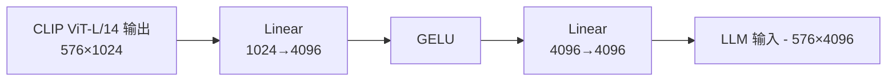
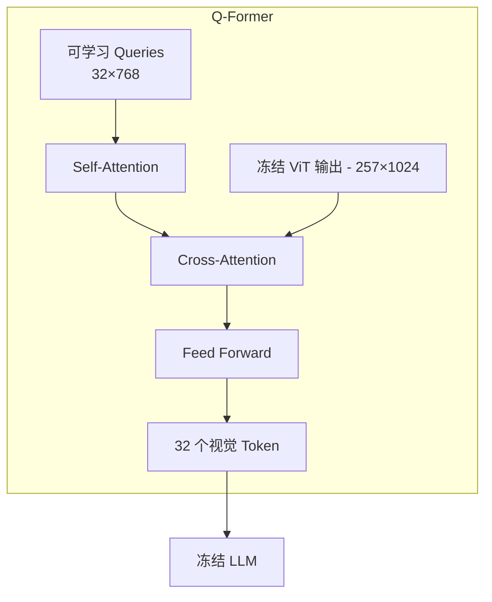
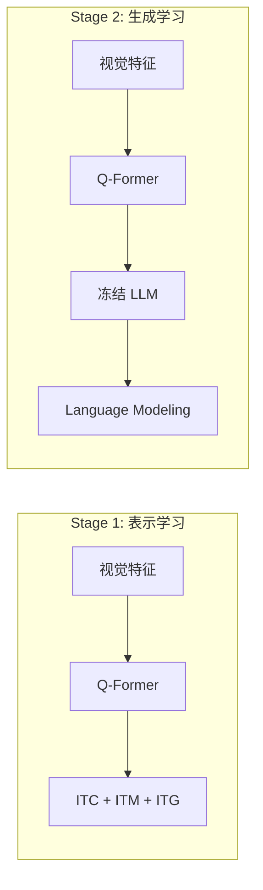
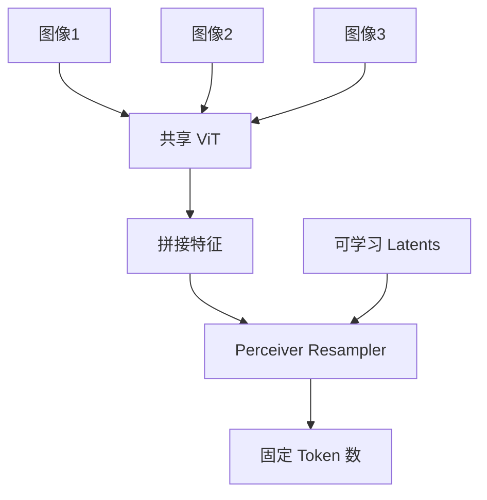
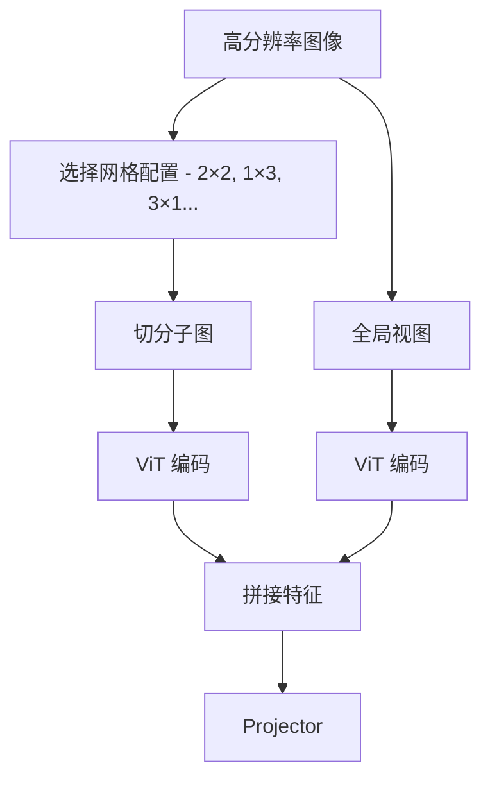

# 模态连接器：LLM 与视觉的桥梁

> 连接器（Connector/Projector）负责将视觉编码器输出的特征适配到 LLM 的输入空间，其设计直接影响模型的参数效率和语义理解深度。

---

## 架构总览

```mermaid
flowchart LR
    subgraph 视觉编码
        IMG[图像] --> VIT[Vision Encoder (ViT/CLIP)]
        VIT --> VF[视觉特征 - N×D]
    end
    
    subgraph 连接器
        VF --> CONN[Connector]
        CONN --> LF[LLM 兼容特征 - M×D']
    end
    
    subgraph 语言模型
        LF --> LLM[LLM Backbone]
        TXT[文本 Token] --> LLM
        LLM --> OUT[输出]
    end
```

---

## 主流方案对比

| 特性 | LLaVA 系列 (Projector) | BLIP-2 (Q-Former) | Flamingo (Perceiver) |
| :--- | :--- | :--- | :--- |
| **核心机制** | 初代线性投影，1.5 常用两层 MLP | Transformer 查询器 | Cross-Attention |
| **输出 Token 数** | 取决于 Patch 数 | 固定（如 32） | 固定（如 64） |
| **信息保留** | 保留每个编码后 patch 的位置；不等于保留原像素全部信息 | 压缩提取关键特征 | 选择性压缩 |
| **训练复杂度** | 低 | 高（两阶段） | 中 |
| **LLM 是否冻结** | 可选 | 通常冻结 | 冻结 |
| **优势场景** | OCR、细粒度 | 高效推理 | 多图交织 |

---

## LLaVA 线性投影

初代 LLaVA 用线性投影；下图与代码示意 [LLaVA-1.5](https://arxiv.org/abs/2310.03744)的两层 MLP。576 个 patch 对应 336×336 输入与 14×14 patch，不是所有 LLaVA 的固定配置。

### 架构设计


```mermaid
flowchart LR
    V[CLIP ViT-L/14 输出<br/>576×1024] --> L1[Linear<br/>1024→4096]
    L1 --> ACT[GELU]
    ACT --> L2[Linear<br/>4096→4096]
    L2 --> OUT[LLM 输入 - 576×4096]
```

### 实现细节

```python
import torch.nn as nn

class LLaVAProjector(nn.Module):
    def __init__(self, vision_dim=1024, llm_dim=4096):
        super().__init__()
        self.projector = nn.Sequential(
            nn.Linear(vision_dim, llm_dim),
            nn.GELU(),
            nn.Linear(llm_dim, llm_dim)
        )
    
    def forward(self, vision_features):
        # vision_features: [B, N, vision_dim]
        return self.projector(vision_features)
        # output: [B, N, llm_dim]
```

### 优势与代价

| 优势 | 代价 |
| :--- | :--- |
| ✅ 不在连接器处减少 patch 数 | ❌ Token 数量多（576 个） |
| ✅ 训练简单快速 | ❌ 推理成本高 |
| ✅ OCR/细节任务表现好 | ❌ 显存占用大 |
| ✅ 相对 LLM 主干参数较少 | ❌ 长文本上下文受限 |

### LLaVA 训练策略

#### 数据生成策略：利用 GPT-4 合成指令

**核心思想**：用 GPT-4（纯文本）基于 COCO Caption + Bounding Box 信息生成多轮对话，涵盖描述、推理与交互。

**Prompt 设计**示例：

```python
# 示例 Prompt
prompt = f"""
基于以下图像描述和对象位置信息，生成三种类型的多轮对话：

图像描述：{coco_caption}
对象位置信息：
- person: [x1, y1, x2, y2]
- bicycle: [x1, y1, x2, y2]

请生成：
1. 详细描述（Detailed Description）：对图像进行全面描述
2. 推理问答（Reasoning QA）：基于图像内容的推理问答
3. 复杂对话（Complex Conversation）：多轮交互式对话
"""
```

**生成示例**：

```json
{
  "image": "COCO_val2014_000000001234.jpg",
  "conversations": [
    {
      "from": "human",
      "value": "<image>\n请详细描述这张图片。"
    },
    {
      "from": "gpt",
      "value": "图片中展示了一个人骑着自行车在公园路上。这个人穿着蓝色运动服，戴着头盔，背景是有绿树和草地的公园景色。"
    }
  ]
}
```

**数据规模**：初代视觉指令合成与 LLaVA-1.5 的混合训练不是同一配方。LLaVA-1.5 常见配置使用约 558K 对齐数据和 665K 指令混合数据；样本构成、学习率和训练时长须随具体 release 核对，不能把它们标成所有版本的固定 recipe。

### 两阶段预训练

| 阶段 | 训练部分 | 目的 | 排障信号 |
| --- | --- | --- | --- |
| 特征对齐 | 冻结 ViT/LLM，训练 projector | 把视觉特征接入语言空间 | projector 梯度与简单图像描述是否改善 |
| 指令微调 | 常见做法更新 projector + LLM，ViT 冻结 | 按指令使用视觉信息 | 新问题、视觉对照和纯文本回归 |

这张表是常见路线，不是强制配置。冻结 LLM 参数仍须保留经过 LLM 到 projector 的梯度；冻结参数与关闭整个前向的 autograd 是两回事。

---

## BLIP-2 Q-Former

BLIP-2 引入 **Q-Former（Querying Transformer）** 作为视觉与语言的瓶颈层。

### 架构设计


```mermaid
flowchart TB
    subgraph Q-Former
        Q[可学习 Queries<br/>32×768] --> SA[Self-Attention]
        SA --> CA[Cross-Attention]
        VIT[冻结 ViT 输出 - 257×1024] --> CA
        CA --> FFN[Feed Forward]
        FFN --> OUT[32 个视觉 Token]
    end
    
    OUT --> LLM[冻结 LLM]
```

### 核心机制

**可学习查询向量（Learnable Queries）**：

- 初始化 32 个查询向量，每个维度 768
- 通过 Cross-Attention 与视觉特征交互
- 强制从海量视觉信息中"提炼"关键特征

**双流结构**：

- **图像 Transformer**：与视觉特征交互
- **文本 Transformer**：与文本特征交互
- 两者共享 Self-Attention 层

### 两阶段预训练


```mermaid
flowchart LR
    subgraph "Stage 1: 表示学习"
        V1[视觉特征] --> Q1[Q-Former]
        Q1 --> L1[ITC + ITM + ITG]
    end
    
    subgraph "Stage 2: 生成学习"
        V2[视觉特征] --> Q2[Q-Former]
        Q2 --> LLM[冻结 LLM]
        LLM --> L2[Language Modeling]
    end
```

**Stage 1 损失函数**：

- **ITC (Image-Text Contrastive)**：对比学习对齐
- **ITM (Image-Text Matching)**：二分类匹配
- **ITG (Image-grounded Text Generation)**：图像条件文本生成

**Stage 2**：

- 将 Q-Former 输出作为 LLM 的软提示（Soft Prompt）
- 训练 Q-Former 与到 LLM 的投影层，LLM 参数冻结

### 信息压缩分析

| 输入 | 输出 | token 数缩减（不是无损信息压缩率） |
| :--- | :--- | :--- |
| ViT-L: 257×1024 | 32×768 | **~8×** |
| ViT-G: 577×1408 | 32×768 | **~18×** |

### Q-Former 训练详细流程

下列是原理伪代码，`encode_image`、`match`、loss 函数均为抽象接口；需按 [BLIP-2 官方实现](https://github.com/salesforce/LAVIS/tree/main/lavis/models/blip2_models)接入正确 attention mask、负例标签和语言标签。不是可直接运行的训练脚本。

#### Stage 1：三合一损失函数

**代码实现**：

```python
def stage1_training(image, text, qformer, vision_encoder):
    """
    BLIP-2 Stage 1: 视觉-语言表征学习
    """
    # 1. Image-Text Contrastive (ITC) - 对比学习
    with torch.no_grad():
        image_features = vision_encoder(image)  # 冻结ViT
    
    # 图像 queries 仍通过 Cross-Attention 读取视觉；unimodal mask 隔离 query 与文本流
    image_embeds = qformer.encode_image(image_features, mode='unimodal')
    text_embeds = qformer.encode_text(text, mode='unimodal')
    
    # 对比损失
    loss_itc = contrastive_loss(image_embeds, text_embeds)
    
    # 2. ITM (Image-Text Matching)：二分类匹配
    # 难负样本挖掘：从对比学习中选相似但不匹配的样本
    with torch.no_grad():
        neg_indices = select_hard_negatives(image_embeds, text_embeds)
    
    # 正样本
    pos_score = qformer.match(image_features, text, label=1)
    # 负样本
    neg_score = qformer.match(image_features, text[neg_indices], label=0)
    
    loss_itm = binary_cross_entropy(pos_score, neg_score)
    
    # 3. Image-grounded Text Generation (ITG) - 图像条件生成
    # Q-Former输出作为Prefixes
    visual_prefix = qformer.encode_image(image_features, mode='multimodal')
    loss_itg = language_modeling_loss(visual_prefix, text)
    
    # 总损失
    total_loss = loss_itc + loss_itm + loss_itg
    return total_loss
```

**难负样本挖掘策略**：

- 在 batch 内找与当前图像相似度最高的 k 个负样本
- 让模型学会区分细微差异

#### Stage 2：软提示生成

```python
def stage2_training(image, text, qformer, vision_encoder, llm):
    """
    BLIP-2 "Stage 2: 视觉到语言的生成学习"
    """
    with torch.no_grad():
        image_features = vision_encoder(image)  # 冻结ViT
    
    # Q-Former 输出 32 个 Query
    queries = qformer.forward(image_features)  # [B, 32, 768]
    
    # 线性投影到 LLM 词嵌入维度
    soft_prompts = linear_projection(queries)  # [B, 32, llm_dim]
    
    # 前置于文本 token 之前
    inputs_embeds = torch.cat([soft_prompts, llm.embed_tokens(text)], dim=1)
    
    # 参数不更新，但保留从 loss 经 LLM 到 soft_prompts 的计算图
    for parameter in llm.parameters():
        parameter.requires_grad_(False)
    outputs = llm(inputs_embeds=inputs_embeds)
    
    # 语言建模损失（仅在文本部分）
    loss = language_modeling_loss(outputs, text)
    return loss
```

**关键设计**：

- 将 Q-Former 输出作为**可导软提示**，必须计算其梯度才能训练 Q-Former
- LLM 完全冻结，仅训练 Q-Former 和投影层
- 基座参数保持不变；端到端输出质量仍需验证

---

## Flamingo Perceiver Resampler

Flamingo 使用 Perceiver 架构处理多图场景。

### 架构特点


```mermaid
flowchart TB
    IMG1[图像1] --> VIT
    IMG2[图像2] --> VIT
    IMG3[图像3] --> VIT
    VIT[共享 ViT] --> CAT[拼接特征]
    CAT --> PR[Perceiver Resampler]
    L[可学习 Latents] --> PR
    PR --> OUT[固定 Token 数]
```

**核心思想**：

- 使用固定数量的可学习 Latent 向量
- 对每张图像或一段视频的视觉特征重采样
- 每个视觉输入输出固定数量 latent；多个图像的总视觉表示预算仍会增长

### Gated Cross-Attention

Flamingo 按配置在 LLM 层之间插入 Gated Cross-Attention，插入频率并非所有规模都相同：

```python
# Flamingo Gated Cross-Attention
y = x + tanh(gate) * CrossAttention(x, vision_features)
```

- `gate` 初始化为 0，训练时逐渐学习
- 保护预训练 LLM 权重不被破坏

---

## 设计选择指南

### 场景 → 方案映射

| 场景 | 推荐方案 | 理由 |
| :--- | :--- | :--- |
| **OCR/文档理解** | LLaVA Linear | 需要完整视觉细节 |
| **资源受限/高并发** | Q-Former | Token 数量少 |
| **多图交织对话** | Perceiver + 图像关联 mask | 每个视觉输入重采样，显式关联图文 |
| **快速迭代/研究** | LLaVA Linear | 训练简单 |

### Token 数量对推理的影响

以下仅估算直接拼接视觉 token 的上下文预算，设窗口为 4096；还需扣除系统提示、特殊标记和预留输出。Flamingo 的外部 cross-attention 表示不能直接套用此减法：

| 方案 | 视觉 Token | 剩余文本 Token | 推理成本 |
| :--- | :--- | :--- | :--- |
| **LLaVA (576)** | 576 | 3520 | 高 |
| **Q-Former (32)** | 32 | 4064 | 低 |
| **AnyRes (2880)** | 2880 | 1216 | 极高 |

---

## 进阶：动态 Token 方案

### LLaVA-NeXT AnyRes

解决高分辨率图像细节丢失问题：


```mermaid
flowchart TB
    IMG[高分辨率图像] --> GRID[选择网格配置 - 2×2, 1×3, 3×1...]
    IMG --> GLOBAL[全局视图]
    GRID --> SPLIT[切分子图]
    SPLIT --> VIT1[ViT 编码]
    GLOBAL --> VIT2[ViT 编码]
    VIT1 --> CAT[拼接特征]
    VIT2 --> CAT
    CAT --> PROJ[Projector]
```

**Token 数量计算**：

- 全局视图：576 Token
- 每个子图：576 Token
- 2×2 配置简单计数：576 + 4×576 = 2880 Token；实际 processor 可能去 padding、添加换行或合并 token，最终以模型输入为准

### Token 压缩技术

| 技术 | 方法 | 压缩率 |
| :--- | :--- | :--- |
| **Spatial Pooling** | 2×2 平均池化 | 4× |
| **Token Merging** | 相似 Token 合并 | 2-4× |
| **Resampler** | Perceiver 架构 | 可变 |

---

## 连接器实验怎么验收

固定视觉编码器、语言基座、数据和分辨率，比较 projector 与不同 query 数的重采样器。至少报告细粒度 OCR、计数、空间关系、文本回归、视觉 token 与端到端延迟；token 少不等于总耗时一定少。

- 对同一 batch 检查 projector/Q-Former 有梯度，冻结参数没有梯度；再检查一次 optimizer step 后只有预期参数变化。
- 换图或遮挡证据区域后，答案应随证据变化。若答案始终相同，排查图像索引、占位符、mask 和语言捷径。
- 低 query 数只丢小字/计数而粗分类正常时，优先增大视觉信息预算；所有任务都坏时先检查 dtype、特征层与预处理。
- 记录训练模块清单、实际张量形状、输入预算与留出结果，使“冻结”“压缩”“对齐”都有可检查的证据。

## 参考资源

| 论文 | 主题 |
| :--- | :--- |
| [Visual Instruction Tuning (LLaVA)](https://arxiv.org/abs/2304.08485) | 线性投影 |
| [BLIP-2](https://arxiv.org/abs/2301.12597) | Q-Former |
| [Flamingo](https://arxiv.org/abs/2204.14198) | Perceiver Resampler |
| [LLaVA-NeXT](https://llava-vl.github.io/blog/2024-01-30-llava-next/) | AnyRes |
