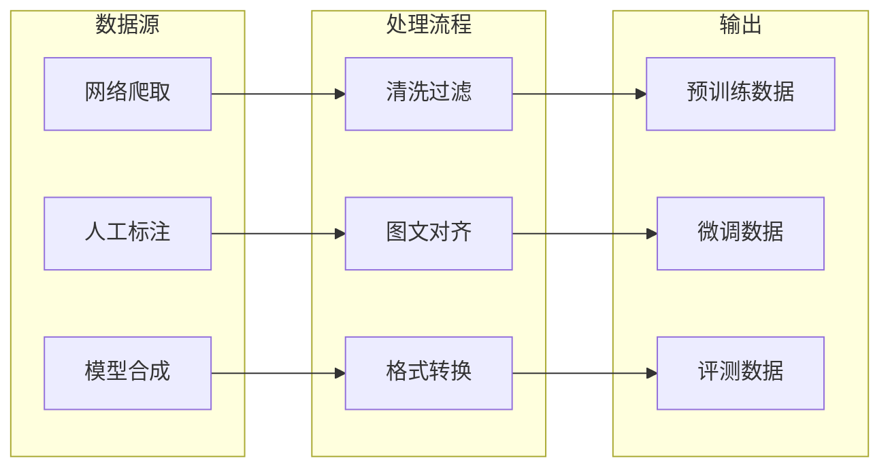
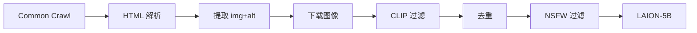
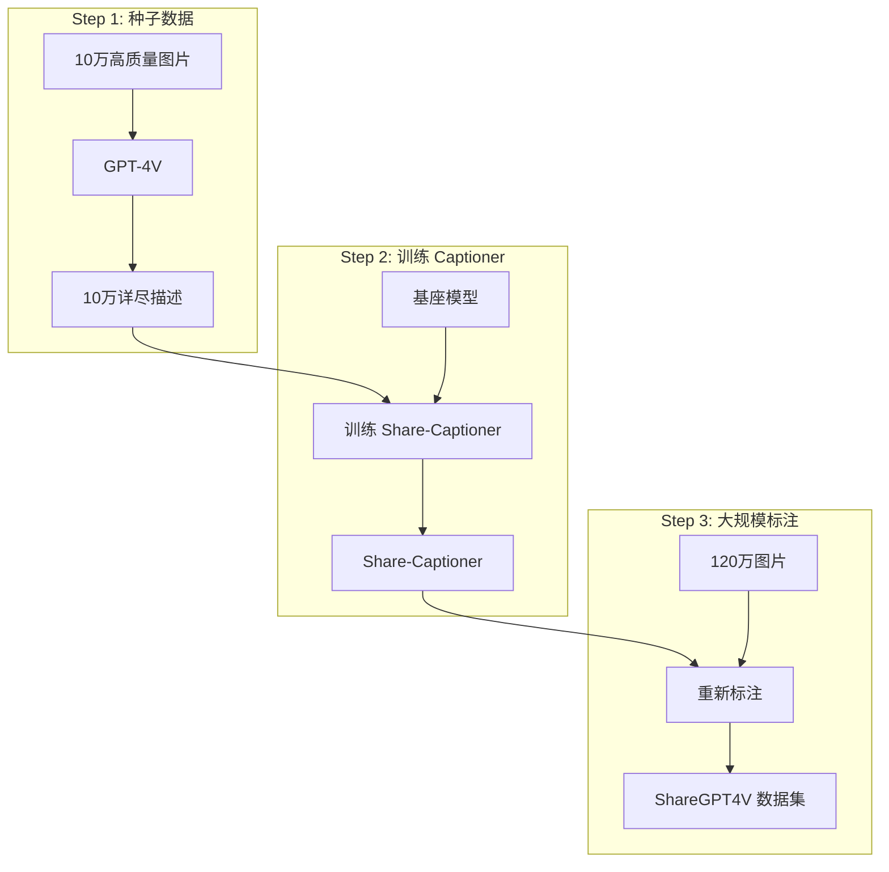
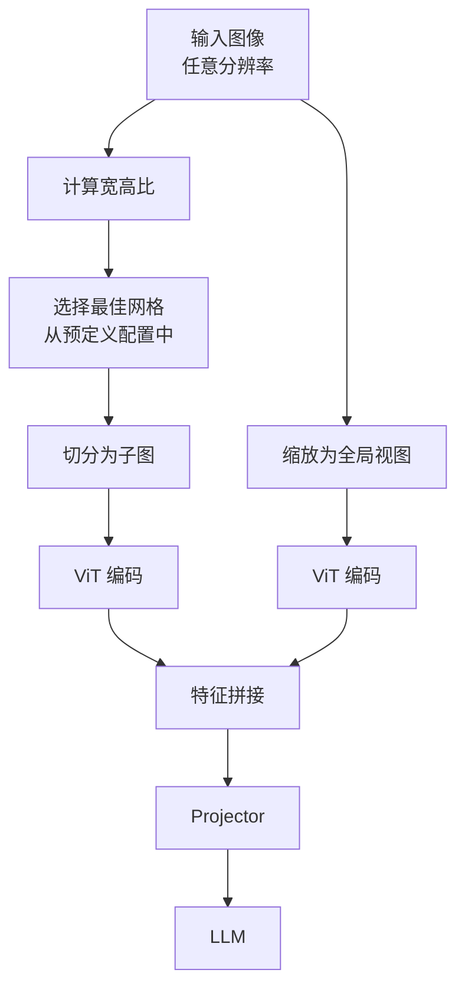

# 多模态数据工程

> **"Data is the new oil"** —— 在多模态领域，数据的质量与规模直接决定模型上限。数据工程不仅是收集，更涉及复杂的清洗、过滤与合成策略。

---

## 数据工程全景



---

## LAION-5B：工业级数据清洗

LAION-5B 是目前最大的开源多模态数据集，包含 **58.5 亿**图文对。

### 构建流水线



### 关键过滤步骤

| 步骤 | 技术 | 目的 |
| :--- | :--- | :--- |
| **URL 过滤** | 黑名单匹配 | 排除低质/违规站点 |
| **图像下载** | 并行爬取 + 重试 | 获取原始图像 |
| **CLIP 过滤** | 计算图文相似度 | 保证语义相关性 |
| **去重** | 感知哈希 (pHash) | 去除重复图像 |
| **NSFW 过滤** | CLIP 分类器 | 过滤成人内容 |

### CLIP Score 阈值

```python
# LAION 过滤逻辑
def filter_sample(image, text):
    image_emb = clip.encode_image(image)
    text_emb = clip.encode_text(text)
    score = cosine_similarity(image_emb, text_emb)
    
    # 英文数据阈值
    if language == 'en':
        return score >= 0.28
    # 多语言数据阈值
    else:
        return score >= 0.26
```

### CLIP 过滤的双刃剑

<div class="compare-box">
  <div class="compare-item highlight">
    <div class="compare-title">优势</div>
    <p class="compare-desc">✅ 保证图文语义相关<br/>✅ 自动过滤低质数据<br/>✅ 可大规模并行处理</p>
  </div>
  <div class="compare-vs">VS</div>
  <div class="compare-item">
    <div class="compare-title">劣势</div>
    <p class="compare-desc">❌ 继承 CLIP 偏见<br/>❌ 过滤罕见概念<br/>❌ 某些艺术风格被排除</p>
  </div>
</div>

::: warning CLIP 偏见传播
如果 CLIP 无法识别某种艺术风格或生僻概念，相关数据就会被过滤掉。这导致下游模型在这些领域覆盖率不足，形成"偏见闭环"。
:::

### LAION 数据集家族

| 数据集 | 规模 | 语言 | 特点 |
| :--- | :--- | :--- | :--- |
| **LAION-400M** | 4 亿 | 英文 | 早期版本 |
| **LAION-5B** | 58.5 亿 | 多语言 | 主力数据集 |
| **LAION-Aesthetic** | 1.2 亿 | 英文 | 高美学评分 |
| **LAION-COCO** | 6 亿 | 英文 | 类 COCO 格式 |

---

## ShareGPT4V：高质量 Caption 合成

传统网络爬取数据的 alt 文本往往**过于简短**，缺乏对图像细节的描述。

### 问题示例

| 来源 | Caption 示例 |
| :--- | :--- |
| **网络 alt 文本** | "beach photo" |
| **人工标注** | "A person surfing on a wave" |
| **GPT-4V 生成** | "The image captures an exhilarating moment of a surfer riding a powerful wave. The surfer, clad in a black wetsuit, demonstrates remarkable balance and skill..." |

### ShareGPT4V 数据闭环



### GPT-4V Prompt 设计

```markdown
请详细描述这张图片，包括但不限于：
1. 主要对象及其属性（颜色、形状、大小）
2. 对象之间的空间关系
3. 场景的整体氛围和背景
4. 任何文字或符号
5. 图片的艺术风格或拍摄技术
6. 可能的世界知识关联

请用详尽的段落形式描述，而非简单的列表。
```

### 数据质量对比

| 指标 | LAION Caption | ShareGPT4V Caption |
| :--- | :--- | :--- |
| **平均长度** | ~12 词 | ~150 词 |
| **细节覆盖** | 仅主体 | 全面细节 |
| **空间关系** | 无 | 有 |
| **世界知识** | 无 | 有 |

### 训练效果

实验证明，使用高密度 Caption 预训练：
- 视觉特征与语言概念对齐更精确
- 细粒度任务（OCR、定位）显著提升
- 幻觉问题减少

---

## 动态分辨率：AnyRes

### 问题：固定分辨率的局限

传统方法将所有图像缩放到固定分辨率（如 336×336）：

| 原始图像 | 缩放后 | 问题 |
| :--- | :--- | :--- |
| 高清照片 4K | 336×336 | 细节丢失 |
| 文档截图 | 336×336 | 文字模糊 |
| 长图/宽图 | 336×336 | 严重变形 |

### LLaVA-NeXT AnyRes 方案



### 网格配置

```python
GRID_CONFIGS = [
    (1, 1),  # 正方形小图
    (1, 2),  # 宽图
    (2, 1),  # 高图
    (2, 2),  # 大正方形
    (1, 3),  # 超宽图
    (3, 1),  # 超高图
    (2, 3),  # 宽大图
    (3, 2),  # 高大图
]

def select_grid(image_width, image_height, patch_size=336):
    aspect_ratio = image_width / image_height
    # 选择最匹配宽高比的网格配置
    best_grid = min(GRID_CONFIGS, 
                    key=lambda g: abs(g[0]/g[1] - aspect_ratio))
    return best_grid
```

### Token 数量计算

| 配置 | 子图数 | 子图 Token | 全局 Token | 总计 |
| :--- | :--- | :--- | :--- | :--- |
| **1×1** | 1 | 576 | 576 | 1152 |
| **2×2** | 4 | 2304 | 576 | 2880 |
| **3×2** | 6 | 3456 | 576 | 4032 |

### 意外收获：零样本视频理解

AnyRes 的设计意外带来视频理解能力：
- 视频帧 = 动态分辨率的图像序列
- 将多帧作为"子图"输入
- 无需专门视频训练

---

## 数据格式标准

### 预训练格式

```json
{
  "image": "path/to/image.jpg",
  "caption": "A detailed description of the image..."
}
```

### 指令微调格式

```json
{
  "image": "path/to/image.jpg",
  "conversations": [
    {"from": "human", "value": "<image>\nDescribe this image."},
    {"from": "gpt", "value": "This image shows..."}
  ]
}
```

### 多图对话格式

```json
{
  "images": ["img1.jpg", "img2.jpg"],
  "conversations": [
    {"from": "human", "value": "<image>\n<image>\nCompare these two images."},
    {"from": "gpt", "value": "The first image shows... while the second..."}
  ]
}
```

---

## 数据质量评估

### 自动化指标

| 指标 | 计算方式 | 用途 |
| :--- | :--- | :--- |
| **CLIP Score** | 图文余弦相似度 | 语义相关性 |
| **Aesthetic Score** | LAION 美学模型 | 图像质量 |
| **Text Complexity** | 词汇多样性/长度 | Caption 丰富度 |
| **Perplexity** | 语言模型困惑度 | Caption 流畅度 |

### 人工评估维度

| 维度 | 评估内容 |
| :--- | :--- |
| **准确性** | Caption 是否真实描述图像 |
| **完整性** | 是否覆盖主要视觉元素 |
| **细节度** | 空间关系、属性是否充分 |
| **相关性** | 是否有无关信息 |

---

## 实践建议

### 数据收集策略

| 阶段 | 数据类型 | 规模 | 质量要求 |
| :--- | :--- | :--- | :--- |
| **预训练** | 网络爬取 | 10M+ | 中等 |
| **多任务** | 公开数据集 | 1M+ | 较高 |
| **指令微调** | 人工/合成 | 100K+ | 极高 |

### 常见陷阱

::: danger 数据泄漏
确保训练数据与评测数据无重叠！使用去重和交叉检查。
:::

::: warning 分布偏差
网络数据存在严重的长尾分布，罕见概念覆盖不足。考虑数据增强或合成补充。
:::

---

## 参考资源

| 资源 | 说明 |
| :--- | :--- |
| [LAION-5B](https://laion.ai/blog/laion-5b/) | 数据集主页 |
| [ShareGPT4V](https://sharegpt4v.github.io/) | 高质量 Caption |
| [LLaVA-NeXT](https://llava-vl.github.io/blog/2024-01-30-llava-next/) | AnyRes 技术 |
| [img2dataset](https://github.com/rom1504/img2dataset) | 数据下载工具 |
