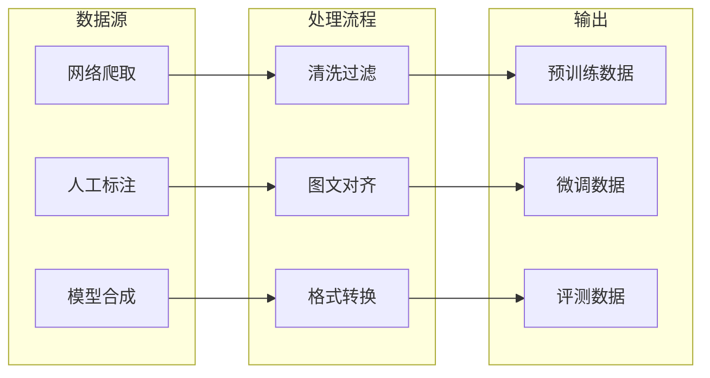
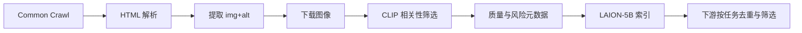
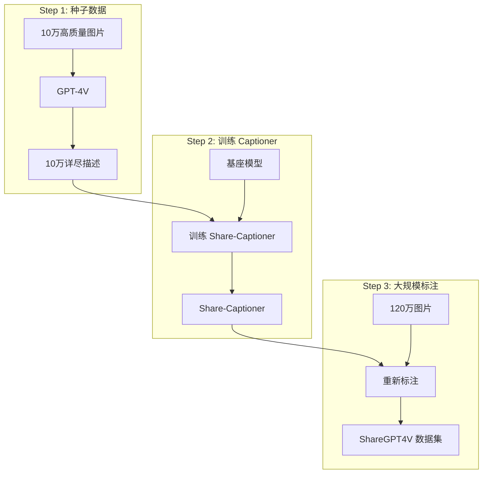
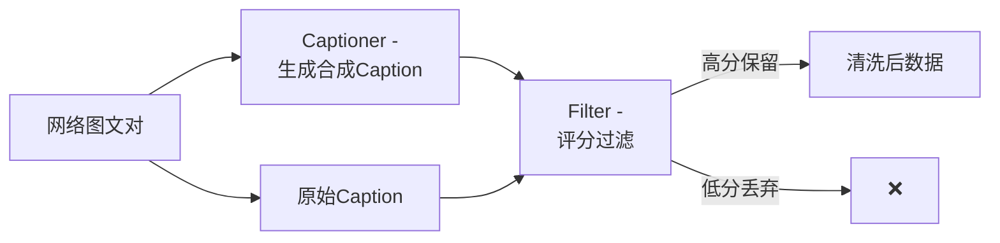
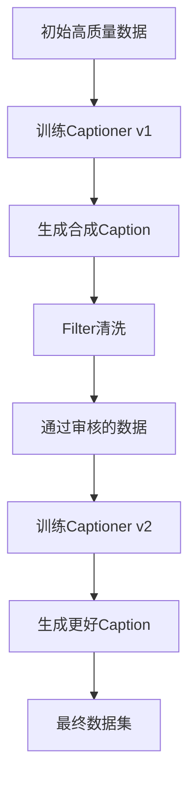
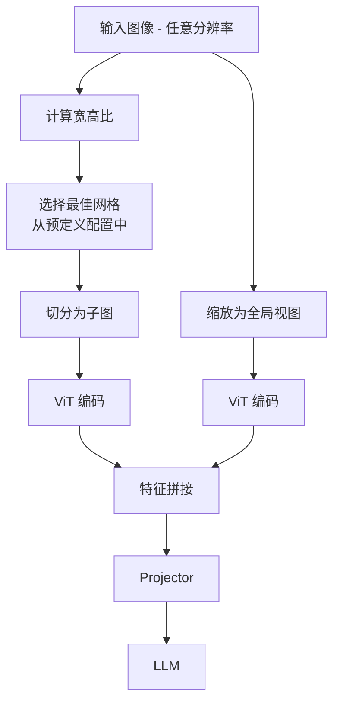

# 多模态数据工程

> **"Data is the new oil"** —— 在多模态领域，数据的质量与规模直接决定模型上限。数据工程不仅是收集，更涉及复杂的清洗、过滤与合成策略。

---

## 数据工程全景


```mermaid
flowchart LR
    subgraph 数据源
        WEB[网络爬取]
        HUMAN[人工标注]
        SYNTH[模型合成]
    end
    
    subgraph 处理流程
        CLEAN[清洗过滤]
        ALIGN[图文对齐]
        FORMAT[格式转换]
    end
    
    subgraph 输出
        PT[预训练数据]
        SFT[微调数据]
        EVAL[评测数据]
    end
    
    WEB --> CLEAN
    HUMAN --> ALIGN
    SYNTH --> FORMAT
    CLEAN --> PT
    ALIGN --> SFT
    FORMAT --> EVAL
```

---

## LAION-5B：工业级数据清洗

[LAION-5B](https://laion.ai/blog/laion-5b/)是 2022 年发布的大规模图文索引，报告约 **58.5 亿**图文对。它提供 URL 与元数据等，并不意味着图像统一托管、链接持续可用或所有数据都已获得你的使用许可。

### 构建流水线


```mermaid
flowchart LR
    CC[Common Crawl] --> PARSE[HTML 解析]
    PARSE --> EXTRACT[提取 img+alt]
    EXTRACT --> DOWNLOAD[下载图像]
    DOWNLOAD --> CLIP[CLIP 相关性筛选]
    CLIP --> META[质量与风险元数据]
    META --> OUT[LAION-5B 索引]
    OUT --> USER[下游按任务去重与筛选]
```

### 关键过滤步骤

| 步骤 | 技术 | 目的 |
| :--- | :--- | :--- |
| **URL 过滤** | 黑名单匹配 | 排除低质/违规站点 |
| **图像下载** | 并行爬取 + 重试 | 获取原始图像 |
| **CLIP 过滤** | 计算图文相似度 | 筛选候选相关性，不保证事实匹配 |
| **下游去重** | 内容哈希、pHash 与近邻候选复核 | 按任务去重，不能假设下载后已无重复 |
| **风险标签** | 自动分类分数/元数据 | 下游需明确筛选规则并抽检，不等于全部移除 |

### CLIP Score 阈值

下例是 LAION 历史筛选阈值的概念表示，依赖当时的编码器与语言配置。更换模型后分数尺度可能改变；实际阈值应在人工标注的正负匹配样本上校准。

```python
# LAION 过滤逻辑
def filter_sample(image, text, language):
    image_emb = clip.encode_image(image)
    text_emb = clip.encode_text(text)
    score = cosine_similarity(image_emb, text_emb)
    
    # 英文数据阈值
    if language == 'en':
        return score >= 0.28
    # 多语言数据阈值
    else:
        return score >= 0.26
```

### CLIP 过滤的双刃剑

<div class="compare-box">
  <div class="compare-item highlight">
    <div class="compare-title">优势</div>
    <p class="compare-desc">✅ 提供图文相关性的自动筛选信号<br/>✅ 自动过滤低质数据<br/>✅ 可大规模并行处理</p>
  </div>
  <div class="compare-vs">VS</div>
  <div class="compare-item">
    <div class="compare-title">劣势</div>
    <p class="compare-desc">❌ 继承 CLIP 偏见<br/>❌ 过滤罕见概念<br/>❌ 某些艺术风格被排除</p>
  </div>
</div>

::: warning CLIP 偏见传播
如果 CLIP 无法识别某种艺术风格或生僻概念，相关数据就会被过滤掉。这导致下游模型在这些领域覆盖率不足，形成"偏见闭环"。
:::

### LAION 数据集家族

| 数据集 | 规模 | 语言 | 特点 |
| :--- | :--- | :--- | :--- |
| **LAION-400M** | 4 亿 | 英文 | 早期版本 |
| **LAION-5B** | 58.5 亿 | 多语言 | 主力数据集 |
| **LAION-Aesthetic** | 1.2 亿 | 英文 | 高美学评分 |
| **LAION-COCO** | 6 亿 | 英文 | 类 COCO 格式 |

---

## ShareGPT4V：高质量 Caption 合成

传统网络爬取数据的 alt 文本往往**过于简短**，缺乏对图像细节的描述。

### 问题示例

| 来源 | Caption 示例 |
| :--- | :--- |
| **网络 alt 文本** | "beach photo" |
| **人工标注** | "A person surfing on a wave" |
| **GPT-4V 生成** | "The image captures an exhilarating moment of a surfer riding a powerful wave. The surfer, clad in a black wetsuit, demonstrates remarkable balance and skill..." |

### ShareGPT4V 数据闭环


```mermaid
flowchart TB
    subgraph "Step 1: 种子数据"
        IMG1[10万高质量图片]
        GPT4V[GPT-4V]
        IMG1 --> GPT4V
        GPT4V --> SEED[10万详尽描述]
    end
    
    subgraph "Step 2: 训练 Captioner"
        SEED --> TRAIN[训练 Share-Captioner]
        BASE[基座模型] --> TRAIN
        TRAIN --> CAP[Share-Captioner]
    end
    
    subgraph "Step 3: 大规模标注"
        IMG2[120万图片]
        CAP --> LABEL[重新标注]
        IMG2 --> LABEL
        LABEL --> DATA[ShareGPT4V 数据集]
    end
```

### GPT-4V Prompt 设计

合成描述应把可见事实与推测分开：无法辨认的字、数量或身份要标为不确定，不把世界知识联想当图中证据。以下历史提示需加这一约束，再用人工抽样核对模型是否补写不存在的细节。

```markdown
请详细描述这张图片，包括但不限于：
1. 主要对象及其属性（颜色、形状、大小）
2. 对象之间的空间关系
3. 场景的整体氛围和背景
4. 任何文字或符号
5. 图片的艺术风格或拍摄技术
6. 可能的世界知识关联

请用详尽的段落形式描述，而非简单的列表。
```

### 数据质量对比

长 caption 可以补充对象属性、关系和文字，但也会增加不可验证的联想。对同一图像逐项审核：可见对象、属性、数量、关系、文字转写和无法判断项，报告每类准确率与漏标率。不要用平均字数替代质量。

### 训练效果

[ShareGPT4V](https://sharegpt4v.github.io/)研究了高质量详细描述对多模态训练的作用。迁移到自己的任务时，固定图片和训练预算，对比原 caption、合成 caption 与混合数据；只有在留出 OCR、关系理解与幻觉负例上改善，才说明补充描述有价值。

---

## BLIP CapFilt：数据自举的艺术

### 核心机制

**CapFilt = Captioner + Filter**


```mermaid
flowchart LR
    WEB[网络图文对] --> CAP[
        Captioner - 
        生成合成Caption
    ]
    WEB --> ORI[原始Caption]
    CAP --> FILTER[
        Filter - 
        评分过滤
    ]
    ORI --> FILTER
    FILTER -- 高分保留 --> CLEAN[清洗后数据]
    FILTER -- 低分丢弃 --> DROP[❌]
```

### Captioner 训练

**第一步**：在高质量人工标注数据（如 COCO）上训练图像描述模型  
**第二步**：对网络图像生成 **合成 Caption** (synthetic captions)

**优势**：

- 合成 Caption 通常比噪声 Alt-text 更准确
- 能生成更详细、结构化的描述
- 覆盖 Alt-text 遗漏的视觉细节

### Filter 评分机制

**ITM（Image-Text Matching）分类器**：

```python
def filter_captions(image, original, synthetic, score_fn, threshold):
    # 独立过滤两个候选；二者都好可都保留，不强制只选最高分
    kept = []
    for text in (original, synthetic):
        score = score_fn(image, text)
        if score >= threshold:
            kept.append({"caption": text, "score": score})
    return kept
```

[BLIP CapFilt](https://arxiv.org/abs/2201.12086)将生成 caption 与过滤匹配分开；原始和合成描述均可保留。上例把阈值作为显式参数，需要按实际 ITM 模型与标注集校准，不存在通用 0.8。若两者都低分，应丢弃或送复核，而不是因为合成分数略高就无条件保留。

### 自举循环


```mermaid
flowchart TB
    INIT[初始高质量数据] --> TRAIN1[训练Captioner v1]
    TRAIN1 --> GEN1[生成合成Caption]
    GEN1 --> FILTER1[Filter清洗]
    FILTER1 --> DATA1[通过审核的数据]
    DATA1 --> TRAIN2[训练Captioner v2]
    TRAIN2 --> GEN2[生成更好Caption]
    GEN2 --> FINAL[最终数据集]
```

**迭代改进**：

- 第 1 轮：用人工数据训练 Captioner，生成合成 Caption
- 第 2 轮：用清洗数据重新训练，生成更高质量 Caption（可选）

### 效果验证

CapFilt 的收益应在固定模型、数据来源与预算下做消融，不把不同年代的数据集和无出处的 VQA/CIDEr 数字拼成对比。比较无过滤、仅过滤、仅合成、合成加过滤，同时报告保留率、训练成本、下游任务与长尾覆盖。

### Caption 质量对比

| 候选 | 可能问题 | 审核方法 |
| --- | --- | --- |
| 网络 alt 文本 | 站点广告、文件名、与图无关 | 图文匹配与来源抽检 |
| 合成描述 | 对衣着、数量、背景的补写幻觉 | 逐条事实对照原图 |
| 高分匹配描述 | 模型偏好掩盖罕见概念 | 按领域与语言切片人审 |

---

## 动态分辨率：AnyRes

### 问题：固定分辨率的局限

传统方法将所有图像缩放到固定分辨率（如 336×336）：

| 原始图像 | 缩放后 | 问题 |
| :--- | :--- | :--- |
| 高清照片 4K | 336×336 | 细节丢失 |
| 文档截图 | 336×336 | 文字模糊 |
| 长图/宽图 | 336×336 | 严重变形 |

### LLaVA-NeXT AnyRes 方案


```mermaid
flowchart TB
    IMG[输入图像 - 任意分辨率] --> RATIO[计算宽高比]
    RATIO --> SELECT[选择最佳网格<br/>从预定义配置中]
    SELECT --> SPLIT[切分为子图]
    IMG --> RESIZE[缩放为全局视图]
    SPLIT --> VIT1[ViT 编码]
    RESIZE --> VIT2[ViT 编码]
    VIT1 --> CAT[特征拼接]
    VIT2 --> CAT
    CAT --> PROJ[Projector]
    PROJ --> LLM
```

### 网格配置

下面只示意 `(行数, 列数)` 的宽高比匹配，非 LLaVA-NeXT 完整选择器；生产 processor 还会考虑原图有效面积、padding 和 token 上限。

```python
GRID_CONFIGS = [
    (1, 1),  # 正方形小图
    (1, 2),  # 宽图
    (2, 1),  # 高图
    (2, 2),  # 大正方形
    (1, 3),  # 超宽图
    (3, 1),  # 超高图
    (2, 3),  # 宽大图
    (3, 2),  # 高大图
]

def select_grid(image_width, image_height, patch_size=336):
    aspect_ratio = image_width / image_height
    # 选择最匹配宽高比的网格配置
    best_grid = min(GRID_CONFIGS, 
                    key=lambda g: abs(g[1]/g[0] - aspect_ratio))
    return best_grid
```

### Token 数量计算

以下为每子图 576 patch 加一个全局视图的粗算；去 padding、换行 token、池化或 patch merge 会改变最终长度，以 processor 实际输出验收。

| 配置 | 子图数 | 子图 Token | 全局 Token | 总计 |
| :--- | :--- | :--- | :--- | :--- |
| **1×1** | 1 | 576 | 576 | 1152 |
| **2×2** | 4 | 2304 | 576 | 2880 |
| **3×2** | 6 | 3456 | 576 | 4032 |

### 意外收获：零样本视频理解

LLaVA-NeXT 后续研究探索把视频帧作为多图序列输入。单纯支持切图不等于掌握时序；需要保留帧顺序、时间戳与采样规则，并用事件顺序、短暂事件和跨帧指代测试。多帧输入的成本随帧数增长，静态场景答对不能证明视频理解。

---

## 数据格式标准

### 预训练格式

```json
{
  "image": "path/to/image.jpg",
  "caption": "A detailed description of the image..."
}
```

### 指令微调格式

```json
{
  "image": "path/to/image.jpg",
  "conversations": [
    {"from": "human", "value": "<image>\nDescribe this image."},
    {"from": "gpt", "value": "This image shows..."}
  ]
}
```

### 多图对话格式

```json
{
  "images": ["img1.jpg", "img2.jpg"],
  "conversations": [
    {"from": "human", "value": "<image>\n<image>\nCompare these two images."},
    {"from": "gpt", "value": "The first image shows... while the second..."}
  ]
}
```

---

## 数据质量评估

### 自动化指标

| 指标 | 计算方式 | 用途 |
| :--- | :--- | :--- |
| **CLIP Score** | 图文余弦相似度 | 语义相关性 |
| **Aesthetic Score** | LAION 美学模型 | 图像质量 |
| **Text Complexity** | 词汇多样性/长度 | Caption 丰富度 |
| **Perplexity** | 语言模型困惑度 | Caption 流畅度 |

### 人工评估维度

| 维度 | 评估内容 |
| :--- | :--- |
| **准确性** | Caption 是否真实描述图像 |
| **完整性** | 是否覆盖主要视觉元素 |
| **细节度** | 空间关系、属性是否充分 |
| **相关性** | 是否有无关信息 |

---

## 实践建议

### 数据收集策略

| 阶段 | 数据类型 | 规模 | 质量要求 |
| :--- | :--- | :--- | :--- |
| **预训练** | 网络爬取 | 10M+ | 中等 |
| **多任务** | 公开数据集 | 1M+ | 较高 |
| **指令微调** | 人工/合成 | 100K+ | 极高 |

### 常见陷阱

::: danger 数据泄漏
确保训练数据与评测数据无重叠！使用去重和交叉检查。
:::

::: warning 分布偏差
网络数据存在严重的长尾分布，罕见概念覆盖不足。考虑数据增强或合成补充。
:::

---

### 数据集发布门槛

以文档/视频/原始图片为分组单位切分，近重复裁剪不能跨训练和测试。manifest 至少记录原文件哈希、来源与许可、尺寸/时长、caption 生成版本、过滤原因、处理版本，以及图片占位符与文件列表的对应关系。

抽样重放训练预处理：能解码的文件比例、视觉 token 分布、长尾语言保留率、caption 可见事实准确率和跨切分重复量均应可报告。训练只在高清样本失败时先查缩放；所有多图样本错位时查列表顺序；过滤后某类任务骤降时查阈值和采样配比。

## 参考资源

| 资源 | 说明 |
| :--- | :--- |
| [LAION-5B](https://laion.ai/blog/laion-5b/) | 数据集主页 |
| [ShareGPT4V](https://sharegpt4v.github.io/) | 高质量 Caption |
| [LLaVA-NeXT](https://llava-vl.github.io/blog/2024-01-30-llava-next/) | AnyRes 技术 |
| [img2dataset](https://github.com/rom1504/img2dataset) | 数据下载工具 |
