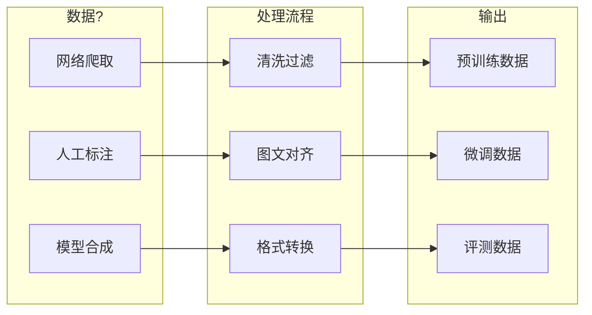
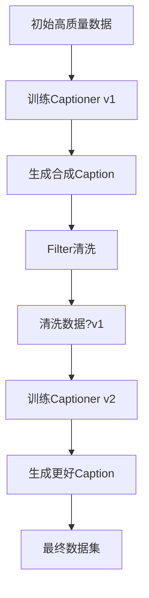

# 多模态数据工?

> **"Data is the new oil"** —?在多模态领域，数据的质量与规模直接决定模型上限。数据工程不仅是收集，更涉及复杂的清洗、过滤与合成策略?

---

## 数据工程全景



---

## LAION-5B：工业级数据清洗

LAION-5B 是目前最大的开源多模态数据集，包?**58.5 ?*图文对?

### 构建流水?


### 关键过滤步骤

| 步骤 | 技?| 目的 |
| :--- | :--- | :--- |
| **URL 过滤** | 黑名单匹?| 排除低质/违规站点 |
| **图像下载** | 并行爬取 + 重试 | 获取原始图像 |
| **CLIP 过滤** | 计算图文相似?| 保证语义相关?|
| **去重** | 感知哈希 (pHash) | 去除重复图像 |
| **NSFW 过滤** | CLIP 分类?| 过滤成人内容 |

### CLIP Score 阈?

```python
# LAION 过滤逻辑
def filter_sample(image, text):
    image_emb = clip.encode_image(image)
    text_emb = clip.encode_text(text)
    score = cosine_similarity(image_emb, text_emb)
    
    # 英文数据阈?
    if language == 'en':
        return score >= 0.28
    # 多语言数据阈?
    else:
        return score >= 0.26
```

### CLIP 过滤的双刃剑

<div class="compare-box">
  <div class="compare-item highlight">
    <div class="compare-title">优势</div>
    <p class="compare-desc">?保证图文语义相关 - ?自动过滤低质数据 - ?可大规模并行处理</p>
  </div>
  <div class="compare-vs">VS</div>
  <div class="compare-item">
    <div class="compare-title">劣势</div>
    <p class="compare-desc">?继承 CLIP 偏见 - ?过滤罕见概念 - ?某些艺术风格被排?</p>
  </div>
</div>

::: warning CLIP 偏见传播
如果 CLIP 无法识别某种艺术风格或生僻概念，相关数据就会被过滤掉。这导致下游模型在这些领域覆盖率不足，形?偏见闭环"?
:::

### LAION 数据集家?

| 数据?| 规模 | 语言 | 特点 |
| :--- | :--- | :--- | :--- |
| **LAION-400M** | 4 ?| 英文 | 早期版本 |
| **LAION-5B** | 58.5 ?| 多语言 | 主力数据?|
| **LAION-Aesthetic** | 1.2 ?| 英文 | 高美学评?|
| **LAION-COCO** | 6 ?| 英文 | ?COCO 格式 |

---

## ShareGPT4V：高质量 Caption 合成

传统网络爬取数据?alt 文本往往**过于简?*，缺乏对图像细节的描述?

### 问题示例

| 来源 | Caption 示例 |
| :--- | :--- |
| **网络 alt 文本** | "beach photo" |
| **人工标注** | "A person surfing on a wave" |
| **GPT-4V 生成** | "The image captures an exhilarating moment of a surfer riding a powerful wave. The surfer, clad in a black wetsuit, demonstrates remarkable balance and skill..." |

### ShareGPT4V 数据闭环

```mermaid
flowchart TB
    subgraph "Step 1: 种子数据"
        IMG1[10万高质量图片]
        GPT4V[GPT-4V]
        IMG1 --> GPT4V
        GPT4V --> SEED[10万详尽描述]
    end
    
    subgraph "Step 2: 训练 Captioner"
        SEED --> TRAIN[训练 Share-Captioner]
        BASE[基座模型] --> TRAIN
        TRAIN --> CAP[Share-Captioner]
    end
    
    subgraph "Step 3: 大规模标?
        IMG2[120万图片]
        CAP --> LABEL[重新标注]
        IMG2 --> LABEL
        LABEL --> DATA[ShareGPT4V 数据集]
    end
```

### GPT-4V Prompt 设计

```markdown
请详细描述这张图片，包括但不限于?
1. 主要对象及其属性（颜色、形状、大小）
2. 对象之间的空间关?
3. 场景的整体氛围和背景
4. 任何文字或符?
5. 图片的艺术风格或拍摄技?
6. 可能的世界知识关?

请用详尽的段落形式描述，而非简单的列表?
```

### 数据质量对比

| 指标 | LAION Caption | ShareGPT4V Caption |
| :--- | :--- | :--- |
| **平均长度** | ~12 ?| ~150 ?|
| **细节覆盖** | 仅主?| 全面细节 |
| **空间关系** | ?| ?|
| **世界知识** | ?| ?|

### 训练效果

实验证明，使用高密度 Caption 预训练：

- 视觉特征与语言概念对齐更精?
- 细粒度任务（OCR、定位）显著提升
- 幻觉问题减少

---

## BLIP CapFilt：数据自举的艺术

### 核心机制

**CapFilt = Captioner + Filter**


### Captioner 训练

**第一?*：在高质量人工标注数据（如COCO）上训练图像描述模型

**第二?*：对网络图像生成**合成Caption** (synthetic captions)

**优势**?

- 合成Caption通常比噪声的Alt-text更准?
- 能够生成详细、结构化的描?
- 覆盖Alt-text遗漏的视觉细?

### Filter 评分机制

**ITM（Image-Text Matching）分类器**?

```python
def filter_score(image, text_original, text_synthetic):
    """使用ITM模型评估图文匹配?""
    
    # ITM分数：图文匹配二分类器（0-1之间?
    score_original = itm_model(image, text_original)
    score_synthetic = itm_model(image, text_synthetic)
    
    # 策略：取最高分的Caption
    if score_synthetic > score_original:
        return text_synthetic, score_synthetic
    elif score_original > threshold:  # threshold通常?.8
        return text_original, score_original
    else:
        return None, 0  # 两者都不合格，丢弃该样?
```

**过滤策略**?

1. **优先合成**：如果合成Caption得分更高，使用合?
2. **保留原始**：如果原始Caption足够好（>阈值），保?
3. **双重淘汰**：如果两者都不行，丢弃样?

### 自举循环



**迭代改进**?

- ?轮：用人工数据训??生成合成Caption
- ?轮：用清洗数据重新训??生成更高质量Caption（可选）

### 效果验证

| 训练数据 | 规模 | VQA准确?| COCO CIDEr | 说明 |
| :--- | :--- | :--- | :--- | :--- |
| 原始LAION | 1.8亿对 | 78.3 | 121.6 | 未清?|
| CapFilt清洗?| **1.29亿对** | **82.4** | **130.5** | 质量>数量 |
| 仅合成Caption | 1.29亿对 | 80.1 | 125.3 | 略低于混?|

**关键发现**?

- ?**质量胜于数量**?.29亿清洗数据超?.8亿原始数?
- ?**合成+原始混合**：效果最?
- ?**幻觉减少**：Filter淘汰了不匹配的描?

### Caption 质量对比

| 来源 | 示例 | 特点 |
| :--- | :--- | :--- |
| **网络Alt-text** | "beach photo" | 过于简?|
| **CapFilt合成** | "The image captures an exhilarating moment of a surfer riding a powerful wave. The surfer, clad in a black wetsuit, demonstrates remarkable balance and skill as they navigate the turbulent waters..." | 详细、丰?|

---

## 动态分辨率：AnyRes

### 问题：固定分辨率的局?

传统方法将所有图像缩放到固定分辨率（?336×336）：

| 原始图像 | 缩放?| 问题 |
| :--- | :--- | :--- |
| 高清照片 4K | 336×336 | 细节丢失 |
| 文档截图 | 336×336 | 文字模糊 |
| 长图/宽图 | 336×336 | 严重变形 |

### LLaVA-NeXT AnyRes 方案


### 网格配置

```python
GRID_CONFIGS = [
    (1, 1),  # 正方形小?
    (1, 2),  # 宽图
    (2, 1),  # 高图
    (2, 2),  # 大正方形
    (1, 3),  # 超宽?
    (3, 1),  # 超高?
    (2, 3),  # 宽大?
    (3, 2),  # 高大?
]

def select_grid(image_width, image_height, patch_size=336):
    aspect_ratio = image_width / image_height
    # 选择最匹配宽高比的网格配置
    best_grid = min(GRID_CONFIGS, 
                    key=lambda g: abs(g[0]/g[1] - aspect_ratio))
    return best_grid
```

### Token 数量计算

| 配置 | 子图?| 子图 Token | 全局 Token | 总计 |
| :--- | :--- | :--- | :--- | :--- |
| **1×1** | 1 | 576 | 576 | 1152 |
| **2×2** | 4 | 2304 | 576 | 2880 |
| **3×2** | 6 | 3456 | 576 | 4032 |

### 意外收获：零样本视频理解

AnyRes 的设计意外带来视频理解能力：

- 视频?= 动态分辨率的图像序?
- 将多帧作?子图"输入
- 无需专门视频训练

---

## 数据格式标准

### 预训练格?

```json
{
  "image": "path/to/image.jpg",
  "caption": "A detailed description of the image..."
}
```

### 指令微调格式

```json
{
  "image": "path/to/image.jpg",
  "conversations": [
    {"from": "human", "value": "<image>\nDescribe this image."},
    {"from": "gpt", "value": "This image shows..."}
  ]
}
```

### 多图对话格式

```json
{
  "images": ["img1.jpg", "img2.jpg"],
  "conversations": [
    {"from": "human", "value": "<image>\n<image>\nCompare these two images."},
    {"from": "gpt", "value": "The first image shows... while the second..."}
  ]
}
```

---

## 数据质量评估

### 自动化指?

| 指标 | 计算方式 | 用?|
| :--- | :--- | :--- |
| **CLIP Score** | 图文余弦相似?| 语义相关?|
| **Aesthetic Score** | LAION 美学模型 | 图像质量 |
| **Text Complexity** | 词汇多样?长度 | Caption 丰富?|
| **Perplexity** | 语言模型困惑?| Caption 流畅?|

### 人工评估维度

| 维度 | 评估内容 |
| :--- | :--- |
| **准确?* | Caption 是否真实描述图像 |
| **完整?* | 是否覆盖主要视觉元素 |
| **细节?* | 空间关系、属性是否充?|
| **相关?* | 是否有无关信?|

---

## 实践建议

### 数据收集策略

| 阶段 | 数据类型 | 规模 | 质量要求 |
| :--- | :--- | :--- | :--- |
| **预训?* | 网络爬取 | 10M+ | 中等 |
| **多任?* | 公开数据?| 1M+ | 较高 |
| **指令微调** | 人工/合成 | 100K+ | 极高 |

### 常见陷阱

::: danger 数据泄漏
确保训练数据与评测数据无重叠！使用去重和交叉检查?
:::

::: warning 分布偏差
网络数据存在严重的长尾分布，罕见概念覆盖不足。考虑数据增强或合成补充?
:::

---

## 参考资?

| 资源 | 说明 |
| :--- | :--- |
| [LAION-5B](https://laion.ai/blog/laion-5b/) | 数据集主?|
| [ShareGPT4V](https://sharegpt4v.github.io/) | 高质?Caption |
| [LLaVA-NeXT](https://llava-vl.github.io/blog/2024-01-30-llava-next/) | AnyRes 技?|
| [img2dataset](https://github.com/rom1504/img2dataset) | 数据下载工具 |

