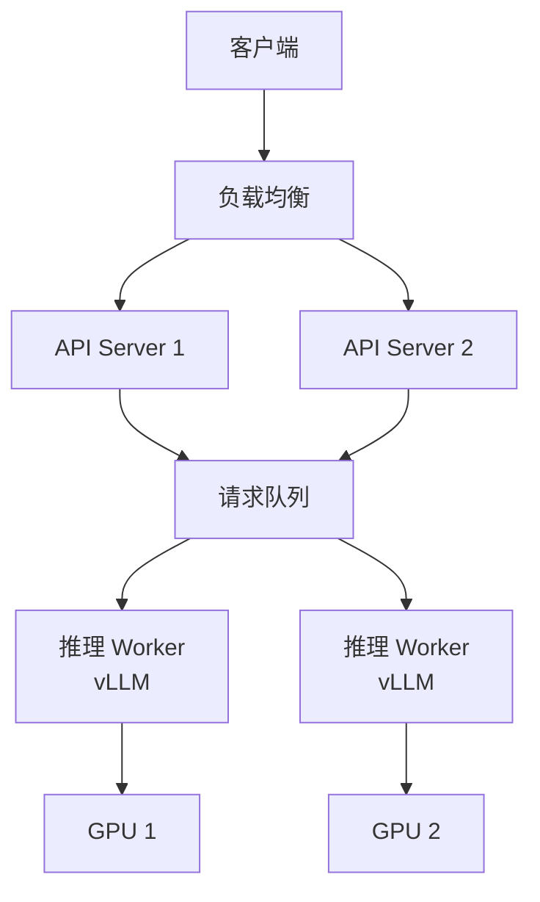

# 多模态部署与评测

> 从研究到生产的最后一公里：高性能推理优化与科学的评测方法论。

---

## 推理优化

### vLLM PagedAttention

**传统问题**：KV Cache 需要连续显存，预分配浪费 60%-80%

**PagedAttention 方案**：借鉴操作系统虚拟内存分页
- KV Cache 切分为固定大小块
- 通过页表映射逻辑连续到物理不连续
- 显存利用率接近 100%

| 指标 | 传统方法 | vLLM |
| :--- | :--- | :--- |
| **显存利用率** | 20%-40% | ~100% |
| **吞吐量** | 基准 | 2-4× |
| **并发能力** | 低 | 高 |

### TensorRT-LLM

NVIDIA 推出的高性能推理库：

| 优化技术 | 效果 |
| :--- | :--- |
| **层融合** | 减少内存访问 |
| **FP8/INT8 量化** | 降低计算/带宽需求 |
| **Tensor Core 优化** | 充分利用硬件 |
| **KV Cache 优化** | PagedAttention 集成 |

### 多模态推理特殊考虑

| 组件 | 优化方向 |
| :--- | :--- |
| **Vision Encoder** | 批处理图像、FP16 |
| **Connector** | 算子融合 |
| **LLM** | PagedAttention、量化 |
| **整体流水线** | 异步处理 |

---

## 评测基准

### MMBench：综合能力评测

**CircularEval 机制**：消除选项位置偏见

```python
# 传统评测：选项固定
options = ["A. cat", "B. dog", "C. bird"]

# CircularEval：选项轮换
round_1 = ["A. cat", "B. dog", "C. bird"]
round_2 = ["A. dog", "B. bird", "C. cat"]
round_3 = ["A. bird", "B. cat", "C. dog"]
# 只有全部轮次正确才算通过
```

**评测维度**：

| 维度 | 子任务 |
| :--- | :--- |
| **感知** | 物体识别、场景理解 |
| **推理** | 逻辑推理、常识推理 |
| **知识** | 世界知识、专业知识 |
| **语言** | 文本理解、OCR |

### HallusionBench：幻觉检测

专注于评估视觉幻觉，诱导模型产生错误回答。

| 幻觉类型 | 示例 |
| :--- | :--- |
| **视觉欺骗** | 透视错觉图 |
| **几何错觉** | 大小/长度错觉 |
| **图文冲突** | 图像与文字矛盾 |
| **不存在物体** | 询问图中没有的东西 |

### MMMU：多学科推理

大学水平专业知识评测：
- 涵盖数学、物理、化学、生物等学科
- 需要图像理解 + 专业推理
- 当前最难的多模态基准之一

### 主流基准对比

| 基准 | 侧重点 | 难度 |
| :--- | :--- | :--- |
| **VQAv2** | 基础视觉问答 | 低 |
| **MMBench** | 综合能力 | 中 |
| **MMMU** | 专业推理 | 高 |
| **HallusionBench** | 幻觉检测 | 高 |
| **RealWorldQA** | 真实场景 | 中 |

---

## 量化部署

### 多模态模型量化

| 组件 | 推荐精度 | 说明 |
| :--- | :--- | :--- |
| **Vision Encoder** | FP16/BF16 | 视觉精度敏感 |
| **Connector** | FP16 | 参数量小 |
| **LLM** | INT8/INT4 | 主要压缩目标 |

### AWQ/GPTQ 应用

```python
# AWQ 量化示例
from awq import AutoAWQForCausalLM

model = AutoAWQForCausalLM.from_pretrained(model_path)
model.quantize(
    tokenizer,
    quant_config={
        "w_bit": 4,
        "q_group_size": 128,
    }
)
```

---

## 生产部署架构



### 关键指标监控

| 指标 | 说明 | 目标 |
| :--- | :--- | :--- |
| **TTFT** | 首 Token 时间 | <500ms |
| **TPS** | Token 生成速度 | >30 tok/s |
| **吞吐量** | 并发请求数 | 根据 GPU |
| **显存占用** | GPU 内存使用 | <90% |

---

## 参考资源

| 资源 | 说明 |
| :--- | :--- |
| [vLLM](https://github.com/vllm-project/vllm) | 高性能推理 |
| [TensorRT-LLM](https://github.com/NVIDIA/TensorRT-LLM) | NVIDIA 优化 |
| [MMBench](https://mmbench.opencompass.org.cn/) | 综合评测 |
| [lmms-eval](https://github.com/EvolvingLMMs-Lab/lmms-eval) | 评测框架 |
