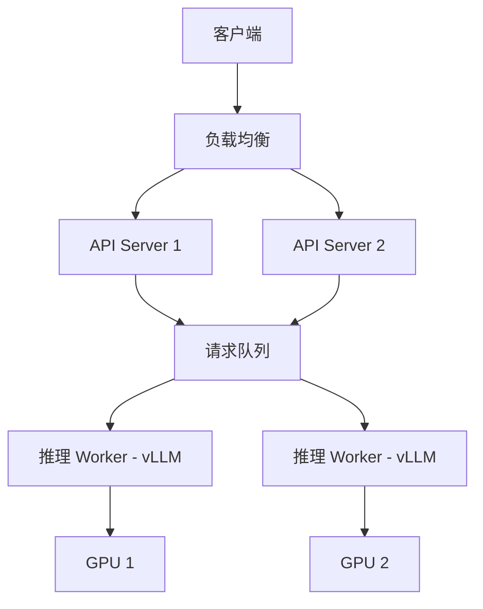

# 多模态部署与评测

> 从研究到生产的最后一公里：高性能推理优化与科学的评测方法论。

---

## 推理优化

### vLLM PagedAttention

PagedAttention 将 KV cache 分块，通过映射管理逻辑序列与物理存储，减少连续预分配带来的碎片。它改善的是 KV 管理，不意味着整张 GPU 的显存或计算利用率接近 100%；模型权重、视觉编码激活、图像缓存和工作区仍占资源。[PagedAttention 论文](https://arxiv.org/abs/2309.06180)

多模态输入还需核查模型在当前版本的支持、每请求媒体上限、图像 token 预算和缓存策略；不要只因一个文本模型能服务，就假设同系列 VLM 使用相同接口。[vLLM 多模态输入文档](https://docs.vllm.ai/en/latest/features/multimodal_inputs/)

吞吐对比需固定模型、图片数量/尺寸、输入输出长度、设备和 P95 延迟约束，不能复用某个历史基准的 2–4 倍收益。

### TensorRT-LLM

NVIDIA 推出的高性能推理库：

| 优化技术 | 效果 |
| :--- | :--- |
| **层融合** | 减少内存访问 |
| **FP8/INT8 量化** | 降低计算/带宽需求 |
| **Tensor Core 优化** | 充分利用硬件 |
| **KV Cache 优化** | PagedAttention 集成 |

### 多模态推理特殊考虑

| 组件 | 优化方向 |
| :--- | :--- |
| **Vision Encoder** | 批处理图像、FP16 |
| **Connector** | 算子融合 |
| **LLM** | PagedAttention、量化 |
| **整体流水线** | 异步处理 |

---

## 媒体缓存与上下文预算：上线前显式验收

**2026-10-08 对照 [vLLM 多模态输入文档](https://docs.vllm.ai/en/latest/features/multimodal_inputs/)**：媒体 UUID 可用于复用已缓存的输入；省略媒体本体时，若缺少匹配 UUID 或缓存未命中，请求会失败。不要把 UUID 当成持久文件存储，也不要假设重启、驱逐或多副本切换后一定命中。

建议把缓存身份绑定到媒体内容、预处理配置与模型版本；这属于应用设计建议，不是所有引擎自动完成的保证。客户端必须能在明确缓存未命中时重发原始媒体，并区分重发与整次任务重试。

| 层次 | 复用/限制对象 | 独立验收 |
| --- | --- | --- |
| 媒体加载与处理缓存 | 图像、视频、音频及其处理结果 | 内容变更、驱逐、重启、跨副本未命中 |
| 视觉编码与输入预算 | 分辨率、裁剪、帧数与视觉 token | 最坏媒体组合、峰值显存、证据可读性 |
| LLM 前缀 KV 缓存 | 可复用的兼容 token 前缀 | 冷/热缓存、模型/适配器切换 |
| 解码 | 新生成 token | 输出长度分布、TPOT 与取消回收 |

[前缀缓存官方说明](https://docs.vllm.ai/en/latest/features/automatic_prefix_caching/)限定收益主要在 prefill，不能把缓存命中率当成所有阶段加速。多图/视频请求同时限制媒体数量、输入尺寸与总上下文，为输出保留预算；这些限制需按实际模型 processor 测量。本文仅做文档对照，未运行服务或验证缓存 API 兼容性。


## 评测基准

### MMBench：综合能力评测

**CircularEval 机制**：通过轮换选项位置检查答案的一致性，降低单次位置偏差对结果的影响；并不能证明所有位置偏见被消除。[MMBench 论文](https://arxiv.org/abs/2307.06281)

```python
# 传统评测：选项固定
options = ["A. cat", "B. dog", "C. bird"]

# CircularEval：选项轮换
round_1 = ["A. cat", "B. dog", "C. bird"]
round_2 = ["A. dog", "B. bird", "C. cat"]
round_3 = ["A. bird", "B. cat", "C. dog"]
# 只有全部轮次正确才算通过
```

**评测维度**：

| 维度 | 子任务 |
| :--- | :--- |
| **感知** | 物体识别、场景理解 |
| **推理** | 逻辑推理、常识推理 |
| **知识** | 世界知识、专业知识 |
| **语言** | 文本理解、OCR |

### HallusionBench：幻觉检测

[HallusionBench](https://arxiv.org/abs/2310.14566)诊断语言幻觉与视觉错觉的交织影响。应使用官方问题组与一致性指标，不把普通的“是否有某物”测试直接等同于该基准。

| 幻觉类型 | 示例 |
| :--- | :--- |
| **视觉欺骗** | 透视错觉图 |
| **几何错觉** | 大小/长度错觉 |
| **图文冲突** | 图像与文字矛盾 |
| **不存在物体** | 询问图中没有的东西 |

### MMMU：多学科推理

大学水平专业知识评测：
- 涵盖数学、物理、化学、生物等学科
- 需要图像理解 + 专业推理
- 难度来自知识、视觉证据与推理结合；与其他基准不作无条件排名

### 主流基准对比

| 基准 | 侧重点 | 难度 |
| :--- | :--- | :--- |
| **VQAv2** | 基础视觉问答 | 低 |
| **MMBench** | 综合能力 | 中 |
| **MMMU** | 专业推理 | 高 |
| **HallusionBench** | 幻觉检测 | 高 |
| **RealWorldQA** | 真实场景 | 中 |

---

## 量化部署

### 多模态模型量化

| 组件 | 推荐精度 | 说明 |
| :--- | :--- | :--- |
| **Vision Encoder** | FP16/BF16 | 视觉精度敏感 |
| **Connector** | FP16 | 参数量小 |
| **LLM** | INT8/INT4 | 主要压缩目标 |

### AWQ/GPTQ 应用

以下 AutoAWQ 示例仅保留作历史接口说明；[项目仓库](https://github.com/casper-hansen/AutoAWQ)已标注弃用。新项目应选择目标推理框架支持的量化工具与格式，固定版本，并用真实图文样本校准与回归。`AutoAWQForCausalLM` 不保证支持任意视觉语言架构，也不表示视觉编码器已一同量化。

```python
# AWQ 量化示例
from awq import AutoAWQForCausalLM

model = AutoAWQForCausalLM.from_pretrained(model_path)
model.quantize(
    tokenizer,
    quant_config={
        "w_bit": 4,
        "q_group_size": 128,
    }
)
```

---

## 生产部署架构


```mermaid
flowchart TB
    CLIENT[客户端] --> LB[负载均衡]
    LB --> API1[API Server 1]
    LB --> API2[API Server 2]
    
    API1 --> QUEUE[请求队列]
    API2 --> QUEUE
    
    QUEUE --> WORKER1[推理 Worker - vLLM]
    QUEUE --> WORKER2[推理 Worker - vLLM]
    
    WORKER1 --> GPU1[GPU 1]
    WORKER2 --> GPU2[GPU 2]
```

### 关键指标监控

| 指标 | 统计口径 | 判断方式 |
| --- | --- | --- |
| TTFT | 上传/下载、图像处理、排队、视觉编码与 prefill 分段记录 | 按业务确定 P50/P95/P99 门槛 |
| TPOT / 输出 token/s | 每请求解码节奏 | 与聚合吞吐分开报告 |
| 吞吐量 | 成功请求/s 或有效输出 token/s | 写清长度分布、并发和失败率 |
| 显存 | 权重、KV、视觉缓存、激活/峰值 | 最坏输入组合仍保留恢复余量 |
| 视觉质量 | OCR、计数、图表、无法判断等切片 | 比较量化前后的同一留出集 |

### 一次可复现的上线实验

1. 固定模型与 processor revision、图片顺序、最大像素/帧数、模板和量化配置；把真实业务输入长度分布放进压测集。
2. 从单请求开始核对图像是否进入模型，再逐级增加并发；同时测冷启动、冷热缓存、多图大图和超时取消。
3. 分别跑 OCR/表格/图表/空间关系与无答案样本，记录答案和证据位置。量化只通过语言总分并不足够。
4. 重复测量报告方差，设置队列上限、媒体大小限制、超时和回滚版本；缓存键包含图像哈希与预处理配置。

远程图片加载在服务边界限制来源、下载大小和超时；图像中的文本不能越过工具权限边界。若小图快、大图 TTFT 高，查预处理/视觉编码；若并发时 OOM，查视觉缓存与 KV 预算；若量化后只有 OCR 退化，检查校准分布和被量化组件，再决定回退精度。

## 参考资源

| 资源 | 说明 |
| :--- | :--- |
| [vLLM](https://github.com/vllm-project/vllm) | 高性能推理 |
| [TensorRT-LLM](https://github.com/NVIDIA/TensorRT-LLM) | NVIDIA 优化 |
| [MMBench](https://mmbench.opencompass.org.cn/) | 综合评测 |
| [lmms-eval](https://github.com/EvolvingLMMs-Lab/lmms-eval) | 评测框架 |

