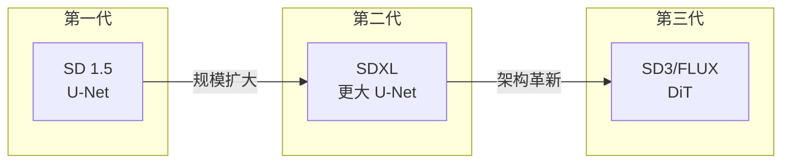
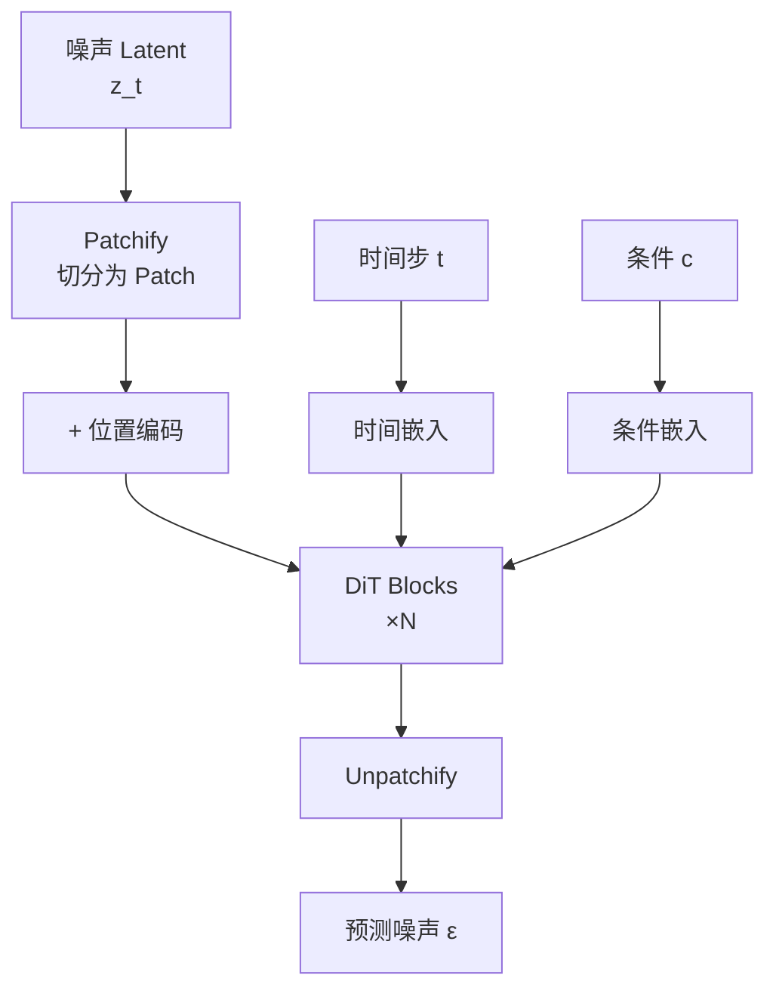
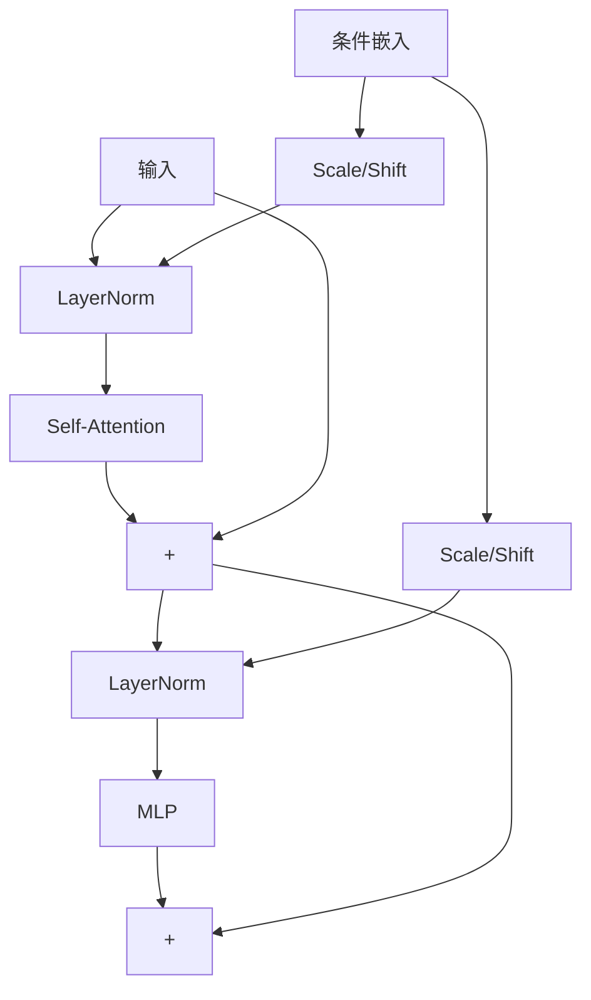
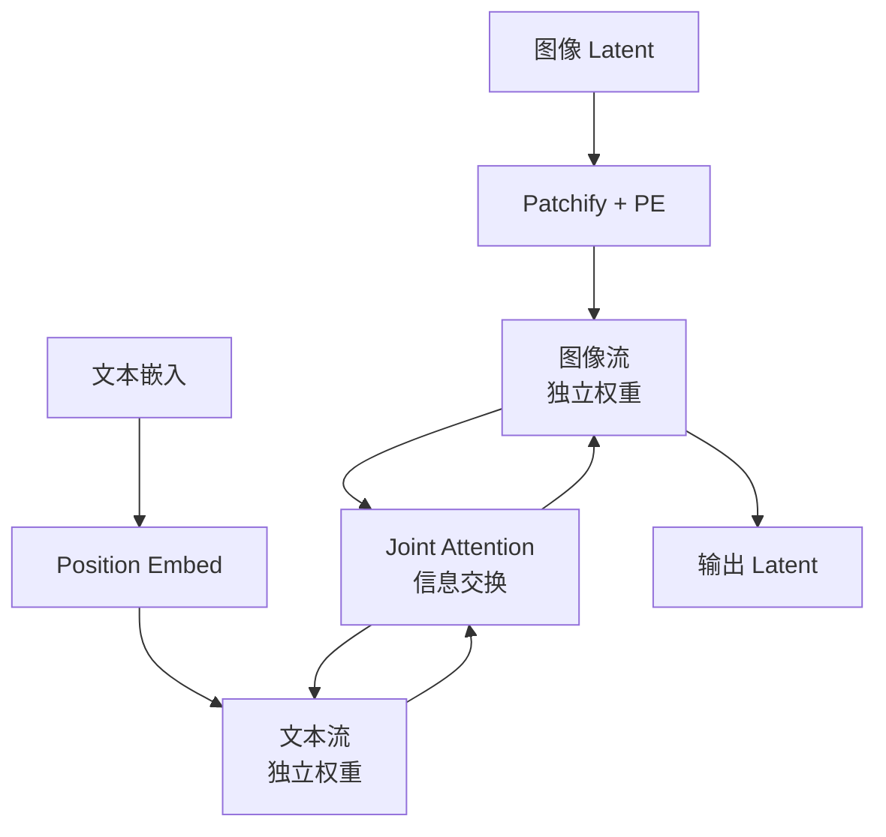
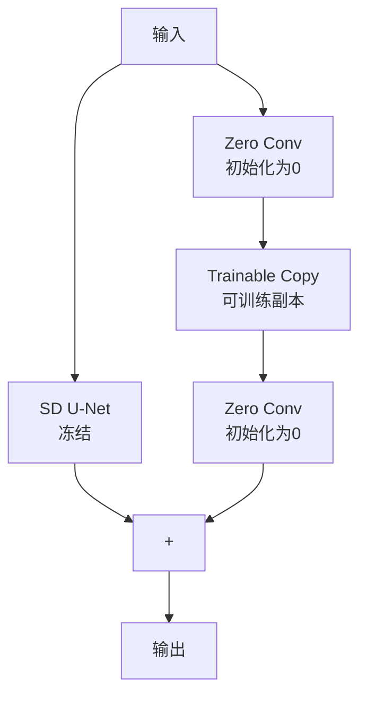
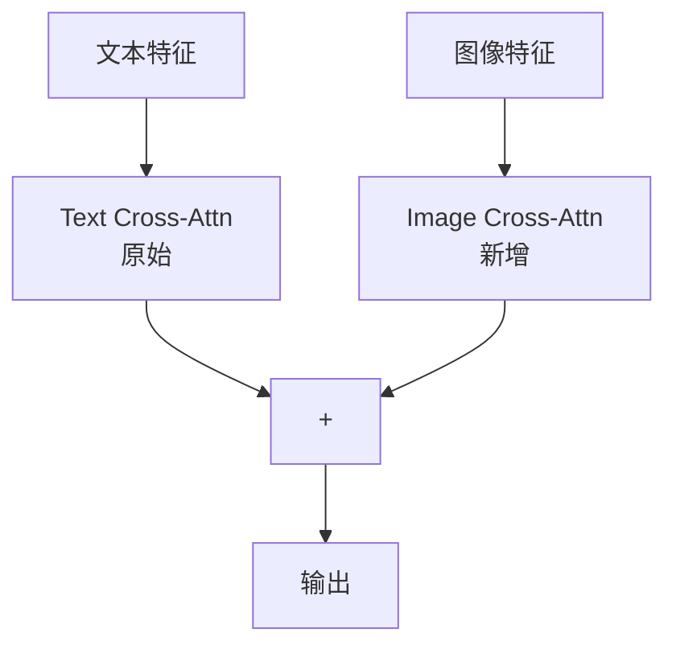
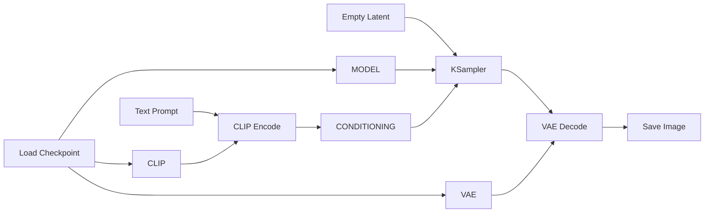
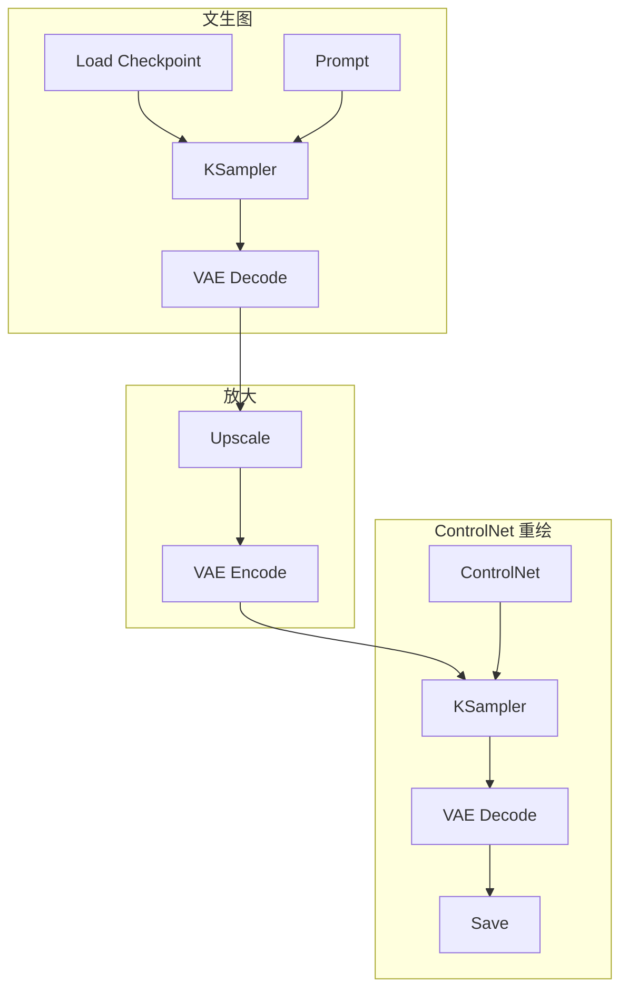
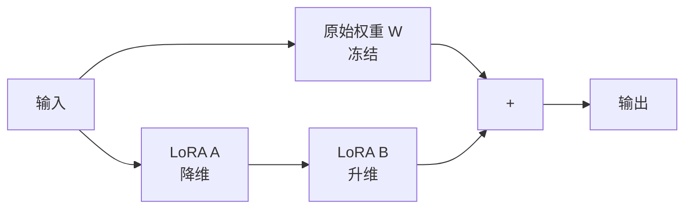

# 扩散模型：生成式多模态革命

> 生成式 AI 正经历从 U-Net 向 Transformer 的架构转移，同时工程化工具链（如 ComfyUI）使生成过程高度可控。

---

## 架构演进



| 代际 | 代表模型 | 骨干网络 | 特点 |
| :--- | :--- | :--- | :--- |
| **第一代** | SD 1.5 | U-Net 860M | 开创性工作 |
| **第二代** | SDXL | U-Net 2.6B | 更大规模 |
| **第三代** | SD3, FLUX | DiT | Transformer 架构 |

---

## Diffusion Transformer (DiT)

DiT 将 Transformer 引入扩散过程，替代传统 U-Net。

### 核心架构



### DiT Block 内部结构



**AdaLN-Zero**：条件信息通过自适应 LayerNorm 注入，初始化为零以保护预训练权重。

### DiT 优势

| 特性 | U-Net | DiT |
| :--- | :--- | :--- |
| **缩放性** | 有限 | 遵循 Scaling Law |
| **长距离依赖** | 受限于感受野 | 全局注意力 |
| **分辨率灵活性** | 需要适配 | 天然支持 |
| **训练稳定性** | 一般 | 更稳定 |

---

## Stable Diffusion 3 (SD3)

SD3 是 DiT 架构的集大成者，核心创新是 **MMDiT（Multimodal DiT）**。

### MMDiT 架构



### 关键创新

| 创新点 | 说明 |
| :--- | :--- |
| **独立权重** | 图像/文本模态有各自的 Transformer 权重 |
| **Joint Attention** | 周期性的跨模态注意力交互 |
| **Rectified Flow** | 更直的去噪轨迹，减少推理步数 |
| **三重文本编码** | CLIP + OpenCLIP + T5 |

### Rectified Flow

```
传统扩散：弯曲轨迹，需要多步
x_0 ~~~~> ~~~~> ~~~~> x_T

Rectified Flow：直线轨迹，步数更少
x_0 ---------> x_T
```

**效果**：相同质量下，推理步数可减少 50%。

---

## ControlNet：精细控制

ControlNet 解决了扩散模型生成"不可控"的痛点。

### 零卷积机制



### Zero Convolution 原理

```python
class ZeroConv(nn.Module):
    def __init__(self, channels):
        super().__init__()
        self.conv = nn.Conv2d(channels, channels, 1)
        # 关键：初始化为零
        nn.init.zeros_(self.conv.weight)
        nn.init.zeros_(self.conv.bias)
    
    def forward(self, x):
        return self.conv(x)
```

**设计哲学**："不伤害"
- 训练初期 ZeroConv 输出为 0
- 模型行为与原始 SD 完全一致
- 随训练进行，控制信号平滑注入

### 支持的控制条件

| 条件类型 | 输入 | 应用场景 |
| :--- | :--- | :--- |
| **Canny Edge** | 边缘图 | 保持轮廓 |
| **Depth** | 深度图 | 保持空间结构 |
| **Pose** | 骨架图 | 人物姿态控制 |
| **Segmentation** | 语义分割 | 区域控制 |
| **Scribble** | 涂鸦 | 草图生成 |
| **Normal Map** | 法线图 | 表面细节 |

---

## IP-Adapter：风格迁移

IP-Adapter 提出轻量级的图像提示（Image Prompt）适配方法。

### 解耦交叉注意力



### 实现细节

```python
# IP-Adapter 注入
def forward(self, hidden_states, text_embeds, image_embeds):
    # 原始文本注意力
    text_attn = self.text_cross_attn(hidden_states, text_embeds)
    # 新增图像注意力
    image_attn = self.image_cross_attn(hidden_states, image_embeds)
    # 加权融合
    output = text_attn + self.scale * image_attn
    return output
```

### 特点

| 特性 | 说明 |
| :--- | :--- |
| **参数量** | 仅 22M（vs SD 860M） |
| **兼容性** | 可与 ControlNet 等组合 |
| **训练成本** | 8×A100 约 1 天 |
| **推理成本** | 几乎无额外开销 |

---

## ComfyUI：节点式工作流

ComfyUI 将生成管线解构为**有向无环图（DAG）**。

### 核心概念



### 数据类型

| 类型 | 颜色 | 说明 |
| :--- | :--- | :--- |
| `MODEL` | 紫色 | 扩散模型权重 |
| `CLIP` | 黄色 | 文本编码器 |
| `VAE` | 红色 | 变分自编码器 |
| `CONDITIONING` | 橙色 | 编码后的提示 |
| `LATENT` | 粉色 | 潜在空间数据 |
| `IMAGE` | 绿色 | 像素级图像 |

### 执行逻辑

1. 用户点击 "Queue Prompt"
2. 从输出节点反向遍历 DAG
3. 计算依赖关系
4. 仅执行发生变化的节点（Lazy Evaluation）

### 工作流示例

**文生图 + 放大 + ControlNet**：



---

## LoRA 微调

### 扩散模型 LoRA



### 训练配置

| 参数 | 推荐值 | 说明 |
| :--- | :--- | :--- |
| **Rank** | 4-128 | 低秩维度 |
| **Alpha** | rank 或 rank×2 | 缩放系数 |
| **Learning Rate** | 1e-4 ~ 1e-5 | LoRA 学习率 |
| **训练图片** | 10-50 | 角色/风格 LoRA |

### 常见 LoRA 类型

| 类型 | 训练数据 | 用途 |
| :--- | :--- | :--- |
| **角色 LoRA** | 特定人物图片 | 生成一致角色 |
| **风格 LoRA** | 特定画风作品 | 风格迁移 |
| **概念 LoRA** | 特定概念图片 | 学习新概念 |

---

## 推理优化

### 采样器选择

| 采样器 | 速度 | 质量 | 推荐步数 |
| :--- | :--- | :--- | :--- |
| **Euler** | 快 | 一般 | 20-30 |
| **DPM++ 2M** | 中 | 好 | 20-25 |
| **DPM++ 2M Karras** | 中 | 很好 | 20-30 |
| **DDIM** | 快 | 一般 | 30-50 |

### CFG Scale 指南

| CFG 值 | 效果 |
| :--- | :--- |
| **1-3** | 创意强，可能偏离提示 |
| **5-7** | 平衡，推荐默认 |
| **10-15** | 严格遵循提示 |
| **>15** | 可能过饱和/失真 |

---

## 参考资源

| 资源 | 说明 |
| :--- | :--- |
| [Scalable Diffusion Models (DiT)](https://arxiv.org/abs/2212.09748) | DiT 论文 |
| [Scaling Rectified Flow (SD3)](https://arxiv.org/abs/2403.03206) | SD3 技术报告 |
| [Adding Conditional Control (ControlNet)](https://arxiv.org/abs/2302.05543) | ControlNet |
| [IP-Adapter](https://arxiv.org/abs/2308.06721) | 图像提示适配 |
| [ComfyUI](https://github.com/comfyanonymous/ComfyUI) | 节点式 UI |
