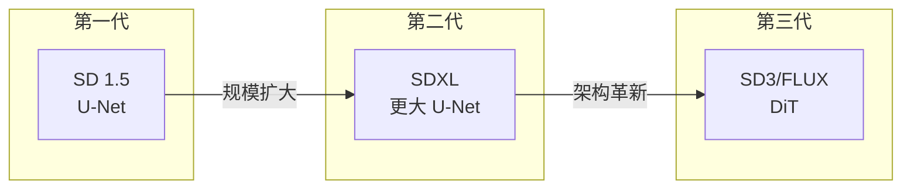
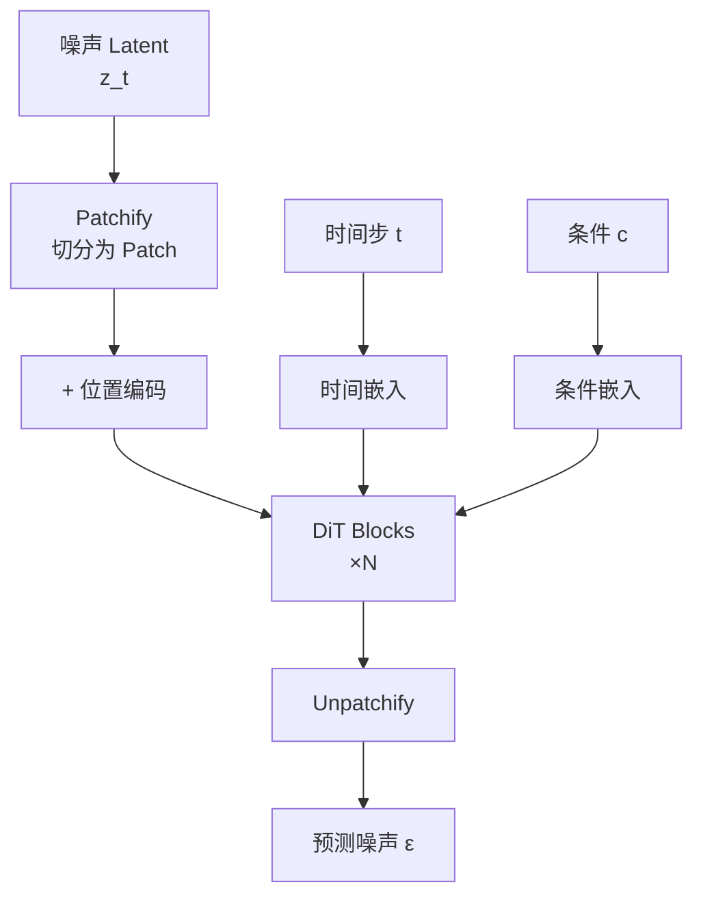
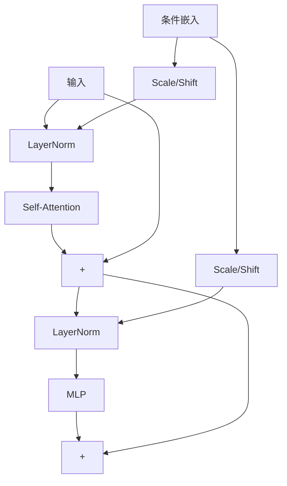
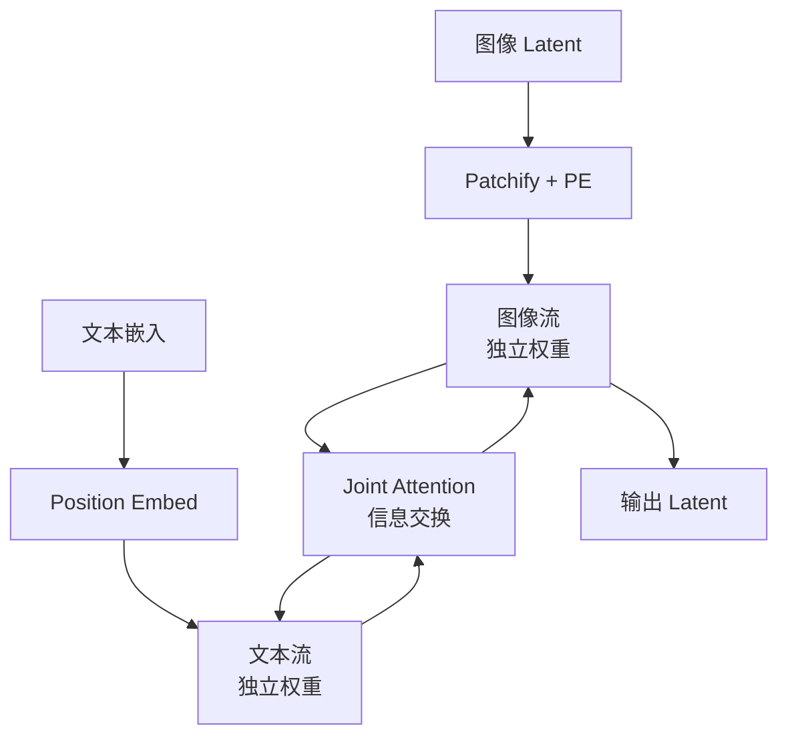
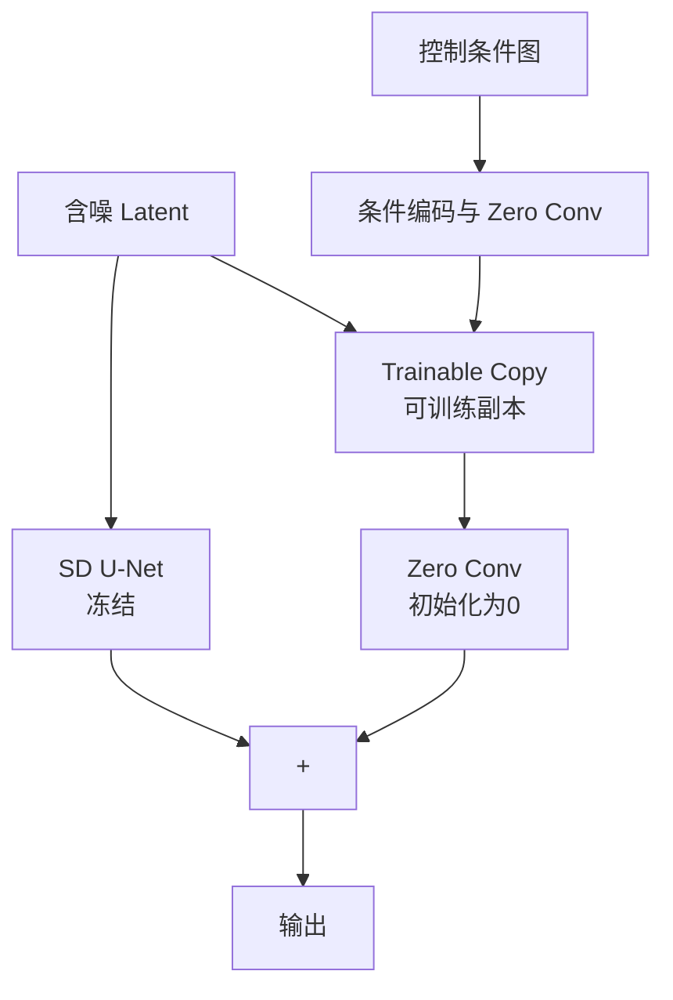
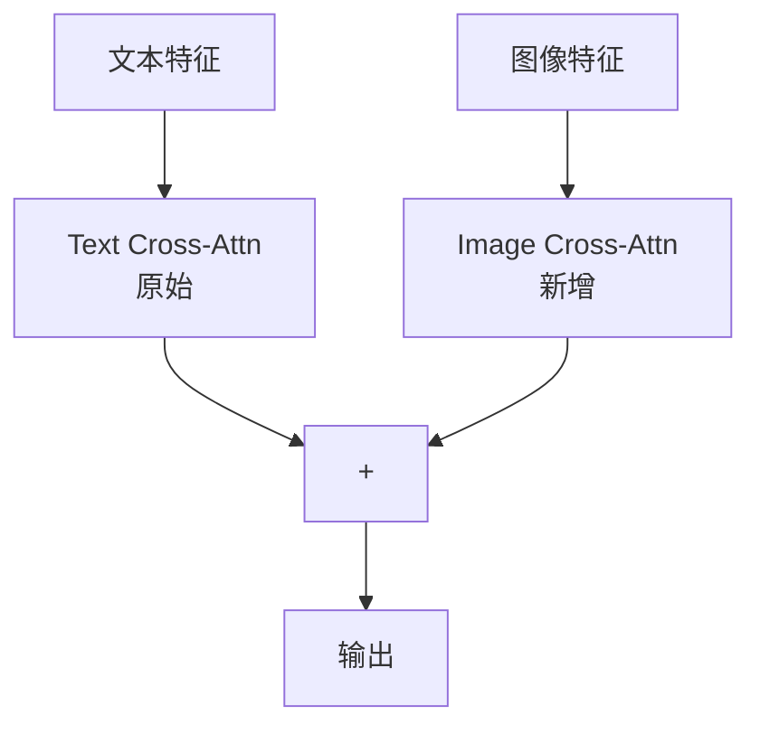
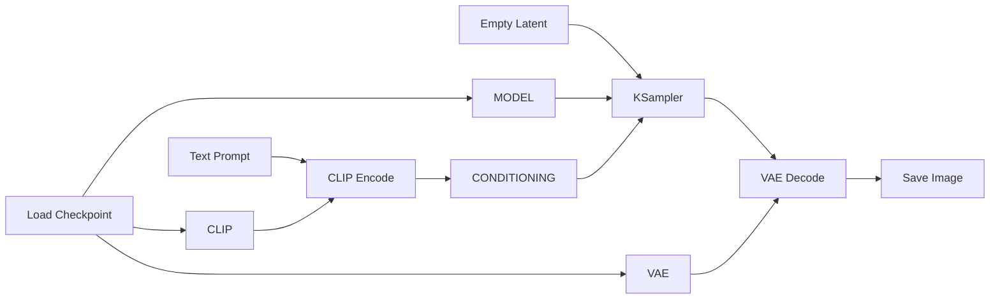
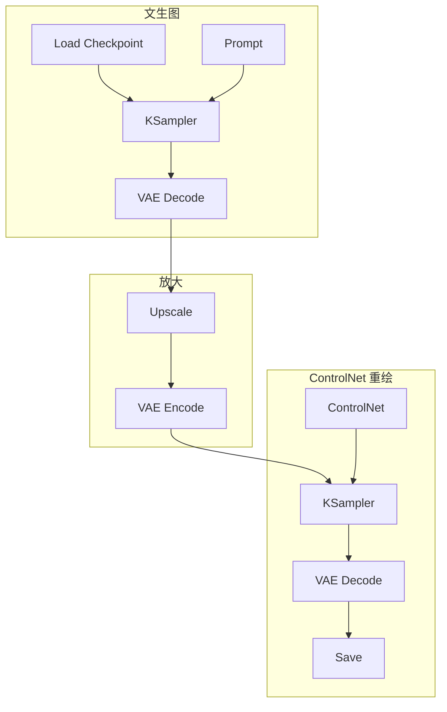
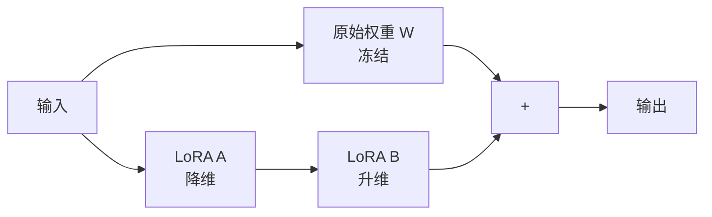

# 扩散模型：生成式多模态革命

> 学习生成系统时分开看表示空间、建模目标、网络骨干、条件控制和数值采样。DiT 是网络骨干，扩散或 Flow 是训练目标，ControlNet/IP-Adapter 是条件机制，ComfyUI 是执行工作流。

---

## 架构演进


```mermaid
flowchart LR
    subgraph "第一代"
        SD1[SD 1.5\nU-Net]
    end
    
    subgraph "第二代"
        SDXL[SDXL\n更大 U-Net]
    end
    
    subgraph "第三代"
        SD3[SD3/FLUX\nDiT]
    end
    
    SD1 -->|规模扩大| SDXL
    SDXL -->|架构革新| SD3
```

| 代际 | 代表模型 | 骨干网络 | 特点 |
| :--- | :--- | :--- | :--- |
| **第一代** | SD 1.5 | U-Net 860M | 开创性工作 |
| **第二代** | SDXL | U-Net 2.6B | 更大规模 |
| **第三代** | SD3, FLUX | DiT | Transformer 架构 |

---

## Diffusion Transformer (DiT)

DiT 将 Transformer 引入扩散过程，替代传统 U-Net。

### 核心架构


```mermaid
flowchart TB
    NOISE[噪声 Latent\nz_t] --> PATCH[Patchify\n切分为 Patch]
    PATCH --> PE[+ 位置编码]
    T[时间步 t] --> TE[时间嵌入]
    C[条件 c] --> CE[条件嵌入]
    PE --> DIT[DiT Blocks\n×N]
    TE --> DIT
    CE --> DIT
    DIT --> UNPATCH[Unpatchify]
    UNPATCH --> OUT[预测噪声 ε]
```

### DiT Block 内部结构


```mermaid
flowchart TB
    X[输入] --> LN1[LayerNorm]
    LN1 --> ATTN[Self-Attention]
    ATTN --> ADD1[+]
    X --> ADD1
    ADD1 --> LN2[LayerNorm]
    LN2 --> MLP[MLP]
    MLP --> ADD2[+]
    ADD1 --> ADD2
    
    COND[条件嵌入] --> SCALE1[Scale/Shift]
    SCALE1 --> LN1
    COND --> SCALE2[Scale/Shift]
    SCALE2 --> LN2
```

**AdaLN-Zero**：条件产生归一化的缩放/平移和残差门控，零初始化使残差块初始接近恒等映射，有助于稳定训练；原始 DiT 不应解释成“保护一个预训练扩散主干”。[DiT 论文](https://arxiv.org/abs/2212.09748)

### DiT 优势

Transformer 提供规则的 token 计算结构，DiT 论文研究了增加深度、宽度与 token 数的可扩展性；但 U-Net 也能使用注意力，DiT 也要处理位置编码、分辨率分布和二次 attention 成本。不能据此断言 DiT 在所有预算下更稳定、更省或天然适配任意分辨率。

工程比较需固定 VAE、数据、训练算力和输出分辨率，再测质量与采样成本；仅比较网络名称会把训练规模的作用算到架构头上。

---

## Stable Diffusion 3 (SD3)

[SD3 技术报告](https://arxiv.org/abs/2403.03206)结合 rectified flow 训练与 **MMDiT** 骨干；这两个概念分别回答“预测什么”和“怎样交换图文条件”。

### MMDiT 架构


```mermaid
flowchart TB
    IMG[图像 Latent] --> PE1[Patchify + PE]
    TXT[文本嵌入] --> PE2[Position Embed]
    
    PE1 --> STREAM1[图像流\n独立权重]
    PE2 --> STREAM2[文本流\n独立权重]
    
    STREAM1 --> JA[Joint Attention\n信息交换]
    STREAM2 --> JA
    
    JA --> STREAM1
    JA --> STREAM2
    
    STREAM1 --> OUT[输出 Latent]
```

### 关键创新

| 创新点 | 说明 |
| :--- | :--- |
| **独立权重** | 图像/文本模态有各自的 Transformer 权重 |
| **Joint Attention** | 周期性的跨模态注意力交互 |
| **Rectified Flow** | 以插值路径学习速度场，采样步数需按质量实测 |
| **三重文本编码** | CLIP + OpenCLIP + T5 |

### Rectified Flow

以一种常见约定为例，数据 `x₀` 与噪声 `ε` 构造线性插值 `xₜ = (1 − t)x₀ + tε`，训练速度场预测 `ε − x₀`；采样时从噪声端沿学习到的场积分回数据端。不同实现可能反转时间或使用不同参数化，scheduler 必须与 checkpoint 匹配。

线性的是训练用插值路径，学习场诱导的采样轨迹不保证每条都是直线。减少步数是否保持质量取决于模型、调度和求解器，不能统一声称减少 50%。工程上固定 seeds 比较多个步数，同时记录图像约束正确率与耗时。

---

## ControlNet：精细控制

ControlNet 解决了扩散模型生成"不可控"的痛点。

### 零卷积机制


```mermaid
flowchart TB
    X[含噪 Latent] --> SD[SD U-Net\n冻结]
    H[控制条件图] --> ZC1[条件编码与 Zero Conv]
    X --> COPY[Trainable Copy\n可训练副本]
    ZC1 --> COPY
    COPY --> ZC2[Zero Conv\n初始化为0]
    SD --> ADD[+]
    ZC2 --> ADD
    ADD --> OUT[输出]
```

### Zero Convolution 原理

```python
import torch.nn as nn

class ZeroConv(nn.Module):
    def __init__(self, channels):
        super().__init__()
        self.conv = nn.Conv2d(channels, channels, 1)
        # 关键：初始化为零
        nn.init.zeros_(self.conv.weight)
        nn.init.zeros_(self.conv.bias)
    
    def forward(self, x):
        return self.conv(x)
```

**设计哲学**："不伤害"
- 训练初期 ZeroConv 输出为 0
- 在相同主干、输入和随机状态下，新增残差初始为零；之后逐渐学习控制
- 随训练进行，控制信号平滑注入

### 支持的控制条件

| 条件类型 | 输入 | 应用场景 |
| :--- | :--- | :--- |
| **Canny Edge** | 边缘图 | 保持轮廓 |
| **Depth** | 深度图 | 保持空间结构 |
| **Pose** | 骨架图 | 人物姿态控制 |
| **Segmentation** | 语义分割 | 区域控制 |
| **Scribble** | 涂鸦 | 草图生成 |
| **Normal Map** | 法线图 | 表面细节 |

---

## IP-Adapter：风格迁移

[IP-Adapter](https://arxiv.org/abs/2308.06721)提供图像提示适配，不只用于风格，也可影响主体和构图；身份、局部结构是否保持须单独验证。

### 解耦交叉注意力


```mermaid
flowchart TB
    TXT[文本特征] --> CA1[Text Cross-Attn\n原始]
    IMG[图像特征] --> CA2[Image Cross-Attn\n新增]
    CA1 --> ADD[+]
    CA2 --> ADD
    ADD --> OUT[输出]
```

### 实现细节

```python
# IP-Adapter 注入
def forward(self, hidden_states, text_embeds, image_embeds):
    # 原始文本注意力
    text_attn = self.text_cross_attn(hidden_states, text_embeds)
    # 新增图像注意力
    image_attn = self.image_cross_attn(hidden_states, image_embeds)
    # 加权融合
    output = text_attn + self.scale * image_attn
    return output
```

### 特点

| 特性 | 说明 |
| :--- | :--- |
| **参数量** | 原始论文适配器约 22M，其他基座/变体不同 |
| **兼容性** | 在匹配的基座与实现上可组合；权重不可任意跨 SD 系列使用 |
| **训练成本** | 随基座、分辨率、数据与冻结范围变化 |
| **推理成本** | 有图像编码与新增注意力，需测量 |

---

## ComfyUI：节点式工作流

ComfyUI 将生成管线解构为**有向无环图（DAG）**。

### 核心概念


```mermaid
flowchart LR
    LOAD[Load Checkpoint] --> MODEL[MODEL]
    LOAD --> CLIP[CLIP]
    LOAD --> VAE[VAE]
    
    PROMPT[Text Prompt] --> ENCODE[CLIP Encode]
    CLIP --> ENCODE
    ENCODE --> COND[CONDITIONING]
    
    LATENT[Empty Latent] --> SAMPLE[KSampler]
    MODEL --> SAMPLE
    COND --> SAMPLE
    SAMPLE --> DECODE[VAE Decode]
    VAE --> DECODE
    DECODE --> SAVE[Save Image]
```

### 数据类型

| 类型 | 颜色 | 说明 |
| :--- | :--- | :--- |
| `MODEL` | 紫色 | 扩散模型权重 |
| `CLIP` | 黄色 | 文本编码器 |
| `VAE` | 红色 | 变分自编码器 |
| `CONDITIONING` | 橙色 | 编码后的提示 |
| `LATENT` | 粉色 | 潜在空间数据 |
| `IMAGE` | 绿色 | 像素级图像 |

### 执行逻辑

1. 用户点击 "Queue Prompt"
2. 从输出节点反向遍历 DAG
3. 计算依赖关系
4. 按依赖和缓存有效性执行；输入变化可能使下游缓存全部失效，具体规则依节点实现

### 工作流示例

**文生图 + 放大 + ControlNet**：


```mermaid
flowchart TB
    subgraph 文生图
        L1[Load Checkpoint] --> K1[KSampler]
        P1[Prompt] --> K1
        K1 --> D1[VAE Decode]
    end
    
    subgraph 放大
        D1 --> UP[Upscale]
        UP --> E1[VAE Encode]
    end
    
    subgraph ControlNet 重绘
        E1 --> K2[KSampler]
        CN[ControlNet] --> K2
        K2 --> D2[VAE Decode]
        D2 --> SAVE[Save]
    end
```

---

## LoRA 微调

### 扩散模型 LoRA


```mermaid
flowchart LR
    X[输入] --> W[原始权重 W\n冻结]
    X --> A[LoRA A\n降维]
    A --> B[LoRA B\n升维]
    W --> ADD[+]
    B --> ADD
    ADD --> OUT[输出]
```

### 训练配置

以下是小规模角色/风格实验起点，不是保证成功的配方。数据数量不能代替视角、背景、表情与概念覆盖；caption 应区分要学习的主体与不想绑定的背景。训练/验证按拍摄场景切分，避免同一照片近重复泄漏。

| 参数 | 推荐值 | 说明 |
| :--- | :--- | :--- |
| **Rank** | 4-128 | 低秩维度 |
| **Alpha** | rank 或 rank×2 | 缩放系数 |
| **Learning Rate** | 1e-4 ~ 1e-5 | LoRA 学习率 |
| **训练图片** | 10-50 | 角色/风格 LoRA |

### 常见 LoRA 类型

| 类型 | 训练数据 | 用途 |
| :--- | :--- | :--- |
| **角色 LoRA** | 特定人物图片 | 生成一致角色 |
| **风格 LoRA** | 特定画风作品 | 风格迁移 |
| **概念 LoRA** | 特定概念图片 | 学习新概念 |

---

## 推理优化

### 采样器选择

先使用 checkpoint 官方工作流的 scheduler 与步数，再一次只改变采样器或步数。Euler、DDIM、DPM 系列的名称不能脱离噪声/时间参数化比较；蒸馏模型也不能机械套用普通模型的 20–50 步配置。

### CFG Scale 指南

典型 classifier-free guidance 用 `uncond + s × (cond - uncond)` 加强条件方向，过大可能过饱和、失真或损害多样性，不保证更遵循每条指令。某些模型使用蒸馏 guidance 或不同控制接口，应以其模型卡为准，而不是通用“5–7 最佳”。

### 可复现工作流与验收

保存 checkpoint/VAE/文本编码器/adapter 哈希、工作流 JSON、节点版本、尺寸、seed、scheduler、步数、guidance 和控制强度。相同 seed 也未必跨设备/内核逐像素一致。

| 现象 | 排查顺序 | 验收方式 |
| --- | --- | --- |
| 黑图、NaN | VAE/精度兼容、权重与 scheduler | 中间 latent 数值有限，输出可正常解码 |
| 姿态符合但画面僵硬 | ControlNet 强度与起止步、条件图质量 | 固定 seed 扫强度，人工检查结构与自然度 |
| 主体相似但文字/数量错误 | 条件理解与训练覆盖 | 对每条 prompt 约束逐项打分，不只看美观 |
| LoRA 记住背景或重复构图 | 数据重复、caption 与训练时长 | 未见背景、姿态和负例上的泛化 |

用固定 prompt 集与多 seeds 比较提示遵循、主体一致性、伪影、安全与耗时。CLIP 相似度不能单独验证精确计数、文字或空间关系；生成输出须与 [视觉理解评估](/llms/multimodal/deployment)的目标分开。

## 参考资源

## 参考资源

| 资源 | 说明 |
| :--- | :--- |
| [Scalable Diffusion Models (DiT)](https://arxiv.org/abs/2212.09748) | DiT 论文 |
| [Scaling Rectified Flow (SD3)](https://arxiv.org/abs/2403.03206) | SD3 技术报告 |
| [Adding Conditional Control (ControlNet)](https://arxiv.org/abs/2302.05543) | ControlNet |
| [IP-Adapter](https://arxiv.org/abs/2308.06721) | 图像提示适配 |
| [ComfyUI](https://github.com/comfyanonymous/ComfyUI) | 节点式 UI |
