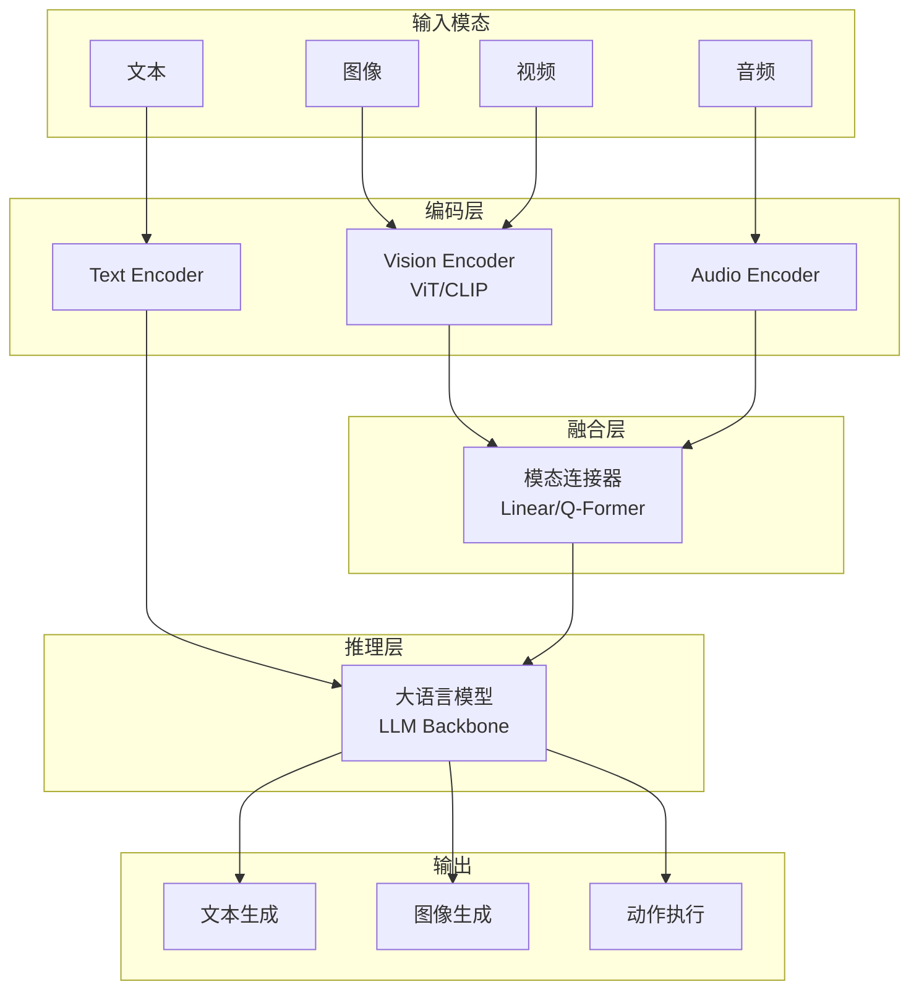
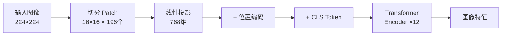
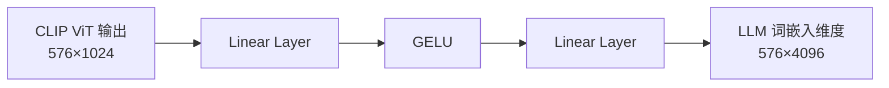
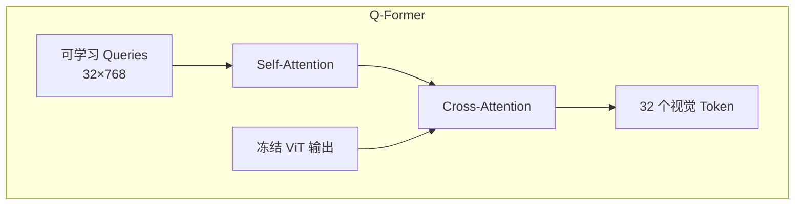
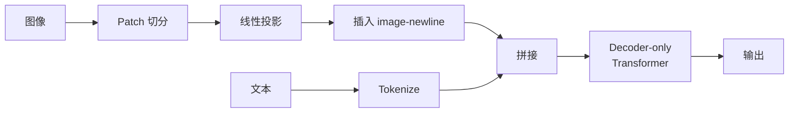
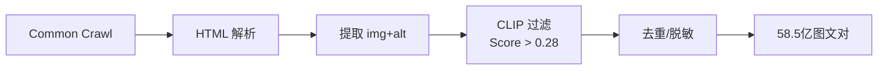
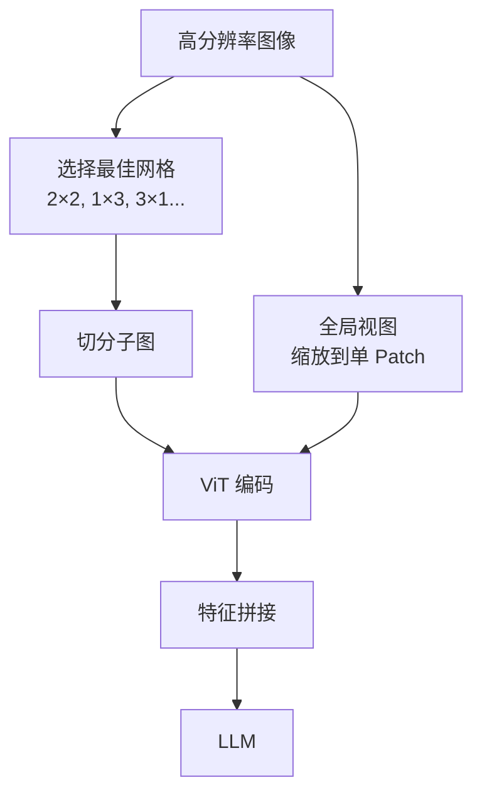
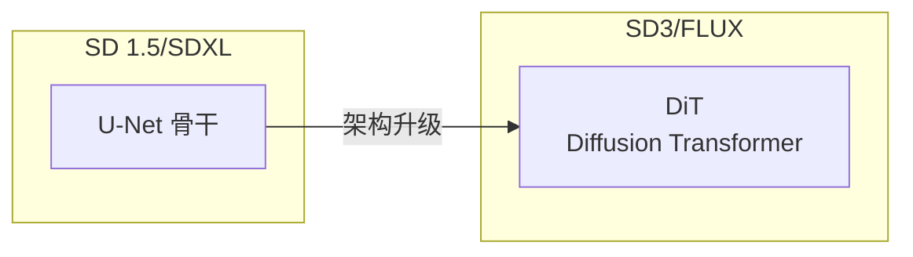
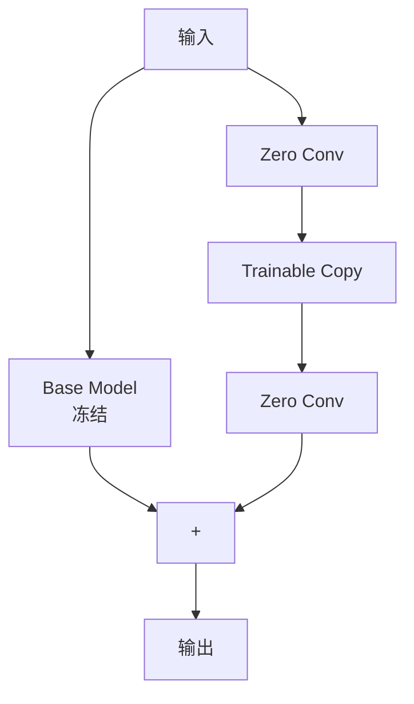
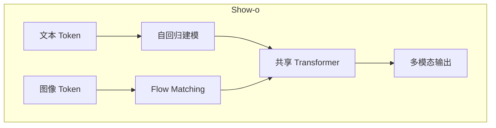

# 多模态大模型全景

> 人工智能正经历从单一模态向多模态融合的深刻范式转移。**多模态大模型（MLLMs）** 通过整合视觉、语言、音频等信息源，正在重塑通用人工智能的技术路径。

---

## 技术全景图



### 核心能力矩阵

| 能力域 | 代表模型 | 技术特点 |
| :--- | :--- | :--- |
| **视觉理解** | GPT-4V, LLaVA, Qwen-VL | 图像描述、VQA、OCR |
| **图像生成** | DALL-E 3, SD3, Midjourney | 文生图、图生图、风格迁移 |
| **视频理解** | Video-LLaVA, Gemini | 长视频问答、时序推理 |
| **具身智能** | RT-2, PaLM-E | 视觉-语言-动作 (VLA) |
| **统一模型** | Show-o, MMaDA | 理解+生成一体化 |

---

## 1. 视觉编码：从像素到语义

视觉编码器是多模态模型的"眼睛"，将连续像素转化为结构化特征向量。

### 1.1 Vision Transformer (ViT)

ViT 摒弃传统卷积，直接将图像视为一系列 **Patch 序列**。



**Patch Embedding 过程**：

$$\mathbf{z}_0 = [\mathbf{x}_{cls}; \mathbf{x}_p^1\mathbf{E}; \mathbf{x}_p^2\mathbf{E}; \cdots; \mathbf{x}_p^N\mathbf{E}] + \mathbf{E}_{pos}$$

- 输入图像 $224 \times 224$ → 切分为 $14 \times 14 = 196$ 个 Patch
- 每个 Patch $(16 \times 16 \times 3 = 768)$ 通过线性投影映射到嵌入空间
- 添加可学习的位置编码，赋予空间感知能力

**位置编码演进**：

| 方案 | 特点 | 适用场景 |
| :--- | :--- | :--- |
| **可学习位置编码** | 训练时学习，固定分辨率 | 标准 ViT |
| **RoPE 2D** | 旋转位置编码扩展到二维 | 可变分辨率 |
| **缩放平均位置嵌入** | 编码相对感受野大小 | 多尺度输入 |

### 1.2 CLIP：视觉-语言对齐

**CLIP (Contrastive Language-Image Pre-training)** 是连接视觉与文本语义的基石。

**InfoNCE Loss**：

$$\mathcal{L}_{I \to T} = -\log \frac{\exp(\text{sim}(I_i, T_i) / \tau)}{\sum_{j=1}^N \exp(\text{sim}(I_i, T_j) / \tau)}$$

<div class="compare-box">
  <div class="compare-item">
    <div class="compare-title">传统分类模型</div>
    <p class="compare-desc">固定类别标签<br/>无法泛化到新类别<br/>需要大量标注数据</p>
  </div>
  <div class="compare-vs">VS</div>
  <div class="compare-item highlight">
    <div class="compare-title">CLIP 对比学习</div>
    <p class="compare-desc">开放词汇识别<br/>强大的 Zero-shot 能力<br/>自然语言作为监督信号</p>
  </div>
</div>

**训练机制**：
- 构建 $N \times N$ 相似度矩阵（Batch 内图文对）
- 最大化对角线（正样本对）相似度
- 最小化非对角线（负样本对）相似度
- 温度系数 $\tau$ 调节分布尖锐程度

---

## 2. 模态连接器：LLM 与视觉的桥梁

连接器负责将视觉特征适配到 LLM 输入空间，设计直接影响参数效率和理解深度。

### 2.1 架构对比

| 特性 | LLaVA (Linear) | BLIP-2 (Q-Former) |
| :--- | :--- | :--- |
| **核心机制** | 两层 MLP 投影 | Transformer 查询转换器 |
| **Token 数量** | 取决于 Patch 数（如 576） | 固定数量（如 32） |
| **信息保留** | 保留完整视觉细节 | 压缩提取关键特征 |
| **训练复杂度** | 低，仅训练投影层 | 高，需两阶段预训练 |
| **优势场景** | OCR、细粒度识别 | 高效推理、显存受限 |

### 2.2 LLaVA 线性投影



**设计哲学**：极简但有效，保留最完整的视觉信息。代价是 Token 数量随分辨率平方增长。

### 2.3 BLIP-2 Q-Former



**核心机制**：
- 初始化 32 个可学习查询向量
- 通过 Cross-Attention 从海量视觉信息中"提炼"关键特征
- 起到"信息过滤器"作用，去除与文本无关的视觉噪声

---

## 3. 原生多模态架构

传统"编码器-连接器-LLM"架构存在模态割裂问题，新一代模型探索更紧密的融合。

### 3.1 Fuyu-8B：纯 Decoder 架构

**革命性设计**：摒弃独立视觉编码器，直接用 Decoder-only Transformer 处理图像。



**image-newline 机制**：
- 每行 Patch 结束时插入特殊 Token
- 让模型像处理换行符一样理解图像二维结构
- 天然支持任意分辨率和宽高比

### 3.2 Qwen-VL：多阶段特征融合

**DeepStack 融合**：不仅使用 ViT 最后一层输出，还融合多层特征，同时捕获低层纹理和高层语义。

**三阶段训练**：

| 阶段 | 数据 | 策略 |
| :--- | :--- | :--- |
| **1. 预训练** | 海量弱监督图文 | 冻结 LLM，训练 Adapter |
| **2. 多任务微调** | 高质量 VQA/Caption | 解冻全模型 |
| **3. 指令微调** | 对话数据 | 优化指令遵循 |

---

## 4. 数据工程：多模态能力的基石

> **"Data is the new oil"** —— 数据质量直接决定模型上限。

### 4.1 LAION-5B 清洗流水线



**CLIP 过滤的双刃剑**：
- ✅ 保证图文相关性
- ❌ 引入 CLIP 固有偏见（无法识别的艺术风格被过滤）

### 4.2 ShareGPT4V：高质量 Caption 合成

**数据闭环策略**：

| 步骤 | 操作 | 规模 |
| :--- | :--- | :--- |
| **种子数据** | GPT-4V 生成详尽描述 | 10 万张 |
| **训练 Captioner** | 学习 GPT-4V 描述能力 | - |
| **大规模标注** | Captioner 重标注 | 120 万张 |

**Caption 质量提升**：从"人冲浪"升级为"图像捕捉到冲浪者骑在波浪上的惊险瞬间，冲浪者身穿黑色潜水服……"

### 4.3 AnyRes：动态分辨率处理

解决固定分辨率导致的高清细节丢失问题（LLaVA-NeXT）。



**意外收获**：零样本视频理解能力——视频可视为"动态分辨率"图像序列。

---

## 5. 生成式多模态：扩散模型革命

### 5.1 架构演进：从 U-Net 到 DiT



**Diffusion Transformer (DiT)**：
- 将 VAE 压缩后的 Latent 切分为 Patch
- 继承 Transformer 缩放律，质量随参数量对数线性提升
- 灵活处理不同分辨率和宽高比

**SD3 MMDiT**：
- 图像和文本模态独立权重参数
- 通过周期性 Joint Attention 交换信息
- Rectified Flow 使去噪轨迹更直，推理步数更少

### 5.2 精细控制：ControlNet

**零卷积（Zero Convolution）机制**：



**设计哲学**："不伤害"原模型
- ZeroConv 初始化为全零
- 训练初期 ControlNet 输出为 0，行为与原模型一致
- 随训练进行，控制信号平滑注入

### 5.3 风格迁移：IP-Adapter

**解耦交叉注意力**：

| 流 | 输入 | Cross-Attention |
| :--- | :--- | :--- |
| **文本流** | CLIP 文本特征 | 原始 Cross-Attn |
| **图像流** | CLIP 图像特征 | 新增 Cross-Attn |

两者输出在加法层合并，仅需 22M 参数实现强大的风格/内容迁移。

### 5.4 ComfyUI：节点式工作流

**核心理念**：将生成管线解构为有向无环图（DAG）。

**数据类型**：
- `LATENT`：潜在空间数据
- `IMAGE`：像素级图像
- `CONDITIONING`：编码后的提示
- `MODEL`：模型权重

**执行逻辑**：从输出节点反向遍历，按需计算（Lazy Evaluation）。

---

## 6. 多模态 RAG 与智能体

### 6.1 ColPali：视觉 RAG

传统 RAG 对 PDF 需要 OCR，丢失排版和图表信息。

**ColPali 方案**：
- VLM 直接编码文档页面图像
- 保留多个 Patch 的嵌入向量（Multi-vector）
- MaxSim 检索：$S(q, d) = \sum_{i \in q} \max_{j \in d} (q_i \cdot d_j)$

**效果**：精确定位图表、标题或特定段落，"所见即所得"的检索。

### 6.2 RT-2：具身智能

**动作 Token 化**：将机器人动作离散化为语言 Token。

```mermaid
flowchart LR
    IMG[视觉观察] --> VLM[VLM Backbone]
    CMD[语言指令] --> VLM
    VLM --> ACT[动作 Token<br/>"128, 55, terminate"]
    ACT --> ROBOT[机器人执行]
```

**涌现能力**：指令"把灭绝的动物捡起来"→ 机器人利用 VLM 知识识别恐龙玩具并抓取。

---

## 7. 前沿统一架构

### 7.1 Show-o：理解与生成统一



**创新点**：
- 自回归处理文本，继承推理能力
- Flow Matching 处理图像，高质量生成
- 单一权重同时处理理解和生成

### 7.2 Uni-MoE：统一混合专家

**渐进式训练**：
1. 跨模态对齐（统一特征空间）
2. 特定模态专家训练
3. LoRA 统一微调

**效果**：减少多模态干扰，提升泛化能力。

### 7.3 RingAttention：超长上下文

**Blockwise Parallelism**：
- 长序列切分为块，分配给不同 GPU
- KV 块在设备环之间流转
- 理论支持 1M+ Token 上下文

---

## 8. 推理优化与评测

### 8.1 高性能推理

| 方案 | 核心技术 | 加速比 |
| :--- | :--- | :--- |
| **vLLM** | PagedAttention，显存零浪费 | 2-4× |
| **TensorRT-LLM** | 层融合、FP8 量化 | 2× |

### 8.2 评测基准

| 基准 | 评测维度 | 特点 |
| :--- | :--- | :--- |
| **MMBench** | 综合能力 | CircularEval 消除位置偏见 |
| **HallusionBench** | 幻觉检测 | 视觉欺骗、几何错觉 |
| **MMMU** | 多学科推理 | 大学水平专业知识 |

---

## 📚 学习路线

<div class="learning-path">
  <div class="path-step step-1">
    <div class="step-num">1</div>
    <div class="step-title">理解基础</div>
    <ul>
      <li>ViT 与 CLIP 原理</li>
      <li>模态连接器设计</li>
      <li>LLaVA 架构实践</li>
    </ul>
  </div>
  <div class="path-arrow">→</div>
  <div class="path-step step-2">
    <div class="step-num">2</div>
    <div class="step-title">生成模型</div>
    <ul>
      <li>扩散模型原理</li>
      <li>SD3/DiT 架构</li>
      <li>ControlNet/IP-Adapter</li>
    </ul>
  </div>
  <div class="path-arrow">→</div>
  <div class="path-step step-3">
    <div class="step-num">3</div>
    <div class="step-title">前沿应用</div>
    <ul>
      <li>多模态 RAG</li>
      <li>统一架构 (Show-o)</li>
      <li>具身智能 (VLA)</li>
    </ul>
  </div>
</div>

---

## 🔗 核心资源

### 代表模型

| 模型 | 类型 | 链接 |
| :--- | :--- | :--- |
| **LLaVA** | 视觉理解 | [llava-vl.github.io](https://llava-vl.github.io/) |
| **CLIP** | 视觉-语言对齐 | [openai.com/research/clip](https://openai.com/research/clip) |
| **Stable Diffusion 3** | 图像生成 | [stability.ai](https://stability.ai/) |
| **Qwen-VL** | 原生多模态 | [github.com/QwenLM/Qwen-VL](https://github.com/QwenLM/Qwen-VL) |

### 重要论文

| 论文 | 主题 |
| :--- | :--- |
| [An Image is Worth 16x16 Words (ViT)](https://arxiv.org/abs/2010.11929) | Vision Transformer |
| [Learning Transferable Visual Models (CLIP)](https://arxiv.org/abs/2103.00020) | 对比学习 |
| [Visual Instruction Tuning (LLaVA)](https://arxiv.org/abs/2304.08485) | 视觉指令微调 |
| [BLIP-2](https://arxiv.org/abs/2301.12597) | Q-Former 架构 |
| [Scaling Rectified Flow (SD3)](https://arxiv.org/abs/2403.03206) | MMDiT |
| [Adding Conditional Control (ControlNet)](https://arxiv.org/abs/2302.05543) | 精细控制 |

### 工具框架

| 工具 | 用途 |
| :--- | :--- |
| [ComfyUI](https://github.com/comfyanonymous/ComfyUI) | 节点式生成工作流 |
| [Transformers](https://huggingface.co/docs/transformers) | 模型加载与推理 |
| [diffusers](https://huggingface.co/docs/diffusers) | 扩散模型库 |

---

> **技术趋势**：架构统一化、上下文长程化、部署高效化。多模态大模型将不仅能"看"和"说"，更能深入物理世界进行"行动"。
