# 多模态大模型全景

> 人工智能正经历从单一模态向多模态融合的深刻范式转移。**多模态大模型（MLLMs）** 通过整合视觉、语言、音频等信息源，正在重塑通用人工智能的技术路径。

---

## 技术全景图

```mermaid
flowchart TB
    subgraph 输入模态
        I1[图像]
        I2[文本]
        I3[音频]
        I4[视频]
    end
    
    subgraph 编码层
        E1[Vision Encoder (ViT/CLIP)]
        E2[Text Encoder]
        E3[Audio Encoder]
    end
    
    subgraph 融合层
        C[模态连接器 - Linear/Q-Former]
    end
    
    subgraph 推理层
        L[大语言模型 - LLM Backbone]
    end
    
    subgraph 输出
        O1[文本生成]
        O2[图像生成]
        O3[动作执行]
    end
    
    I1 --> E1
    I2 --> E2
    I3 --> E3
    I4 --> E1
    E1 --> C
    E2 --> L
    E3 --> C
    C --> L
    L --> O1
    L --> O2
    L --> O3
```

### 核心能力矩阵

| 能力域 | 代表模型 | 技术特点 |
| :--- | :--- | :--- |
| **视觉理解** | GPT-4V, LLaVA, Qwen-VL | 图像描述、VQA、OCR |
| **图像生成** | DALL-E 3, SD3, Midjourney | 文生图、图生图、风格迁移 |
| **视频理解** | Video-LLaVA, Gemini | 长视频问答、时序推理 |
| **具身智能** | RT-2, PaLM-E | 视觉-语言-动作 (VLA) |
| **统一模型** | Show-o, MMaDA | 理解+生成一体化 |

---

## 1. 视觉编码：从像素到语义

视觉编码器是多模态模型的"眼睛"，将连续像素转化为结构化特征向量。

### 1.1 Vision Transformer (ViT)

ViT 摒弃传统卷积，直接将图像视为一系列 **Patch 序列**。

```mermaid
flowchart LR
    IMG[输入图像 (24×224] --> PATCH[切分 Patch (6×16 × 196个]
    PATCH --> PROJ[线性投影<br/>768维]
    PROJ --> POS[+ 位置编码]
    POS --> CLS[+ CLS Token]
    CLS --> TF[Transformer - Encoder ×12]
    TF --> OUT[图像特征]
```

**Patch Embedding 过程**：

$$\mathbf{z}_0 = [\mathbf{x}_{cls}; \mathbf{x}_p^1\mathbf{E}; \mathbf{x}_p^2\mathbf{E}; \cdots; \mathbf{x}_p^N\mathbf{E}] + \mathbf{E}_{pos}$$

- 输入图像 $224 \times 224$ → 切分为 $14 \times 14 = 196$ 个 Patch
- 每个 Patch $(16 \times 16 \times 3 = 768)$ 通过线性投影映射到嵌入空间
- 添加可学习的位置编码，赋予空间感知能力

**位置编码演进**：

| 方案 | 特点 | 适用场景 |
| :--- | :--- | :--- |
| **可学习位置编码** | 训练时学习，固定分辨率 | 标准 ViT |
| **RoPE 2D** | 旋转位置编码扩展到二维 | 可变分辨率 |
| **缩放平均位置嵌入** | 编码相对感受野大小 | 多尺度输入 |

### 1.2 CLIP：视觉-语言对齐

**CLIP (Contrastive Language-Image Pre-training)** 是连接视觉与文本语义的基石。

#### 1.2.1 双编码器架构

**核心机制**：

| 组件 | 实现方案 | 特点 |
| :--- | :--- | :--- |
| **图像编码器** | ResNet-50（注意力池化）/ ViT | 压缩提取视觉特征向量 |
| **文本编码器** | 12 层 Transformer | 序列包裹 `[SOS]` 和 `[EOS]` 标记 |
| **投影层** | 线性层 | 映射到共享嵌入空间 |

**嵌入空间对齐**：两路编码器将图像和文本映射到同一语义空间，语义相关的样本在空间中彼此靠近。

#### 1.2.2 对比学习损失函数

**对称交叉熵损失**（图像→文本 + 文本→图像）

$$\mathcal{L} = \frac{1}{2} (\mathcal{L}_{I \to T} + \mathcal{L}_{T \to I})$$

图像到文本的损失：

$$\mathcal{L}_{I \to T} = -\frac{1}{N} \sum_{i=1}^{N} \log \frac{\exp(\langle v_i, w_i \rangle / \tau)}{\sum_{j=1}^N \exp(\langle v_i, w_j \rangle / \tau)}$$

**温度系数 $\tau$ 的奥义**

- CLIP 将 $\tau$ 参数化为 $e^{-\tau'}$ 并作为可学习参数
- **作用**：动态调节 logits 分布的尖锐程度
- **优势**：防止大规模训练中的梯度消失/爆炸，确保稳定训练

#### 1.2.3 零样本迁移机制

**提示工程（Prompt Engineering）**：

```python
### 单模板
prompt = f"A photo of a {label}."

# 多模板集成（显著提升准确率）
templates = [
    "A photo of a {}.",
    "A rendering of a {}.",
    "A cropped photo of the {}."
]
```

**分类流程**：

1. 将候选类别填入模板生成文本
2. 计算图像嵌入与所有类别文本嵌入的余弦相似度
3. Softmax 归一化得到分类概率

**数据类型**：

- ImageNet 零样本准确率：**76.2%**
- 分布外数据（ImageNet-Rendition 等）鲁棒性差距明显

#### 1.2.4 训练数据与规模

**数据来源**：从互联网收集的 **4 亿图文对**

- **特点**：噪声数据、完整句子描述（非单一标签）
- **偏见问题**：数据偏向发达国家、年轻、男性用户

#### 1.2.5 CLIP 的局限性

| 局限 | 表现 |
| :--- | :--- |
| **无生成能力** | 不能生成 VQA/Caption 或回答开放问题 |
| **细粒度推理弱** | 计数、空间关系判断能力差 |
| **抽象符号** | MNIST 等符号识别任务不如人类 |
| **数据偏见** | 在 Fairface 数据集上表现出性别/种族偏见 |

<div class="compare-box">
  <div class="compare-item">
    <div class="compare-title">传统分类模型</div>
    <p class="compare-desc">固定类别标签<br/>无法泛化到新类别<br/>需要大量标注数据</p>
  </div>
  <div class="compare-vs">VS</div>
  <div class="compare-item highlight">
    <div class="compare-title">CLIP 对比学习</div>
    <p class="compare-desc">开放词汇识别<br/>强大的 Zero-shot 能力<br/>自然语言作为监督信号</p>
  </div>
</div>

#### 1.2.6 对比学习的演进

**ALIGN（Google）**：规模暴力

- 数据策略：8 亿对未清洗的 Raw Alt-text 数据
- 结论：规模足够大时，噪声数据也能学到 SOTA 表征

**SigLIP 过滤的双刃剑**：损失函数革新

- 问题：Softmax 在分布式训练中需要全局通信（All-Reduce）
- 方案：基于 Sigmoid 的损失函数

$$\mathcal{L} = - \frac{1}{N} \sum_{i,j} \log \sigma (z_{ij} \cdot (-1)^{t_{ij}})$$

- 优势：消除全局通信，支持超大 Batch Size（2k+）

**CoCa（Contrastive Captioners）**：理解与生成统一

- **解耦解码器**设计：
  - 单模态文本层：对比学习
  - 多模态文本层：Cross-Attention 接入图像，生成 Caption
- 效果：ImageNet 零样本准确率 **86.3%**

---

## 2. 模态连接器：LLM 与视觉的桥梁

连接器负责将视觉特征适配到 LLM 输入空间，设计直接影响参数效率和理解深度。

### 2.1 架构对比

| 特性 | LLaVA (Linear) | BLIP-2 (Q-Former) |
| :--- | :--- | :--- |
| **核心机制** | 两层 MLP 投影 | Transformer 查询转换器 |
| **Token 数量** | 取决于 Patch 数（如 576） | 固定数量（如 32） |
| **信息保留** | 保留完整视觉细节 | 压缩提取关键特征 |
| **训练复杂度** | 低，仅训练投影层 | 高，需两阶段预训练 |
| **优势场景** | OCR、细粒度识别 | 高效推理、显存受限 |

### 2.2 LLaVA：极简主义哲学

### 2.2 LLaVA 线性投影

```mermaid
flowchart LR
    V[CLIP ViT 输出 (76×1024] --> MLP1[Linear Layer]
    MLP1 --> ACT[GELU]
    ACT --> MLP2[Linear Layer]
    MLP2 --> OUT[LLM 词嵌入维度<br/>576×4096]
```

**设计洞察**：

- 强大的 LLM 只需简单映射即可理解视觉特征
- 保留**完整视觉信息**（例如 576 个 Token）
- 代价：Token 数量随分辨率平方增长

#### 2.2.2 视觉指令微调（Visual Instruction Transformer）

**数据生成策略**：利用 GPT-4（纯文本）基于 COCO Caption + Bounding Box 生成复杂多轮对话

**两阶段训练**：

| 阶段 | 数据 | 参数更新 | 目标 |
| :--- | :--- | :--- | :--- |
| **特征对齐** | 简单图文对 | 仅投影层 | 视觉-文本基础对齐 |
| **端到端微调** | 158k 高质量指令 | 投影层 + LLM | 赋予「助手」能力 |

**架构组件**：

- 视觉编码器：CLIP ViT-L/14（冻结）
- LLM：Vicuna（基于 LLaMA）
- 连接器：**两层 MLP**

### 2.3 BLIP：引导语言-图像预训练

**CLIP (Contrastive Language-Image Pre-training)** 是连接视觉与文本语义的基石。

#### 2.3.1 MED 架构：灵活的多任务处理

**MED (Multimodal Mixture of Encoder-Decoder)** 通过权重共享与 Attention Mask 控制，在三种模式下运行：

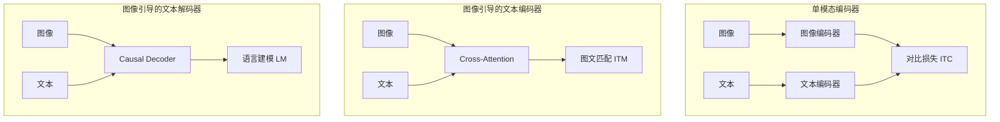

**三种模式细节**：

| 模式 | 训练目标 | 核心机制 |
| :--- | :--- | :--- |
| **单模态编码器** | ITC（对比损失） | 学习全局检索表征 |
| **图像引导文本编码器** | ITM（二分类） | 难负样本挖掘，区分细微差异 |
| **图像引导文本解码器** | LM（语言建模） | 赋予自然语言描述能力 |

#### 2.3.2 CapFilt：数据质量的"自举"革命

BLIP 利用模型自身清洗网络噪声数据：

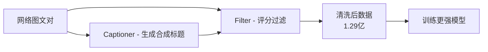

**效果对比**：

- 1.29 亿清洗后数据 > 1.8 亿原始数据  
- Caption 质量提升：从“人冲浪”升级为“图像捕捉到冲浪者骑在波浪上的惊险瞬间，冲浪者身穿黑色潜水服……”

### 2.4 BLIP-2：冻结大模型时代的计算美学

#### 2.4.1 BLIP-2 Q-Former

**设计理念**：冻结预训练好的视觉编码器和 LLM，仅训练轻量级中间件。

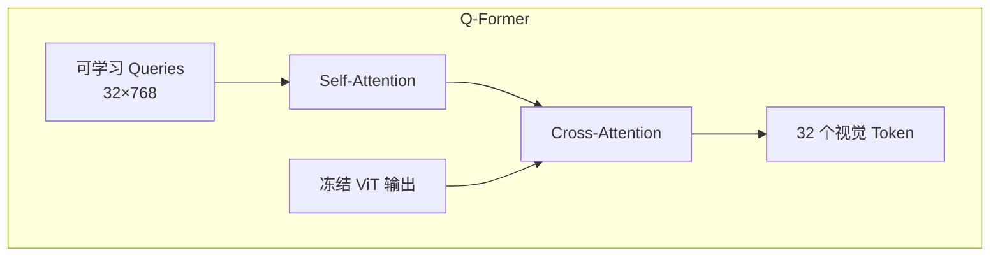

**核心机制**：

- 初始化 32 个可学习查询向量
- 通过 Cross-Attention 从海量视觉信息中"提炼"关键特征
- 起到"信息过滤器"作用，去除与文本无关的视觉噪声

#### 2.4.2 两阶段预训练策略

**阶段 1：视觉-语言表征学习**
- 损失：ITC（对比）+ ITG（生成）+ ITM（匹配）
- 关键：尚未连接 LLM

**阶段 2：视觉到语言的生成学习**
- Q-Former 输出的 Queries 通过线性投影转化为 **软提示（Soft Prompts）**
- 引导冻结的 LLM 生成文本

**性能与局限**
- 仅训练约 1/54 的参数量，在 VQAv2 上超过 Flamingo
- 但缺乏 **In-Context Learning** 能力

---

## 3. 原生多模态架构

传统"编码器-连接器-LLM"架构存在模态割裂问题，新一代模型探索更紧密的融合。

### 3.1 Fuyu-8B：纯 Decoder 架构

**革命性设计**：摒弃独立视觉编码器，直接用 Decoder-only Transformer 处理图像。

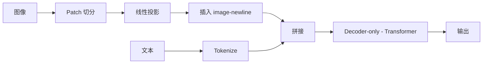

**image-newline 机制**：

- 每行 Patch 结束时插入特殊 Token
- 让模型像处理换行符一样理解图像二维结构
- 天然支持任意分辨率和宽高比

### 3.2 Qwen-VL：多阶段特征融合

**DeepStack 融合**：不仅使用 ViT 最后一层输出，还融合多层特征，同时捕获低层纹理和高层语义。

**三阶段训练**：

| 阶段 | 数据 | 策略 |
| :--- | :--- | :--- |
| **1. 预训练** | 海量弱监督图文 | 冻结 LLM，训练 Adapter |
| **2. 多任务微调** | 高质量 VQA/Caption | 解冻全模型 |
| **3. 指令微调** | 对话数据 | 优化指令遵循 |

---

## 4. 数据工程：多模态能力的基石

> **"Data is the new oil"** —— 数据质量直接决定模型上限。

### 4.1 LAION-5B 清洗流水线


**CLIP 过滤的双刃剑**：

- ✅ 保证图文相关性
- ❌ 引入 CLIP 固有偏见（无法识别的艺术风格被过滤）

### 4.2 ShareGPT4V：高质量 Caption 合成

**数据闭环策略**：

| 步骤 | 操作 | 规模 |
| :--- | :--- | :--- |
| **种子数据** | GPT-4V 生成详尽描述 | 10 万张 |
| **训练 Captioner** | 学习 GPT-4V 描述能力 | - |
| **大规模标注** | Captioner 重标注 | 120 万张 |

**Caption 质量提升**：从"人冲浪"升级为"图像捕捉到冲浪者骑在波浪上的惊险瞬间，冲浪者身穿黑色潜水服……"

### 4.3 AnyRes：动态分辨率处理

解决固定分辨率导致的高清细节丢失问题（LLaVA-NeXT）。

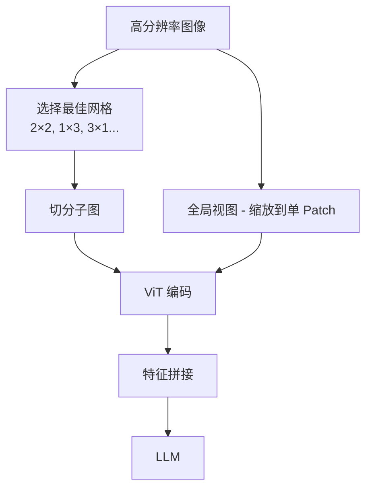

**意外收获**：零样本视频理解能力——视频可视为"动态分辨率"图像序列。

---

## 5. 生成式多模态：扩散模型革命

### 5.1 架构演进：从 U-Net 到 DiT

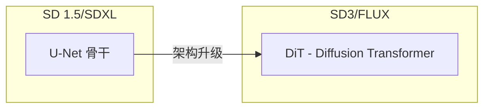

**Diffusion Transformer (DiT)**：

- 将 VAE 压缩后的 Latent 切分为 Patch
- 继承 Transformer 缩放律，质量随参数量对数线性提升
- 灵活处理不同分辨率和宽高比

**SD3 MMDiT**：

- 图像和文本模态独立权重参数
- 通过周期性 Joint Attention 交换信息
- Rectified Flow 使去噪轨迹更直，推理步数更少

### 5.2 精细控制：ControlNet

**零卷积（Zero Convolution）机制**：

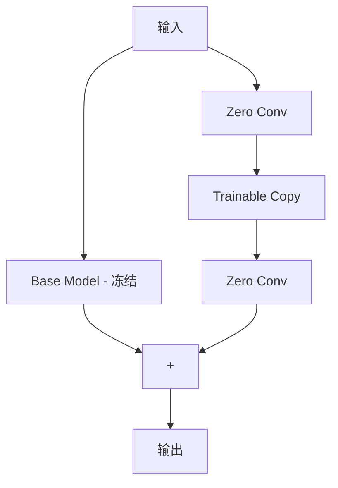

**设计哲学**："不伤害"原模型

- ZeroConv 初始化为全零
- 训练初期 ControlNet 输出为 0，行为与原模型一致
- 随训练进行，控制信号平滑注入

### 5.3 风格迁移：IP-Adapter

**解耦交叉注意力**：

| 流 | 输入 | Cross-Attention |
| :--- | :--- | :--- |
| **文本流** | CLIP 文本特征 | 原始 Cross-Attn |
| **图像流** | CLIP 图像特征 | 新增 Cross-Attn |

两者输出在加法层合并，仅需 22M 参数实现强大的风格/内容迁移。

### 5.4 ComfyUI：节点式工作流

**核心理念**：将生成管线解构为有向无环图（DAG）。

**数据类型**：

- `LATENT`：潜在空间数据
- `IMAGE`：像素级图像
- `CONDITIONING`：编码后的提示
- `MODEL`：模型权重

**执行逻辑**：从输出节点反向遍历，按需计算（Lazy Evaluation）。

---

## 6. OCR：从像素到文本的桥梁

### 6.1 OCR 技术全栈

**现代 OCR 系统工作流**

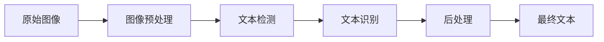

#### 6.1.1 图像预处理：从混沌到清晰

**噪声抑制**

| 方法 | 原理 | 适用场景 |
| :--- | :--- | :--- |
| **中值滤波** | 像素值替换为邻域中值 | 椒盐噪声 |
| **高斯滤波** | 加权平均平滑 | 高斯噪声 |
| **双边滤波** | 保边去噪 | 复杂纹理 |

**对比度增强：CLAHE**

```python
# 对比度受限的自适应直方图均衡化
import cv2
clahe = cv2.createCLAHE(clipLimit=2.0, tileGridSize=(8,8))
enhanced = clahe.apply(gray_image)
```

**CLAHE 机制**

1. 将图像划分为多个小矩形区域（tiles）
2. 在每个区域内独立进行直方图均衡化
3. 通过“裁剪限制”参数约束对比度放大程度

**几何校正**


- **传统方法**：圆柱体展开模型（依赖特定假设）
- **深度学习**：端到端预测像素级位移场

**二值化：Sauvola 自适应阈值**：

$$T(x,y) = m(x,y) \\left[1 + k\\left(\\frac{s(x,y)}{R} - 1\\right)\\right]$$

- $m(x,y)$：局部邻域灰度均值
- $s(x,y)$：局部标准差
- $k$：调节系数（通常 0.2-0.5）

#### 6.1.2 文本检测：定位文本区域

**深度学习主流方法**

| 方法 | 原理 | 优势 |
| :--- | :--- | :--- |
| **DB (Differentiable Binarization)** | 可微分二值化 | 任意形状文本 |
| **EAST** | 高效的场景文本检测 | 速度快 |
| **PSENet** | 渐进式尺度扩展 | 处理密集文本 |

**DB 算法流程**：

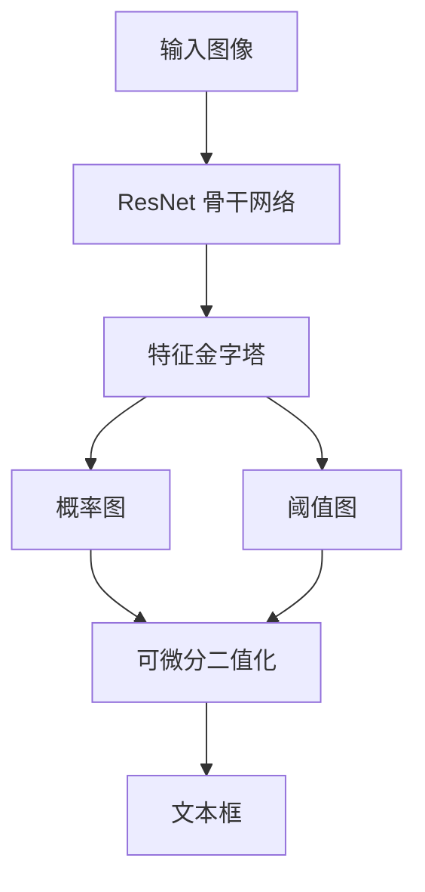

#### 6.1.3 文本识别：从像素到字符

**CRNN 架构（经典方案）**：

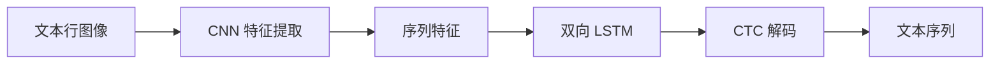

- **CNN**：提取视觉特征
- **RNN**：捕获上下文信息
- **CTC**：处理不定长序列对齐

**Diffusion Transformer OCR（新一代）**：

```python
# Vision Transformer for OCR（示意）
# Patch Embedding -> Transformer Encoder -> Text Decoder
```

**优势**：

- 全局注意力机制，更好捕获长距离依赖
- 并行计算，推理速度更快
- 适应多语言、手写体等复杂场景

### 6.2 主流 OCR 引擎对比

| 引擎 | 核心技术栈 | 优势 | 局限 |
| :--- | :--- | :--- | :--- |
| **Tesseract** | 基于规则 + LSTM | 开源历史悠久，支持 100+ 语言 | 复杂场景准确率低 |
| **PaddleOCR** | PP-OCRv4（深度学习） | 高精度、轻量化、产业级 | 需要一定算力 |
| **MionerU** | 原生 PDF 解析 + VLM | 保留排版、表格、公式结构 | 专注科学文献 |

**PaddleOCR PP-OCRv4 创新**：

- **检测**：DBNet + CML（协同互学习）
- **识别**：SVTR（Scene Text Recognition Transformer）
- **轻量化**：MobileNetV3 骨干网络，模型仅 3.5MB

### 6.3 从识别到理解：LayoutLM 与文档智能

$$	ext{Input} = 	ext{Text Emb} + 	ext{1D Pos Emb} + 	ext{2D Pos Emb} + 	ext{Image Emb}$$

- **文本嵌入**：语义信息
- **1D 位置嵌入**：序列顺序
- **2D 位置嵌入**：边界框坐标 $(x_0, y_0, x_1, y_1)$
- **图像嵌入**：视觉特征（字体、颜色）

**应用场景**：

- 表单理解与字段抽取
- 发票、合同等文档解析
- 多栏布局文档阅读顺序校正

---

## 6. 多模态 RAG 与智能体

### 7.1 文档预处理：多模态 RAG 的基石

传统 RAG 对 PDF 仅做 OCR，易丢失排版、图表等关键信息；多模态 RAG 需要保留布局、表格与公式结构。

#### 7.1.1 文档布局分析 (DLA)
- 核心：布局既是视觉呈现，也是语义层次载体。
- Transformer 路线：LayoutLM 系列（v1/v2/v3、LayoutLLM）通过文本嵌入 + 1D/2D 位置 + 图像嵌入建模。
- GNN 路线：将段落、表格、标题作为节点，邻接/包含关系作为边，显式建模空间拓扑。

#### 7.1.2 复杂表格识别
- 挑战：合并单元格、无边框表格、多行表头。
- 流程：检测表格框 → 结构识别网格线 → 单元格定位 row_span/col_span → OCR → 输出 HTML/DataFrame。
- 工具：`img2table`、`Camelot`、`DeepDeSRT`。

#### 7.1.3 数学与化学公式识别
- 特点：二维结构（上下标、分数线、根号）。
- Image-to-LaTeX 流程：CNN/ViT 编码 → 注意力解码 → 生成 LaTeX 序列。
- 模型：Pix2Tex、LaTeX-OCR、Mathpix。输出格式：LaTeX / MathML / ASCII Math。

#### 7.1.4 图像与图表理解
- 使用 VLM（如 BLIP-2）生成初步描述，再结合 RAG 注入领域知识，形成更准确的专业说明。
- 适用于图表摘要、科研插图解释、产品评价总结等场景。

#### 7.1.5 逻辑阅读顺序检测
- 问题：多栏、嵌入图表会打乱阅读顺序。
- 方法：规则（XY-Cut）、深度学习（GCN）、混合策略；逐步确定正确的阅读路径。

### 6.1 ColPali：视觉 RAG

传统 RAG 对 PDF 需要 OCR，丢失排版和图表信息。

**ColPali 方案**：

- VLM 直接编码文档页面图像
- 保留多个 Patch 的嵌入向量（Multi-vector）
- MaxSim 检索：$S(q, d) = \sum_{i \in q} \max_{j \in d} (q_i \cdot d_j)$

**优势**：

- 精确定位图表、标题或特定段落
- "所见即所得" 的检索体验
- 无需复杂的 OCR + 布局分析流水线

### 6.2 RT-2：具身智能

**动作 Token 化**：将机器人动作离散化为语言 Token。

```mermaid
flowchart LR
    IMG[视觉观察] --> VLM[VLM Backbone]
    CMD[语言指令] --> VLM
    VLM --> ACT[动作 Token - "128, 55, terminate"]
    ACT --> ROBOT[机器人执行]
```

**涌现能力**：指令"把灭绝的动物捡起来"→ 机器人利用 VLM 知识识别恐龙玩具并抓取。

---

## 8. OpenAI 多模态 API：生产级应用

### 8.1 Responses API：下一代智能体API

**核心创新**：统一的智能体接口，支持视觉、音频、工具调用、结构化输出。

#### 8.1.1 原生多模态视觉输入

**支持三种图像输入方式**：

```python
# 方式1: URL
{"type": "image_url", "image_url": {"url": "https://example.com/image.jpg"}}

# 方式2: Base64 编码
{"type": "image_url", "image_url": {"url": "data:image/jpeg;base64,..."}}

# 方式3: 文件 ID（上传后引用）
{"type": "image_url", "image_url": {"url": "file-abc123"}}
```

**`detail` 参数控制分辨率**：

| 参数 | 效果 | Token 消耗 |
| :--- | :--- | :--- |
| `low` | 低分辨率快速处理 | 65 tokens |
| `high` | 高分辨率细粒度理解 | 最多 2000 tokens |
| `auto` | 自动选择（默认） | 动态 |

**限制**：

- 单张图像最大 50MB
- 单次请求最多 500 张图像
- 支持格式：PNG、JPG、WEBP、GIF（非动画）

#### 8.1.2 图像生成

**DALL·E 3 / GPT-Image-1**：

```python
{
  "size": "1024x1024",  # 1024x1024, 1792x1024, 1024x1792
  "quality": "hd",       # standard, hd
  "style": "vivid"       # vivid, natural
}
```

- **quality**：`standard`（快速）vs `hd`（高清细节）
- **style**：`vivid`（生动夸张）vs `natural`（自然写实）

#### 8.1.3 音频处理

**语音转文本（STT）**

| 模型 | 特点 | 说明 |
| :--- | :--- | :--- |
| `gpt-4o-transcribe` | 高精度通用转录 |
| `gpt-4o-transcribe-diarize` | 支持说话人分离（Diarization） |
| `whisper-1` | 经典 Whisper 模型 |

```python
from openai import OpenAI
client = OpenAI()
audio = open("/path/to/audio.mp3", "rb")
result = client.audio.transcriptions.create(
    model="gpt-4o-transcribe-diarize",
    file=audio
)
```

**文本转语音（TTS）**

```javascript
const mp3 = await openai.audio.speech.create({
  model: "gpt-4o-mini-tts",
  voice: "coral",  // alloy, ash, ballad, coral, echo, fable...
  input: "Hello, world!",
  instructions: "Speak in a cheerful and positive tone."
});
```

- **可选声线**：alloy、ash、ballad、coral、echo、fable、nova、onyx、sage、shimmer
- **自定义指令**：控制语调、情感、语速等

#### 8.1.4 工具调用与结构化输出

**三步函数调用**：

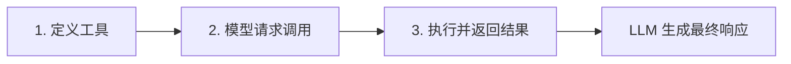

**结构化输出（JSON Schema）**：

```python
{
  "format": {
    "type": "json_schema",
    "schema": {
      "type": "object",
      "properties": {
        "title": {"type": "string"},
        "authors": {"type": "array", "items": {"type": "string"}},
        "abstract": {"type": "string"}
      },
      "required": ["title", "authors"],
      "additionalProperties": false
    },
    "strict": true
  }
}
```

**内置工具支持**：

- `web_search_preview`：网页搜索（预览）
- `code_interpreter`：代码执行
- `file_search`：文件检索
- `computer_use`：计算机操作

### 8.2 Realtime API：低延迟语音交互

**WebSocket 架构**：

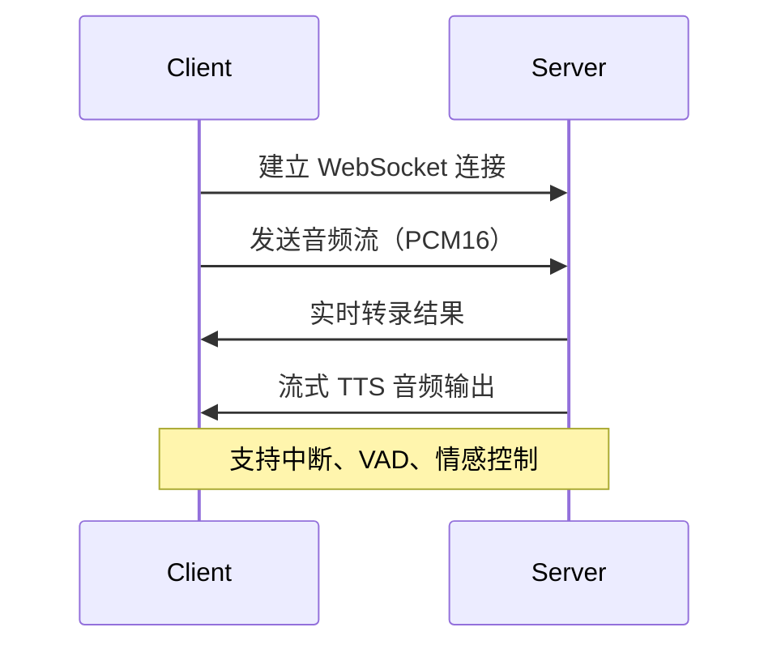

**核心特性**：

- **超低延迟**：端到端 < 500ms
- **VAD（语音活动检测）**：自动检测说话开始/结束
- **中断处理**：用户打断时平滑切换
- **情感控制**：实时调整语调、情绪

---

## 9. 前沿统一架构

### 9.1 Show-o：理解与生成统一

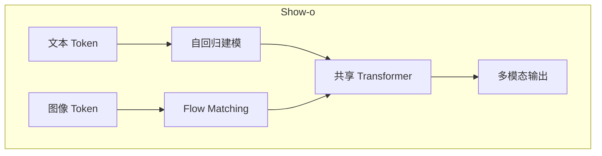

**创新点**：

- 自回归处理文本，继承推理能力
- Flow Matching 处理图像，高质量生成
- 单一权重同时处理理解和生成

### 9.2 Uni-MoE：统一混合专家

**渐进式训练**：

1. 跨模态对齐（统一特征空间）
2. 特定模态专家训练
3. LoRA 统一微调

**效果**：减少多模态干扰，提升泛化能力。

### 9.3 RingAttention：超长上下文

**Blockwise Parallelism**：

- 长序列切分为块，分配给不同 GPU
- KV 块在设备环之间流转
- 理论支持 1M+ Token 上下文

---

## 8. 推理优化与评测

### 10.1 高性能推理

| 方案 | 核心技术 | 加速比 |
| :--- | :--- | :--- |
| **vLLM** | PagedAttention，显存零浪费 | 2-4× |
| **TensorRT-LLM** | 层融合、FP8 量化 | 2× |

### 10.2 评测基准

| 基准 | 评测维度 | 特点 |
| :--- | :--- | :--- |
| **MMBench** | 综合能力 | CircularEval 消除位置偏见 |
| **HallusionBench** | 幻觉检测 | 视觉欺骗、几何错觉 |
| **MMMU** | 多学科推理 | 大学水平专业知识 |

---

## 📚 学习路线

<div class="learning-path">
  <div class="path-step step-1">
    <div class="step-num">1</div>
    <div class="step-title">理解基础</div>
    <ul>
      <li>ViT 与 CLIP 原理</li>
      <li>模态连接器设计</li>
      <li>LLaVA 架构实践</li>
    </ul>
  </div>
  <div class="path-arrow">→</div>
  <div class="path-step step-2">
    <div class="step-num">2</div>
    <div class="step-title">生成模型</div>
    <ul>
      <li>扩散模型原理</li>
      <li>SD3/DiT 架构</li>
      <li>ControlNet/IP-Adapter</li>
    </ul>
  </div>
  <div class="path-arrow">→</div>
  <div class="path-step step-3">
    <div class="step-num">3</div>
    <div class="step-title">前沿应用</div>
    <ul>
      <li>多模态 RAG</li>
      <li>统一架构 (Show-o)</li>
      <li>具身智能 (VLA)</li>
    </ul>
  </div>
</div>

---

## 🔗 核心资源

### 代表模型

| 模型 | 类型 | 链接 |
| :--- | :--- | :--- |
| **LLaVA** | 视觉理解 | [llava-vl.github.io](https://llava-vl.github.io/) |
| **CLIP** | 视觉-语言对齐 | [openai.com/research/clip](https://openai.com/research/clip) |
| **Stable Diffusion 3** | 图像生成 | [stability.ai](https://stability.ai/) |
| **Qwen-VL** | 原生多模态 | [github.com/QwenLM/Qwen-VL](https://github.com/QwenLM/Qwen-VL) |

### 重要论文

| 论文 | 主题 |
| :--- | :--- |
| [An Image is Worth 16x16 Words (ViT)](https://arxiv.org/abs/2010.11929) | Vision Transformer |
| [Learning Transferable Visual Models (CLIP)](https://arxiv.org/abs/2103.00020) | 对比学习 |
| [Visual Instruction Tuning (LLaVA)](https://arxiv.org/abs/2304.08485) | 视觉指令微调 |
| [BLIP-2](https://arxiv.org/abs/2301.12597) | Q-Former 架构 |
| [Scaling Rectified Flow (SD3)](https://arxiv.org/abs/2403.03206) | MMDiT |
| [Adding Conditional Control (ControlNet)](https://arxiv.org/abs/2302.05543) | 精细控制 |

### 工具框架

| 工具 | 用途 |
| :--- | :--- |
| [ComfyUI](https://github.com/comfyanonymous/ComfyUI) | 节点式生成工作流 |
| [Transformers](https://huggingface.co/docs/transformers) | 模型加载与推理 |
| [diffusers](https://huggingface.co/docs/diffusers) | 扩散模型库 |

---

## 📝 相关博客文章

### 核心能力矩阵

| 文章 | 主题 |
| :--- | :--- |
| [视觉与语言的深度融合：从对比学习到多模态生成范式的技术演进全景报告](https://dd-ff.blog.csdn.net/article/details/155029719) | 多模态技术演进全景 |
| [关于OpenAI CLIP的综合技术报告：架构、对比预训练与多模态影响](https://dd-ff.blorg.csdn.net/article/details/2301538774597) | CLIP 架构与对比学习 |
| [多感官AI的黎明：多模态大模型综合指南](https://dd-ff.blog.csdn.net/article/details/153827638) | 多模态大模型综合指南 |
| [超越文本：深入剖析多模态AI的架构原理](https://dd-ff.blorg.csdn.net/article/details/2301.1250956816) | 多模态架构原理剖析 |
| [从像素到篇章：深入剖析光学字符识别（OCR）的技术原理](https://dd-ff.blog.csdn.net/article/details/150947985) | OCR 与视觉编码 |

### 6. 多模态 API 与应用

| 文章 | 主题 |
| :--- | :--- |
| [OpenAI Realtime API 权威技术指南：从 \"Hello\" 到生产级语音代理](https://dd-ff.blorg.csdn.net/article/details/154490186) | 多模态语音 API |
| [Responses API——OpenAI 下一代智能体与多模态 API 完整开发者指南](https://dd-ff.blog.csdn.net/article/details/154444088) | 多模态智能体 API |
| [超越纯文本：解锁高级RAG中复杂文档预处理的艺术](https://dd-ff.blog.csdn.net/article/details/152045489) | 多模态 RAG 文档处理 |
| [AutoGen AgentChat智能体指南：从工具调用到多模态交互的全能助手](https://dd-ff.blog.csdn.net/article/details/149062503) | 多模态智能体交互 |
| [AutoGen AgentChat消息系统：构建智能体交互的通信枢纽](https://dd-ff.blog.csdn.net/article/details/149062184) | 智能体多模态消息枢纽 |

### 计算机视觉基础

| 文章 | 主题 |
| :--- | :--- |
| [计算机视觉——飞桨深度学习实战：图像分类算法原理与实战](https://dd-ff.blog.csdn.net/article/details/133513426) | 图像分类算法 |
| [计算机视觉——飞桨深度学习实战：深度学习网络模型](https://dd-ff.blog.csdn.net/article/details/133490586) | 视觉网络模型 |
| [计算机视觉——飞桨深度学习实战：起始篇](https://dd-ff.blog.csdn.net/article/details/133489869) | 深度学习入门 |

---

> **技术趋势**：架构统一化、上下文长程化、部署高效化。多模态大模型将不仅能"看"和"说"，更能深入物理世界进行"行动"。
