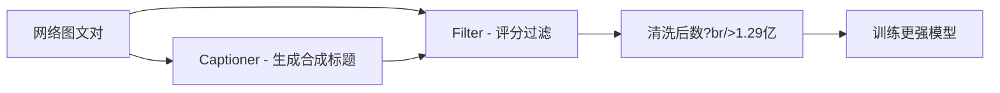
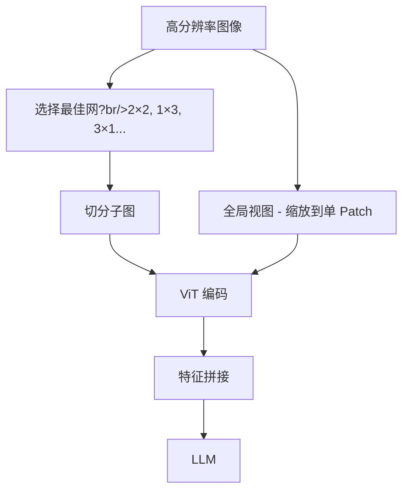
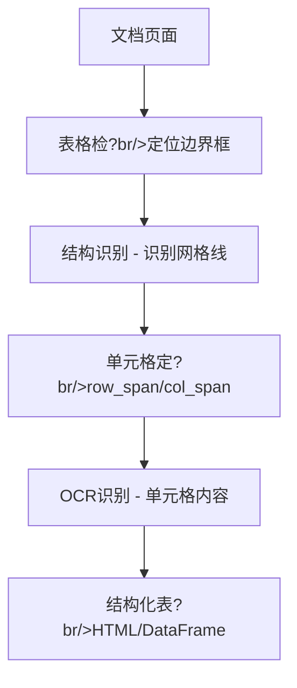

# 多模态大模型全景

> 人工智能正经历从单一模态向多模态融合的深刻范式转移?*多模态大模型（MLLMs?* 通过整合视觉、语言、音频等信息源，正在重塑通用人工智能的技术路径?

---

## 技术全景图

```mermaid
flowchart TB
    subgraph 输入模?
        I1[图像]
        I2[文本]
        I3[音频]
        I4[视频]
    end
    
    subgraph 编码?
        E1[Vision Encoder (ViT/CLIP)]
        E2[Text Encoder]
        E3[Audio Encoder]
    end
    
    subgraph 融合?
        C[模态连接器 - Linear/Q-Former]
    end
    
    subgraph 推理?
        L[大语言模型 - LLM Backbone]
    end
    
    subgraph 输出
        O1[文本生成]
        O2[图像生成]
        O3[动作执行]
    end
    
    I1 --> E1
    I2 --> E2
    I3 --> E3
    I4 --> E1
    E1 --> C
    E2 --> L
    E3 --> C
    C --> L
    L --> O1
    L --> O2
    L --> O3
```

### 核心能力矩阵

| 能力?| 代表模型 | 技术特?|
| :--- | :--- | :--- |
| **视觉理解** | GPT-4V, LLaVA, Qwen-VL | 图像描述、VQA、OCR |
| **图像生成** | DALL-E 3, SD3, Midjourney | 文生图、图生图、风格迁?|
| **视频理解** | Video-LLaVA, Gemini | 长视频问答、时序推?|
| **具身智能** | RT-2, PaLM-E | 视觉-语言-动作 (VLA) |
| **统一模型** | Show-o, MMaDA | 理解+生成一体化 |

---

## 1. 视觉编码：从像素到语?

视觉编码器是多模态模型的"眼睛"，将连续像素转化为结构化特征向量?

### 1.1 Vision Transformer (ViT)

ViT 摒弃传统卷积，直接将图像视为一系列 **Patch 序列**?

```mermaid
flowchart LR
    IMG[输入图像 (24×224] --> PATCH[切分 Patch (6×16 × 196个]
    PATCH --> PROJ[线性投?br/>768维]
    PROJ --> POS[+ 位置编码]
    POS --> CLS[+ CLS Token]
    CLS --> TF[Transformer - Encoder ×12]
    TF --> OUT[图像特征]
```

**Patch Embedding 过程**?

$$\mathbf{z}_0 = [\mathbf{x}_{cls}; \mathbf{x}_p^1\mathbf{E}; \mathbf{x}_p^2\mathbf{E}; \cdots; \mathbf{x}_p^N\mathbf{E}] + \mathbf{E}_{pos}$$

- 输入图像 $224 \times 224$ ?切分?$14 \times 14 = 196$ ?Patch
- 每个 Patch $(16 \times 16 \times 3 = 768)$ 通过线性投影映射到嵌入空间
- 添加可学习的位置编码，赋予空间感知能?

**位置编码演进**?

| 方案 | 特点 | 适用场景 |
| :--- | :--- | :--- |
| **可学习位置编?* | 训练时学习，固定分辨?| 标准 ViT |
| **RoPE 2D** | 旋转位置编码扩展到二?| 可变分辨?|
| **缩放平均位置嵌入** | 编码相对感受野大?| 多尺度输?|

### 1.2 CLIP：视?语言对齐的基?

**CLIP (Contrastive Language-Image Pre-training)** 彻底改变了计算机视觉训练范式，从传统?预定义类别监?转向"自然语言监督"?

#### 1.2.1 双编码器架构

**核心组件**?

| 组件 | 实现方案 | 特点 |
| :--- | :--- | :--- |
| **图像编码?* | ResNet-50（注意力池化? ViT | 提取视觉特征向量 |
| **文本编码?* | 12?Transformer | 序列包裹?`[SOS]` ?`[EOS]` 标记 |
| **投影?* | 线性层 | 映射到共享嵌入空?|

**嵌入空间对齐**：两路编码器将图像和文本映射到同一语义空间，语义相关的样本在空间中彼此靠近?

#### 1.2.2 对比学习损失函数

**对称交叉熵损?*（图像→文本 + 文本→图像）?

$$\mathcal{L} = \frac{1}{2} (\mathcal{L}_{I \to T} + \mathcal{L}_{T \to I})$$

图像到文本的损失?

$$\mathcal{L}_{I \to T} = -\frac{1}{N} \sum_{i=1}^{N} \log \frac{\exp(\langle v_i, w_i \rangle / \tau)}{\sum_{j=1}^N \exp(\langle v_i, w_j \rangle / \tau)}$$

**温度系数 $\tau$ 的奥?*?

- CLIP ?$\tau$ 参数化为 $e^{-\tau'}$ 并作?*可学习标?*
- **作用**：动态调?logits 分布的尖锐程?
- **优势**：防止大规模训练中的梯度消失/爆炸，确保稳定?

#### 1.2.3 零样本迁移机?

**提示工程（Prompt Engineering?*?

```python
# 单模?
prompt = f"A photo of a {label}."

# 多模板集成（显著提升准确率）
templates = [
    "A photo of a {}.",
    "A rendering of a {}.",
    "A cropped photo of the {}."
]
```

**分类流程**?

1. 将候选类别填入模板生成文?
2. 计算图像嵌入与所有类别文本嵌入的余弦相似?
3. Softmax 归一化得到分类概?

**性能数据**?

- ImageNet 零样本准确率?*76.2%**
- 分布外数据（ImageNet-Rendition 等）鲁棒性差距极?

#### 1.2.4 训练数据与规?

**数据?*：从互联网收集的 **4 亿图文对**

- **特点**：噪声数据、完整句子描述（非单一标签?
- **偏见问题**：数据偏向发达国家、年轻、男性用?

#### 1.2.5 CLIP 的局限?

| 局?| 表现 |
| :--- | :--- |
| **无生成能?* | 不能生成 Caption 或回答开放问?|
| **细粒度推理弱** | 计数、空间关系判断能力差 |
| **抽象符号?* | MNIST 等符号识别任务不如人?|
| **数据偏见** | ?Fairface 数据集上表现出性别/种族偏见 |

<div class="compare-box">
  <div class="compare-item">
    <div class="compare-title">传统分类模型</div>
    <p class="compare-desc">固定类别标签 - 无法泛化到新类别 - 需要大量标注数?</p>
  </div>
  <div class="compare-vs">VS</div>
  <div class="compare-item highlight">
    <div class="compare-title">CLIP 对比学习</div>
    <p class="compare-desc">开放词汇识?br/>强大?Zero-shot 能力 - 自然语言作为监督信号</p>
  </div>
</div>

#### 1.2.6对比学习的演?

**ALIGN（Google?*：规模暴?

- 数据策略?8 亿对**未清?* Raw Alt-text 数据
- 结论：规模足够大时，噪声数据也能学到 SOTA 表征

**SigLIP**：损失函数革?

- 问题：Softmax 在分布式训练中需要全局通信（All-Reduce?
- 方案：基?Sigmoid 的损失函?

$$\mathcal{L} = - \frac{1}{N} \sum_{i,j} \log \sigma (z_{ij} \cdot (-1)^{t_{ij}})$$

- 优势：消除全局通信，支持极?Batch Size?2k+?

**CoCa（Contrastive Captioners?*：理?生成统一

- **解耦解码器**设计?
  - 单模态文本层：对比学?
  - 多模态文本层：Cross-Attention 接入图像，生?Caption
- 效果：ImageNet 零样本准确率 **86.3%**

---

## 2. 模态连接器：LLM 与视觉的桥梁

连接器负责将视觉特征适配?LLM 输入空间，设计直接影响参数效率和理解深度?

### 2.1 架构对比

| 特?| LLaVA (Linear) | BLIP-2 (Q-Former) |
| :--- | :--- | :--- |
| **核心机制** | 两层 MLP 投影 | Transformer 查询转换?|
| **Token 数量** | 取决?Patch 数（?576?| 固定数量（如 32?|
| **信息保留** | 保留完整视觉细节 | 压缩提取关键特征 |
| **训练复杂?* | 低，仅训练投影层 | 高，需两阶段预训练 |
| **优势场景** | OCR、细粒度识别 | 高效推理、显存受?|

### 2.2 LLaVA：极简主义哲学

#### 2.2.1 线性投影架?

```mermaid
flowchart LR
    V[CLIP ViT 输出 (76×1024] --> MLP1[Linear Layer]
    MLP1 --> ACT[GELU]
    ACT --> MLP2[Linear Layer]
    MLP2 --> OUT[LLM 词嵌入维?br/>576×4096]
```

**设计洞察**?

- 强大?LLM 只需简单映射即可理解视觉特?
- 保留**完整视觉信息**?76 ?Token?
- 代价：Token 数量随分辨率平方增长

#### 2.2.2 视觉指令微调（Visual Instruction Tuning?

**数据生成策略**：利?GPT-4（纯文本）基?COCO Caption ?Bounding Box 生成复杂多轮对话

**两阶段训?*?

| 阶段 | 数据 | 参数更新 | 目标 |
| :--- | :--- | :--- | :--- |
| **特征对齐** | 简单图文对 | 仅投影层 | 视觉-文本基础对齐 |
| **端到端微?* | 158k 高质量指?| 投影?+ LLM | 赋予"助手"能力 |

**架构组件**?

- 视觉编码器：CLIP ViT-L/14?*冻结**?
- LLM：Vicuna（基?LLaMA?
- 连接器：**两层 MLP**

### 2.3 BLIP：引导语言-图像预训?

**BLIP (Bootstrapping Language-Image Pre-training)** 致力于解?理解与生?的统一?

#### 2.3.1 MED 架构：灵活的多任务处理中?

**MED (Multimodal Mixture of Encoder-Decoder)** 通过权重共享?Attention Mask 控制，在三种模式下运行：


**三种模式细节**?

| 模式 | 训练目标 | 核心机制 |
| :--- | :--- | :--- |
| **单模态编码器** | ITC（对比损失） | 学习全局检索表?|
| **图像引导文本编码?* | ITM（二分类?| 难负样本挖掘，区分细微差?|
| **图像引导文本解码?* | LM（语言建模?| 赋予自然语言描述能力 |

#### 2.3.2 CapFilt：数据质量的"自举"革命

BLIP 利用模型自身清洗网络噪声数据?



**效果对比**?

- 1.29 亿清洗后数据 > 1.8 亿原始数?
- Caption 质量?人冲?升级?图像捕捉到冲浪者骑在波浪上的惊险瞬间…?

### 2.4 BLIP-2：冻结大模型时代的计算美?

#### 2.4.1 Q-Former：瓶颈架?

**设计理念**：冻结预训练好的视觉编码器和 LLM，仅训练轻量级中间件?

```mermaid
flowchart TB
    subgraph Q-Former
        Q[可学?Queries (2×768] --> SA[Self-Attention]
        SA --> CA[Cross-Attention]
        IMG[冻结 ViT 输出] --> CA
        CA --> OUT[32 个视?Token]
    end
```

**核心机制**?

- 初始?32 个可学习查询向量
- 通过 Cross-Attention 从海量视觉信息中"提炼"关键特征
- 起到"信息过滤?作用，去除与文本无关的视觉噪?

```mermaid
flowchart TB
    subgraph Q-Former
        Q[可学?Queries (2×768] --> SA[Self-Attention]
        SA --> CA[Cross-Attention]
        IMG[冻结 ViT 输出 (57×768] --> CA
        CA --> OUT[32 个视?Token]
    end
    OUT --> PROJ[线性投影]
    PROJ --> LLM[冻结 LLM - 软提示]
```

**核心机制**?

- 初始?**32 个可学习查询向量**
- 通过 Cross-Attention 从海量视觉信息中"提炼"关键特征
- 起到"信息过滤?作用，去除与文本无关的视觉噪?

#### 2.4.2 两阶段预训练策略

**阶段1：视?语言表征学习**

- 目标：训?Q-Former 提取视觉特征
- 损失：ITC（对比）+ ITG（生成）+ ITM（匹配）
- **关键**：尚未连?LLM

**阶段2：视觉到语言的生成学?*

- Q-Former 输出?Queries 通过**线性投?*转化?**软提示（Soft Prompts?*
- 引导冻结?LLM 生成文本

**性能与局?*?

- ??**1/54 参数?*?VQAv2 上超?Flamingo
- ?缺乏**上下文学习（In-Context Learning?*能力

---

## 3. 原生多模态架?

传统"编码?连接?LLM"架构存在模态割裂问题，新一代模型探索更紧密的融合?

### 3.1 Fuyu-8B：纯 Decoder 架构

**革命性设?*：摒弃独立视觉编码器，直接用 Decoder-only Transformer 处理图像?


**image-newline 机制**?

- 每行 Patch 结束时插入特?Token
- 让模型像处理换行符一样理解图像二维结?
- 天然支持任意分辨率和宽高?

### 3.2 Qwen-VL：多阶段特征融合

**DeepStack 融合**：不仅使?ViT 最后一层输出，还融合多层特征，同时捕获低层纹理和高层语义?

**三阶段训?*?

| 阶段 | 数据 | 策略 |
| :--- | :--- | :--- |
| **1. 预训?* | 海量弱监督图?| 冻结 LLM，训?Adapter |
| **2. 多任务微?* | 高质?VQA/Caption | 解冻全模?|
| **3. 指令微调** | 对话数据 | 优化指令遵循 |

---

## 4. 数据工程：多模态能力的基石

> **"Data is the new oil"** —?数据质量直接决定模型上限?

### 4.1 LAION-5B 清洗流水?


**CLIP 过滤的双刃剑**?

- ?保证图文相关?
- ?引入 CLIP 固有偏见（无法识别的艺术风格被过滤）

### 4.2 ShareGPT4V：高质量 Caption 合成

**数据闭环策略**?

| 步骤 | 操作 | 规模 |
| :--- | :--- | :--- |
| **种子数据** | GPT-4V 生成详尽描述 | 10 万张 |
| **训练 Captioner** | 学习 GPT-4V 描述能力 | - |
| **大规模标?* | Captioner 重标?| 120 万张 |

**Caption 质量提升**：从"人冲?升级?图像捕捉到冲浪者骑在波浪上的惊险瞬间，冲浪者身穿黑色潜水服…?

### 4.3 AnyRes：动态分辨率处理

解决固定分辨率导致的高清细节丢失问题（LLaVA-NeXT）?



**意外收获**：零样本视频理解能力——视频可视为"动态分辨率"图像序列?

---

## 5. 生成式多模态：扩散模型革命

### 5.1 架构演进：从 U-Net ?DiT


**Diffusion Transformer (DiT)**?

- ?VAE 压缩后的 Latent 切分?Patch
- 继承 Transformer 缩放律，质量随参数量对数线性提?
- 灵活处理不同分辨率和宽高?

**SD3 MMDiT**?

- 图像和文本模态独立权重参?
- 通过周期?Joint Attention 交换信息
- Rectified Flow 使去噪轨迹更直，推理步数更少

### 5.2 精细控制：ControlNet

**零卷积（Zero Convolution）机?*?


**设计哲学**?不伤?原模?

- ZeroConv 初始化为全零
- 训练初期 ControlNet 输出?0，行为与原模型一?
- 随训练进行，控制信号平滑注入

### 5.3 风格迁移：IP-Adapter

**解耦交叉注意力**?

| ?| 输入 | Cross-Attention |
| :--- | :--- | :--- |
| **文本?* | CLIP 文本特征 | 原始 Cross-Attn |
| **图像?* | CLIP 图像特征 | 新增 Cross-Attn |

两者输出在加法层合并，仅需 22M 参数实现强大的风?内容迁移?

### 5.4 ComfyUI：节点式工作?

**核心理念**：将生成管线解构为有向无环图（DAG）?

**数据类型**?

- `LATENT`：潜在空间数?
- `IMAGE`：像素级图像
- `CONDITIONING`：编码后的提?
- `MODEL`：模型权?

**执行逻辑**：从输出节点反向遍历，按需计算（Lazy Evaluation）?

---

## 6. OCR：从像素到文本的桥梁

### 6.1 OCR 技术全栈解?

**现代 OCR 系统工作?*?


#### 6.1.1 图像预处理：从混沌中锻造清?

**噪声抑制**?

| 方法 | 原理 | 适用场景 |
| :--- | :--- | :--- |
| **中值滤?* | 像素值替换为邻域中位?| 椒盐噪声 |
| **高斯滤波** | 加权平均平滑 | 高斯噪声 |
| **双边滤波** | 保边去噪 | 复杂纹理 |

**对比度增强：CLAHE**

```python
# 对比度受限的自适应直方图均衡化
import cv2
clahe = cv2.createCLAHE(clipLimit=2.0, tileGridSize=(8,8))
enhanced = clahe.apply(gray_image)
```

**CLAHE 机制**?

1. 将图像划分为多个小矩形区域（tiles?
2. 在每个区域内独立进行直方图均衡化
3. 通过"裁剪限制"参数约束对比度放大程?

**几何校正**?


- **传统方法**：圆柱体展开模型（依赖特定假设）
- **深度学习**：端到端预测像素级位移场

**二值化：Sauvola 自适应阈?*

$$T(x,y) = m(x,y) \\left[1 + k\\left(\\frac{s(x,y)}{R} - 1\\right)\\right]$$

- $m(x,y)$：局部邻域灰度均?
- $s(x,y)$：局部标准差
- $k$：调节系数（通常 0.2-0.5?

#### 6.1.2 文本检测：定位文本区域

**深度学习主流方法**?

| 方法 | 原理 | 优势 |
| :--- | :--- | :--- |
| **DB (Differentiable Binarization)** | 可微分二值化 | 任意形状文本 |
| **EAST** | 高效准确场景文本检?| 速度?|
| **PSENet** | 渐进式尺度扩展网?| 处理密集文本 |

**DB 算法流程**?


#### 6.1.3 文本识别：从图像到字?

**CRNN 架构（经典方案）**?


- **CNN**：提取视觉特?
- **RNN**：捕获上下文信息
- **CTC**：处理不定长序列对齐

**Transformer OCR（新一代）**?

```python
# Vision Transformer for OCR
ViT ?Patch Embedding ?Transformer Encoder ?Text Decoder
```

**优势**?

- 全局注意力机制，更好捕获长距离依?
- 并行计算，推理速度更快
- 适应多语言、手写体等复杂场?

### 6.2 主流 OCR 引擎对比

| 引擎 | 技术栈 | 优势 | 局?|
| :--- | :--- | :--- | :--- |
| **Tesseract** | 基于规则+LSTM | 开源历史悠久、支?00+语言 | 复杂场景准确率低 |
| **PaddleOCR** | PP-OCRv4（深度学习） | 高精度、轻量化、产业级 | 需要一定算?|
| **MinerU** | PDF原生解析+VLM | 保留排版、表格、公式结?| 专注科学文献 |

**PaddleOCR PP-OCRv4 创新**?

- **检?*：DBNet + CML（协同互学习?
- **识别**：SVTR（Scene Text Recognition Transformer?
- **轻量?*：MobileNetV3 骨干网络，模型仅 3.5MB

### 6.3 从识别到理解：LayoutLM 与文档智?

**LayoutLM 多模态嵌?*?

$$\\text{Input} = \\text{Text Emb} + \\text{1D Pos Emb} + \\text{2D Pos Emb} + \\text{Image Emb}$$

- **文本嵌入**：语义信?
- **1D 位置嵌入**：序列顺?
- **2D 位置嵌入**：边界框坐标 $(x_0, y_0, x_1, y_1)$
- **图像嵌入**：视觉特征（字体、颜色）

**应用场景**?

- 表单理解与字段抽?
- 发票、合同等文档解析
- 多栏布局文档阅读顺序检?

---

## 7. 多模?RAG 与智能体

### 7.1 文档预处理：多模?RAG 的基?

传统 RAG ?PDF ?OCR 处理会丢失排版、图表等关键信息?*文档智能预处?*是多模?RAG 的突破口?

#### 7.1.1 文档布局分析 (DLA)

**核心原理**：布局不仅是视觉呈?更是语义层次的载体?

##### Transformer 方法：LayoutLM 及其后继?

**LayoutLM 多模态嵌?*（已在第6.3节详述）?


**演进谱系**?

- **LayoutLMv2**：引入空间感知的自注意力机制
- **LayoutLMv3**：统一文本和图像的预训?
- **LayoutLLM**：结?LLM 实现多任务文档理?

##### 图神经网?(GNN) 方法

**核心思想**：将文档页面表示为图，元素为节点，关系为边?


**优势**?

- 显式建模空间关系（相邻、包含、层级）
- 对混乱布局（倾斜、手写）鲁棒性强
- 计算效率?

#### 7.1.2 复杂表格识别与解?

**核心挑战**：维护行列关?尤其?*合并单元?*?

**深度学习方法**?



**关键能力**?

- 明确识别**合并单元?*（row_span/col_span 属性）
- 处理**无边框表?*（通过对齐线索推断?
- 支持**多行表头**（层次化表头结构?

**工具推荐**?

- `img2table`：OpenCV 检?+ ?OCR 后端
- `Camelot`：PDF 表格抽取
- `DeepDeSRT`：Transformer 直接输出结构化表?

#### 7.1.3 数学与化学公式识?

**二维语言特?*：公式具有复杂的空间结构（上下标、分数线、根号）?

**Image-to-Sequence 翻译**?


**主流模型**?

- **Pix2Tex**：Transformer + CTC
- **LaTeX-OCR**：Vision Encoder + Text Decoder
- **Mathpix**：商用高精度方案

**输出格式**：LaTeX、MathML、ASCII Math

#### 7.1.4 图像与图表分?

**利用视觉语言模型 (VLM)**?

```python
from transformers import Blip2Processor, Blip2ForConditionalGeneration

# 使用 BLIP-2 描述图表
processor = Blip2Processor.from_pretrained("Salesforce/blip2-opt-2.7b")
model = Blip2ForConditionalGeneration.from_pretrained("Salesforce/blip2-opt-2.7b")

question = "What does this chart show?"
inputs = processor(chart_image, question, return_tensors="pt")
out = model.generate(**inputs)
caption = processor.decode(out[0], skip_special_tokens=True)
```

**RAG 增强的图像描?*?

```mermaid
flowchart LR
    IMG[图表] --> VLM[VLM - 初步描述]
    VLM --> RAG[RAG检?br/>领域知识]
    RAG --> LLM[LLM精细?br/>专业解释]
    LLM --> DESC[详细描述]
```

#### 7.1.5 逻辑阅读顺序检?

**问题**：多栏布局、嵌入式图表打乱了自然阅读顺序?

**三足鼎立的技?*?

| 方法 | 原理 | 适用场景 |
| :--- | :--- | :--- |
| **基于规则** | XY-Cut算法（递归切分?| 标准双栏论文 |
| **深度学习** | Graph Convolutional Network | 复杂布局 |
| **混合方法** | 规则 + 启发?+ 深度学习 | 通用文档 |

**XY-Cut 算法**?

1. 横向投影找最大空白带（Y-Cut?
2. 纵向投影分左右栏（X-Cut?
3. 递归处理每个区域

### 7.2 ColPali：视?RAG

传统 RAG ?PDF 需?OCR，丢失排版和图表信息?

**ColPali 方案**?

- VLM 直接编码文档页面图像
- 保留多个 Patch 的嵌入向量（Multi-vector?
- MaxSim 检索：$S(q, d) = \sum_{i \in q} \max_{j \in d} (q_i \cdot d_j)$

**优势**?

- 精确定位图表、标题或特定段落
- "所见即所?的检索体?
- 无需复杂?OCR + 布局分析流水?

### 7.3 RT-2：具身智?

**动作 Token ?*：将机器人动作离散化为语言 Token?

```mermaid
flowchart LR
    IMG[视觉观察] --> VLM[VLM Backbone]
    CMD[语言指令] --> VLM
    VLM --> ACT[动作 Token - "128, 55, terminate"]
    ACT --> ROBOT[机器人执行]
```

**涌现能力**：指?把灭绝的动物捡起??机器人利?VLM 知识识别恐龙玩具并抓取?

---

## 8. OpenAI 多模?API：生产级应用

### 8.1 Responses API：下一代智能体API

**核心创新**：统一的智能体接口,支持视觉、音频、工具调用、结构化输出?

#### 8.1.1 多模态视觉输?

**支持三种图像输入方式**?

```python
# 方式1: URL
{"type": "image_url", "image_url": {"url": "https://example.com/image.jpg"}}

# 方式2: Base64 编码
{"type": "image_url", "image_url": {"url": "data:image/jpeg;base64,..."}}

# 方式3: 文件 ID（上传后引用?
{"type": "image_url", "image_url": {"url": "file-abc123"}}
```

**`detail` 参数控制分辨?*?

| 参数?| 效果 | Token 消?|
| :--- | :--- | :--- |
| `low` | 低分辨率快速处?| 65 tokens |
| `high` | 高分辨率细粒度理?| 最?2000 tokens |
| `auto` | 自动选择（默认） | 动?|

**限制**?

- 单张图像最?50MB
- 单次请求最?500 张图?
- 支持格式：PNG、JPG、WEBP、GIF（非动画?

#### 8.1.2 图像生成

**DALL·E 3 ?GPT-Image-1**?

```python
{
  "size": "1024x1024",  # 1024x1024, 1792x1024, 1024x1792
  "quality": "hd",       # standard, hd
  "style": "vivid"       # vivid, natural
}
```

- **quality**：`standard`（快速）vs `hd`（高清细节）
- **style**：`vivid`（生动夸张）vs `natural`（自然写实）

#### 8.1.3 音频处理

**语音转文本（STT?*?

| 模型 | 特?|
| :--- | :--- |
| `gpt-4o-transcribe` | 高精度通用转录 |
| `gpt-4o-transcribe-diarize` | **说话人分?*（Diarization?|
| `whisper-1` | 经典 Whisper 模型 |

```python
from openai import OpenAI
client = OpenAI()
audio = open("/path/to/audio.mp3", "rb")
result = client.audio.transcriptions.create(
    model="gpt-4o-transcribe-diarize",
    file=audio
)
```

**文本转语音（TTS?*?

```javascript
const mp3 = await openai.audio.speech.create({
  model: "gpt-4o-mini-tts",
  voice: "coral",  // alloy, ash, ballad, coral, echo, fable...
  input: "Hello, world!",
  instructions: "Speak in a cheerful and positive tone."
});
```

- **可选声?*：alloy、ash、ballad、coral、echo、fable、nova、onyx、sage、shimmer
- **自定义指?*：控制语调、情感、语?

#### 8.1.4 工具调用与结构化输出

**三步函数调用**?

```mermaid
flowchart LR
    DEF[1. 定义工具] --> REQ[2. 模型请求调用]
    REQ --> EXEC[3. 执行并返回结果]
    EXEC --> LLM[LLM 生成最终响应]
```

**结构化输出（JSON Schema?*?

```python
{
  "format": {
    "type": "json_schema",
    "schema": {
      "type": "object",
      "properties": {
        "title": {"type": "string"},
        "authors": {"type": "array", "items": {"type": "string"}},
        "abstract": {"type": "string"}
      },
      "required": ["title", "authors"],
      "additionalProperties": false
    },
    "strict": true
  }
}
```

**内置工具支持**?

- `web_search_preview`：网页搜索（预览?
- `code_interpreter`：代码执?
- `file_search`：文件检?
- `computer_use`：计算机操作

### 8.2 Realtime API：低延迟语音交互

**WebSocket 架构**?

```mermaid
sequenceDiagram
    Client->>Server: 建立 WebSocket 连接
    Client->>Server: 发送音频流（PCM16?
    Server->>Client: 实时转录结果
    Server->>Client: 流式 TTS 音频输出
    Note over Client,Server: 支持中断、VAD、情感控?
```

**核心特?*?

- **超低延迟**：端到端 < 500ms
- **VAD（语音活动检测）**：自动检测说话开?结束
- **中断处理**：用户打断时平滑切换
- **情感控制**：实时调整语调、情?

---

## 9. 前沿统一架构

### 9.1 Show-o：理解与生成统一

```mermaid
flowchart TB
    subgraph Show-o
        T[文本 Token] --> AR[自回归建模]
        I[图像 Token] --> FM[Flow Matching]
        AR --> TF[共享 Transformer]
        FM --> TF
        TF --> OUT[多模态输出]
    end
```

**创新?*?

- 自回归处理文本，继承推理能力
- Flow Matching 处理图像，高质量生成
- 单一权重同时处理理解和生?

### 9.2 Uni-MoE：统一混合专家

**渐进式训?*?

1. 跨模态对齐（统一特征空间?
2. 特定模态专家训?
3. LoRA 统一微调

**效果**：减少多模态干扰，提升泛化能力?

### 9.3 RingAttention：超长上下文

**Blockwise Parallelism**?

- 长序列切分为块，分配给不?GPU
- KV 块在设备环之间流?
- 理论支持 1M+ Token 上下?

---

## 10. 推理优化与评?

### 10.1 高性能推理

| 方案 | 核心技?| 加速比 |
| :--- | :--- | :--- |
| **vLLM** | PagedAttention，显存零浪费 | 2-4× |
| **TensorRT-LLM** | 层融合、FP8 量化 | 2× |

### 10.2 评测基准

| 基准 | 评测维度 | 特点 |
| :--- | :--- | :--- |
| **MMBench** | 综合能力 | CircularEval 消除位置偏见 |
| **HallusionBench** | 幻觉检?| 视觉欺骗、几何错?|
| **MMMU** | 多学科推?| 大学水平专业知识 |

---

## 📚 学习路线

<div class="learning-path">
  <div class="path-step step-1">
    <div class="step-num">1</div>
    <div class="step-title">理解基础</div>
    <ul>
      <li>ViT ?CLIP 原理</li>
      <li>模态连接器设计</li>
      <li>LLaVA 架构实践</li>
    </ul>
  </div>
  <div class="path-arrow">?</div>
  <div class="path-step step-2">
    <div class="step-num">2</div>
    <div class="step-title">生成模型</div>
    <ul>
      <li>扩散模型原理</li>
      <li>SD3/DiT 架构</li>
      <li>ControlNet/IP-Adapter</li>
    </ul>
  </div>
  <div class="path-arrow">?</div>
  <div class="path-step step-3">
    <div class="step-num">3</div>
    <div class="step-title">前沿应用</div>
    <ul>
      <li>多模?RAG</li>
      <li>统一架构 (Show-o)</li>
      <li>具身智能 (VLA)</li>
    </ul>
  </div>
</div>

---

## 🔗 核心资源

### 代表模型

| 模型 | 类型 | 链接 |
| :--- | :--- | :--- |
| **LLaVA** | 视觉理解 | [llava-vl.github.io](https://llava-vl.github.io/) |
| **CLIP** | 视觉-语言对齐 | [openai.com/research/clip](https://openai.com/research/clip) |
| **Stable Diffusion 3** | 图像生成 | [stability.ai](https://stability.ai/) |
| **Qwen-VL** | 原生多模?| [github.com/QwenLM/Qwen-VL](https://github.com/QwenLM/Qwen-VL) |

### 重要论文

| 论文 | 主题 |
| :--- | :--- |
| [An Image is Worth 16x16 Words (ViT)](https://arxiv.org/abs/2010.11929) | Vision Transformer |
| [Learning Transferable Visual Models (CLIP)](https://arxiv.org/abs/2103.00020) | 对比学习 |
| [Visual Instruction Tuning (LLaVA)](https://arxiv.org/abs/2304.08485) | 视觉指令微调 |
| [BLIP-2](https://arxiv.org/abs/2301.12597) | Q-Former 架构 |
| [Scaling Rectified Flow (SD3)](https://arxiv.org/abs/2403.03206) | MMDiT |
| [Adding Conditional Control (ControlNet)](https://arxiv.org/abs/2302.05543) | 精细控制 |

### 工具框架

| 工具 | 用?|
| :--- | :--- |
| [ComfyUI](https://github.com/comfyanonymous/ComfyUI) | 节点式生成工作流 |
| [Transformers](https://huggingface.co/docs/transformers) | 模型加载与推?|
| [diffusers](https://huggingface.co/docs/diffusers) | 扩散模型?|

---

## 📝 相关博客文章

### 核心技?

| 文章 | 主题 |
| :--- | :--- |
| [视觉与语言的深度融合：从对比学习到多模态生成范式的技术演进全景报告](https://dd-ff.blog.csdn.net/article/details/155029719) | 多模态技术演进全?|
| [关于OpenAI CLIP的综合技术报告：架构、对比预训练与多模态影响](https://dd-ff.blog.csdn.net/article/details/153877459) | CLIP 架构与对比学?|
| [多感官AI的黎明：多模态大模型综合指南](https://dd-ff.blog.csdn.net/article/details/153827638) | 多模态大模型综合指南 |
| [超越文本：深入剖析多模态AI的架构原理](https://dd-ff.blog.csdn.net/article/details/150956816) | 多模态架构原理剖?|
| [从像素到篇章：深入剖析光学字符识别（OCR）的技术原理](https://dd-ff.blog.csdn.net/article/details/150947985) | OCR 与视觉编?|

### 多模?API 与应?

| 文章 | 主题 |
| :--- | :--- |
| [OpenAI Realtime API 权威技术指南：?Hello"到生产级语音代理](https://dd-ff.blog.csdn.net/article/details/154490186) | 多模态语?API |
| [Responses API——OpenAI 下一代智能体与多模?API 完整开发者指南](https://dd-ff.blog.csdn.net/article/details/154444088) | 多模态智能体 API |
| [超越纯文本：解锁高级RAG中复杂文档预处理的艺术](https://dd-ff.blog.csdn.net/article/details/152045489) | 多模?RAG 文档处理 |
| [AutoGen AgentChat智能体指南：从工具调用到多模态交互的全能助手](https://dd-ff.blog.csdn.net/article/details/149062503) | 多模态智能体交互 |
| [AutoGen AgentChat消息系统：构建智能体交互的通信枢纽](https://dd-ff.blog.csdn.net/article/details/149062184) | 智能体多模态消?|

### 计算机视觉基础

| 文章 | 主题 |
| :--- | :--- |
| [计算机视觉——飞桨深度学习实?图像分类算法原理与实战](https://dd-ff.blog.csdn.net/article/details/133513426) | 图像分类算法 |
| [计算机视觉——飞桨深度学习实?深度学习网络模型](https://dd-ff.blog.csdn.net/article/details/133490586) | 视觉网络模型 |
| [计算机视觉——飞桨深度学习实?起始篇](https://dd-ff.blog.csdn.net/article/details/133489869) | 深度学习入门 |

---

> **技术趋?*：架构统一化、上下文长程化、部署高效化。多模态大模型将不仅能"???，更能深入物理世界进?行动"?

