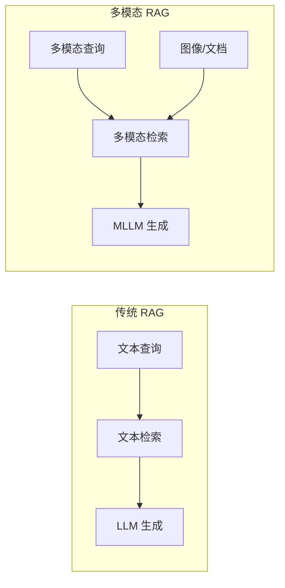
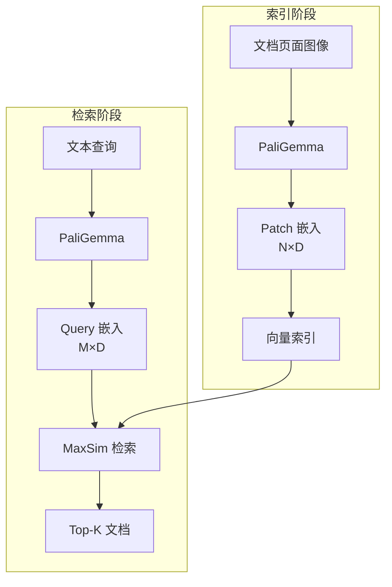
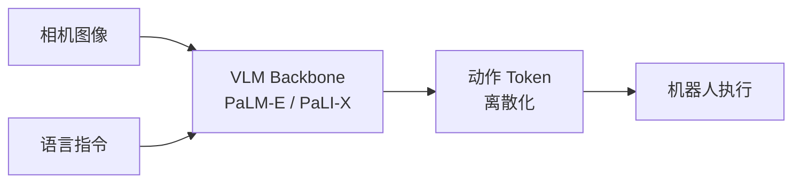
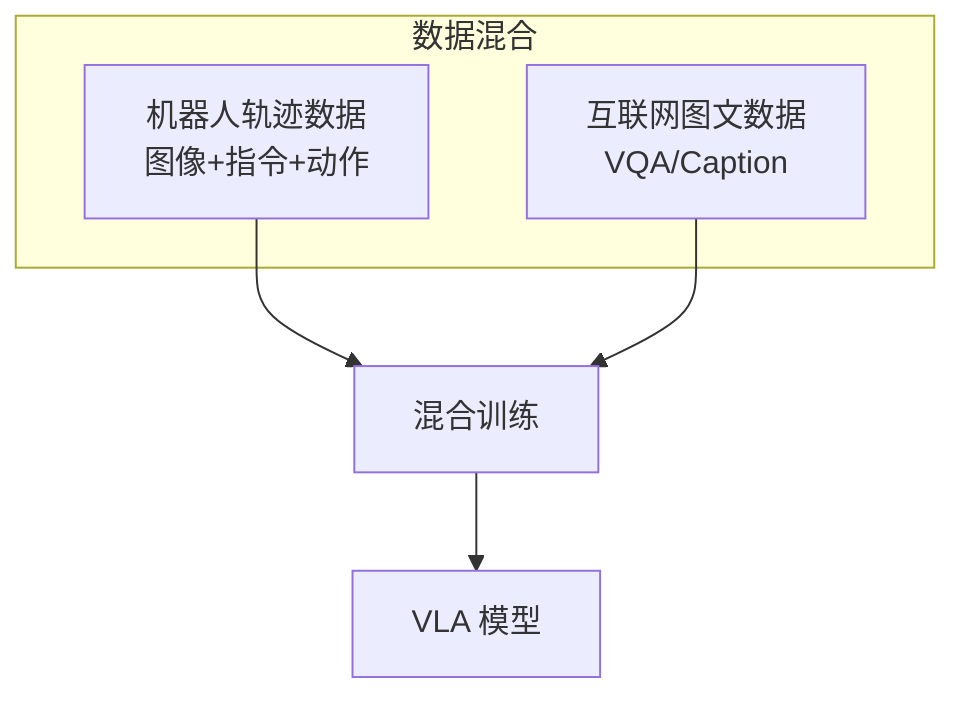
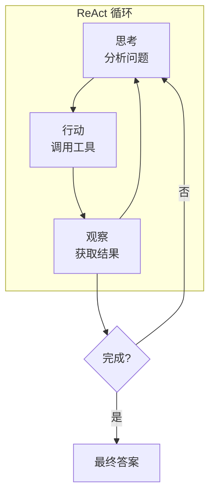
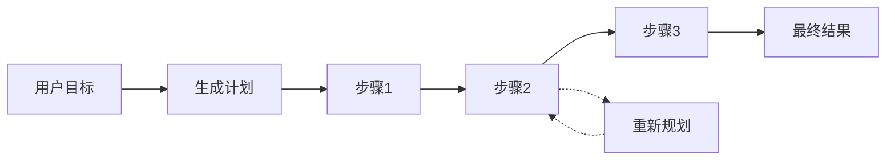
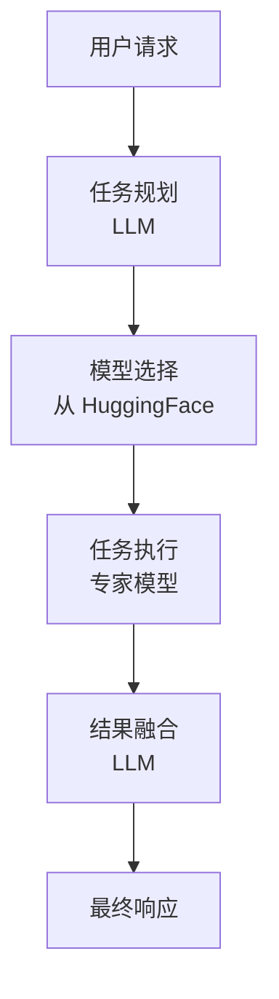

# 多模态 RAG 与智能体

> 多模态 Agent 不再局限于被动问答，而是通过检索增强、工具调用和物理交互，解决复杂的真实世界问题。

---

## 多模态 RAG 概述



| 类型 | 检索对象 | 生成模型 | 应用场景 |
| :--- | :--- | :--- | :--- |
| **文本 RAG** | 文本块 | LLM | 知识问答 |
| **多模态 RAG** | 图像+文本 | MLLM | 文档理解、视觉问答 |
| **视觉 RAG** | 文档页面图像 | VLM | PDF 检索 |

---

## ColPali：端到端视觉 RAG

传统 PDF 检索需要 OCR，丢失排版、图表等视觉信息。ColPali 直接用 VLM 编码文档页面。

### 架构设计



### Late Interaction 机制

**传统 Dense Retrieval**：
```
doc_emb = mean(patch_embeddings)  # 压缩为单向量
score = dot(query_emb, doc_emb)
```

**ColPali MaxSim**：
```python
def maxsim(query_tokens, doc_patches):
    # query_tokens: [M, D]
    # doc_patches: [N, D]
    scores = query_tokens @ doc_patches.T  # [M, N]
    max_scores = scores.max(dim=1).values  # [M]
    return max_scores.sum()
```

$$S(q, d) = \sum_{i \in q} \max_{j \in d} (q_i \cdot d_j)$$

### 优势分析

<div class="compare-box">
  <div class="compare-item">
    <div class="compare-title">OCR + Dense</div>
    <p class="compare-desc">❌ 丢失排版信息<br/>❌ 图表无法检索<br/>❌ OCR 错误传播<br/>❌ 多阶段流水线</p>
  </div>
  <div class="compare-vs">VS</div>
  <div class="compare-item highlight">
    <div class="compare-title">ColPali</div>
    <p class="compare-desc">✅ 保留视觉布局<br/>✅ 图表精准定位<br/>✅ 端到端训练<br/>✅ 所见即所得</p>
  </div>
</div>

### 应用场景

| 场景 | 传统方法问题 | ColPali 优势 |
| :--- | :--- | :--- |
| **表格检索** | OCR 丢失结构 | 直接编码表格图像 |
| **图表问答** | 无法处理 | 图表内容可检索 |
| **多栏文档** | 栏序混乱 | 视觉布局保留 |
| **手写文档** | OCR 错误高 | VLM 直接理解 |

---

## RT-2：具身智能

RT-2（Robotic Transformer 2）将多模态大模型转化为 **VLA（Vision-Language-Action）** 模型。

### 架构设计



### 动作 Token 化

**核心思想**：将连续动作离散化为语言 Token

```python
# 机器人动作空间
action = {
    'x': 0.15,      # 末端位置 x
    'y': -0.02,     # 末端位置 y
    'z': 0.08,      # 末端位置 z
    'roll': 0.0,    # 姿态
    'pitch': 0.1,
    'yaw': 0.0,
    'gripper': 1,   # 夹爪开合
    'terminate': 0  # 是否结束
}

# 离散化为 Token
# 每个维度量化到 256 个 bin
action_tokens = [128, 120, 140, 128, 135, 128, 255, 0]
# 作为"外语"输入/输出 LLM
```

### Co-Fine-Tuning



### 涌现能力

**训练数据中未见过的指令也能执行**：

| 指令 | 所需能力 | 来源 |
| :--- | :--- | :--- |
| "把灭绝的动物捡起来" | 恐龙=灭绝动物 | VLM 世界知识 |
| "把泰勒·斯威夫特的专辑放到盒子里" | 识别专辑封面 | VLM 视觉理解 |
| "用可乐把这杯水填满" | 可乐=饮料 | VLM 常识推理 |

---

## 多模态 Agent 工作流

### Agentic Patterns



### 多模态工具调用

**示例：图片中的产品评价查询**

```
用户：图中这款咖啡机的评价如何？
[上传咖啡机图片]

Agent 思考：需要先识别咖啡机型号，然后搜索评价

步骤1 - OCR 工具：
  输入：图片
  输出：型号 "DeLonghi EC685"

步骤2 - 搜索工具：
  输入：{"query": "DeLonghi EC685 评价"}
  输出：[搜索结果...]

步骤3 - 总结：
  输出："这款德龙EC685咖啡机总体评价良好，
         优点是操作简单、出品稳定..."
```

### 工具类型

| 工具类型 | 示例 | 用途 |
| :--- | :--- | :--- |
| **视觉感知** | OCR、目标检测 | 理解图像内容 |
| **信息检索** | 搜索、RAG | 获取外部知识 |
| **执行操作** | 代码执行、API | 完成具体任务 |
| **生成工具** | 图像生成、TTS | 创建内容 |

---

## 规划与反思

### 多步规划



### 自我反思

```python
def reflect(action_history, current_result, goal):
    prompt = f"""
    目标：{goal}
    已执行的动作：{action_history}
    当前结果：{current_result}
    
    请分析：
    1. 当前进度是否符合预期？
    2. 是否需要调整策略？
    3. 下一步应该做什么？
    """
    return llm(prompt)
```

---

## 多模态 Agent 框架

### 主流框架对比

| 框架 | 特点 | 多模态支持 |
| :--- | :--- | :--- |
| **LangChain** | 生态丰富 | 通过扩展支持 |
| **AutoGPT** | 自主规划 | 有限 |
| **JARVIS/HuggingGPT** | 模型调度 | 原生多模态 |
| **TaskMatrix** | 微软方案 | 视觉+API |

### HuggingGPT 架构



---

## 安全与对齐

### 多模态 Agent 风险

| 风险类型 | 描述 | 缓解措施 |
| :--- | :--- | :--- |
| **越狱攻击** | 图像中隐藏恶意指令 | 输入过滤 |
| **工具滥用** | 调用危险 API | 权限控制 |
| **信息泄露** | 暴露敏感数据 | 输出审查 |
| **失控行为** | 机器人意外动作 | 安全边界 |

### 最佳实践

::: tip 安全边界
1. **最小权限原则**：工具只给必要权限
2. **人在回路**：关键操作需人工确认
3. **沙盒执行**：代码在隔离环境运行
4. **输出过滤**：检查生成内容合规性
:::

---

## 参考资源

| 资源 | 说明 |
| :--- | :--- |
| [ColPali](https://arxiv.org/abs/2407.01449) | 视觉 RAG |
| [RT-2](https://arxiv.org/abs/2307.15818) | 具身智能 |
| [PaLM-E](https://arxiv.org/abs/2303.03378) | 具身语言模型 |
| [HuggingGPT](https://arxiv.org/abs/2303.17580) | 模型调度 |
| [TaskMatrix](https://arxiv.org/abs/2303.16434) | 视觉 Agent |
