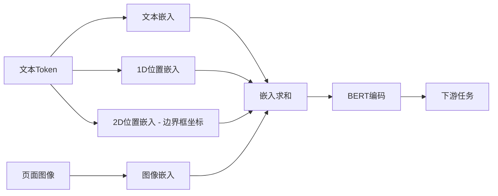
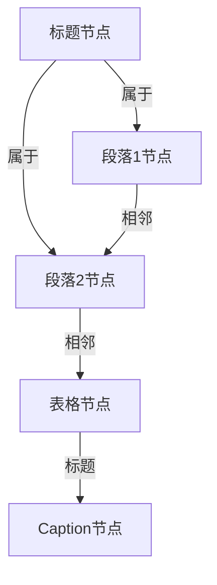
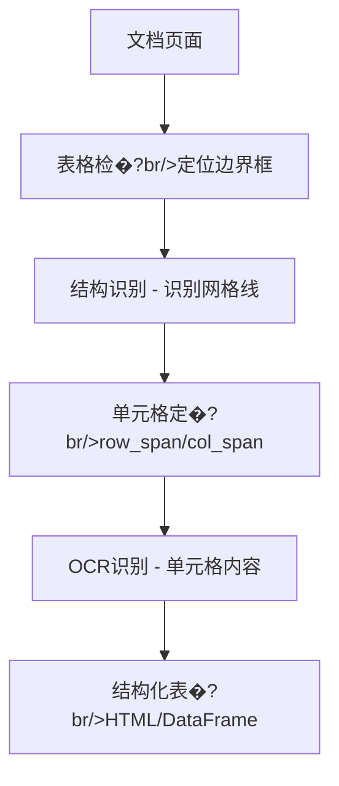
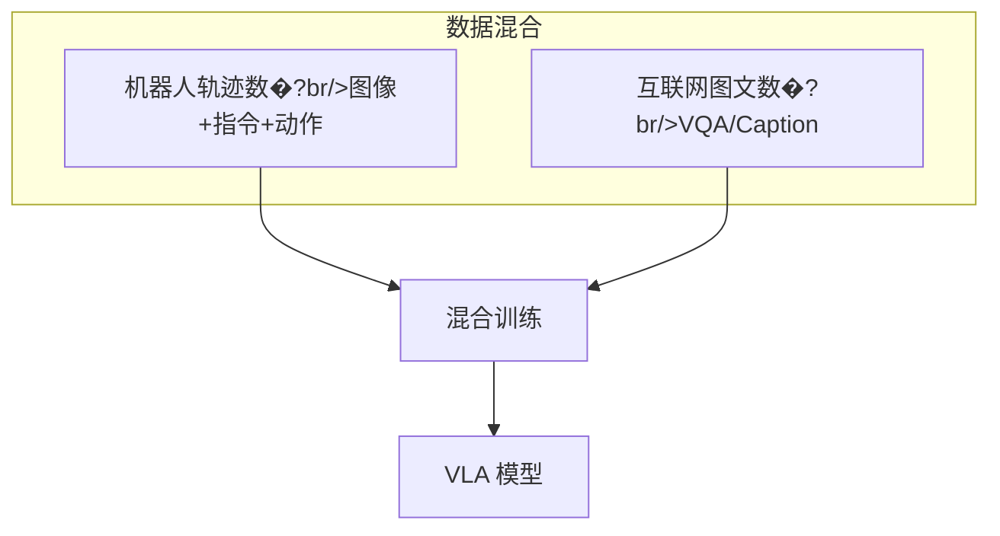
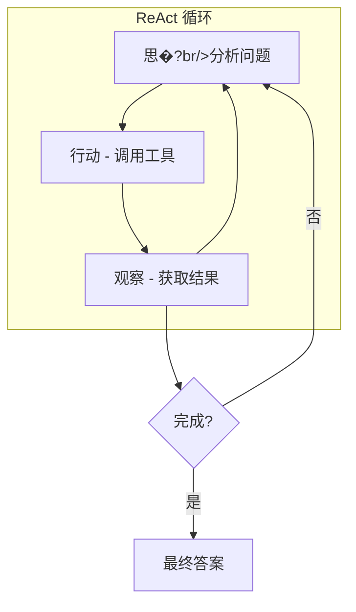
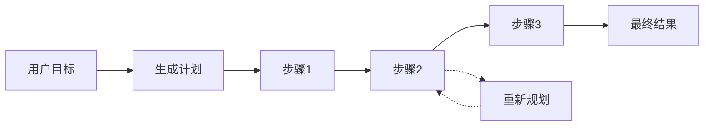
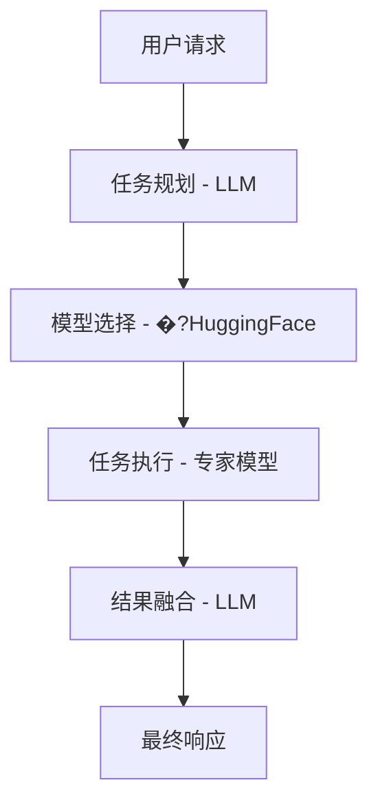

---
title: RAG 与智能体
description: ColPali 视觉 RAG、RT-2 具身智能与多模�?Agent
---

# 多模�?RAG 与智能体

> 多模�?Agent 不再局限于被动问答，而是通过检索增强、工具调用和物理交互，解决复杂的真实世界问题�?

---

## 多模�?RAG 概述

```mermaid
flowchart LR
    subgraph 传统 RAG
        Q1[文本查询] --> R1[文本检索]
        R1 --> G1[LLM 生成]
    end
    
    subgraph 多模�?RAG
        Q2[多模态查询] --> R2[多模态检索]
        R2 --> G2[MLLM 生成]
        IMG[图像/文档] --> R2
    end
```

| 类型 | 检索对�?| 生成模型 | 应用场景 |
| :--- | :--- | :--- | :--- |
| **文本 RAG** | 文本�?| LLM | 知识问答 |
| **多模�?RAG** | 图像+文本 | MLLM | 文档理解、视觉问�?|
| **视觉 RAG** | 文档页面图像 | VLM | PDF 检�?|

---

## 文档预处理：多模�?RAG 的基�?

> 传统 RAG 的痛点：`pdf_to_text()` 丢失了排版、表格、公式等 **90%** 的关键信息！

### 文档布局分析（DLA�?

#### LayoutLM 家族演进



| 模型 | 创新�?| 应用场景 |
| :--- | :--- | :--- |
| **LayoutLM** | 2D位置编码（边界框�?| 表单理解 |
| **LayoutLMv2** | 空间感知注意�?| 文档分类 |
| **LayoutLMv3** | 统一文本图像预训�?| 文档问答 |
| **LayoutLLM** | 结合LLM多任�?| 通用文档智能 |

#### GNN（图神经网络）方�?

**核心思想**：将文档页面建模为图



**图表示要�?*�?

- **节点**：文本块、图片、表格、标�?
- **�?*：空间关系（相邻、包含、层级）
- **优势**：对倾斜、手写文档鲁棒性强

### 复杂表格识别

**核心挑战**：维护行列关系，尤其�?*合并单元�?*（row_span/col_span�?



**关键能力**�?

- �?明确识别**合并单元�?*（row_span/col_span 属性）
- �?处理**无边框表�?*（通过对齐线索推断�?
- �?支持**多行表头**（层次化表头结构�?

**工具推荐**�?

| 工具 | 技术栈 | 特点 |
| :--- | :--- | :--- |
| `img2table` | OpenCV检�?+ 多OCR后端 | 灵活性强 |
| `Camelot` | PDF原生解析 | 专注PDF |
| `DeepDeSRT` | Transformer端到�?| 深度学习 |

### 数学与化学公式识�?

**Image-to-LaTeX 流程**�?


**主流模型**�?

| 模型 | 技�?| 特点 |
| :--- | :--- | :--- |
| **Pix2Tex** | Transformer + CTC | 开�?|
| **LaTeX-OCR** | ViT Encoder + Decoder | 高准确率 |
| **Mathpix** | 商用方案 | 产业�?|

**输出格式**：LaTeX、MathML、ASCII Math

### 图像与图表分�?

**VLM描述 + RAG增强**�?

```python
# 使用BLIP-2描述图表
from transformers import Blip2Processor, Blip2ForConditionalGeneration

processor = Blip2Processor.from_pretrained("Salesforce/blip2-opt-2.7b")
model = Blip2ForConditionalGeneration.from_pretrained("Salesforce/blip2-opt-2.7b")

question = "What does this chart show?"
inputs = processor(chart_image, question, return_tensors="pt")
out = model.generate(**inputs)
caption = processor.decode(out[0], skip_special_tokens=True)

# 使用RAG检索领域知识进一步精细化描述
context = rag_retriever.search(caption)
detailed_desc = llm.generate(f"{caption}\n\nContext: {context}")
```

### 逻辑阅读顺序检�?

**问题**：多栏布局、嵌入式图表打乱了自然阅读顺�?

**技术方�?*�?

| 方法 | 原理 | 适用场景 |
| :--- | :--- | :--- |
| **基于规则** | XY-Cut算法（递归切分�?| 标准双栏论文 |
| **深度学习** | Graph Convolutional Network | 复杂布局 |
| **混合方法** | 规则 + 启发�?+ DL | 通用文档 |

**XY-Cut算法**�?

1. 横向投影找最大空白带（Y-Cut�?
2. 纵向投影分左右栏（X-Cut�?
3. 递归处理每个区域

---

## ColPali：端到端视觉 RAG

传统 PDF 检索需�?OCR，丢失排版、图表等视觉信息。ColPali 直接�?VLM 编码文档页面�?

### 架构设计

```mermaid
flowchart TB
    subgraph 索引阶段
        DOC[文档页面图像] --> VLM1[PaliGemma]
        VLM1 --> PATCH[Patch 嵌入 - N×D]
        PATCH --> INDEX[向量索引]
    end
    
    subgraph 检索阶�?
        Q[文本查询] --> VLM2[PaliGemma]
        VLM2 --> QE[Query 嵌入 - M×D]
        QE --> MAXSIM[MaxSim 检索]
        INDEX --> MAXSIM
        MAXSIM --> TOP[Top-K 文档]
    end
```

### Late Interaction 机制

**传统 Dense Retrieval**�?

```
doc_emb = mean(patch_embeddings)  # 压缩为单向量
score = dot(query_emb, doc_emb)
```

**ColPali MaxSim**�?

```python
def maxsim(query_tokens, doc_patches):
    # query_tokens: [M, D]
    # doc_patches: [N, D]
    scores = query_tokens @ doc_patches.T  # [M, N]
    max_scores = scores.max(dim=1).values  # [M]
    return max_scores.sum()
```

$$S(q, d) = \sum_{i \in q} \max_{j \in d} (q_i \cdot d_j)$$

### 优势分析

<div class="compare-box">
  <div class="compare-item">
    <div class="compare-title">OCR + Dense</div>
    <p class="compare-desc">�?丢失排版信息 - �?图表无法检�?br/>�?OCR 错误传播 - �?多阶段流水线</p>
  </div>
  <div class="compare-vs">VS</div>
  <div class="compare-item highlight">
    <div class="compare-title">ColPali</div>
    <p class="compare-desc">�?保留视觉布局 - �?图表精准定位 - �?端到端训�?br/>�?所见即所�?</p>
  </div>
</div>

### 应用场景

| 场景 | 传统方法问题 | ColPali 优势 |
| :--- | :--- | :--- |
| **表格检�?* | OCR 丢失结构 | 直接编码表格图像 |
| **图表问答** | 无法处理 | 图表内容可检�?|
| **多栏文档** | 栏序混乱 | 视觉布局保留 |
| **手写文档** | OCR 错误�?| VLM 直接理解 |

---

## RT-2：具身智�?

RT-2（Robotic Transformer 2）将多模态大模型转化�?**VLA（Vision-Language-Action�?* 模型�?

### 架构设计

```mermaid
flowchart LR
    CAM[相机图像] --> VLM[VLM Backbone (PaLM-E/PaLI-X)]
    CMD[语言指令] --> VLM
    VLM --> ACT[动作 Token - 离散化]
    ACT --> ROBOT[机器人执行]
```

### 动作 Token �?

**核心思想**：将连续动作离散化为语言 Token

```python
# 机器人动作空�?
action = {
    'x': 0.15,      # 末端位置 x
    'y': -0.02,     # 末端位置 y
    'z': 0.08,      # 末端位置 z
    'roll': 0.0,    # 姿�?
    'pitch': 0.1,
    'yaw': 0.0,
    'gripper': 1,   # 夹爪开�?
    'terminate': 0  # 是否结束
}

# 离散化为 Token
# 每个维度量化�?256 �?bin
action_tokens = [128, 120, 140, 128, 135, 128, 255, 0]
# 作为"外语"输入/输出 LLM
```

### Co-Fine-Tuning



### 涌现能力

**训练数据中未见过的指令也能执�?*�?

| 指令 | 所需能力 | 来源 |
| :--- | :--- | :--- |
| "把灭绝的动物捡起�? | 恐龙=灭绝动物 | VLM 世界知识 |
| "把泰勒·斯威夫特的专辑放到盒子�? | 识别专辑封面 | VLM 视觉理解 |
| "用可乐把这杯水填�? | 可乐=饮料 | VLM 常识推理 |

---

## 多模�?Agent 工作�?

### Agentic Patterns



### 多模态工具调�?

**示例：图片中的产品评价查�?*

```
用户：图中这款咖啡机的评价如何？
[上传咖啡机图片]

Agent 思考：需要先识别咖啡机型号，然后搜索评价

步骤1 - OCR 工具�?
  输入：图�?
  输出：型�?"DeLonghi EC685"

步骤2 - 搜索工具�?
  输入：{"query": "DeLonghi EC685 评价"}
  输出：[搜索结果...]

步骤3 - 总结�?
  输出�?这款德龙EC685咖啡机总体评价良好�?
         优点是操作简单、出品稳�?.."
```

### 工具类型

| 工具类型 | 示例 | 用�?|
| :--- | :--- | :--- |
| **视觉感知** | OCR、目标检�?| 理解图像内容 |
| **信息检�?* | 搜索、RAG | 获取外部知识 |
| **执行操作** | 代码执行、API | 完成具体任务 |
| **生成工具** | 图像生成、TTS | 创建内容 |

---

## 规划与反�?

### 多步规划



### 自我反�?

```python
def reflect(action_history, current_result, goal):
    prompt = f"""
    目标：{goal}
    已执行的动作：{action_history}
    当前结果：{current_result}
    
    请分析：
    1. 当前进度是否符合预期�?
    2. 是否需要调整策略？
    3. 下一步应该做什么？
    """
    return llm(prompt)
```

---

## 多模�?Agent 框架

### 主流框架对比

| 框架 | 特点 | 多模态支�?|
| :--- | :--- | :--- |
| **LangChain** | 生态丰�?| 通过扩展支持 |
| **AutoGPT** | 自主规划 | 有限 |
| **JARVIS/HuggingGPT** | 模型调度 | 原生多模�?|
| **TaskMatrix** | 微软方案 | 视觉+API |

### HuggingGPT 架构



---

## 安全与对�?

### 多模�?Agent 风险

| 风险类型 | 描述 | 缓解措施 |
| :--- | :--- | :--- |
| **越狱攻击** | 图像中隐藏恶意指�?| 输入过滤 |
| **工具滥用** | 调用危险 API | 权限控制 |
| **信息泄露** | 暴露敏感数据 | 输出审查 |
| **失控行为** | 机器人意外动�?| 安全边界 |

### 最佳实�?

::: tip 安全边界

1. **最小权限原�?*：工具只给必要权�?
2. **人在回路**：关键操作需人工确认
3. **沙盒执行**：代码在隔离环境运行
4. **输出过滤**：检查生成内容合规�?
:::

---

## 参考资�?

| 资源 | 说明 |
| :--- | :--- |
| [ColPali](https://arxiv.org/abs/2407.01449) | 视觉 RAG |
| [RT-2](https://arxiv.org/abs/2307.15818) | 具身智能 |
| [PaLM-E](https://arxiv.org/abs/2303.03378) | 具身语言模型 |
| [HuggingGPT](https://arxiv.org/abs/2303.17580) | 模型调度 |
| [TaskMatrix](https://arxiv.org/abs/2303.16434) | 视觉 Agent |


