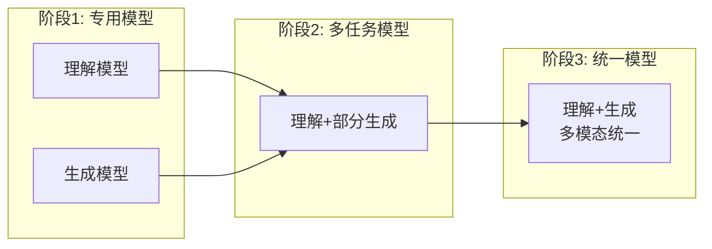
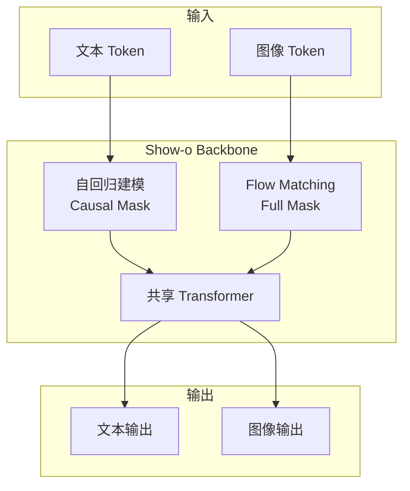
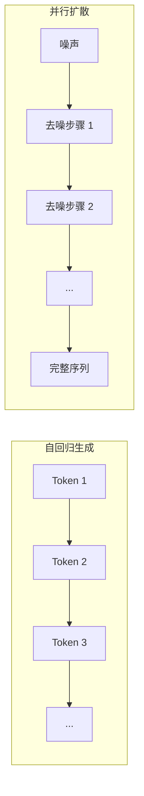
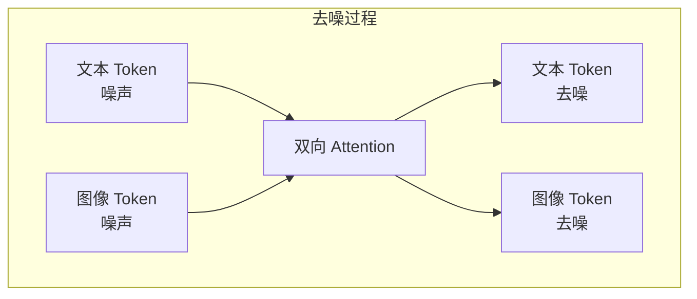
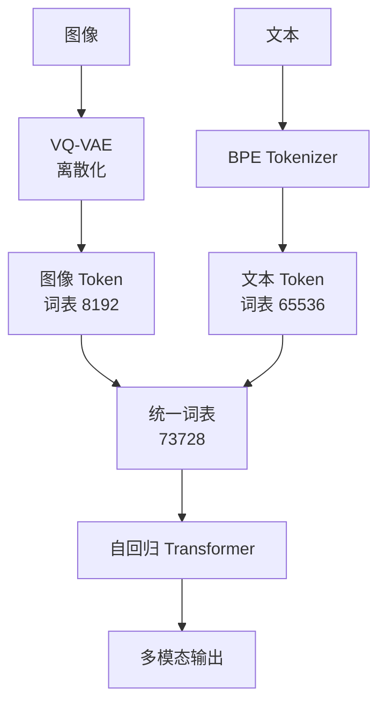
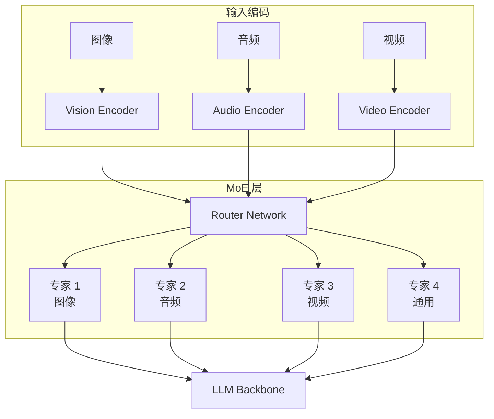
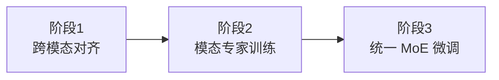
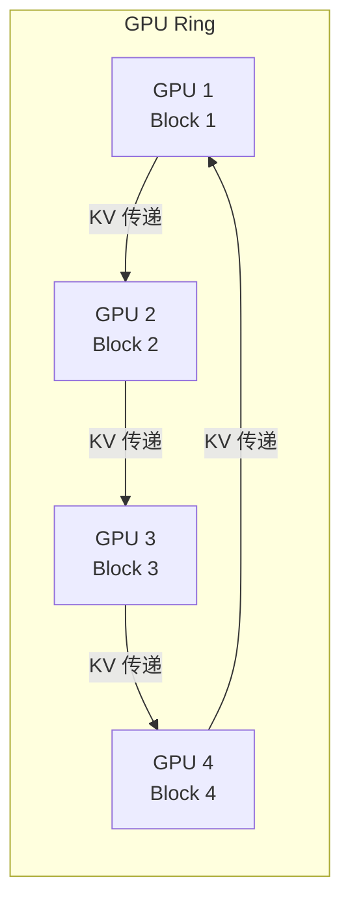

# 前沿统一架构

> 学术界正致力于打破模态和任务的界限，追求 **"One Model for All"**——单一模型同时处理理解与生成、多种模态。

---

## 统一架构演进



| 阶段 | 代表模型 | 能力范围 |
| :--- | :--- | :--- |
| **专用模型** | CLIP + SD | 各司其职 |
| **多任务** | LLaVA, BLIP-2 | 多模态理解 |
| **统一模型** | Show-o, Chameleon | 理解+生成 |

---

## Show-o：自回归与 Flow 的融合

Show-o 创造性地在单一模型中集成两种建模方式。

### 架构设计



### 双模式建模

| 模式 | 目标 | Attention Mask | 预测目标 |
| :--- | :--- | :--- | :--- |
| **自回归 (AR)** | 文本 | Causal（因果） | 下一个 Token |
| **Flow Matching** | 图像 | Full（全连接） | 去噪 |

### 动态模式切换

```python
def forward(self, text_tokens, image_tokens, mode):
    if mode == "understanding":
        # 图像作为条件，自回归生成文本
        mask = create_causal_mask(text_tokens)
        return self.generate_text(image_tokens, text_tokens, mask)
    
    elif mode == "generation":
        # 文本作为条件，Flow 生成图像
        mask = create_full_mask(image_tokens)
        return self.denoise_image(text_tokens, image_tokens, mask)
    
    elif mode == "mixed":
        # 图文交织生成
        return self.interleaved_generation(text_tokens, image_tokens)
```

### 关键创新

| 创新点 | 说明 |
| :--- | :--- |
| **共享骨干网络** | 单一 Transformer 处理所有任务 |
| **动态 Mask** | 根据任务切换注意力模式 |
| **统一词表** | 文本和图像 Token 在同一空间 |
| **端到端训练** | 理解和生成联合优化 |

---

## MMaDA：并行多模态扩散

MMaDA 针对自回归的"错误累积"问题，提出并行扩散方案。

### 自回归 vs 并行扩散



| 特性 | 自回归 | 并行扩散 |
| :--- | :--- | :--- |
| **生成方式** | 逐 Token | 全序列并行 |
| **错误传播** | 累积 | 不累积 |
| **生成速度** | 慢（串行） | 快（并行） |
| **长序列** | 可能退化 | 稳定 |

### 双向交互



**特点**：
- 文本和图像 Token 同时去噪
- 每一步通过双向注意力交互
- 确保跨模态语义一致性

### ParaRL：On-Policy 强化学习

**问题**：传统 DPO 是 Off-Policy，偏好数据分布与模型分布不匹配

**ParaRL 方案**：
1. 使用当前模型生成正负样本
2. 构建 On-Policy 偏好数据
3. 细粒度语义奖励

---

## Chameleon：原生混合模态

Meta 的 Chameleon 实现真正的原生多模态。

### 统一 Token 空间



### VQ-VAE 图像离散化

```python
# VQ-VAE 编码
def encode_image(image):
    # 连续特征
    z = encoder(image)  # [B, H, W, D]
    # 量化到离散 codebook
    indices = quantize(z, codebook)  # [B, H, W]
    # 展平为 Token 序列
    tokens = indices.flatten()  # [B, H*W]
    return tokens

# VQ-VAE 解码
def decode_image(tokens):
    # 从 codebook 查找
    z = codebook[tokens]  # [B, H*W, D]
    z = z.reshape(B, H, W, D)
    # 解码为图像
    image = decoder(z)
    return image
```

### 训练稳定性技术

| 技术 | 作用 |
| :--- | :--- |
| **QK-Norm** | 稳定 Attention Score |
| **Dropout 复用** | 防止模态偏向 |
| **z-loss** | 稳定 Softmax |
| **渐进式训练** | 从小规模逐步扩大 |

### 任意模态组合

Chameleon 支持任意输入输出组合：

| 输入 | 输出 | 示例任务 |
| :--- | :--- | :--- |
| 文本 | 文本 | 对话、问答 |
| 图像 | 文本 | 图像描述 |
| 文本 | 图像 | 文生图 |
| 图像+文本 | 图像 | 图像编辑 |
| 图像+文本 | 图像+文本 | 图文交织生成 |

---

## Uni-MoE：统一混合专家

Uni-MoE 引入稀疏 MoE 架构，解决多模态混合训练的性能偏差问题。

### 架构设计



### 渐进式训练策略



| 阶段 | 目标 | 训练内容 |
| :--- | :--- | :--- |
| **Stage 1** | 跨模态对齐 | 训练连接器 |
| **Stage 2** | 专家专业化 | 单独训练各模态专家 |
| **Stage 3** | 统一协调 | LoRA 微调整个 MoE |

### 优势

| 特性 | 传统多模态 | Uni-MoE |
| :--- | :--- | :--- |
| **模态干扰** | 严重 | 专家隔离 |
| **计算效率** | 全量激活 | 稀疏激活 |
| **扩展性** | 有限 | 易于添加模态 |

---

## RingAttention：超长上下文

长视频理解的关键瓶颈是上下文长度。

### Blockwise Parallelism



### 工作原理

```python
# RingAttention 伪代码
def ring_attention(Q, K, V, num_devices):
    # Q, K, V 按序列维度切分到各设备
    local_Q = Q.chunk(num_devices)[device_id]
    local_K = K.chunk(num_devices)[device_id]
    local_V = V.chunk(num_devices)[device_id]
    
    output = zeros_like(local_Q)
    
    for step in range(num_devices):
        # 计算当前 KV 块的注意力
        attn = softmax(local_Q @ local_K.T)
        output += attn @ local_V
        
        # 环形传递 KV 到下一个设备
        local_K = ring_send_recv(local_K)
        local_V = ring_send_recv(local_V)
    
    return output
```

### 效果

| 指标 | 传统方法 | RingAttention |
| :--- | :--- | :--- |
| **最大长度** | ~128K | 1M+ |
| **显存占用** | 单卡受限 | 分布式 |
| **通信开销** | - | 与计算重叠 |

---

## 未来趋势

### 架构统一化

```
当前：多个专用模型
↓
近期：理解+生成统一
↓
远期：任意模态统一（World Model）
```

### 关键挑战

| 挑战 | 现状 | 解决方向 |
| :--- | :--- | :--- |
| **图像生成质量** | 统一模型弱于专用 | 更好的离散化 |
| **训练成本** | 极高 | 高效训练方法 |
| **模态平衡** | 容易偏向某模态 | MoE / 采样策略 |
| **评测标准** | 缺乏统一基准 | 新评测框架 |

---

## 参考资源

| 资源 | 说明 |
| :--- | :--- |
| [Show-o](https://arxiv.org/abs/2408.12528) | 自回归+Flow 统一 |
| [MMaDA](https://arxiv.org/abs/2505.15809) | 并行多模态扩散 |
| [Chameleon](https://arxiv.org/abs/2405.09818) | 原生混合模态 |
| [Uni-MoE](https://arxiv.org/abs/2405.11273) | 统一混合专家 |
| [RingAttention](https://arxiv.org/abs/2310.01889) | 超长上下文 |
