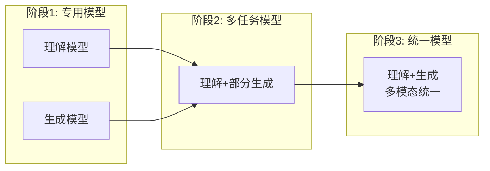
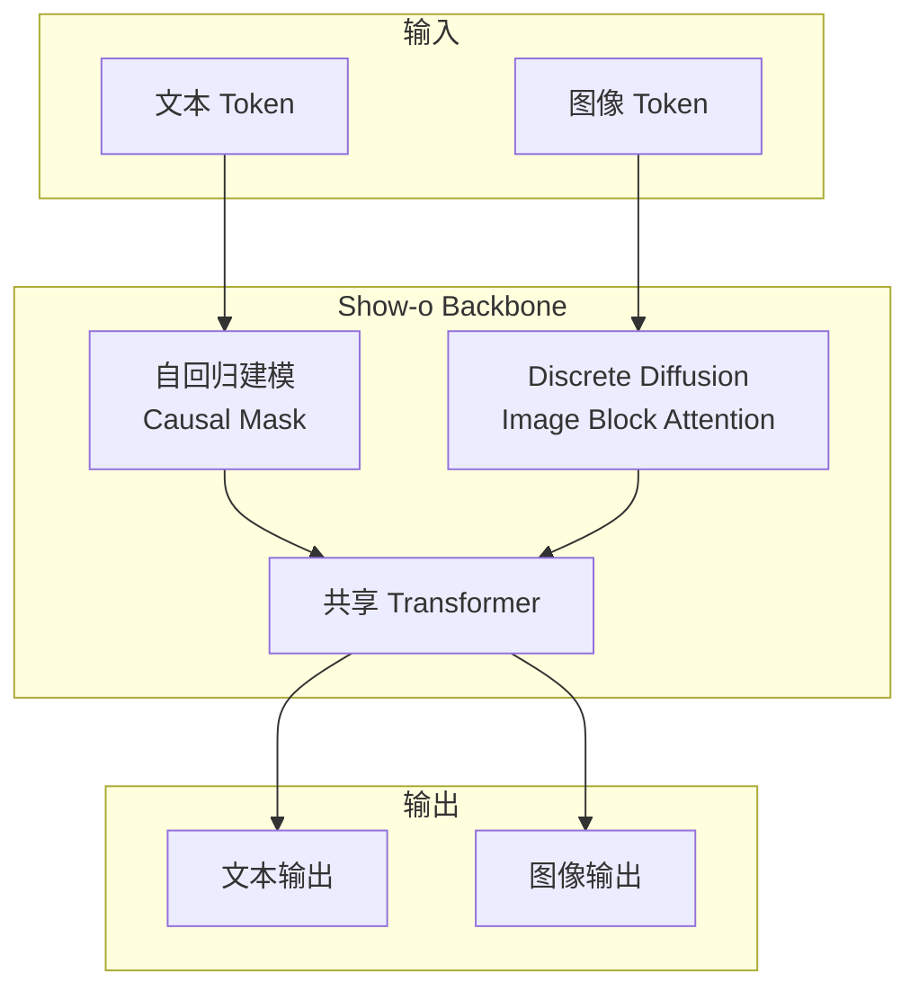
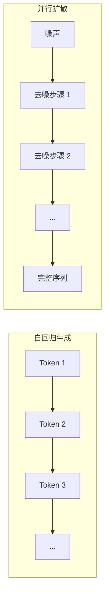
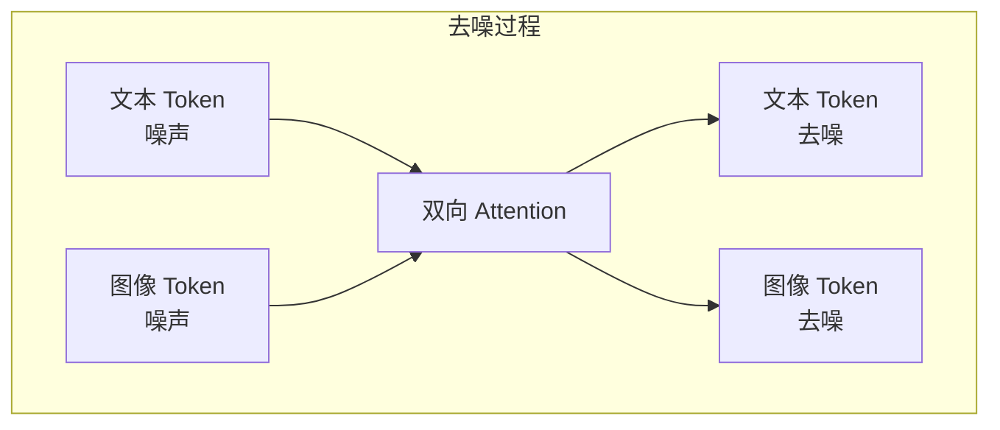
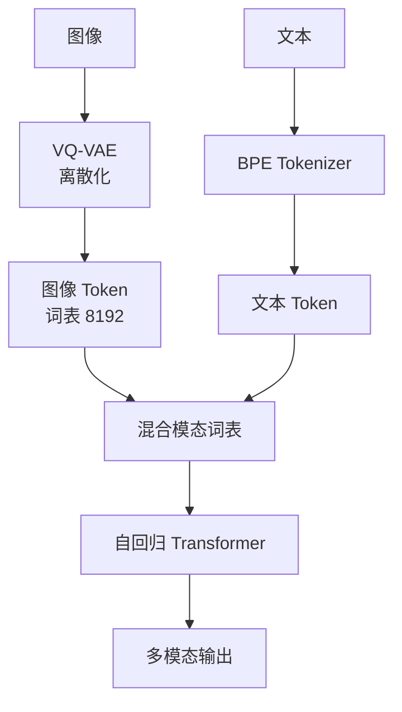
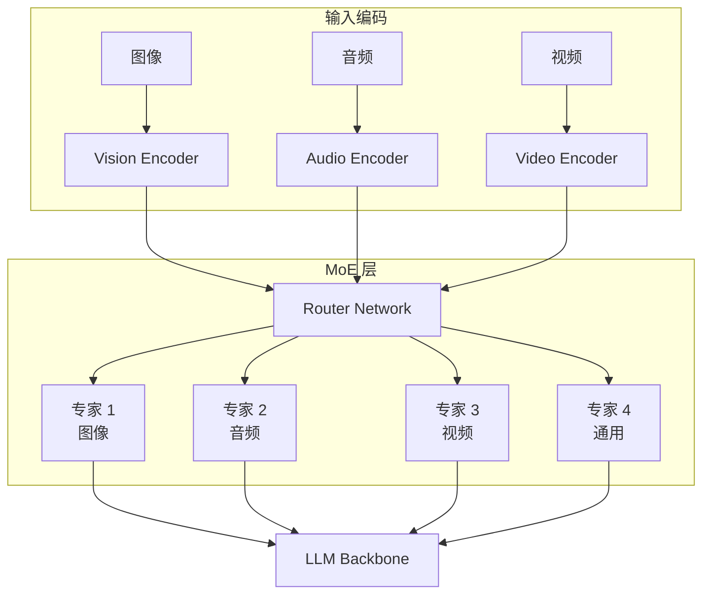
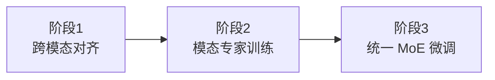
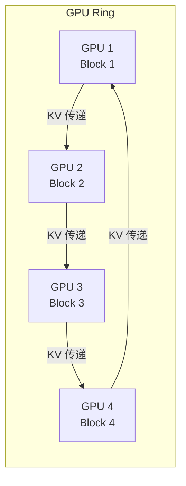

# 前沿统一架构

> 学术界正致力于打破模态和任务的界限，追求 **"One Model for All"**——单一模型同时处理理解与生成、多种模态。

---

## 统一架构演进


```mermaid
flowchart LR
    subgraph "阶段1: 专用模型"
        M1[理解模型]
        M2[生成模型]
    end
    
    subgraph "阶段2: 多任务模型"
        M3[理解+部分生成]
    end
    
    subgraph "阶段3: 统一模型"
        M4[理解+生成\n多模态统一]
    end
    
    M1 --> M3
    M2 --> M3
    M3 --> M4
```

| 阶段 | 代表模型 | 能力范围 |
| :--- | :--- | :--- |
| **专用模型** | CLIP + SD | 各司其职 |
| **多任务** | LLaVA, BLIP-2 | 多模态理解 |
| **统一模型** | Show-o, Chameleon | 理解+生成 |

---

## Show-o：自回归与离散扩散的融合 {#show-o-自回归与-flow-的融合}

[Show-o（2024）](https://arxiv.org/abs/2408.12528)结合文本自回归与图像离散扩散；[Show-o2（2025）](https://arxiv.org/abs/2506.15564)才进一步采用连续空间 flow matching 等设计。两代的 token 表示、训练目标与采样方式不能混写。

### 架构设计


```mermaid
flowchart TB
    subgraph 输入
        TXT[文本 Token]
        IMG[图像 Token]
    end
    
    subgraph "Show-o Backbone"
        TXT --> AR[自回归建模\nCausal Mask]
        IMG --> FM[Discrete Diffusion\nImage Block Attention]
        AR --> TF[共享 Transformer]
        FM --> TF
    end
    
    subgraph 输出
        TF --> OUT_T[文本输出]
        TF --> OUT_I[图像输出]
    end
```

### 双模式建模

| 模式 | 目标 | Attention Mask | 预测目标 |
| :--- | :--- | :--- | :--- |
| **自回归 (AR)** | 文本 | Causal（因果） | 下一个 Token |
| **离散扩散** | 图像离散 token | 图像块内部双向，跨块遵循任务 mask | 恢复被遮蔽的 token |

### 动态模式切换

以下仅示意任务分派；真实 omni-attention 同时约束文本和图像块之间的可见性，不能用纯 causal/full 二选一完全替代。

```python
def forward(self, text_tokens, image_tokens, mode):
    if mode == "understanding":
        # 图像作为条件，自回归生成文本
        mask = create_causal_mask(text_tokens)
        return self.generate_text(image_tokens, text_tokens, mask)
    
    elif mode == "generation":
        # 文本作为条件，迭代恢复图像离散 token
        mask = create_full_mask(image_tokens)
        return self.denoise_image(text_tokens, image_tokens, mask)
    
    elif mode == "mixed":
        # 图文交织生成
        return self.interleaved_generation(text_tokens, image_tokens)
```

### 关键创新

| 创新点 | 说明 |
| :--- | :--- |
| **共享骨干网络** | 单一 Transformer 处理所有任务 |
| **动态 Mask** | 根据任务切换注意力模式 |
| **统一词表** | 文本和图像 Token 在同一空间 |
| **端到端训练** | 理解和生成联合优化 |

---

## MMaDA：并行多模态扩散

[MMaDA](https://arxiv.org/abs/2505.15809)用统一离散扩散目标研究文本推理、多模态理解和图像生成，并使用混合长链推理数据进行后训练。

### 自回归 vs 并行扩散


```mermaid
flowchart LR
    subgraph 自回归生成
        A1[Token 1] --> A2[Token 2]
        A2 --> A3[Token 3]
        A3 --> A4[...]
    end
    
    subgraph 并行扩散
        N[噪声] --> D1[去噪步骤 1]
        D1 --> D2[去噪步骤 2]
        D2 --> D3[...]
        D3 --> OUT[完整序列]
    end
```

| 特性 | 自回归 | 并行扩散 |
| :--- | :--- | :--- |
| **生成方式** | 逐 Token | 全序列并行 |
| **错误传播** | 先前输出影响后续 | 可迭代修改，但仍会形成错误与偏差 |
| **生成速度** | 增量生成可用 KV cache | 每步可并行，但需多次全序列计算，实际速度需测 |
| **长序列** | 受上下文和训练覆盖限制 | 同样受长度、训练分布与采样调度限制 |

### 双向交互


```mermaid
flowchart TB
    subgraph 去噪过程
        T1[文本 Token\n噪声] --> ATTN[双向 Attention]
        I1[图像 Token\n噪声] --> ATTN
        ATTN --> T2[文本 Token\n去噪]
        ATTN --> I2[图像 Token\n去噪]
    end
```

**特点**：
- 文本和图像 Token 同时去噪
- 每一步通过双向注意力交互
- 提供跨模态交互路径，不保证语义一致；须单独评估冲突输入

### UniGRPO：扩散模型的强化学习 {#pararl-on-policy-强化学习}

MMaDA 原论文使用的名称是 **UniGRPO**，并非 ParaRL。它为扩散模型设计策略梯度后训练，结合不同任务的奖励。评价时区分正确性、视觉理解和生成偏好，防止一个奖励的上涨掩盖其他能力下降；“在当前策略采样”也不能自动消除奖励误差。

---

## Chameleon：原生混合模态

Chameleon 使用早期融合的图文离散序列，适合讨论统一自回归目标；图像 tokenizer 仍是专门组件，不等于所有模态共享完全相同的预处理。

### 统一 Token 空间

原论文的总词表为 65,536，已包含 8,192 个图像码本 token，不能再将二者相加。参见 [Chameleon 的 Tokenization 小节](https://arxiv.org/html/2405.09818v1#S2.SS1)。


```mermaid
flowchart TB
    IMG[图像] --> VQVAE[VQ-VAE\n离散化]
    VQVAE --> IT[图像 Token\n词表 8192]
    
    TXT[文本] --> BPE[BPE Tokenizer]
    BPE --> TT[文本 Token]
    
    IT --> MERGE[混合模态词表]
    TT --> MERGE
    
    MERGE --> AR[自回归 Transformer]
    AR --> OUT[多模态输出]
```

### VQ-VAE 图像离散化

```python
# VQ-VAE 编码
def encode_image(image):
    # 连续特征
    z = encoder(image)  # [B, H, W, D]
    # 量化到离散 codebook
    indices = quantize(z, codebook)  # [B, H, W]
    # 展平为 Token 序列
    tokens = indices.flatten(start_dim=1)  # [B, H*W]，不能合并 batch 维
    return tokens

# VQ-VAE 解码
def decode_image(tokens):
    # 从 codebook 查找
    z = codebook[tokens]  # [B, H*W, D]
    z = z.reshape(B, H, W, D)
    # 解码为图像
    image = decoder(z)
    return image
```

### 训练稳定性技术

| 技术 | 作用 |
| :--- | :--- |
| **QK-Norm** | 稳定 Attention Score |
| **归一化设计** | 约束多模态数值规模，具体形式见论文 |
| **z-loss** | 稳定 Softmax |
| **训练监控** | 监测不同模态损失与梯度，避免单一总 loss 掩盖失衡 |

### 任意模态组合

下表是混合序列建模可讨论的任务形式。实际可用任务应核对论文实验、模型卡和公开接口，不能把“可表示”直接等同于“已训练并开放”：

| 输入 | 输出 | 示例任务 |
| :--- | :--- | :--- |
| 文本 | 文本 | 对话、问答 |
| 图像 | 文本 | 图像描述 |
| 文本 | 图像 | 文生图 |
| 图像+文本 | 图像 | 图像编辑 |
| 图像+文本 | 图像+文本 | 图文交织生成 |

---

## Uni-MoE：统一混合专家

Uni-MoE 引入稀疏 MoE 架构，解决多模态混合训练的性能偏差问题。

### 架构设计

下图是概念分工；MoE 专家通常位于 LLM 主干内，路由学习不保证一个专家仅对应一种模态。


```mermaid
flowchart TB
    subgraph 输入编码
        IMG[图像] --> VE[Vision Encoder]
        AUD[音频] --> AE[Audio Encoder]
        VID[视频] --> VDE[Video Encoder]
    end
    
    subgraph "MoE 层"
        VE --> ROUTER[Router Network]
        AE --> ROUTER
        VDE --> ROUTER
        ROUTER --> E1[专家 1\n图像]
        ROUTER --> E2[专家 2\n音频]
        ROUTER --> E3[专家 3\n视频]
        ROUTER --> E4[专家 4\n通用]
    end
    
    E1 --> LLM[LLM Backbone]
    E2 --> LLM
    E3 --> LLM
    E4 --> LLM
```

### 渐进式训练策略


```mermaid
flowchart LR
    S1[阶段1\n跨模态对齐] --> S2[阶段2\n模态专家训练]
    S2 --> S3[阶段3\n统一 MoE 微调]
```

| 阶段 | 目标 | 训练内容 |
| :--- | :--- | :--- |
| **Stage 1** | 跨模态对齐 | 训练连接器 |
| **Stage 2** | 专家专业化 | 单独训练各模态专家 |
| **Stage 3** | 统一协调 | LoRA 微调整个 MoE |

### 优势

| 特性 | 传统多模态 | Uni-MoE |
| :--- | :--- | :--- |
| **模态干扰** | 取决于数据与训练目标 | 稀疏路由可能缓解，仍需负载均衡 |
| **计算效率** | 全量激活 | 稀疏激活 |
| **扩展性** | 可增加编码器/连接器 | 可增加专家，但仍需训练和部署验证 |

---

## RingAttention：超长上下文

长视频理解的关键瓶颈是上下文长度。

### Blockwise Parallelism


```mermaid
flowchart LR
    subgraph "GPU Ring"
        G1[GPU 1\nBlock 1]
        G2[GPU 2\nBlock 2]
        G3[GPU 3\nBlock 3]
        G4[GPU 4\nBlock 4]
    end
    
    G1 -->|KV 传递| G2
    G2 -->|KV 传递| G3
    G3 -->|KV 传递| G4
    G4 -->|KV 传递| G1
```

### 工作原理

[Ring Attention](https://arxiv.org/abs/2310.01889)把序列块分布到设备，传递 K/V 并计算局部 query 对全局 key 的注意力。它是分布式执行技术，不是新的统一多模态建模目标，也不会自动训练出长程理解能力。

关键点是**在线 softmax 归一化**。不能对每个 KV 块独立 softmax 后把结果直接相加，否则每块权重各自和为 1，不等于全序列 attention。

```python
# 数学伪代码：忽略 batch/head 维与通信细节；每行对应一个 local query
m = full((num_queries, 1), -inf)   # 跨块最大 logit
l = zeros((num_queries, 1))       # 跨块指数和
acc = zeros_like(local_Q)         # 未归一化的加权和
for K_block, V_block in ring_blocks:
    scores = local_Q @ K_block.T / sqrt(head_dim)
    scores = apply_global_attention_mask(scores)  # 使用全局 token 位置
    new_m = maximum(m, scores.max(dim=-1, keepdim=True).values)
    rescale = exp(m - new_m)
    p = exp(scores - new_m)
    acc = rescale * acc + p @ V_block
    l = rescale * l + p.sum(dim=-1, keepdim=True)
    m = new_m
output = acc / l
```

真实实现还需处理全遮蔽块、反向传播、混合精度、通信重叠和 causal 边界。上述公式解释归一化，不是可直接部署的分布式内核。

### 效果

可处理长度随设备数量、显存、互联带宽与算力预算增长，不存在“传统方法固定 128K、Ring 固定 1M+”的统一界限。稠密注意力总计算量仍随序列长度二次增长；通信是否能被计算覆盖需要 profiling。

验收先在小序列上对照普通 attention 的输出与梯度，再增加设备和长度测扩展效率；用跨帧、跨段证据任务验证模型利用远距离信息，不能只看输入是否装得下。

---

## 未来趋势

### 架构统一化

```
当前：多个专用模型
↓
近期：理解+生成统一
↓
远期：任意模态统一（World Model）
```

### 关键挑战

| 挑战 | 现状 | 解决方向 |
| :--- | :--- | :--- |
| **图像生成质量** | 取决于表示、训练预算和任务 | 比较离散/连续表示与专用基线 |
| **训练成本** | 极高 | 高效训练方法 |
| **模态平衡** | 容易偏向某模态 | MoE / 采样策略 |
| **评测标准** | 缺乏统一基准 | 新评测框架 |

---

## 是否需要统一：一个工程决策

先做“理解模型 + 生成器”的模块化基线。只有共享上下文、图文交织输出或跨模态协同确实改善任务时，再承担统一模型的训练与服务成本。

固定数据与预算后，分别比较理解正确率、生成条件遵循、图文一致性和端到端耗时。联合训练一个任务涨、另一个降时，检查采样配比、损失尺度和共享参数冲突；并行采样变慢时，检查步数、序列长度和能否复用缓存。上线前核对 checkpoint 真正开放的输入/输出模态、许可证和解码路径，不用论文演示替代产品验收。

## 参考资源

| 资源 | 说明 |
| :--- | :--- |
| [Show-o](https://arxiv.org/abs/2408.12528) | 自回归+离散扩散统一 |
| [Show-o2](https://arxiv.org/abs/2506.15564) | 连续表示与 Flow 后续路线 |
| [MMaDA](https://arxiv.org/abs/2505.15809) | 并行多模态扩散 |
| [Chameleon](https://arxiv.org/abs/2405.09818) | 原生混合模态 |
| [Uni-MoE](https://arxiv.org/abs/2405.11273) | 统一混合专家 |
| [RingAttention](https://arxiv.org/abs/2310.01889) | 超长上下文 |
