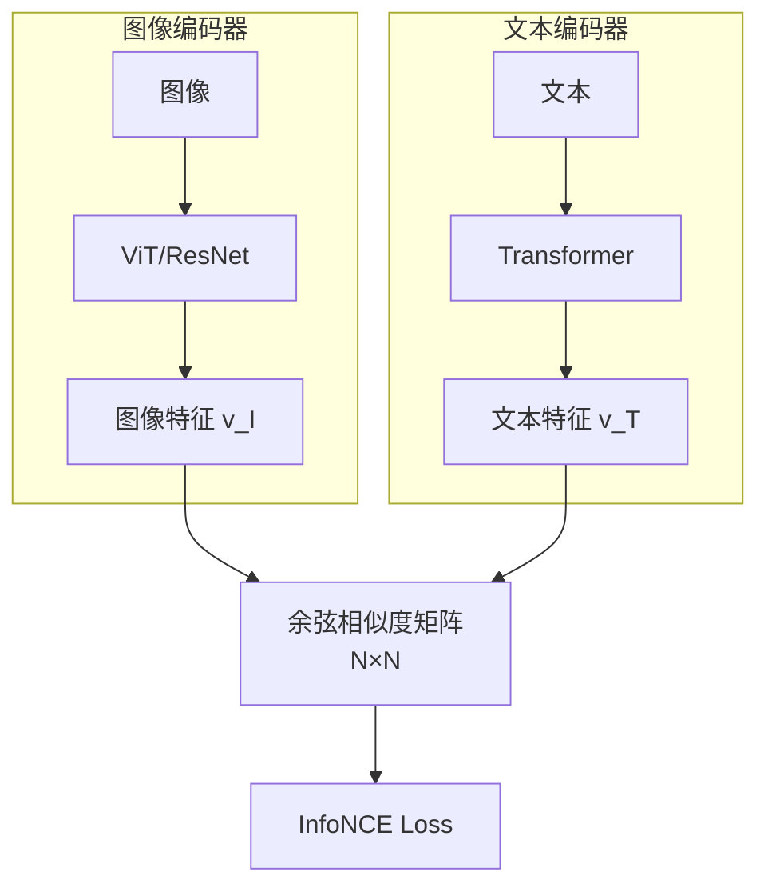

# 视觉编码器：从像素到语义

> 视觉编码器是多模态模型的"眼睛"，将连续像素转化为结构化特征向量，供后续语言模型处理。

---

## Vision Transformer (ViT)

ViT 的出现标志着计算机视觉从 CNN 向 Transformer 的彻底转型，极大削弱了对归纳偏置的依赖。

### 核心架构


### Patch Embedding 数学原理

输入图像 $\mathbf{x} \in \mathbb{R}^{H \times W \times C}$ 被划分为固定大小的 Patch（通常 $16 \times 16$）：

$$\mathbf{z}_0 = [\mathbf{x}_{cls}; \mathbf{x}_p^1\mathbf{E}; \mathbf{x}_p^2\mathbf{E}; \cdots; \mathbf{x}_p^N\mathbf{E}] + \mathbf{E}_{pos}$$

其中：
- $\mathbf{E} \in \mathbb{R}^{(P^2 \cdot C) \times D}$ 是线性投影矩阵
- $\mathbf{E}_{pos}$ 是位置编码
- 对于 $224 \times 224$ 图像，产生 $14 \times 14 = 196$ 个 Patch

### 处理流程详解

| 步骤 | 输入 | 输出 | 说明 |
| :--- | :--- | :--- | :--- |
| **Patch 切分** | 224×224×3 | 196 个 16×16×3 | 网格化切割 |
| **展平** | 16×16×3 | 768 维向量 | 每个 Patch 拉平 |
| **线性投影** | 768 维 | D 维（如 768） | 可学习投影矩阵 |
| **添加位置编码** | N×D | N×D | 赋予空间感知 |
| **添加 CLS Token** | N×D | (N+1)×D | 用于分类任务 |

### 位置编码演进

由于 Transformer 本质上是置换不变的（Permutation Invariant），位置编码至关重要。

| 方案 | 原理 | 优势 | 局限 |
| :--- | :--- | :--- | :--- |
| **可学习位置编码** | 训练时学习固定位置嵌入 | 简单有效 | 固定分辨率 |
| **正弦/余弦编码** | 固定的三角函数 | 无需训练 | 外推性有限 |
| **RoPE 2D** | 旋转位置编码扩展到二维 | 支持可变分辨率 | 实现复杂 |
| **缩放平均位置嵌入** | 编码相对感受野大小 | 多尺度适应 | 计算开销 |

::: tip 缩放平均位置嵌入
RetinaViT 引入的机制：当输入分辨率变化时，通过计算 Patch 在 3D 图像金字塔中的相对位置来调整嵌入的范数，不仅保留二维位置信息，还编码相对感受野大小。
:::

### ViT 变体对比

| 模型 | 参数量 | Patch 大小 | 特点 |
| :--- | :--- | :--- | :--- |
| **ViT-B/16** | 86M | 16×16 | 基础版本 |
| **ViT-L/14** | 304M | 14×14 | CLIP 常用 |
| **ViT-H/14** | 632M | 14×14 | 大模型 |
| **ViT-G/14** | 1.8B | 14×14 | 巨型模型 |

---

## CLIP：视觉-语言对齐

**CLIP (Contrastive Language-Image Pre-training)** 是连接视觉与文本语义的基石，通过对比学习将图像和文本映射到同一共享嵌入空间。

### 架构设计



### InfoNCE Loss 数学原理

假设 Batch 中有 $N$ 个图像-文本对 $(I_1, T_1), \dots, (I_N, T_N)$：

**相似度计算**：
$$\text{sim}(I_i, T_j) = \frac{f_I(I_i) \cdot f_T(T_j)}{\|f_I(I_i)\| \|f_T(T_j)\|}$$

**图像到文本的损失**：
$$\mathcal{L}_{I \to T, i} = -\log \frac{\exp(\text{sim}(I_i, T_i) / \tau)}{\sum_{j=1}^N \exp(\text{sim}(I_i, T_j) / \tau)}$$

**文本到图像的损失**：
$$\mathcal{L}_{T \to I, i} = -\log \frac{\exp(\text{sim}(T_i, I_i) / \tau)}{\sum_{j=1}^N \exp(\text{sim}(T_i, I_j) / \tau)}$$

**总损失**：
$$\mathcal{L} = \frac{1}{2N} \sum_{i=1}^N (\mathcal{L}_{I \to T, i} + \mathcal{L}_{T \to I, i})$$

其中 $\tau$ 是可学习的温度系数，调节分布尖锐程度。

### 训练机制解析

| 元素 | 作用 |
| :--- | :--- |
| **正样本对** | 对角线元素 $(I_i, T_i)$，最大化相似度 |
| **负样本对** | 非对角线元素 $(I_i, T_j)_{i \neq j}$，最小化相似度 |
| **温度系数 τ** | 小 τ → 分布更尖锐，学习更难的负样本 |
| **Batch Size** | 越大 → 负样本越多 → 对比学习效果越好 |

### CLIP 的革命性意义

<div class="compare-box">
  <div class="compare-item">
    <div class="compare-title">传统分类模型</div>
    <p class="compare-desc">固定类别标签（如 1000 类）<br/>无法泛化到新类别<br/>需要大量标注数据<br/>封闭词汇表</p>
  </div>
  <div class="compare-vs">VS</div>
  <div class="compare-item highlight">
    <div class="compare-title">CLIP 对比学习</div>
    <p class="compare-desc">开放词汇识别<br/>强大的 Zero-shot 能力<br/>自然语言作为监督信号<br/>任意文本描述</p>
  </div>
</div>

### Zero-shot 推理

```python
# CLIP Zero-shot 分类示例
image_features = clip.encode_image(image)
text_features = clip.encode_text(["a dog", "a cat", "a bird"])

# 计算相似度
similarity = (image_features @ text_features.T).softmax(dim=-1)
# 输出: [0.95, 0.03, 0.02] → 预测为 "a dog"
```

---

## SigLIP：改进的对比学习

SigLIP 是 CLIP 的改进版本，使用 Sigmoid Loss 替代 Softmax：

$$\mathcal{L} = -\frac{1}{N^2} \sum_{i,j} \log \sigma(y_{ij} \cdot z_{ij})$$

其中 $y_{ij} = 1$ 如果 $i = j$，否则 $y_{ij} = -1$。

**优势**：
- 不需要全局归一化，支持更大 Batch
- 训练更稳定
- 负样本利用更高效

---

## 实践建议

### 选择视觉编码器

| 场景 | 推荐 | 理由 |
| :--- | :--- | :--- |
| **通用理解** | CLIP ViT-L/14 | 平衡效果与效率 |
| **细粒度识别** | ViT-H/14 或更大 | 更多参数捕获细节 |
| **实时应用** | ViT-B/16 | 速度优先 |
| **多语言** | SigLIP | 更好的多语言支持 |

### 常见问题

::: warning 分辨率陷阱
ViT 对分辨率敏感。如果推理分辨率与训练不同，需要插值位置编码或使用支持动态分辨率的方案（如 AnyRes）。
:::

---

## 参考资源

| 论文 | 主题 |
| :--- | :--- |
| [An Image is Worth 16x16 Words](https://arxiv.org/abs/2010.11929) | ViT 原始论文 |
| [Learning Transferable Visual Models](https://arxiv.org/abs/2103.00020) | CLIP |
| [Sigmoid Loss for Language Image Pre-Training](https://arxiv.org/abs/2303.15343) | SigLIP |
