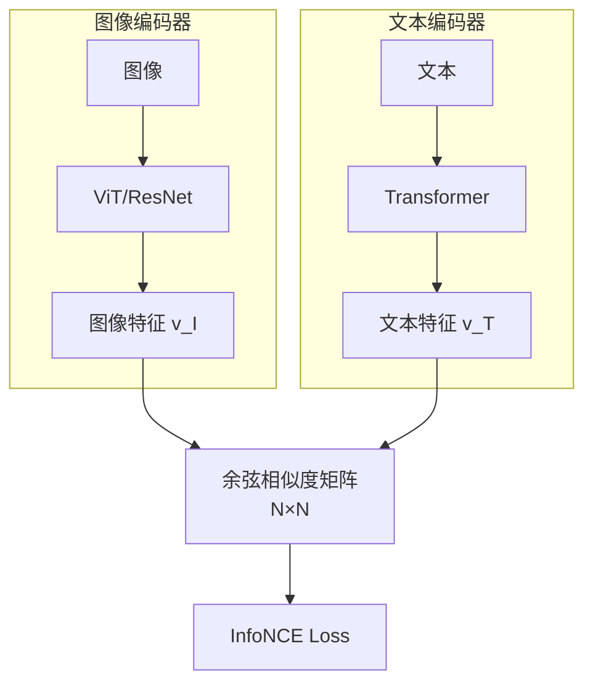
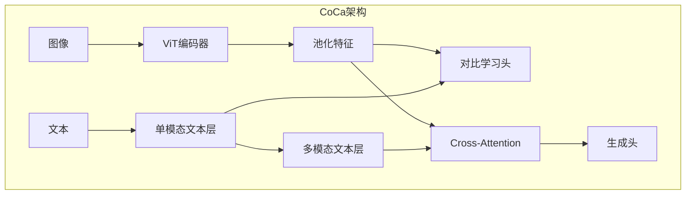

# 视觉编码器：从像素到语义

> 视觉编码器是多模态模型的"眼睛"，将连续像素转化为结构化特征向量，供后续语言模型处理。

---

## Vision Transformer (ViT)

[ViT](https://arxiv.org/abs/2010.11929)把图像 patch 序列交给 Transformer，相比卷积网络减少了局部性等内置假设，但仍有 patch 切分与位置编码等设计偏置；CNN 与混合架构仍是有效路线。

### 核心架构


```mermaid
flowchart LR
    IMG[输入图像\n224×224×3] --> PATCH[Patch 切分\n16×16]
    PATCH --> FLAT[展平\n768维向量]
    FLAT --> PROJ[线性投影\nE矩阵]
    PROJ --> POS[+ 位置编码]
    POS --> CLS[+ CLS Token]
    CLS --> ENC[Transformer Encoder\n×12层]
    ENC --> OUT[图像特征]
```

### Patch Embedding 数学原理

输入图像 `x ∈ ℝ^(H × W × C)` 被划分为固定大小的 Patch（通常 `16 × 16`）：

```text
z₀ = concat(x_cls, x_p¹ E, x_p² E, …, x_pᴺ E) + E_pos
```

其中：

- `E ∈ ℝ^((P² × C) × D)` 是线性投影矩阵
- `E_pos` 是位置编码
- 对于 `224 × 224` 图像，产生 `14 × 14 = 196` 个 Patch

### 处理流程详解

| 步骤 | 输入 | 输出 | 说明 |
| :--- | :--- | :--- | :--- |
| **Patch 切分** | 224×224×3 | 196 个 16×16×3 | 网格化切割 |
| **展平** | 16×16×3 | 768 维向量 | 每个 Patch 拉平 |
| **线性投影** | 768 维 | D 维（如 768） | 可学习投影矩阵 |
| **添加位置编码** | N×D | N×D | 赋予空间感知 |
| **添加 CLS Token** | N×D | (N+1)×D | 用于分类任务 |

### 位置编码演进

不含位置线索、采用对称可见性 mask 的 self-attention 对 token 排列是置换等变的：输入换序，输出随之换序。它本身不能知道二维坐标，因此需要位置编码；这不同于输出完全不变。

| 方案 | 原理 | 优势 | 局限 |
| :--- | :--- | :--- | :--- |
| **可学习位置编码** | 训练时学习固定位置嵌入 | 简单有效 | 固定分辨率 |
| **正弦/余弦编码** | 固定的三角函数 | 无需训练 | 外推性有限 |
| **RoPE 2D** | 旋转位置编码扩展到二维 | 支持可变分辨率 | 实现复杂 |
| **缩放平均位置嵌入** | 编码相对感受野大小 | 多尺度适应 | 计算开销 |

输入尺寸变化时，常见方案包括对固定位置嵌入做插值、使用二维相对位置或模型支持的动态分辨率处理。是否有效取决于训练分布，不能只替换位置编码而忽略图像预处理和 checkpoint 的要求。

### ViT 变体对比

| 模型 | 参数量 | Patch 大小 | 特点 |
| :--- | :--- | :--- | :--- |
| **ViT-B/16** | 86M | 16×16 | 基础版本 |
| **ViT-L/14** | 304M | 14×14 | CLIP 常用 |
| **ViT-H/14** | 632M | 14×14 | 大模型 |
| **ViT-G/14** | 1.8B | 14×14 | 巨型模型 |

---

## CLIP：视觉-语言对齐

**CLIP (Contrastive Language-Image Pre-training)** 是连接视觉与文本语义的基石，通过对比学习将图像和文本映射到同一共享嵌入空间。

### 架构设计


```mermaid
flowchart TB
    subgraph 图像编码器
        I[图像] --> VIT[ViT/ResNet]
        VIT --> VI[图像特征 v_I]
    end
    
    subgraph 文本编码器
        T[文本] --> TF[Transformer]
        TF --> VT[文本特征 v_T]
    end
    
    VI --> SIM[余弦相似度矩阵\nN×N]
    VT --> SIM
    SIM --> LOSS[InfoNCE Loss]
```

### InfoNCE Loss 数学原理

假设 Batch 中有 `N` 个图像-文本对 `(I₁, T₁), …, (Iₙ, Tₙ)`：

**相似度计算**：
```text
sim(I_i,T_j) = (f_I(I_i) · f_T(T_j)) / (||f_I(I_i)||₂ × ||f_T(T_j)||₂)
```

**图像到文本的损失**：
```text
L_I→T(i) = −log [ exp(sim(I_i,T_i) / τ)
                  / Σ_(j=1…N) exp(sim(I_i,T_j) / τ) ]
```

**文本到图像的损失**：
```text
L_T→I(i) = −log [ exp(sim(I_i,T_i) / τ)
                  / Σ_(j=1…N) exp(sim(I_j,T_i) / τ) ]
```

**总损失**：
```text
L = (1 / (2N)) × Σ_(i=1…N) [L_I→T(i) + L_T→I(i)]
```

其中 `τ` 是可学习的温度系数，调节分布尖锐程度。

#### 温度系数 τ 的深度解析

**参数化方式**：官方实现学习 `logit_scale`，计算相似度时使用 `exp(logit_scale)`；若写成温度形式，则 `1/τ = exp(logit_scale)`，初值对应 `τ = 0.07`。[CLIP 官方代码](https://github.com/openai/CLIP/blob/main/clip/model.py)

| 特性 | 说明 |
| :--- | :--- |
| **初始值** | `τ ≈ 0.07`（对应约14的倒数） |
| **训练过程** | 允许模型自适应调节对比学习难度 |
| **作用机制** | 动态调整logits分布的尖锐程度 |
| **稳定性** | 防止大规模训练中的梯度消失/爆炸 |

**数学意义**：

- **小 τ**：分布更尖锐 → 学习更难的负样本
- **大 τ**：分布更平滑 → 学习更容易
- **可学习**：模型在训练过程中动态调整最优值

### 训练机制解析

| 元素 | 作用 |
| :--- | :--- |
| **正样本对** | 对角线元素 `(I_i, T_i)`，最大化相似度 |
| **负样本对** | 非对角线元素 `(I_i, T_j)，i ≠ j`，最小化相似度 |
| **温度系数 τ** | 小 τ → 分布更尖锐，学习更难的负样本 |
| **Batch Size** | 增加候选负样本，也可能增加假负例；收益并非无限单调 |

### CLIP 的革命性意义

<div class="compare-box">
  <div class="compare-item">
    <div class="compare-title">传统分类模型</div>
    <p class="compare-desc">固定类别标签（如 1000 类）<br/>无法泛化到新类别<br/>需要大量标注数据<br/>封闭词汇表</p>
  </div>
  <div class="compare-vs">VS</div>
  <div class="compare-item highlight">
    <div class="compare-title">CLIP 对比学习</div>
    <p class="compare-desc">开放词汇识别<br/>强大的 Zero-shot 能力<br/>自然语言作为监督信号<br/>任意文本描述</p>
  </div>
</div>

### Zero-shot 推理与提示工程

#### 提示工程（Prompt Engineering）

**单模板与多模板集成**：模板改变类别的语言描述。集成先对每个模板文本特征归一化，按类别平均再归一化；是否改善由目标数据决定，不能把不同 CLIP 型号的 ImageNet 成绩当作同模型的模板增益。

```python
# 依赖 OpenAI CLIP、PyTorch、Pillow；需下载模型，本文未实测
import torch
import clip
from PIL import Image

device = "cuda" if torch.cuda.is_available() else "cpu"
model, preprocess = clip.load("ViT-B/32", device=device)
labels = ["dog", "cat", "bird"]
templates = ["a photo of a {}.", "a close-up photo of a {}."]

with torch.no_grad():
    class_features = []
    for label in labels:
        tokens = clip.tokenize([t.format(label) for t in templates]).to(device)
        features = model.encode_text(tokens)
        features = features / features.norm(dim=-1, keepdim=True)
        feature = features.mean(dim=0)
        class_features.append(feature / feature.norm())
    text_features = torch.stack(class_features)
    image = preprocess(Image.open("example.jpg").convert("RGB")).unsqueeze(0).to(device)
    image_features = model.encode_image(image)
    image_features = image_features / image_features.norm(dim=-1, keepdim=True)
    logits = model.logit_scale.exp() * image_features @ text_features.T
    probabilities = logits.softmax(dim=-1)
```

#### Zero-shot 分类流程

固定候选标签 → 用模板编码类别 → 图像预处理与编码 → 特征归一化 → 相似度与候选内 softmax。softmax 只在当前候选集里归一化；即使图像不属于任何候选，也会选出最高项。因此它不是“图片确实属于该类”的校准概率，开放集拒识需单独设计与测试。

---

## CLIP 后续演进：对比学习的优化之路

### ALIGN (Google, 2021)：规模暴力

ALIGN 探索在大规模噪声图文对上学习双塔表示；结论是弱监督数据可以有用，不是“数据越脏、规模越大越好”。抓取、过滤、语言覆盖和评估分布都影响结果，不能声称原始 CLIP 用 CLIP 自身过滤了训练数据。[ALIGN 原论文](https://arxiv.org/abs/2102.05918)

### SigLIP (2023)：损失函数革命

SigLIP 使用配对 sigmoid 损失，不需要 softmax 对所有配对相似度做全局归一化。令归一化图文向量的 logit 为 `z_ij = t × (v_i · u_j) + b`，正例 `y_ij = 1`、负例 `y_ij = −1`，可写为：

```text
L = −(1/N) × Σ_(i,j) log σ(y_ij × z_ij)
```

实际实现要说明负样本选择与归一化口径。省去全局归一化不等于消除所有跨设备通信，特征交换与梯度同步仍可能存在；sigmoid 也需稳定的 log-sigmoid 实现。[SigLIP 论文](https://arxiv.org/abs/2303.15343)

对固定模型与训练预算，比较 batch、负正比例和检索指标；多语言能力取决于 checkpoint 与训练数据，不能仅凭损失名推断。

### CoCa (Google, 2022)：理解+生成统一

**核心创新**：解耦解码器架构


```mermaid
flowchart TB
    subgraph "CoCa架构"
        IMG[图像] --> VIT[ViT编码器]
        VIT --> POOL[池化特征]
        
        TXT[文本] --> UNI[单模态文本层]
        UNI --> MULTI[多模态文本层]
        
        POOL --> CONTRA[对比学习头]
        UNI --> CONTRA
        
        POOL --> CROSS[Cross-Attention]
        MULTI --> CROSS
        CROSS --> GEN[生成头]
    end
```

**双流设计**：

| 模块 | 输入 | 任务 | 损失 |
| :--- | :--- | :--- | :--- |
| **单模态文本层** | 仅文本 | 对比学习 | Contrastive Loss |
| **多模态文本层** | 文本+图像 | 文本生成 | Captioning Loss |

**训练目标**：

```text
L_total = L_contrastive + L_captioning
```

**效果**：

- 论文报告了强零样本与迁移能力；跨模型比较须控制规模、数据与分辨率
- 同时优化对比表示与图像条件文本生成，不等于直接生成图像
- 一次前向传播计算两种损失

---

## 实践建议

### 选择视觉编码器

| 场景 | 推荐 | 理由 |
| :--- | :--- | :--- |
| **通用理解** | CLIP ViT-L/14 | 平衡效果与效率 |
| **细粒度识别** | ViT-H/14 或更大 | 更多参数捕获细节 |
| **实时应用** | ViT-B/16 | 速度优先 |
| **多语言** | 经目标语言验证的 checkpoint | 检查语言覆盖、tokenizer 与跨语言检索 |

### 常见问题

::: warning 分辨率陷阱
ViT 对分辨率敏感。如果推理分辨率与训练不同，需要插值位置编码或使用支持动态分辨率的方案（如 AnyRes）。
:::

---

### 编码器接入与验收

先固定 checkpoint、输入色彩通道、resize/crop、归一化、输出层和是否保留 CLS。用于整图检索的 pooled embedding 与送入 VLM 的 patch features 不是可直接互换的接口。

1. 用清晰/模糊、小字/大字、正常/旋转图片构造切片，测零样本分类或检索 Recall@K；不要只看 ImageNet。
2. 对候选 label 改写和换序，检查是否只对单一模板有效；包含“不属于任一类别”的负例。
3. 若接入后所有相似度异常，先查 RGB、预处理、维度和归一化；只有 OCR 差时，优先查分辨率与训练覆盖。
4. 报告每张图 token 数、编码耗时、显存和任务指标，在同一成本约束下选择模型大小。

## 参考资源

| 论文 | 主题 |
| :--- | :--- |
| [An Image is Worth 16x16 Words](https://arxiv.org/abs/2010.11929) | ViT 原始论文 |
| [Learning Transferable Visual Models](https://arxiv.org/abs/2103.00020) | CLIP |
| [Sigmoid Loss for Language Image Pre-Training](https://arxiv.org/abs/2303.15343) | SigLIP |
