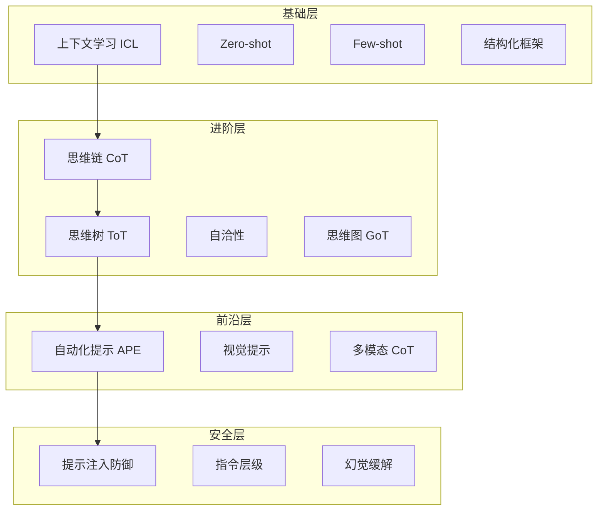
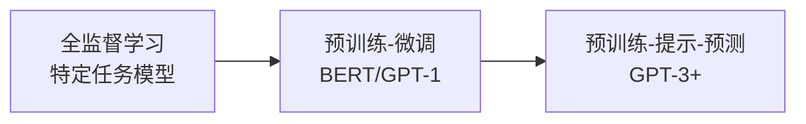
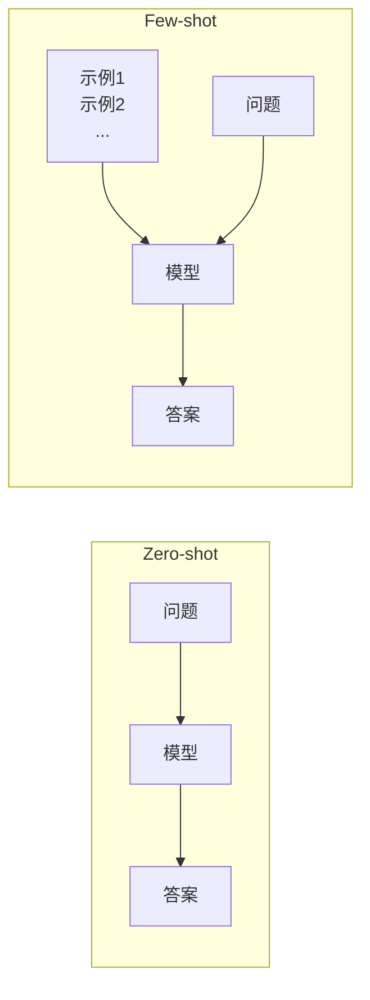
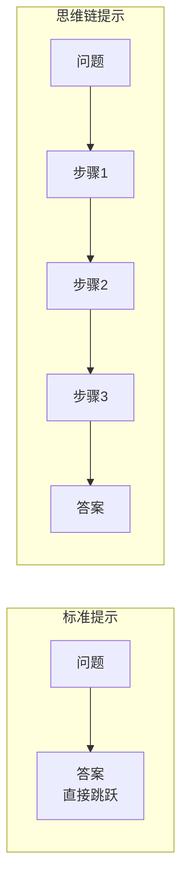
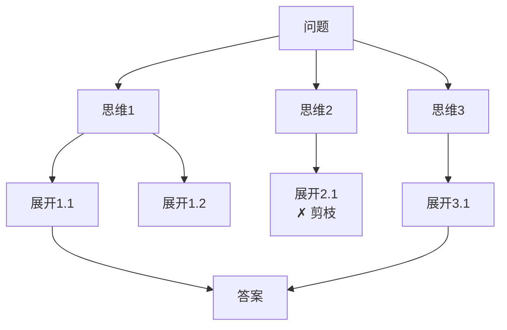
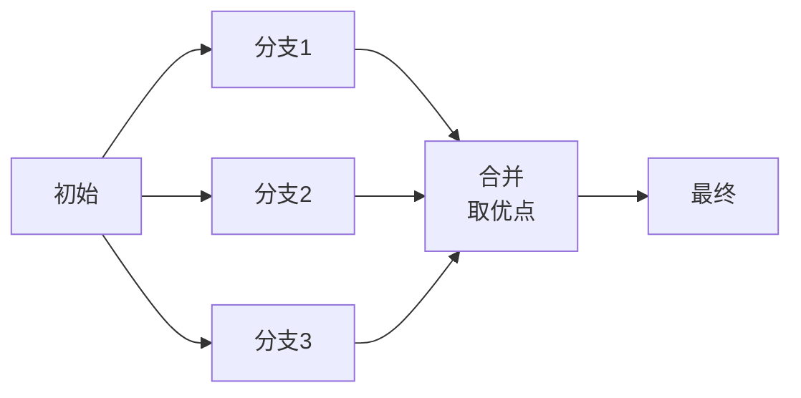
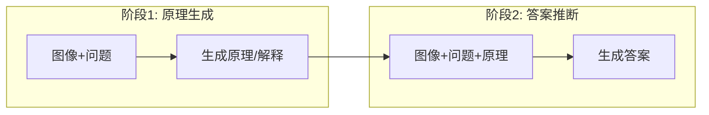

# 提示工程全景

> 提示工程已从早期的经验性技巧演变为一门融合**认知科学、计算语言学与安全工程**的系统性学科。本文解构提示工程的四层架构：基础层、进阶层、前沿层与安全层。

---

## 技术架构全景



---

## 1. 基础层：范式转移与上下文学习

### 1.1 NLP 计算范式演变



| 范式 | 特点 | 局限 |
| :--- | :--- | :--- |
| **全监督学习** | 每任务训练专用模型 | 依赖大量标注，无通用性 |
| **预训练-微调** | 预训练+任务微调 | 仍需梯度更新 |
| **预训练-提示-预测** | 任务重构为文本补全 | 仅需设计提示 |

::: tip 范式转移的意义
GPT-3 的问世标志着第三次范式转移：AI 使用门槛从"训练模型"降低到"设计提示"。提示工程因此成为**激活模型能力的核心接口**。
:::

### 1.2 上下文学习（ICL）机制

**上下文学习（In-Context Learning）** 是提示工程的物理基础——模型无需梯度更新，仅凭提示中的示例即可"学会"新任务。

**运作机制**：

| 机制 | 说明 |
| :--- | :--- |
| **非梯度更新** | 权重 $W$ 保持不变，提示改变激活状态 |
| **能力定位** | 提示作为"搜索键"，在高维空间中定位能力子空间 |
| **隐式贝叶斯推理** | 模型计算后验 $P(Target \| Context)$，示例缩减假设空间 |
| **涌现能力** | 仅在大模型（175B+）中显著涌现 |

### 1.3 CRISPE 结构化框架

CRISPE 框架将高效提示解构为六个核心组件：

| 组件 | 名称 | 功能 | 底层逻辑 |
| :--- | :--- | :--- | :--- |
| **C** | Capacity/Role | 指定角色（如"量子物理学家"） | 在潜在空间划定子空间 |
| **R** | Insight | 提供背景/上下文 | 减少语义歧义 |
| **I** | Statement | 明确任务动作 | 触发任务处理模块 |
| **S** | Style | 规定语气/文体 | 调整生成多样性 |
| **P** | Parameter | 硬性约束（格式/字数） | 设置解码边界 |
| **E** | Experiment | 提供示例（Few-Shot） | 利用 ICL 校准泛化 |

### 1.4 Zero-shot vs Few-shot



| 设置 | 机制 | 优势 | 局限 |
| :--- | :--- | :--- | :--- |
| **Zero-shot** | 纯粹理解指令语义 | 无需准备示例 | 复杂任务受限 |
| **Few-shot** | 示例充当"梯度替代品" | 显著提升准确率 | 消耗上下文窗口 |

**Few-shot 关键因素**：
- 示例的**类别平衡**影响显著
- 示例**顺序**会影响结果
- 标签**正确性**并非总是必需（格式更重要）

---

## 2. 进阶层：逻辑推理与思维链

### 2.1 思维链（Chain-of-Thought）

**CoT** 是提示工程的里程碑，通过中间推理步骤解锁复杂推理能力。



**为什么 CoT 有效？**

| 理论 | 解释 |
| :--- | :--- |
| **可变计算量** | 每个中间 Token 都经过完整 Transformer 处理，"购买"更多计算时间 |
| **逻辑展开** | 将复杂推理"展开"在时间轴上逐步解决 |
| **语义锚定** | 自然语言作为思维载体，锚定问题的语义逻辑 |

**Zero-shot CoT**：只需添加 **"Let's think step by step"** 即可激活零样本推理能力！

### 2.2 思维树（Tree of Thoughts）

CoT 是线性的，一步错则步步错。**ToT** 引入搜索算法，构建非线性求解架构。



**ToT 四大模块**：

| 模块 | 功能 |
| :--- | :--- |
| **思维分解** | 将问题分解为中间步骤 |
| **思维生成** | 每步生成多个候选思维 |
| **状态评估** | 模型自评估候选（Sure/Maybe/Impossible） |
| **搜索算法** | BFS/DFS + 回溯，探索全局最优 |

**24 点游戏案例**：CoT 成功率 4% → ToT 成功率 **74%**

### 2.3 思维图（Graph of Thoughts）

ToT 的进一步扩展，思维节点可**分叉**也可**合并**。



**适用场景**：创意写作——先发散生成多个草稿，再收敛合并最佳元素。

### 2.4 自洽性（Self-Consistency）

利用模型输出随机性提升鲁棒性：

1. 对同一 Prompt 生成多个（如 40 个）推理路径
2. 设置较高 Temperature（如 0.7）
3. 对答案进行**多数投票**

**原理**：正确推理路径相似，错误路径千奇百怪。统计学方法滤除偶然错误。

---

## 3. 前沿层：自动化与多模态

### 3.1 自动化提示工程（APE）

**核心思想**：用 LLM 自身寻找最优提示。


**PE2 框架**：

| 组件 | 作用 |
| :--- | :--- |
| **详细描述** | 明确优化目标 |
| **上下文规范** | 提供错误模式分析 |
| **逐步推理模板** | 强制先分析缺陷再改进 |

**效果**：生成的提示比人工设计的 "Let's think step by step" 性能高出 **6.3%**。

### 3.2 视觉提示（Visual Prompting）

将提示工程的灵活性引入计算机视觉——**所有视觉任务统一为图像修复问题**。

```
┌─────────┬─────────┐
│ 示例输入 │ 示例输出 │  ← 展示"规则"
├─────────┼─────────┤
│ 查询输入 │  [掩码]  │  ← 模型填补
└─────────┴─────────┘
```

**实现**：
- 拼接为 4 格图像网格
- 模型通过观察上方示例推断规则
- 填补右下角掩码区域

### 3.3 多模态思维链

直接在多模态模型应用 CoT 面临严重幻觉问题。**两阶段框架**解决方案：



**效果**：10 亿参数模型超越 GPT-3.5，证明结构化提示可弥补规模劣势。

---

## 4. 安全层：攻击与防御

### 4.1 提示注入攻击

**提示注入（Prompt Injection）**：攻击者诱导模型忽略系统提示，执行恶意指令。

| 类型 | 方式 | 示例 |
| :--- | :--- | :--- |
| **直接注入** | 直接下令 | "忽略之前的指令..." |
| **间接注入** | 第三方数据携带 | 网页内容中嵌入指令 |

### 4.2 DAN 越狱模式

**DAN（Do Anything Now）** 是最著名的越狱攻击，基于**角色扮演**的心理学攻击。

**攻击原理**：
- 构建虚构框架，迫使模型在"安全准则"与"角色扮演"间冲突
- 利用 LLM 的**顺从性偏好**
- 模型优先维持对话连贯性而牺牲安全性

**变体**：Base64 编码、多语言翻译、摩斯密码等绕过关键词过滤。

### 4.3 指令层级防御

**根本性解决方案**：建立指令优先级体系。

| 层级 | 来源 | 优先级 | 权限 |
| :--- | :--- | :--- | :--- |
| **$\Phi_0$** | 系统指令 | 最高 | 定义行为边界 |
| **$\Phi_1$** | 用户指令 | 次级 | 在 $\Phi_0$ 约束下执行 |
| **$\Phi_2$** | 数据 | 最低 | 仅作处理对象，禁止执行 |

**实现**：指令片段嵌入（Instructional Segment Embedding）——在 Token 嵌入层添加来源标识。

**效果**：DAN 攻击成功率从 50%+ 降至接近 **0%**。

### 4.4 幻觉缓解

**成因**：过度依赖语言先验（Language Priors），忽视视觉证据。

**缓解策略**：

| 层面 | 方法 |
| :--- | :--- |
| **Prompt** | Visual CoT，强制先列出检测到的物体 |
| **解码** | 视觉对比解码（VCD），惩罚高频词汇 |

---

## 5. 推理模型的范式转变

### AI模型的"大分流"

AI模型正在经历一场深刻的**"大分流"（Bifurcation）**——我们不再面对单一类型的模型，而是两种截然不同的认知引擎，这与人类的"系统1"与"系统2"思维理论相呼应。

### 系统 1 vs 系统 2

| 特性 | 系统 1（GPT-4o） | 系统 2（o1/o3） |
| :--- | :--- | :--- |
| **思维方式** | 快速直觉 | 慢速审慎 |
| **推理过程** | 外部引导（需CoT提示） | 内部自主（原生推理） |
| **提示策略** | CoT 有效 | **简洁直接** |
| **适用场景** | 聊天、创意写作、快速响应 | 数学、逻辑、编程、复杂研究 |
| **成本效率** | 速度快、成本低 | 速度慢、成本高 |

### 核心转变：从"提示推理"到"使用推理"

在"经典"的GPT-3.5/4时代，开发者通过CoT等技巧**模拟"系统2"思考**。现在，o-系列模型**原生具备"系统2"能力**——推理在模型内部发生，开发者的工作从"创建推理脚手架"转变为"调用、引导和约束原生推理能力"。

::: warning 重要变化
对于推理模型（o1 系列），传统 CoT 提示**反而有害**！OpenAI官方明确指出："避免使用思维链提示"。
:::

### o-系列提示最佳实践

| 原则 | 说明 |
| :--- | :--- |
| **保持简洁直接** | 不要把模型当作需要哄骗的黑盒 |
| **使用developer消息** | 替代system消息，符合命令链行为 |
| **用分隔符提高清晰度** | Markdown标题、XML标签组织复杂输入 |
| **首先信任零样本** | 推理模型通常不需要少样本示例 |
| **提供具体约束** | 明确陈述条件（如"预算在$500以下"） |
| **明确最终目标** | 为成功响应提供具体参数 |

```python
# ❌ 传统 CoT（对 o1 反而有害）
prompt_old = "请一步一步思考：1. 首先分析... 2. 然后..."

# ✅ 推理模型最佳实践
prompt_new = "解决以下问题：[问题]。直接给出最终答案。"

# ✅ 带约束的推理请求
prompt_constrained = """
提出一个预算在 $500 美元以下的解决方案。
要求：使用开源技术栈，部署在云端。
"""
```

### "规划者/执行者"架构

o-系列模型的真正威力在于**智能体工作流**中的应用——"多步智能体规划"架构：

```
┌─────────────────────────────────────────────────────────────┐
│                  规划者/执行者架构                            │
├─────────────────────────────────────────────────────────────┤
│                                                             │
│  ┌─────────────────┐        ┌─────────────────┐            │
│  │   规划者         │ ───→  │   执行者         │            │
│  │   (o1/o3-mini)   │        │   (GPT-4o)      │            │
│  ├─────────────────┤        ├─────────────────┤            │
│  │ • 制定战略       │        │ • 执行具体步骤   │            │
│  │ • 分解大问题     │        │ • 快速响应      │            │
│  │ • 选择工具       │        │ • 低延迟任务    │            │
│  └─────────────────┘        └─────────────────┘            │
│                                                             │
│  思考（系统2）                行动（系统1）                   │
└─────────────────────────────────────────────────────────────┘
```

**真实案例**：
- **Argon AI（制药行业）**："我们使用o1作为规划者，协调工作流中的其他模型"
- **Lindy.AI**：o-系列模型"使用函数调用从日历或电子邮件中提取信息，自动帮助安排会议"

---

## 6. Prompt Caching：提示缓存优化

### 为什么需要 Prompt Caching？

在使用 OpenAI 模型时，**Prompt Caching** 是显著降低成本和延迟的关键技术：

| 维度 | 无缓存 | 有缓存 |
| :--- | :--- | :--- |
| **延迟** | 完整处理所有Token | 仅处理增量部分 |
| **成本** | 全量计费 | 缓存部分50%折扣 |
| **适用** | 首次请求 | 重复前缀请求 |

### 缓存机制原理

```
┌─────────────────────────────────────────────────────────────┐
│                  Prompt Caching 工作原理                     │
├─────────────────────────────────────────────────────────────┤
│                                                             │
│  第一次请求：                                                │
│  [系统提示 + Few-shot示例 + 用户问题A]                        │
│   ↓ 完整处理                                                │
│  [系统提示 + Few-shot示例] → 缓存                            │
│                                                             │
│  第二次请求：                                                │
│  [系统提示 + Few-shot示例 + 用户问题B]                        │
│   ↓ Cache Hit!                                              │
│  仅处理 [用户问题B] 部分                                      │
│                                                             │
└─────────────────────────────────────────────────────────────┘
```

### 缓存优化最佳实践

| 策略 | 说明 |
| :--- | :--- |
| **静态前缀最大化** | 将系统提示、Few-shot示例放在最前面 |
| **动态内容后置** | 用户输入、变量内容放在最后 |
| **保持前缀一致** | 一个字符改动就会导致缓存失效 |
| **合理设置TTL** | 缓存有效期通常为数小时至数天 |

```python
from openai import OpenAI
client = OpenAI()

# 可缓存的静态前缀
STATIC_PREFIX = """你是一个专业的技术文档助手。
请用中文回答问题，格式清晰。

示例1：问：什么是RAG？答：RAG是检索增强生成技术...
示例2：问：什么是Embedding？答：Embedding是向量表示...
"""

# 首次调用（缓存建立）
response1 = client.chat.completions.create(
    model="gpt-4.1",
    messages=[
        {"role": "system", "content": STATIC_PREFIX},
        {"role": "user", "content": "什么是Prompt Caching？"}
    ]
)

# 后续调用（命中缓存，仅处理新问题）
response2 = client.chat.completions.create(
    model="gpt-4.1",
    messages=[
        {"role": "system", "content": STATIC_PREFIX},  # 命中缓存
        {"role": "user", "content": "如何优化LLM性能？"}  # 仅处理此部分
    ]
)
```

### 缓存失效场景

::: warning 注意事项
- 修改前缀内容（即使一个字符）→ 缓存失效
- 切换模型版本 → 缓存失效
- 修改温度等参数 → 生成新的缓存Key
- 缓存是**按用户隔离**的，不跨API Key共享
:::

---

## 7. 评测：LLM-as-a-Judge

传统指标（BLEU/ROUGE）仅计算 N-gram 重叠，对开放式任务几乎失效。

| 维度 | BLEU/ROUGE | LLM-as-a-Judge |
| :--- | :--- | :--- |
| **机制** | 词汇重叠统计 | 深度语义理解 |
| **适用** | 翻译、摘要 | 推理、创意写作 |
| **准确性** | 低 | 接近人类专家 |
| **可解释性** | 无 | 可提供打分理由 |

---

## 📚 学习路线

<div class="learning-path">
  <div class="path-step step-1">
    <div class="step-num">1</div>
    <div class="step-title">基础技术</div>
    <ul>
      <li><a href="/llms/prompt/basics">Zero/Few-shot</a></li>
      <li>CRISPE 框架</li>
      <li>ICL 机制</li>
    </ul>
  </div>
  <div class="path-arrow">→</div>
  <div class="path-step step-2">
    <div class="step-num">2</div>
    <div class="step-title">高级技术</div>
    <ul>
      <li><a href="/llms/prompt/advanced">CoT/ToT/GoT</a></li>
      <li>自洽性</li>
      <li>ReAct</li>
    </ul>
  </div>
  <div class="path-arrow">→</div>
  <div class="path-step step-3">
    <div class="step-num">3</div>
    <div class="step-title">安全与前沿</div>
    <ul>
      <li><a href="/llms/prompt/security">安全防御</a></li>
      <li><a href="/llms/prompt/context">上下文工程</a></li>
      <li>APE 自动化</li>
    </ul>
  </div>
</div>

---

## 🔗 章节导航

| 章节 | 内容 | 状态 |
| :--- | :--- | :--- |
| [基础技术](/llms/prompt/basics) | Zero-shot、Few-shot、ICL 机制 | 📝 |
| [高级技术](/llms/prompt/advanced) | CoT、ToT、GoT、自洽性 | 📝 |
| [上下文工程](/llms/prompt/context) | 动态检索、记忆管理、RAG | 📝 |
| [安全测试](/llms/prompt/security) | 注入防御、越狱、红队测试 | 📝 |

---

## 📚 深度系列文章

| 文章 | 简介 |
| :--- | :--- |
| [从指令到智能：提示词工程与上下文工程](https://dd-ff.blog.csdn.net/article/details/152799914) | 提示词到上下文工程的演进 |
| [掌握 AI 推理：从"提示工程"到"推理架构"](https://dd-ff.blog.csdn.net/article/details/154479954) | 系统 1/系统 2 认知分流 |
| [OpenAI Prompt Engineering 与 Prompt Caching 实战](https://dd-ff.blog.csdn.net/article/details/154450002) | Prompt缓存机制详解 |
| [深入解析 DSPy：从提示工程到程序编译](https://dd-ff.blog.csdn.net/article/details/151709925) | DSPy 编程范式 |
| [红队测试手册：promptfoo 探索 LLM 安全](https://dd-ff.blog.csdn.net/article/details/151834721) | LLM 安全测试 |
| [LangGraph 上下文工程权威指南](https://dd-ff.blog.csdn.net/article/details/151118698) | 静态/动态/持久化上下文 |

---

## 🌐 核心资源

### 重要论文

| 论文 | 主题 |
| :--- | :--- |
| [Language Models are Few-Shot Learners (GPT-3)](https://arxiv.org/abs/2005.14165) | 上下文学习 |
| [Chain-of-Thought Prompting](https://arxiv.org/abs/2201.11903) | 思维链 |
| [Tree of Thoughts](https://arxiv.org/abs/2305.10601) | 思维树 |
| [Large Language Models Are Human-Level Prompt Engineers](https://arxiv.org/abs/2211.01910) | APE |
| [Visual Prompting via Image Inpainting](https://arxiv.org/abs/2209.00647) | 视觉提示 |

### 工具框架

| 工具 | 说明 |
| :--- | :--- |
| [OpenAI Prompt Engineering](https://platform.openai.com/docs/guides/prompt-engineering) | 官方指南 |
| [DSPy](https://github.com/stanfordnlp/dspy) | 程序化提示框架 |
| [promptfoo](https://github.com/promptfoo/promptfoo) | LLM 测试工具 |
| [ChainForge](https://github.com/ianarawjo/ChainForge) | 可视化评估 |

---

> **展望**：提示工程可能逐渐"消亡"——并非因为它不重要，而是因为它将通过**流工程（Flow Engineering）** 和**智能体编排（Agentic Orchestration）** 融入更宏大的系统架构。
