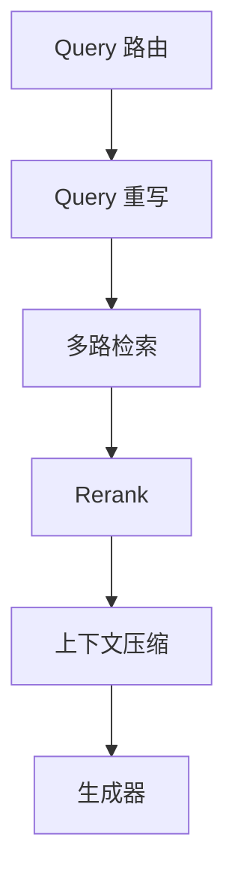
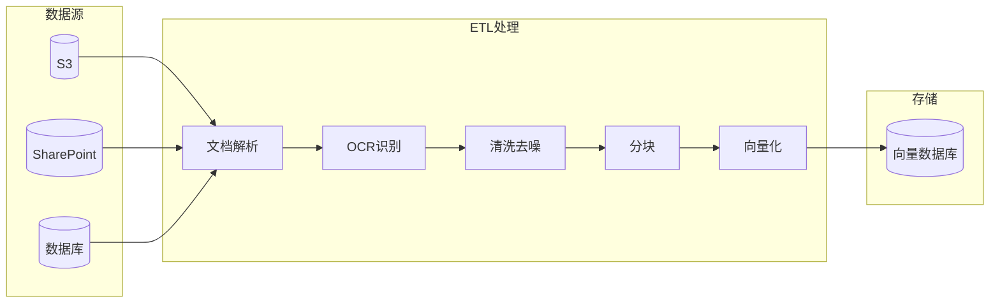
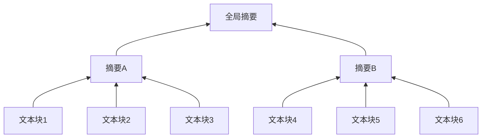
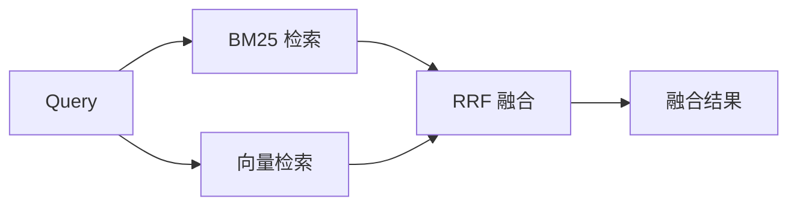

---
title: RAG 技术全景
description: 检索增强生成（RAG）技术深度综述：从架构原理到工程实践
---

# RAG 技术全景：从架构原理到工程实践

> **检索增强生成（Retrieval-Augmented Generation，RAG）** 是大语言模型时代最重要的技术范式之一。它通过将 LLM 的**参数化记忆**（模型权重中隐式编码的知识）与**非参数化记忆**（外部知识库）相结合，有效解决了大模型的知识滞后、幻觉和私有数据访问问题，为企业级 AI 应用提供了一条可信、可控、可解释的落地路径。

---

## 1. 引言：从参数化到非参数化记忆

### 1.1 大模型的固有缺陷

传统 LLM（如 GPT-3、Llama）将训练数据中的知识隐式编码在神经网络的数千亿权重参数中。这种**参数化记忆**存在显著缺陷：

| 问题 | 表现 | 影响 |
| :--- | :--- | :--- |
| **知识滞后** | 训练数据有截止日期 | 无法回答最新事件 |
| **幻觉问题** | 自信地生成错误信息 | 降低可信度 |
| **私有数据盲区** | 无法访问企业内部数据 | 限制应用场景 |
| **上下文限制** | Token 窗口有限 | 无法处理超长文档 |

### 1.2 RAG 的核心思想

RAG 引入**非参数化记忆**（外部知识库），让 AI 在生成前先检索相关信息：


**核心优势**：
-  **知识可更新**：修改知识库即可更新，无需重新训练
-  **可溯源验证**：生成内容可追溯到具体文档
-  **私有数据支持**：企业文档、内部知识库均可接入
-  **成本可控**：相比微调，成本大幅降低

---

## 2. 架构演进：从朴素到智能

RAG 技术经历了四代演进，每一代都解决了前一代的核心痛点：

<div class="paradigm-timeline">
  <div class="paradigm-item">
    <div class="paradigm-year">2020</div>
    <div class="paradigm-name">Naive RAG</div>
    <div class="paradigm-desc">检索-生成<br>线性流程</div>
  </div>
  <div class="paradigm-item">
    <div class="paradigm-year">2022</div>
    <div class="paradigm-name">Advanced RAG</div>
    <div class="paradigm-desc">重写-检索-重排<br>混合检索</div>
  </div>
  <div class="paradigm-item">
    <div class="paradigm-year">2023</div>
    <div class="paradigm-name">Modular RAG</div>
    <div class="paradigm-desc">模块化组件<br>灵活编排</div>
  </div>
  <div class="paradigm-item highlight">
    <div class="paradigm-year">2024+</div>
    <div class="paradigm-name">Agentic RAG</div>
    <div class="paradigm-desc">自主规划<br>多步推理</div>
  </div>
</div>

### 2.1 Naive RAG（朴素 RAG）

最基础的"检索-读取-生成"线性流程：


**局限性**：
- 检索质量完全依赖 Query 与文档的向量相似度
- 无法处理复杂、多跳推理问题
- 噪声文档直接影响生成质量

### 2.2 Advanced RAG（高级 RAG）

引入**预检索**和**后检索**优化模块：

| 阶段 | 技术 | 作用 |
| :--- | :--- | :--- |
| **预检索** | Query 重写、扩展、HyDE | 提升检索召回率 |
| **检索** | 混合检索（稠密+稀疏） | 兼顾语义与关键词匹配 |
| **后检索** | Rerank 重排序 | 精选高质量文档 |

### 2.3 Modular RAG（模块化 RAG）

将 RAG 拆解为可插拔的独立模块，支持灵活编排：



### 2.4 Agentic RAG（代理 RAG）

LLM 作为智能代理，自主决策检索策略：

- **自主规划**：决定是否需要检索、检索什么
- **工具使用**：调用搜索引擎、数据库、计算器等
- **多轮交互**：反复与知识库交互直到满意
- **自我反思**：评估答案质量，必要时重新检索

::: tip 适用场景
Agentic RAG 特别适合**法律尽职调查**、**金融研报分析**、**医疗诊断辅助**等需要多步推理的复杂任务。
:::

---

## 3. 数据准备：高质量 RAG 的基石

> **"Garbage In, Garbage Out"**  数据质量决定 RAG 上限。

### 3.1 ETL 流水线

企业数据通常是异构的非结构化数据（PDF、PPT、Word、扫描件）。ETL 流水线负责将其转化为可索引的清洁文本：



**关键挑战**：
- **布局分析**：识别标题、正文、表格、页眉页脚（工具：Unstructured.io、LlamaParse）
- **OCR 识别**：多栏排版、手写体、低质量扫描件
- **数据清洗**：乱码去除、格式标准化、PII 脱敏

### 3.2 分块策略（Chunking Strategies）

分块是将长文档切分为小片段的过程。**核心权衡**：块太小导致上下文缺失，块太大引入噪声。

#### 3.2.1 固定大小分块

```python
# 示例：按 Token 数量切分，带重叠窗口
chunk_size = 500  # tokens
overlap = 50      # 重叠量，缓解边缘语义丢失
```

| 优点 | 缺点 |
| :--- | :--- |
| 实现简单、效率高 | 可能粗暴打断语义流 |
| 块大小一致 | 不考虑文档结构 |

#### 3.2.2 递归字符分块

使用层级分隔符（段落 `\n\n`  句子 `\n`  空格）递归切分：

```python
# LangChain RecursiveCharacterTextSplitter
separators = ["\n\n", "\n", " ", ""]
# 优先段落切分，段落过长则按句子切分
```

**优势**：较好地保留文本自然结构，是 LangChain 默认策略。

#### 3.2.3 语义分块（Semantic Chunking）

利用 Embedding 模型计算相邻句子的语义相似度，在**相似度骤降处**切分：


**优势**：确保每个块是独立语义单元，检索相关性最高。  
**代价**：需要额外的 Embedding 计算开销。

#### 3.2.4 代理分块（Agentic Chunking）

让 LLM 阅读文本并决定最佳切分点。适合**高价值复杂文档**（法律合同、代码库）。

#### 3.2.5 结构化分块

基于文档结构（Markdown 标题、HTML 标签）切分：

```python
# MarkdownHeaderTextSplitter
headers_to_split_on = [
    ("#", "Header 1"),
    ("##", "Header 2"),
]
```

### 3.3 分块策略选型指南

| 策略 | 适用场景 | 实现复杂度 | 语义完整性 |
| :--- | :--- | :---: | :---: |
| 固定大小 | 简单文本、快速原型 |  |  |
| 递归字符 | 通用文档（默认推荐） |  |  |
| 语义分块 | 话题转换频繁的文档 |  |  |
| 代理分块 | 高价值复杂文档 |  |  |
| 结构化分块 | 技术文档、Markdown |  |  |

### 3.4 多模态数据处理

现实数据不仅是文本，**表格和图片**往往承载关键信息。

**表格处理**：
1. 使用 LLM 生成表格摘要进行索引
2. 生成时将原始表格（HTML/Markdown）作为上下文

**图片处理**：
1. 多模态 LLM（GPT-4o、Llava）生成图片描述
2. 多模态 Embedding（CLIP）直接将图片映射到向量空间

---

## 4. 索引构建：从扁平列表到多维结构

### 4.1 向量空间：稠密 vs 稀疏

<div class="compare-box">
  <div class="compare-item">
    <div class="compare-title">稠密向量 (Dense)</div>
    <div class="compare-flow">BERT/OpenAI  1536维实数向量</div>
    <p class="compare-desc"> 语义匹配强（"手机""移动电话"）<br> 专有名词、代码匹配弱</p>
  </div>
  <div class="compare-vs">VS</div>
  <div class="compare-item">
    <div class="compare-title">稀疏向量 (Sparse)</div>
    <div class="compare-flow">BM25/SPLADE  高维稀疏向量</div>
    <p class="compare-desc"> 关键词精确匹配（错误码、序列号）<br> 缺乏语义理解</p>
  </div>
</div>

**最佳实践**：混合检索（Hybrid Search）结合两者优势。

### 4.2 RAPTOR：递归树状索引

解决传统 RAG 无法回答**宏观概括类问题**的痛点（如"这份文档主要讲什么？"）。



**构建流程**：
1. 底层：原始文本块作为叶子节点
2. 聚类：使用 GMM 对相似块聚类
3. 摘要：LLM 对每个聚类生成摘要
4. 递归：将摘要作为新节点，重复聚类-摘要过程
5. 检索：可从根部（宏观）或叶子（细节）检索

### 4.3 GraphRAG：知识图谱增强

微软提出的 GraphRAG 将文本转化为**实体-关系知识图谱**：

<div class="compare-box">
  <div class="compare-item">
    <div class="compare-title">传统向量 RAG</div>
    <div class="compare-flow">向量相似度  <strong>单跳检索</strong></div>
    <p class="compare-desc">寻找"相似性"。难以连接分散在不同文档的关联信息。</p>
  </div>
  <div class="compare-vs">VS</div>
  <div class="compare-item highlight">
    <div class="compare-title">GraphRAG</div>
    <div class="compare-flow">实体关系图谱  <strong>多跳推理</strong></div>
    <p class="compare-desc">寻找"关联性"。文档A提到"项目X"，文档B提到"项目X由Alice负责"，图谱可连接两者。</p>
  </div>
</div>

---

## 5. 向量数据库选型 (2025)

| 数据库 | 类型 | 核心优势 | 适用场景 | 索引算法 |
| :--- | :--- | :--- | :--- | :--- |
| **Pinecone** | SaaS 闭源 | Serverless、零运维 | 生产环境 | 专有算法 |
| **Milvus** | 开源/托管 | 十亿级规模、分布式 | 大规模应用 | IVF, HNSW |
| **Weaviate** | 开源/托管 | 原生混合搜索 | 复杂查询 | HNSW |
| **Qdrant** | 开源/托管 | Rust 高性能 | 性能敏感 | HNSW |
| **Chroma** | 开源 | 开发者友好 | 本地开发 | HNSW |

::: tip 选型建议
- **初创团队**：Pinecone Serverless（零运维）
- **大厂/自建**：Milvus（规模与性能）
- **隐私敏感**：Chroma/Qdrant（本地部署）
:::

---

## 6. 检索优化：超越简单相似度

### 6.1 混合检索（Hybrid Search）

结合关键词检索（BM25）和语义检索（Dense Vector）：



**RRF（倒数排名融合）公式**：

$$RRF_{score}(d) = \sum_{r \in R} \frac{1}{k + rank_r(d)}$$

### 6.2 Query 优化策略

#### 6.2.1 Query 重写与扩展

| 原始 Query | 重写变体 |
| :--- | :--- |
| "RAG 慢怎么调？" | "RAG 延迟优化策略"、"向量数据库索引加速" |

#### 6.2.2 HyDE（假设性文档嵌入）

颠覆性思路：先让 LLM 编造"假设答案"，用假设答案的向量去搜真实答案。


**原理**：假设答案的**语义结构、用词习惯**与真实文档高度相似。

#### 6.2.3 Step-Back Prompting

面对具体问题时，先提出更抽象的问题获取背景知识：

| 原始问题 | Step-back 问题 |
| :--- | :--- |
| "2005年谁是Google的工程副总裁？" | "列出Google历任高管名单" |

---

## 7. 重排机制（Rerank）

检索阶段召回 Top-100 文档中包含大量噪声。**重排器**对候选文档进行精细打分，筛选 Top-5 精华。

### 7.1 双编码器 vs 交叉编码器

| 类型 | 原理 | 速度 | 精度 |
| :--- | :--- | :---: | :---: |
| **双编码器** | 分别编码，向量相似度 |  快 | 一般 |
| **交叉编码器** | 拼接输入，深度交互 |  慢 | 极高 |


### 7.2 主流 Rerank 模型

| 模型 | 类型 | 优势 |
| :--- | :--- | :--- |
| **Cohere Rerank 3.5** | 商用 API | 多语言、代码检索 |
| **BGE-Reranker-v2-m3** | 开源 | 中文更优、可私有部署 |

---

## 8. 生成优化与上下文增强

### 8.1 "迷失中间"现象

LLM 对上下文的注意力呈 **U 型曲线**：最关注开头和结尾，容易忽略中间。

**优化策略**：将最相关文档放在首尾，次相关放中间。

### 8.2 Prompt 压缩（LLMLingua）

利用小型语言模型计算每个 Token 的信息熵，剔除冗余 Token：

- 可压缩 **80% tokens**，几乎不损失生成质量
- 大幅降低推理成本和延迟

### 8.3 引用溯源

在 System Prompt 中强制要求模型标注来源：

```
生成的每一句话必须标注来源 ID，格式如 [1][2]。
如果无法从检索内容中找到依据，请明确说明"未找到相关信息"。
```

---

## 9. RAG 评估体系

### 9.1 RAG 三元组（The RAG Triad）

| 指标 | 评估对象 | 问题 |
| :--- | :--- | :--- |
| **Context Relevance** | 检索器 | 检索到的内容和问题相关吗？ |
| **Faithfulness** | 生成器 | 答案完全基于检索内容吗？ |
| **Answer Relevance** | 端到端 | 答案真正回答了用户问题吗？ |

### 9.2 自动化评估框架

| 框架 | 特点 | 适用场景 |
| :--- | :--- | :--- |
| **[RAGAS](https://docs.ragas.io/)** | LLM 无参考评估 | 快速迭代 |
| **[TruLens](https://trulens.org/)** | 全链路追踪 | 生产监控 |

---

## 10. 未来展望

| 趋势 | 描述 |
| :--- | :--- |
| **多模态原生** | 图片、视频、音频跨模态检索成为标配 |
| **图文融合** | GraphRAG 普及，知识图谱 + 向量检索 |
| **端侧 RAG** | SLM + 本地向量库，隐私 RAG |
| **Agentic 深化** | 更复杂的多步推理、工具编排 |

---

##  学习路线与资源

<div class="learning-path">
  <div class="path-step step-1">
    <div class="step-num">1</div>
    <div class="step-title">入门基础</div>
    <ul>
      <li><a href="/llms/rag/paradigms">RAG 范式演进</a></li>
      <li><a href="/llms/rag/embedding">Embedding 原理</a></li>
      <li><a href="/llms/rag/vector-db">向量数据库入门</a></li>
    </ul>
  </div>
  <div class="path-arrow"></div>
  <div class="path-step step-2">
    <div class="step-num">2</div>
    <div class="step-title">核心技术</div>
    <ul>
      <li><a href="/llms/rag/chunking">分块策略</a></li>
      <li><a href="/llms/rag/retrieval">混合检索</a></li>
      <li><a href="/llms/rag/rerank">Rerank 重排序</a></li>
    </ul>
  </div>
  <div class="path-arrow"></div>
  <div class="path-step step-3">
    <div class="step-num">3</div>
    <div class="step-title">高级进阶</div>
    <ul>
      <li><a href="/llms/rag/production">GraphRAG & Agentic</a></li>
      <li><a href="/llms/rag/evaluation">RAGAs 评估体系</a></li>
    </ul>
  </div>
</div>

###  深度系列文章

| 模块 | 文章 | 简介 |
| :--- | :--- | :--- |
| **综述** | [RAG 技术范式与未来展望](https://dd-ff.blog.csdn.net/article/details/149274498) | Naive/Advanced/Modular 全解析 |
| **数据** | [15种分块策略秘籍](https://dd-ff.blog.csdn.net/article/details/149529161) | 语义切分、代理切分实战 |
| **检索** | [HNSW 向量检索算法](https://dd-ff.blog.csdn.net/article/details/149275016) | 毫秒级近似最近邻搜索 |
| **高阶** | [GraphRAG 完整教程](https://dd-ff.blog.csdn.net/article/details/154530805) | 知识图谱增强多跳推理 |

---

> **注**：本文基于 2024-2025 年行业前沿研究整理。RAG 技术仍在快速演进中。
