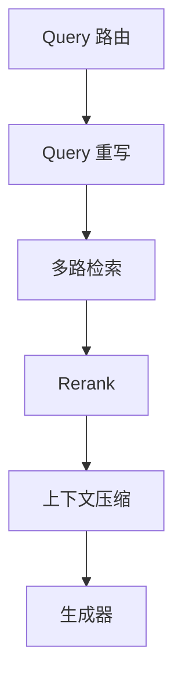
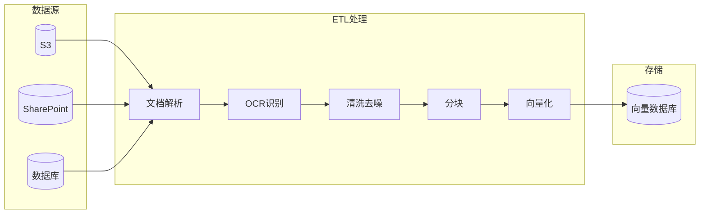
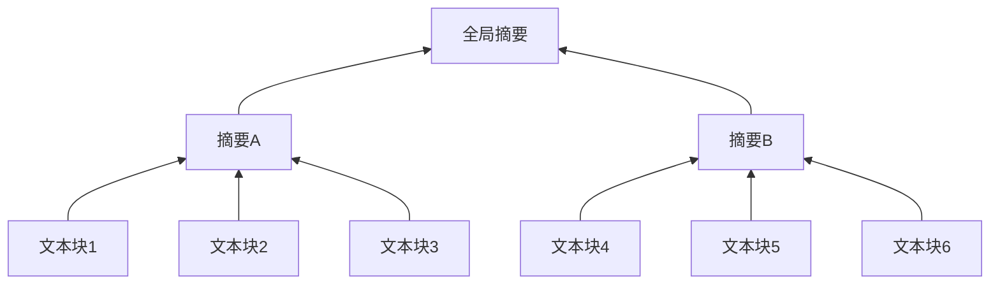
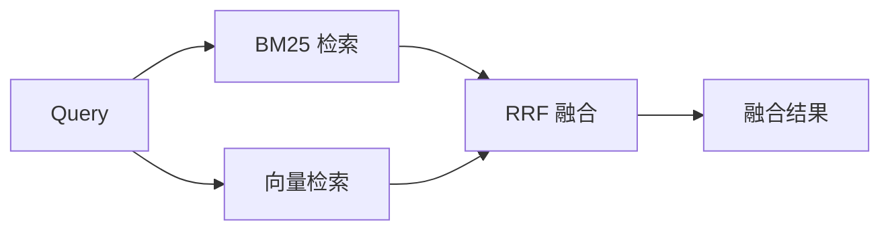
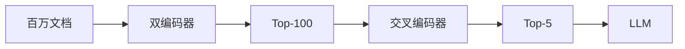

---
title: RAG 技术全景
description: 检索增强生成（RAG）技术深度综述：从架构原理到工程实践
---

# RAG 技术全景：从架构原理到工程实践

> **检索增强生成（Retrieval-Augmented Generation，RAG）** 是大语言模型时代最重要的技术范式之一。它通过将 LLM 的**参数化记忆**（模型权重中隐式编码的知识）与**非参数化记忆**（外部知识库）相结合，有效解决了大模型的知识滞后、幻觉和私有数据访问问题，为企业级 AI 应用提供了一条可信、可控、可解释的落地路径。

---

## 1. 引言：从参数化到非参数化记忆

### 1.1 大模型的固有缺陷

传统 LLM（如 GPT-3、Llama）将训练数据中的知识隐式编码在神经网络的数千亿权重参数中。这种**参数化记忆**存在显著缺陷：

| 问题 | 表现 | 影响 |
| :--- | :--- | :--- |
| **知识滞后** | 训练数据有截止日期 | 无法回答最新事件 |
| **幻觉问题** | 自信地生成错误信息 | 降低可信度 |
| **私有数据盲区** | 无法访问企业内部数据 | 限制应用场景 |
| **上下文限制** | Token 窗口有限 | 无法处理超长文档 |

### 1.2 RAG 的核心思想

RAG 引入**非参数化记忆**（外部知识库），让 AI 在生成前先检索相关信息：


**核心优势**：
-  **知识可更新**：修改知识库即可更新，无需重新训练
-  **可溯源验证**：生成内容可追溯到具体文档
-  **私有数据支持**：企业文档、内部知识库均可接入
-  **成本可控**：相比微调，成本大幅降低

---

## 2. 架构演进：从朴素到智能

RAG 技术经历了四代演进，每一代都解决了前一代的核心痛点：

<div class="paradigm-timeline">
  <div class="paradigm-item">
    <div class="paradigm-year">2020</div>
    <div class="paradigm-name">Naive RAG</div>
    <div class="paradigm-desc">检索-生成<br>线性流程</div>
  </div>
  <div class="paradigm-item">
    <div class="paradigm-year">2022</div>
    <div class="paradigm-name">Advanced RAG</div>
    <div class="paradigm-desc">重写-检索-重排<br>混合检索</div>
  </div>
  <div class="paradigm-item">
    <div class="paradigm-year">2023</div>
    <div class="paradigm-name">Modular RAG</div>
    <div class="paradigm-desc">模块化组件<br>灵活编排</div>
  </div>
  <div class="paradigm-item highlight">
    <div class="paradigm-year">2024+</div>
    <div class="paradigm-name">Agentic RAG</div>
    <div class="paradigm-desc">自主规划<br>多步推理</div>
  </div>
</div>

### 2.1 Naive RAG（朴素 RAG）

最基础的"检索-读取-生成"线性流程：


用户的问题经过embedding模型向量化后，再进行向量检索，找到Top-K文档，然后将这些文档作为上下文，再将用户的问题和上下文一起输入到LLM中，生成最终答案。这里只使用了稠密向量检索，没有使用稀疏向量检索。依赖于所谓的向量之间的距离，来判断文档的相似度。题外话：embedding模型的本质，或者说向量查询的本质，就是将各个向量投影到一个共同的高维向量空间中，然后在向量空间中进行向量之间的距离度量比较。所以在向量空间中，向量之间的距离并不能很好地表征文档的相似度。

**局限性**：
- 检索质量完全依赖 Query 与文档的向量相似度
- 无法处理复杂、多跳推理问题（RAG的通病，只能根据问题检索一次，很多东西就是很难检索出来，所以也出现了很多解决方案，例如GraphRAG，Agentic RAG等）
- 噪声文档直接影响生成质量（例如分块策略不当，会引入噪声文档，MaxChunkSize限制，也会导致不得已的分块状况，文档本身质量低等等，都会影响到生成质量。所以需要对文档进行清洗，对分块策略进行优化）

### 2.2 Advanced RAG（高级 RAG）

引入**预检索**和**后检索**优化模块：
即检索前和检索后进行优化，提升检索质量。
问题扩展，问题重写都可以将用户原本不专业，不容易被大模型理解的问题，转换成专业，容易被大模型理解的问题。
HyDE（Hypothetical Document Embeddings）是一种改进检索的方法，它**生成可用于回答用户输入问题的假设文档**。这些文档来自LLM自身学习到的知识，向量化后用于从索引中检索文档。HyDE方法认为原始问题一般都比较短，而生成的假设文档可能会更好地与索引文档对齐。[HyDE](https://arxiv.org/abs/2206.05266)

高级RAG中的检索一般都是使用混合检索，稠密向量检索和稀疏向量检索相结合，稠密向量检索是基于向量空间的，稀疏向量检索是基于关键词的。二者各有优势，稠密向量检索可以更好地表征文档的语义，稀疏向量检索可以更好地表征文档的关键词。二者加权后，得到最后的评分（默认是7：3的权重，即稠密向量检索占70%，稀疏向量检索占30%，但是好像这一直都是个玄学）。

后检索，即Rerank，是根据文档的语义和用户的问题进行重新排序，选择最相关的文档。这个就跟embedding不太类似了，embedding是基于向量空间的，而Rerank是基于语义的。embedding是为了快，能够在向量空间中快速找到最相关的文档，而Rerank是基于语义的，能够找到最相关的文档。先找出top——k个相关文档，这个相关是基于向量距离度量的，不是基于语义的，即这些文档分块并不一定就可以解决用户的问题，只有经历rerank后，使用cross-encoder，即交叉编码器，就可以相较于Bi-Encoder，即双编码器，能够更好地表征文档的语义，找到最相关的文档。

| 阶段 | 技术 | 作用 |
| :--- | :--- | :--- |
| **预检索** | Query 重写、扩展、HyDE | 提升检索召回率 |
| **检索** | 混合检索（稠密+稀疏） | 兼顾语义与关键词匹配 |
| **后检索** | Rerank 重排序 | 精选高质量文档 |

### 2.3 Modular RAG（模块化 RAG）

将 RAG 拆解为可插拔的独立模块，支持灵活编排：
这里主要就是要讲一下路由和上下文压缩的东西，路由是大模型里面不可或缺的一个环节，决定下一步要怎么走，抽象一点的包括是否开启思考模式，MoE中选择哪个专家模型等等。一般来说有三种策略，**基于规则模型，基于Bert小模型，基于LLM小模型等等**，**目前我认为比较合适的方式是规则模型与Bert模型结合加权，然后用LLM做兜底**。至于上下文压缩，就是将检索到的文档进行压缩，去掉一些无用的，或者说噪声数据，只保留一些关键的，或者说有用的数据。这个压缩过程，可以使用一些文本压缩的算法，比如TF-IDF，也可以使用一些文本摘要的算法，比如TextRank，LDA等等。然后使得大模型可以获得更多的上下文信息，从而能够更好地回答用户的问题。



### 2.4 Agentic RAG（代理 RAG）

LLM 作为智能代理，自主决策检索策略：
原本的RAG一般是用于workflow或者问答系统，基本都是一问一答或者一次性运行完，将Agent与RAG结合起来，可以实现多轮交互，反复与知识库交互直到满意，反复的去检索，检索不同的关键词，不同的问法等等。

- **自主规划**：决定是否需要检索、检索什么
- **工具使用**：调用搜索引擎、数据库、计算器等
- **多轮交互**：反复与知识库交互直到满意
- **自我反思**：评估答案质量，必要时重新检索

::: tip 适用场景
Agentic RAG 特别适合**法律尽职调查**、**金融研报分析**、**医疗诊断辅助**等需要多步推理的复杂任务。
:::

---

## 3. 数据准备：高质量 RAG 的基石

> **"Garbage In, Garbage Out"**  "垃圾进，垃圾出"，数据质量决定 RAG 上限。

### 3.1 ETL 流水线

企业数据通常是异构的非结构化数据（PDF、PPT、Word、扫描件）。ETL 流水线负责将其转化为可索引的清洁文本：
现在有很多做这种事情的厂家，例如Unstructured.io、LlamaParse，MinerU，Mixstrial等等。这里面是一个很复杂的流程，包括版面分析（版面分析是识别文档的布局，包括标题、正文、表格、页眉页脚等等，一般是用yolo这些视觉模型），OCR识别（OCR识别是识别文档的文本，包括文字、图片、表格等等，一般是用Tesseract或者百度的PaddleOCR，因为这些都是开源的。公式识别，段落顺序识别，页眉页脚识别，页码识别等等。一般来说，大模型都是使用txt，xml，md等格式的输入文档，因为这些文档的格式清晰明了，更利于大模型阅读学习和分块处理。



**关键挑战**：
- **布局分析**：识别标题、正文、表格、页眉页脚（工具：Unstructured.io、LlamaParse）
- **OCR 识别**：多栏排版、手写体、低质量扫描件
- **数据清洗**：乱码去除、格式标准化、PII 脱敏

### 3.2 分块策略（Chunking Strategies）

分块是将长文档切分为小片段的过程。**核心权衡**：块太小导致上下文缺失，块太大引入噪声。

#### 3.2.1 固定大小分块

```python
# 示例：按 Token 数量切分，带重叠窗口
chunk_size = 500  # tokens
overlap = 50      # 重叠量，缓解边缘语义丢失
```

| 优点 | 缺点 |
| :--- | :--- |
| 实现简单、效率高 | 可能粗暴打断语义流 |
| 块大小一致 | 不考虑文档结构 |

#### 3.2.2 递归字符分块

使用层级分隔符（段落 `\n\n`  句子 `\n`  空格）递归切分：

```python
# LangChain RecursiveCharacterTextSplitter
separators = ["\n\n", "\n", " ", ""]
# 优先段落切分，段落过长则按句子切分
```

**优势**：较好地保留文本自然结构，是 LangChain 默认策略。

#### 3.2.3 语义分块（Semantic Chunking）

利用 Embedding 模型计算相邻句子的语义相似度，在**相似度骤降处**切分：


**优势**：确保每个块是独立语义单元，检索相关性最高。  
**代价**：需要额外的 Embedding 计算开销。

#### 3.2.4 代理分块（Agentic Chunking）

让 LLM 阅读文本并决定最佳切分点。适合**高价值复杂文档**（法律合同、代码库）。

#### 3.2.5 结构化分块

基于文档结构（Markdown 标题、HTML 标签）切分：

```python
# MarkdownHeaderTextSplitter
headers_to_split_on = [
    ("#", "Header 1"),
    ("##", "Header 2"),
]
```

### 3.3 分块策略选型指南

| 策略 | 适用场景 | 实现复杂度 | 语义完整性 |
| :--- | :--- | :---: | :---: |
| 固定大小 | 简单文本、快速原型 |  |  |
| 递归字符 | 通用文档（默认推荐） |  |  |
| 语义分块 | 话题转换频繁的文档 |  |  |
| 代理分块 | 高价值复杂文档 |  |  |
| 结构化分块 | 技术文档、Markdown |  |  |

### 3.4 多模态数据处理

现实数据不仅是文本，**表格和图片**往往承载关键信息。

根据这些示例，其实可以引入另一个知识点，“**上下文增强**”，即对每个分块进行增强，（好像是智谱提出的一个方案，对每个分块进行描述，例如，这个分块在文档的哪个位置，主要是干什么的，上下文还有哪些等等，然后将这些描述作为上下文，与原始文本一起输入到大模型中，大模型就可以更好地理解这个分块，从而更好地回答用户的问题），然后就可以发现，其实多模态处理数据的方式，其实与上下文增强是很类似的，只不过是数据类型不太相同而已。

**表格处理**：
1. 使用 LLM 生成表格摘要进行索引
2. 生成时将原始表格（HTML/Markdown）作为上下文

**图片处理**：
1. 多模态 LLM（GPT-4o、Llava）生成图片描述
2. 多模态 Embedding（CLIP）直接将图片映射到向量空间

---

## 4. 索引构建：从扁平列表到多维结构

### 4.1 向量空间：稠密 vs 稀疏

<div class="compare-box">
  <div class="compare-item">
    <div class="compare-title">稠密向量 (Dense)</div>
    <div class="compare-flow">BERT/OpenAI  1536维实数向量</div>
    <p class="compare-desc"> 语义匹配强（"手机""移动电话"）<br> 专有名词、代码匹配弱</p>
  </div>
  <div class="compare-vs">VS</div>
  <div class="compare-item">
    <div class="compare-title">稀疏向量 (Sparse)</div>
    <div class="compare-flow">BM25/SPLADE  高维稀疏向量</div>
    <p class="compare-desc"> 关键词精确匹配（错误码、序列号）<br> 缺乏语义理解</p>
  </div>
</div>

**最佳实践**：混合检索（Hybrid Search）结合两者优势。

### 4.2 RAPTOR：递归树状索引

解决传统 RAG 无法回答**宏观概括类问题**的痛点（如"这份文档主要讲什么？"）。



**构建流程**：
1. 底层：原始文本块作为叶子节点
2. 聚类：使用 GMM 对相似块聚类
3. 摘要：LLM 对每个聚类生成摘要
4. 递归：将摘要作为新节点，重复聚类-摘要过程
5. 检索：可从根部（宏观）或叶子（细节）检索

### 4.3 GraphRAG：知识图谱增强

微软提出的 GraphRAG 将文本转化为**实体-关系知识图谱**：
这一块其实挺重要的，因为实际应用当中，很多公司都希望使用知识图谱来实现推理的效果，去处理多跳逻辑的内容。还有类似的项目，例如LightRAG等等。里面的知识挺多的，后面再给大家介绍。

<div class="compare-box">
  <div class="compare-item">
    <div class="compare-title">传统向量 RAG</div>
    <div class="compare-flow">向量相似度  <strong>单跳检索</strong></div>
    <p class="compare-desc">寻找"相似性"。难以连接分散在不同文档的关联信息。</p>
  </div>
  <div class="compare-vs">VS</div>
  <div class="compare-item highlight">
    <div class="compare-title">GraphRAG</div>
    <div class="compare-flow">实体关系图谱  <strong>多跳推理</strong></div>
    <p class="compare-desc">寻找"关联性"。文档A提到"项目X"，文档B提到"项目X由Alice负责"，图谱可连接两者。</p>
  </div>
</div>

---

## 5. 向量数据库选型 (2025)

| 数据库 | 类型 | 核心优势 | 适用场景 | 索引算法 |
| :--- | :--- | :--- | :--- | :--- |
| **Pinecone** | SaaS 闭源 | Serverless、零运维 | 生产环境 | 专有算法 |
| **Milvus** | 开源/托管 | 十亿级规模、分布式 | 大规模应用 | IVF, HNSW |
| **Weaviate** | 开源/托管 | 原生混合搜索 | 复杂查询 | HNSW |
| **Qdrant** | 开源/托管 | Rust 高性能 | 性能敏感 | HNSW |
| **Chroma** | 开源 | 开发者友好 | 本地开发 | HNSW |

::: tip 选型建议
- **初创团队**：Pinecone Serverless（零运维）
- **大厂/自建**：Milvus（规模与性能）
- **隐私敏感**：Chroma/Qdrant（本地部署）
:::

---

## 6. 检索优化：超越简单相似度
简单介绍一下，后续章节会详细介绍所有内容。

### 6.1 混合检索（Hybrid Search）

结合关键词检索（BM25）和语义检索（Dense Vector）：



**RRF（倒数排名融合）公式**：

$$RRF_{score}(d) = \sum_{r \in R} \frac{1}{k + rank_r(d)}$$

### 6.2 Query 优化策略

#### 6.2.1 Query 重写与扩展

| 原始 Query | 重写变体 |
| :--- | :--- |
| "RAG 慢怎么调？" | "RAG 延迟优化策略"、"向量数据库索引加速" |

#### 6.2.2 HyDE（假设性文档嵌入）

颠覆性思路：先让 LLM 编造"假设答案"，用假设答案的向量去搜真实答案。


**原理**：假设答案的**语义结构、用词习惯**与真实文档高度相似。

#### 6.2.3 Step-Back Prompting

面对具体问题时，先提出更抽象的问题获取背景知识：

| 原始问题 | Step-back 问题 |
| :--- | :--- |
| "2005年谁是Google的工程副总裁？" | "列出Google历任高管名单" |

---

## 7. 重排机制（Rerank）

检索阶段召回 Top-100 文档中包含大量噪声。**重排器**对候选文档进行精细打分，筛选 Top-5 精华。

### 7.1 双编码器 vs 交叉编码器

| 类型 | 原理 | 速度 | 精度 |
| :--- | :--- | :---: | :---: |
| **双编码器** | 分别编码，向量相似度 |  快 | 一般 |
| **交叉编码器** | 拼接输入，深度交互 |  慢 | 极高 |



### 7.2 主流 Rerank 模型

| 模型 | 类型 | 优势 |
| :--- | :--- | :--- |
| **Cohere Rerank 3.5** | 商用 API | 多语言、代码检索 |
| **BGE-Reranker-v2-m3** | 开源 | 中文更优、可私有部署 |

---

## 8. 生成优化与上下文增强

### 8.1 上下文退化：越长≠越好

这里就牵扯到一个问题，总有人问，现在大模型的上下文窗口都有几百K了，为什么还要做RAG分块呢？文档内容可能都没有几百K，全丢进去大模型也可以读呀。为什么还要分块呢？

#### "迷失于中间"现象

LLM 对上下文的注意力呈 **U 型曲线**：最关注开头和结尾，容易忽略中间。之前还遇到过，例如，用户传入100条数据，让大模型全部输出一遍给你，但是经常就是只返回最开始的和结尾的部分，中间的数据都是省略号代替了，模型会有偷懒的现象。

#### 颠覆认知的发现

Chroma对18个主流大语言模型（包括GPT-4.1、Claude 4、Gemini 2.5和Qwen3等尖端模型）的测试揭示了一个残酷现实：**当输入长度超过临界点后，模型性能会出现非均匀的断崖式下降**。这种被称为"上下文退化"的现象，彻底打破了"token越多越聪明"的惯性思维。

想象一下：你给AI输入一份10万字的法律文档，希望它提取关键条款。但由于上下文退化，模型可能完美记住了开头和结尾的内容，却对中间的核心条款视而不见——这不是模型在"偷懒"，而是它的认知机制在长输入下出现了"记忆混乱"。

#### 主流模型的"抗退化"能力对比

| 模型家族 | 表现特征 | 适用场景 |
|----------|----------|----------|
| **Claude** | 退化速度最慢，8000词内保持稳定 | 中等长度精准任务（合同审查、报告分析） |
| **Qwen** | 稳步衰退但无剧烈波动，模型规模与抗退化能力正相关 | 需平衡成本与长度的企业级应用 |
| **GPT系列** | 毫无规律的随机错误，可能"突然摆烂" | 商业应用需警惕其不稳定性 |
| **Gemini** | 500-750词就开始出现明显错误，退化曲线最陡 | 仅限短文本场景（邮件摘要、即时问答） |

#### 为什么会出现上下文退化？

可以把LLM的上下文处理机制比作人类的"工作记忆"：

- **人类**：同时处理超过7±2个信息块时会出现记忆衰减
- **LLM**：长输入中面临"注意力资源分配失衡"——模型的注意力头无法均匀覆盖所有token，导致部分信息被"边缘化"

不同模型的注意力机制设计差异：
- **Claude**："分层注意力"更擅长维持长文本连贯性
- **GPT**："动态注意力分配"短文本灵活高效，但长文本下易陷入"局部最优陷阱"
- **Gemini**："并行注意力"速度占优，却牺牲了长距离依赖捕捉能力

**优化策略**：将最相关文档放在首尾，次相关放中间。

#### 应对上下文退化的实战策略

面对这一难题，与其期待模型厂商的"技术突破"，不如主动构建一套抗退化的应用架构：

| 策略 | 核心逻辑 | 具体手段 |
|------|----------|----------|
| **上下文管理** | 不依赖LLM自身的上下文处理能力 | 细粒度文本分段、滑动窗口缓存、"摘要-细节"二级架构 |
| **RAG检索** | 让AI成为"高效检索者"而非"记忆大师" | 定制分块策略、双重检索（语义+关键词）、多轮检索反馈 |
| **模型无关性设计** | 不把鸡蛋放在一个篮子里 | 构建多模型切换抽象层，根据任务长度自动选择最优模型 |
| **小模型专精化** | 避开"大而全"的陷阱 | 用领域数据微调SLM，构建"小模型处理+大模型校验"混合架构 |

**任务长度与模型选择建议**：
- **短任务（<1000词）**：Gemini或GPT，响应速度快
- **中长任务（1000-8000词）**：Claude 3.5 Sonnet
- **超长任务（>8000词）**：Qwen3-235B配合分块检索

::: warning 警惕模型漂移
OpenAI的"模型编排"技术意味着你调用的"GPT-4"可能随时在底层切换为不同模型组合。建议建立自己的**模型性能基准线**——定期用标准化长文本测试集验证模型表现，当退化率超过阈值时自动触发切换机制。
:::

### 8.2 Prompt 压缩（LLMLingua）

利用小型语言模型计算每个 Token 的信息熵，剔除冗余 Token：

- 可压缩 **80% tokens**，几乎不损失生成质量
- 大幅降低推理成本和延迟

### 8.3 引用溯源

在 System Prompt 中强制要求模型标注来源：

```
生成的每一句话必须标注来源 ID，格式如 [1][2]。
如果无法从检索内容中找到依据，请明确说明"未找到相关信息"。
```

---

## 9. RAG 评估体系

下面的就是RAGAS提出的评估三元组概念，除了这三元组以外，还可以根据业务需求，自定义评估指标。现在基本使用的评估方案，都是使用LLM-as-a-judge的方式，让LLM打分，人类专家复核，减少数据成本。

### 9.1 RAG 三元组（The RAG Triad）

| 指标 | 评估对象 | 问题 |
| :--- | :--- | :--- |
| **Context Relevance** | 检索器 | 检索到的内容和问题相关吗？ |
| **Faithfulness** | 生成器 | 答案完全基于检索内容吗？ |
| **Answer Relevance** | 端到端 | 答案真正回答了用户问题吗？ |

### 9.2 自动化评估框架

| 框架 | 特点 | 适用场景 |
| :--- | :--- | :--- |
| **[RAGAS](https://docs.ragas.io/)** | LLM 无参考评估 | 快速迭代 |
| **[TruLens](https://trulens.org/)** | 全链路追踪 | 生产监控 |

---

## 10. 未来展望

| 趋势 | 描述 |
| :--- | :--- |
| **多模态原生** | 图片、视频、音频跨模态检索成为标配 |
| **图文融合** | GraphRAG 普及，知识图谱 + 向量检索 |
| **端侧 RAG** | SLM + 本地向量库，隐私 RAG |
| **Agentic 深化** | 更复杂的多步推理、工具编排 |
| **GEO 崛起** | 生成式引擎优化，从"被搜索"到"被引用" |

### 10.1 答案经济：从SEO到GEO

随着AI的崛起，信息检索的版图正在经历一场地壳运动。一个新的概念应运而生：**GEO（生成式引擎优化）**。

#### 搜索优化的演进之路

| 阶段 | 名称 | 目标 | 成功指标 |
|------|------|------|----------|
| **SEO** | 搜索引擎优化 | 让蓝色链接排名更高 | 排名、点击率、自然流量 |
| **AEO** | 答案引擎优化 | 成为特定问题的单一直接答案（精选摘要） | 被语音助手朗读 |
| **GEO** | 生成式引擎优化 | 在AI生成的综合性回答中被引用 | 引用频率、品牌提及次数 |

#### "零点击搜索"的兴起

当AI在搜索结果页面上直接提供全面、令人满意的答案时，用户点击进入单个网站的需求就大大降低了。Gartner预测，到2026年，传统搜索引擎的搜索量将下降25%。

**危机与机遇并存**：
- **危机**：对传统依赖流量的商业模式构成直接威胁
- **机遇**：被AI引用是品牌认可的终极形式——AI在含蓄地宣告"在这个问题上，这个品牌是权威"

#### GEO的核心策略：E-E-A-T框架

在一个充斥着AI生成内容的世界里，可被验证的人类经验和专业知识，成为了最稀缺的差异化优势：

| 维度 | 含义 | 实践方法 |
|------|------|----------|
| **经验 (Experience)** | 展示第一手经验 | 案例研究、原创研究、真实世界例子 |
| **专业 (Expertise)** | 彰显深厚知识 | 专业资质的作者简介、事实准确 |
| **权威 (Authoritativeness)** | 成为公认行业领导者 | 反向链接、媒体提及、知识图谱占位 |
| **可信 (Trustworthiness)** | 透明可靠 | 清晰来源、隐私政策、HTTPS |

#### 为何SEO是GEO的基石？

AI模型和生成式搜索功能（如Google的AI Overviews）在设计上明确倾向于优先采用那些在传统搜索算法中已经排名靠前的页面。**强大的SEO表现，就是获得被AI考虑的"入场券"**。

Google明确表示，AI Overviews是由"顶级的网络搜索结果"支持的。所有为SEO所做的工作——建立反向链接、提升域名权重、创作优质内容——都是对未来AI系统所依赖的基础权威性的关键投资。

::: tip GEO实践建议
1. **思考主题，而非仅仅是关键词**：构建全面的"主题集群"
2. **为AI理解而结构化**：清晰的标题层次、列表表格、FAQ格式
3. **使用结构化数据（Schema Markup）**：消除歧义，使内容更易被AI处理
4. **成为第一手信息源**：发布原创数据和研究报告
5. **维护并更新内容**：AI偏爱最新、最准确的信息
:::

---

##  学习路线与资源

<div class="learning-path">
  <div class="path-step step-1">
    <div class="step-num">1</div>
    <div class="step-title">入门基础</div>
    <ul>
      <li><a href="/llms/rag/paradigms">RAG 范式演进</a></li>
      <li><a href="/llms/rag/embedding">Embedding 原理</a></li>
      <li><a href="/llms/rag/vector-db">向量数据库入门</a></li>
    </ul>
  </div>
  <div class="path-arrow"></div>
  <div class="path-step step-2">
    <div class="step-num">2</div>
    <div class="step-title">核心技术</div>
    <ul>
      <li><a href="/llms/rag/chunking">分块策略</a></li>
      <li><a href="/llms/rag/retrieval">混合检索</a></li>
      <li><a href="/llms/rag/rerank">Rerank 重排序</a></li>
    </ul>
  </div>
  <div class="path-arrow"></div>
  <div class="path-step step-3">
    <div class="step-num">3</div>
    <div class="step-title">高级进阶</div>
    <ul>
      <li><a href="/llms/rag/production">GraphRAG & Agentic</a></li>
      <li><a href="/llms/rag/evaluation">RAGAs 评估体系</a></li>
    </ul>
  </div>
</div>

###  深度系列文章

| 模块 | 文章 | 简介 |
| :--- | :--- | :--- |
| **综述** | [RAG 技术范式与未来展望](https://dd-ff.blog.csdn.net/article/details/149274498) | Naive/Advanced/Modular 全解析 |
| **数据** | [15种分块策略秘籍](https://dd-ff.blog.csdn.net/article/details/149529161) | 语义切分、代理切分实战 |
| **检索** | [HNSW 向量检索算法](https://dd-ff.blog.csdn.net/article/details/149275016) | 毫秒级近似最近邻搜索 |
| **高阶** | [GraphRAG 完整教程](https://dd-ff.blog.csdn.net/article/details/154530805) | 知识图谱增强多跳推理 |
| **优化** | [LLM 上下文退化](https://dd-ff.blog.csdn.net/article/details/149531324) | 越长输入让AI变得越"笨" |
| **前沿** | [答案经济：AI时代SEO与GEO崛起](https://dd-ff.blog.csdn.net/article/details/152038939) | 从"被搜索"到"被引用"的战略指南 |

---

> **注**：本文基于 2024-2025 年行业前沿研究整理。RAG 技术仍在快速演进中。
