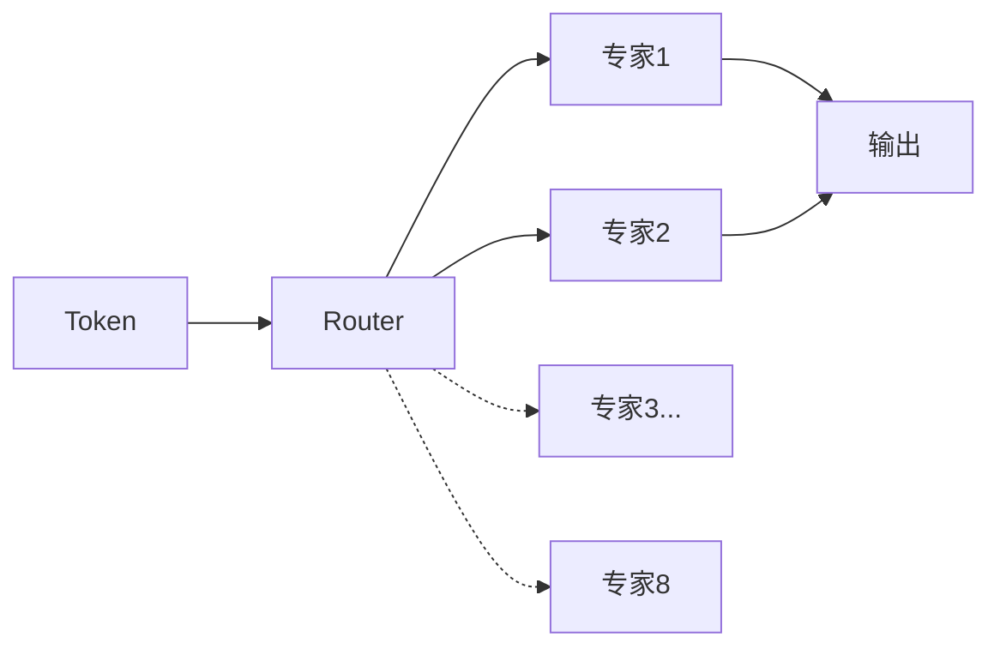
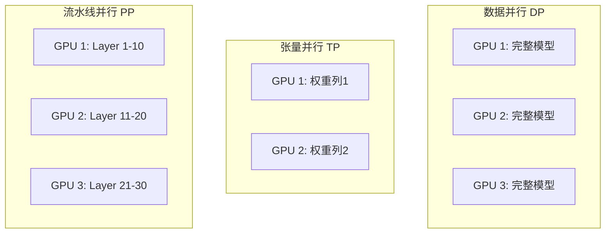
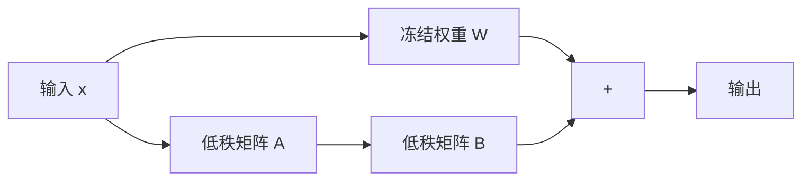
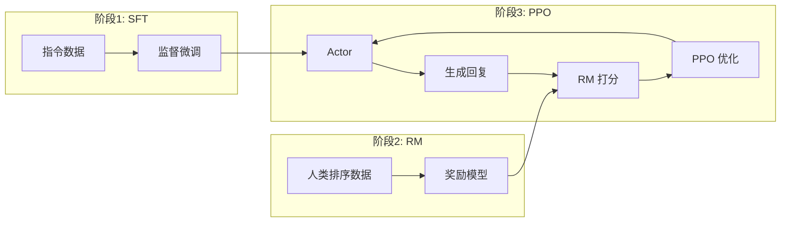

---
title: LLM 训练全景
description: 大语言模型全栈技术深度综述：从架构原理到工程实践
---

# LLM 训练全景：从架构原理到工程实践

> 本文旨在提供一份关于**大语言模型（Large Language Models, LLMs）** 技术栈的详尽综述，跨越从底层数学原理到大规模分布式系统工程的完整技术图谱，涵盖 Transformer 架构演进、万亿级参数训练基础设施、高效微调范式、人类价值观对齐算法以及生产级推理优化技术。

---

## 训练流程全景图

### 三大模型版本

| 版本 | 训练方式 | 特点 | 适用场景 |
| :--- | :--- | :--- | :--- |
| **Base（基座）** | 预训练 | 知识储备丰富，无指令遵循能力 | 知识检索、RAG、续写 |
| **Instruct（指令）** | SFT | 遵循指令，执行任务 | 结构化任务、API 调用 |
| **Chat（对话）** | RLHF/DPO | 自然对话，安全对齐 | 聊天机器人、AI 助手 |

::: warning 对齐税（Alignment Tax）
经过 RLHF 对齐的模型可能在某些任务（如 RAG 检索）上表现不如基座模型，这被称为"对齐税"。选择模型版本需根据具体场景权衡。
:::

---

## 1. 架构演进：现代 Transformer 重构

尽管 2017 年的原始 Transformer 奠定了 LLM 基础，但在迈向千亿参数和超长上下文的过程中，原始架构暴露出**外推性差、训练不稳定、显存效率低**等问题。现代主流 LLM（Llama 3、PaLM、Gemini）实际运行的是一套深度改良的"现代 Transformer"。

### 1.1 位置编码革命：从绝对到相对

位置编码是 Transformer 处理序列顺序的关键。早期的正弦波绝对位置编码在处理超过训练长度的序列时，外推性（Extrapolation）表现极差。

#### RoPE（旋转位置编码）

目前被 **Llama、PaLM、Qwen** 等主流模型广泛采用。

**数学原理**：将 $d$ 维的 Query/Key 向量视为 $d/2$ 个二维复数向量。对于位置 $m$ 的输入，通过旋转矩阵 $R_{\Theta, m}$ 进行变换，在复平面内将向量旋转角度 $m\theta$。

**核心优势**：
- 通过乘法实现相对位置信息注入
- 保持与绝对位置编码相同的计算复杂度
- 优异的长度外推能力，允许推理时处理比训练更长的序列

#### ALiBi（线性注意力偏置）

更激进的方案，彻底解决外推性问题。

**实现机制**：完全放弃 Embedding 层的位置向量，直接在 Attention 的 Softmax 之前添加与 Query-Key 距离成正比的静态线性惩罚项。距离越远，惩罚越大。

**外推性能**：使用 ALiBi 训练的模型（如 BLOOM）能平滑处理数倍于训练窗口长度的输入，无需额外训练成本。

### 1.2 注意力机制效率优化

全注意力的 $O(N^2)$ 复杂度是长序列建模的主要瓶颈。

  

    
MQA (Multi-Query)

    
所有 Query 头共享一对 K/V 头 KV Cache 降低 H 倍  模型表达能力下降

  

  
VS

  

    
GQA (Grouped-Query)

    
Query 头分 G 组共享 K/V Llama 2/3 标配  速度与质量兼得

  

**GQA 优势**：达到接近 MQA 的推理速度和显存效率，同时保持 MHA 的模型质量。通过"Uptraining"技术，可将预训练好的 MHA 模型低成本转化为 GQA。

### 1.3 归一化与激活函数

| 技术 | 改进点 | 采用模型 |
| :--- | :--- | :--- |
| **Pre-Norm** | 将归一化置于残差连接外，梯度直接流过网络，提升深层训练稳定性 | 现代 LLM 标配 |
| **RMSNorm** | 去除均值中心化操作，减少 GPU 同步，加速训练 | Llama、PaLM |
| **SwiGLU** | Swish 门控的 GLU 变体，更强非线性表达，同等算力下更低 Perplexity | Llama、PaLM |

### 1.4 下一代架构

#### MoE（混合专家模型）

打破稠密模型计算瓶颈的首选路径（Mixtral 8x7B、DeepSeek-V3）。

**稀疏激活**：对于每个 Token，路由网络仅激活 Top-k（通常 1-2 个）专家计算。实现"训练万亿参数，推理百亿计算"。

**负载均衡**：训练损失中引入辅助损失，强制 Router 均匀分配 Token，防止"专家坍塌"。

#### Mamba（状态空间模型）

挑战 Transformer 统治地位。基于选择性 SSM，推理时 $O(1)$ 状态更新，达到 $O(N)$ 线性时间复杂度。在长序列任务中展现更高吞吐和更低显存。

---

## 2. 数据工程：万亿 Token 的知识库

> **"Garbage In, Garbage Out"**  数据质量是 LLM 性能的决定性因素。

### 2.1 数据处理流水线

| 步骤 | 技术细节 | 目的 |
| :--- | :--- | :--- |
| **URL 过滤** | 黑名单过滤成人/暴力/垃圾站 | 源头阻断低质内容 |
| **文本提取** | Trafilatura 解析 HTML | 去除导航栏、广告噪声 |
| **语言识别** | FastText (CCNet) | 过滤非目标语言 |
| **质量过滤** | 启发式规则 + BERT 分类器 | 剔除机器生成、乱码 |
| **PII 去除** | 正则匹配 Email/IP/电话 | 隐私保护 |
| **去重** | MinHash LSH + Exact Match | 防止记忆样本，提升泛化 |

::: tip 去重的重要性
模糊去重通过 MinHash 算法识别并去除只有细微差异的重复文档（如转载新闻），对提升 Zero-shot 能力至关重要，也是防止基准测试数据泄漏的关键。
:::

### 2.2 Tokenization 策略

**BPE（Byte-Pair Encoding）**：GPT-4、Llama 3 采用。从字符级开始，迭代合并最频繁字节对。现代实现直接在 UTF-8 字节层面操作，支持零样本处理任何 Unicode（代码、Emoji、小语种）。

**词表大小权衡**：
- 大词表（Llama 3: 128k） 编码效率高，但增加 Embedding/Softmax 参数量
- 小词表  序列更长，训练成本增加

---

## 3. 分布式训练：驯服算力巨兽

训练千亿参数模型需要数千张 GPU 协同工作，单一并行策略已无法满足需求。

### 3.1 多维并行策略（3D/4D Parallelism）

| 策略 | 原理 | 通信特点 | 适用场景 |
| :--- | :--- | :--- | :--- |
| **数据并行 (DP)** | 复制模型，切分 Batch | All-Reduce 梯度 | 基础策略 |
| **张量并行 (TP)** | 切分权重矩阵（Megatron-LM） | 每层 All-Reduce | 节点内 (NVLink) |
| **流水线并行 (PP)** | 不同层放不同设备 | 点对点传输 | 跨节点 |
| **序列并行 (SP)** | 切分序列维度 (DeepSpeed Ulysses) | All-to-All | 超长上下文 |

### 3.2 显存优化

#### ZeRO（零冗余优化器）

DeepSpeed 核心贡献，解决数据并行中模型状态冗余存储问题：

| 阶段 | 切分内容 | 显存节省 |
| :--- | :--- | :--- |
| **Stage 1** | 优化器状态 | 4 |
| **Stage 2** | + 梯度 | 8 |
| **Stage 3** | + 模型参数 | 万亿参数可训练 |

#### 激活重算（Activation Checkpointing）

前向传播不保存中间激活值，反向传播时重新计算。以约 **30% 额外计算**换取 **5-10 显存节省**，支持更大 Batch Size 和序列长度。

### 3.3 训练稳定性：Loss Spike

**成因**：AdamW 二阶矩估计问题。训练后期梯度范数变小，遇到"坏数据"导致梯度突增时，全局裁剪阈值未能及时生效。

**解决方案**：
- **AdaGC**：动态调整裁剪阈值
- **Checkpoint 回滚**：跳过导致 Spike 的数据
- **QK-Norm**：在 Query/Key 上加 LayerNorm

---

## 4. 参数高效微调（PEFT）

全量微调成本高昂且易导致灾难性遗忘。PEFT 允许仅更新极少量参数即可达到媲美效果。

### 4.1 LoRA（低秩适配）

目前最主流的微调技术。

**原理**：假设权重更新量 $\Delta W$ 具有低秩特性。冻结预训练权重 $W_0$，注入两个低秩矩阵：

$$W_{new} = W_0 + \Delta W = W_0 + BA \quad (rank \ll d)$$

**工程优势**：
-  **显存节省**：不存储优化器状态
-  **零推理延迟**：$BA$ 可合并回 $W_0$
-  **多任务支持**：不同任务加载不同 LoRA 权重

### 4.2 QLoRA

将 LoRA 与高精度量化结合，进一步降低门槛。

| 技术 | 作用 |
| :--- | :--- |
| **NF4 量化** | 4-bit 加载预训练模型 |
| **双重量化** | 量化量化常数，进一步压缩 |
| **分页优化器** | 显存不足时卸载到 CPU |

**效果**：单张 48GB 显卡可微调 65B 模型。

### 4.3 微调方法对比

| 方法 | 参数更新 | 资源需求 | 适用场景 |
| :--- | :--- | :--- | :--- |
| **全量微调** | 100% | 极高 | 资源充足，追求最佳 |
| **LoRA/QLoRA** | <1% | 低 | 消费级硬件 |
| **Adapter** | <5% | 中 | 多任务适配 |
| **Prefix Tuning** | <1% | 低 | 特定任务优化 |

---

## 5. 对齐技术：赋予模型价值观

预训练赋予模型"知识"，对齐赋予模型"指令遵循"能力和安全价值观。

### 5.1 RLHF（人类反馈强化学习）

ChatGPT 背后的核心技术。

**流程**：
1. **SFT**：高质量指令数据上监督微调
2. **Reward Modeling**：收集人类偏好排序，训练奖励模型（Bradley-Terry）
3. **PPO**：用 RM 作为环境反馈，最大化奖励同时 KL 约束防止偏离

**局限**：涉及 4 个模型（Actor, Critic, Reference, Reward）协同训练，超参敏感，极不稳定。

### 5.2 DPO（直接偏好优化）

简化工序的里程碑。

**数学原理**：推导出最优策略与奖励函数的解析映射，可直接在偏好数据上优化，无需显式训练奖励模型。

**损失函数**：
$$\mathcal{L}_{DPO} = -\mathbb{E}[\log \sigma (\beta \log \frac{\pi(y_w|x)}{\pi_{ref}(y_w|x)} - \beta \log \frac{\pi(y_l|x)}{\pi_{ref}(y_l|x)})]$$

  

    
RLHF (PPO)

    
4 个模型协同训练 超参敏感，训练不稳定 显存需求极高

  

  
VS

  

    
DPO

    
类似 SFT 的简单流程 训练稳定，效果持平 开源社区首选

  

---

## 6. 推理优化：极致速度与吞吐

推理核心目标：降低延迟（Latency）+ 提升吞吐量（Throughput）。

### 6.1 FlashAttention

Attention 瓶颈是**内存带宽**而非算力。

**核心技术**：Tiling（分块）+ Recomputation（重算）。将 Q、K、V 分块加载到 GPU SRAM，融合所有算子，避免将 $N \times N$ 中间结果写入慢速 HBM。

**效果**：HBM 读写量从 $O(N^2)$ 降到 $O(N)$，推理速度提升 **2-4**。

### 6.2 PagedAttention 与 vLLM

传统引擎要求 KV Cache 连续存储，预分配导致显存浪费高达 **60%-80%**。

**PagedAttention**：借鉴操作系统虚拟内存分页思想，将 KV Cache 切分为固定大小块，通过页表映射逻辑连续到物理不连续的显存。

**vLLM**：基于 PagedAttention，实现显存零浪费，吞吐量比 HuggingFace TGI 高 **2-4**。

### 6.3 投机采样（Speculative Decoding）

**原理**：利用 LLM 推理是"访存密集型"特点。小草稿模型快速生成多个候选 Token，大模型一次并行验证。

**效果**：草稿准确时，一次计算生成多个 Token，延迟降低 **2-3**，数学上保证与大模型输出完全一致。

### 6.4 推理引擎对比

| 特性 | vLLM | TensorRT-LLM | TGI |
| :--- | :--- | :--- | :--- |
| **核心技术** | PagedAttention | Kernel Fusion, FP8 | Router 架构 |
| **优势** | 高并发、易用 | 极致低延迟、N卡优化 | 生态兼容 |
| **部署难度** | 低 | 高 | 中 |
| **吞吐量** | 极高 | 高 | 中 |

---

## 7. 模型压缩与部署

### 7.1 量化技术

| 方法 | 精度 | 速度提升 | 质量损失 |
| :--- | :--- | :--- | :--- |
| **FP16** | 16-bit | 2 | 几乎无 |
| **INT8** | 8-bit | 4 | 轻微 |
| **INT4/NF4** | 4-bit | 8 | 可接受 |
| **GPTQ/AWQ** | 4-bit | 8 | 优化后极小 |

### 7.2 知识蒸馏

大模型（Teacher）指导小模型（Student）学习，保留核心能力同时大幅减少参数量。

---

##  学习路线与资源

  

    
1

    
基础入门

    <ul>
      <li><a href="/llms/training/data">数据处理</a></li>
      <li><a href="/llms/training/sft">SFT 监督微调</a></li>
      <li><a href="/llms/training/lora">LoRA 高效微调</a></li>
    </ul>
  

  

  

    
2

    
对齐技术

    <ul>
      <li><a href="/llms/training/rlhf">RLHF 对齐</a></li>
      <li><a href="/llms/training/dpo">DPO 直接偏好</a></li>
      <li><a href="/llms/training/eval">模型评估</a></li>
    </ul>
  

  

  

    
3

    
生产部署

    <ul>
      <li><a href="/llms/training/serving">推理优化</a></li>
      <li>量化与蒸馏</li>
      <li>分布式推理</li>
    </ul>
  

###  深度系列文章

| 模块 | 文章 | 简介 |
| :--- | :--- | :--- |
| **全流程** | [一个大模型落地的技术详解](https://dd-ff.blog.csdn.net/article/details/150265751) | 预训练微调蒸馏强化学习 |
| **数据** | [垃圾进垃圾出：高质量微调数据集](https://dd-ff.blog.csdn.net/article/details/152254276) | 数据清洗、格式、质量评估 |
| **PEFT** | [大模型微调的省钱秘笈](https://dd-ff.blog.csdn.net/article/details/153965724) | LoRA/Adapter/Prefix 对比 |
| **对齐** | [从 PPO 到 DPO](https://dd-ff.blog.csdn.net/article/details/153269912) | RLHF 三阶段流程详解 |
| **部署** | [压缩巨兽：模型压缩底层科学](https://dd-ff.blog.csdn.net/article/details/150932519) | 量化/剪枝/蒸馏技术 |
| **词表** | [词表构建技术深度剖析](https://dd-ff.blog.csdn.net/article/details/155357751) | BPE/Unigram、词表扩充 |

###  开源框架

| 框架 | 说明 |
| :--- | :--- |
| [Hugging Face TRL](https://huggingface.co/docs/trl) | RLHF/DPO 训练库 |
| [LLaMA-Factory](https://github.com/hiyouga/LLaMA-Factory) | 一站式微调框架 |
| [DeepSpeed](https://github.com/microsoft/DeepSpeed) | 分布式训练优化 |
| [Megatron-LM](https://github.com/NVIDIA/Megatron-LM) | NVIDIA 大规模训练框架 |
| [vLLM](https://github.com/vllm-project/vllm) | 高性能推理引擎 |

###  重要论文

| 论文 | 说明 |
| :--- | :--- |
| [Attention Is All You Need](https://arxiv.org/abs/1706.03762) | Transformer 原始论文 |
| [RoPE](https://arxiv.org/abs/2104.09864) | 旋转位置编码 |
| [LoRA](https://arxiv.org/abs/2106.09685) | 低秩适配 |
| [InstructGPT](https://arxiv.org/abs/2203.02155) | RLHF 经典论文 |
| [DPO](https://arxiv.org/abs/2305.18290) | 直接偏好优化 |
| [FlashAttention](https://arxiv.org/abs/2205.14135) | 高效注意力计算 |
| [Mamba](https://arxiv.org/abs/2312.00752) | 状态空间模型 |

---

> **注**：本文基于 2024-2025 年行业前沿研究整理。LLM 技术栈仍在快速演进中。
