---
title: LLM 训练全景
description: 大语言模型全栈技术深度综述：从架构原理到工程实践
---

# LLM 训练全景：从架构原理到工程实践

> 本文旨在提供一份关于**大语言模型（Large Language Models, LLMs）** 技术栈的详尽综述，跨越从底层数学原理到大规模分布式系统工程的完整技术图谱，涵盖 Transformer 架构演进、万亿级参数训练基础设施、高效微调范式、人类价值观对齐算法以及生产级推理优化技术。

---

## 训练流程全景图

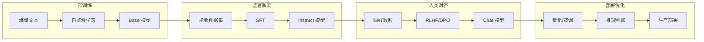

### 三大模型版本

| 版本 | 训练方式 | 特点 | 适用场景 |
| :--- | :--- | :--- | :--- |
| **Base（基座）** | 预训练 | 知识储备丰富，无指令遵循能力 | 知识检索、RAG、续写 |
| **Instruct（指令）** | SFT | 遵循指令，执行任务 | 结构化任务、API 调用 |
| **Chat（对话）** | RLHF/DPO | 自然对话，安全对齐 | 聊天机器人、AI 助手 |

::: warning 对齐税（Alignment Tax）
经过 RLHF 对齐的模型可能在某些任务（如 RAG 检索）上表现不如基座模型，这被称为"对齐税"。选择模型版本需根据具体场景权衡。
:::

---

## 1. 架构演进：现代 Transformer 重构

尽管 2017 年的原始 Transformer 奠定了 LLM 基础，但在迈向千亿参数和超长上下文的过程中，原始架构暴露出**外推性差、训练不稳定、显存效率低**等问题。现代主流 LLM（Llama 3、PaLM、Gemini）实际运行的是一套深度改良的"现代 Transformer"。

### 1.1 位置编码革命：从绝对到相对

位置编码是 Transformer 处理序列顺序的关键。早期的正弦波绝对位置编码在处理超过训练长度的序列时，外推性（Extrapolation）表现极差。

#### RoPE（旋转位置编码）

目前被 **Llama、PaLM、Qwen** 等主流模型广泛采用。

**数学原理**：将 $d$ 维的 Query/Key 向量视为 $d/2$ 个二维复数向量。对于位置 $m$ 的输入，通过旋转矩阵 $R_{\Theta, m}$ 进行变换，在复平面内将向量旋转角度 $m\theta$。

**核心优势**：
- 通过乘法实现相对位置信息注入
- 保持与绝对位置编码相同的计算复杂度
- 优异的长度外推能力，允许推理时处理比训练更长的序列

#### ALiBi（线性注意力偏置）

更激进的方案，彻底解决外推性问题。

**实现机制**：完全放弃 Embedding 层的位置向量，直接在 Attention 的 Softmax 之前添加与 Query-Key 距离成正比的静态线性惩罚项。距离越远，惩罚越大。

**外推性能**：使用 ALiBi 训练的模型（如 BLOOM）能平滑处理数倍于训练窗口长度的输入，无需额外训练成本。

### 1.2 注意力机制效率优化

全注意力的 $O(N^2)$ 复杂度是长序列建模的主要瓶颈。

<div class="compare-box">
  <div class="compare-item">
    <div class="compare-title">MQA (Multi-Query)</div>
    <p class="compare-desc">所有 Query 头共享一对 K/V 头<br>KV Cache 降低 H 倍<br> 模型表达能力下降</p>
  </div>
  <div class="compare-vs">VS</div>
  <div class="compare-item highlight">
    <div class="compare-title">GQA (Grouped-Query)</div>
    <p class="compare-desc">Query 头分 G 组共享 K/V<br>Llama 2/3 标配<br> 速度与质量兼得</p>
  </div>
</div>

**GQA 优势**：达到接近 MQA 的推理速度和显存效率，同时保持 MHA 的模型质量。通过"Uptraining"技术，可将预训练好的 MHA 模型低成本转化为 GQA。

### 1.3 归一化与激活函数

| 技术 | 改进点 | 采用模型 |
| :--- | :--- | :--- |
| **Pre-Norm** | 将归一化置于残差连接外，梯度直接流过网络，提升深层训练稳定性 | 现代 LLM 标配 |
| **RMSNorm** | 去除均值中心化操作，减少 GPU 同步，加速训练 | Llama、PaLM |
| **SwiGLU** | Swish 门控的 GLU 变体，更强非线性表达，同等算力下更低 Perplexity | Llama、PaLM |

### 1.4 下一代架构

#### MoE（混合专家模型）

> 参考：[HuggingFace MoE 详解](https://huggingface.co/blog/zh/moe) | [知乎 MoE 深度解析](https://zhuanlan.zhihu.com/p/680846351)

打破稠密模型计算瓶颈的首选路径（Mixtral 8x7B、DeepSeek-V3）。


*Switch Transformers 中的 MoE 层结构*

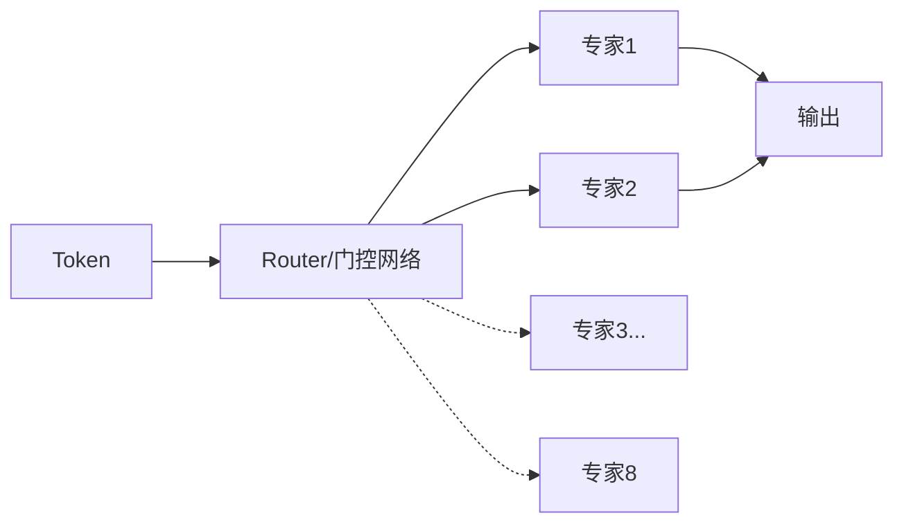

**核心组件**：
- **稀疏 MoE 层**：替代传统 FFN 层，包含若干“专家”（通常 8 个），每个专家是独立的神经网络
- **门控网络/路由器**：决定哪些 Token 发送到哪个专家，通常采用 Noisy Top-K Gating

**稀疏激活**：对于每个 Token，路由网络仅激活 Top-k（通常 1-2 个）专家计算。实现“训练万亿参数，推理百亿计算”。

**负载均衡**：训练损失中引入辅助损失（aux_loss），强制 Router 均匀分配 Token，防止“专家坍塞”。

| 特性 | 说明 |
| :--- | :--- |
| **预训练速度** | 比稠密模型更快（Switch Transformers 达 4×） |
| **推理速度** | 相同参数量下更快（仅激活部分专家） |
| **显存需求** | 高（所有专家需加载到内存） |
| **微调挑战** | 易过拟合，但指令调优效果显著 |

::: tip Switch Transformers
Google 的 Switch Transformers 采用单专家策略（Top-1），减少计算负担和通信成本，同时保持模型质量。[1.6万亿参数模型](https://huggingface.co/google/switch-c-2048)已开源。
:::

#### Mamba（状态空间模型）

挑战 Transformer 统治地位。基于选择性 SSM，推理时 $O(1)$ 状态更新，达到 $O(N)$ 线性时间复杂度。在长序列任务中展现更高吞吐和更低显存。

---

## 2. 数据工程：万亿 Token 的知识库

> **"Garbage In, Garbage Out"**  数据质量是 LLM 性能的决定性因素。

### 2.1 数据处理流水线

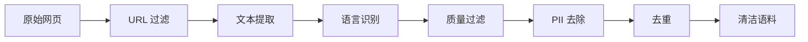

| 步骤 | 技术细节 | 目的 |
| :--- | :--- | :--- |
| **URL 过滤** | 黑名单过滤成人/暴力/垃圾站 | 源头阻断低质内容 |
| **文本提取** | Trafilatura 解析 HTML | 去除导航栏、广告噪声 |
| **语言识别** | FastText (CCNet) | 过滤非目标语言 |
| **质量过滤** | 启发式规则 + BERT 分类器 | 剔除机器生成、乱码 |
| **PII 去除** | 正则匹配 Email/IP/电话 | 隐私保护 |
| **去重** | MinHash LSH + Exact Match | 防止记忆样本，提升泛化 |

::: tip 去重的重要性
模糊去重通过 MinHash 算法识别并去除只有细微差异的重复文档（如转载新闻），对提升 Zero-shot 能力至关重要，也是防止基准测试数据泄漏的关键。
:::

### 2.2 Tokenization 策略

**BPE（Byte-Pair Encoding）**：GPT-4、Llama 3 采用。从字符级开始，迭代合并最频繁字节对。现代实现直接在 UTF-8 字节层面操作，支持零样本处理任何 Unicode（代码、Emoji、小语种）。

**词表大小权衡**：
- 大词表（Llama 3: 128k） 编码效率高，但增加 Embedding/Softmax 参数量
- 小词表  序列更长，训练成本增加

---

## 3. 分布式训练：驯服算力巨兽

> 参考：[DeepSpeed ZeRO 官方文档](https://deepspeed.readthedocs.io/en/latest/zero3.html) | [分布式训练详解](https://zhuanlan.zhihu.com/p/674745061) | [大模型训练技术](https://zhuanlan.zhihu.com/p/18510212574)

训练千亿参数模型需要数千张 GPU 协同工作，单一并行策略已无法满足需求。

### 3.1 多维并行策略（3D/4D Parallelism）


*数据并行（DP）原理示意图*

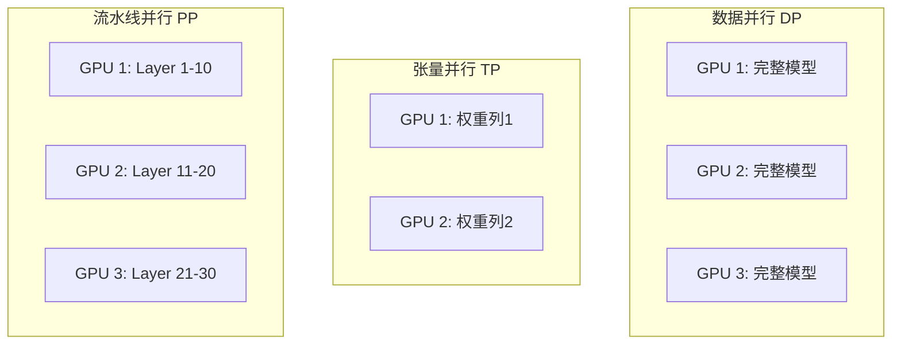


*DDP 使用 Ring-AllReduce 进行梯度同步*

| 策略 | 原理 | 通信特点 | 适用场景 |
| :--- | :--- | :--- | :--- |
| **数据并行 (DP)** | 复制模型，切分 Batch | All-Reduce 梯度 | 基础策略 |
| **张量并行 (TP)** | 切分权重矩阵（Megatron-LM） | 每层 All-Reduce | 节点内 (NVLink) |
| **流水线并行 (PP)** | 不同层放不同设备 | 点对点传输 | 跨节点 |
| **序列并行 (SP)** | 切分序列维度 (DeepSpeed Ulysses) | All-to-All | 超长上下文 |

### 3.2 ZeRO（零冗余优化器）

> DeepSpeed 核心贡献，解决数据并行中模型状态冗余存储问题


*ZeRO 各阶段显存优化效果*

**问题**：传统数据并行中，每个 GPU 都保存完整的模型状态（参数、梯度、优化器状态），造成大量冗余。

**核心思想**：将模型状态分片存储到不同 GPU，需要时再收集。

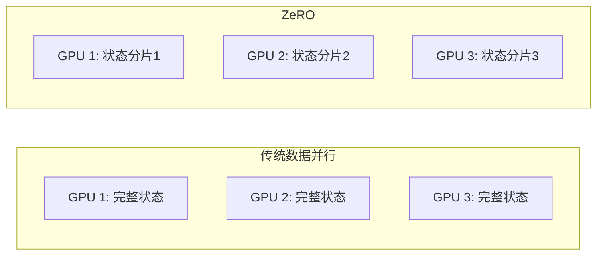


*ZeRO Stage 1/2/3 显存占用对比*

#### ZeRO 三阶段

| 阶段 | 切分内容 | 显存节省 | 说明 |
| :--- | :--- | :--- | :--- |
| **Stage 1** | 优化器状态 | 4× | Adam 的 32-bit 权重、一阶矩、二阶矩分片 |
| **Stage 2** | + 梯度 | 8× | 16-bit 梯度也分片，每个进程仅保留对应分片 |
| **Stage 3** | + 模型参数 | 线性扩展 | 16-bit 参数也分片，前向/反向时自动收集和释放 |

**ZeRO-3 工作流程**：
1. **前向传播**：需要某层参数时，从其他 GPU 收集（All-Gather）
2. **计算完成**：立即释放非本地分片，节省显存
3. **反向传播**：同样按需收集参数，计算梯度后分片存储
4. **优化器更新**：每个 GPU 仅更新自己负责的参数分片

#### ZeRO-Offload 与 ZeRO-Infinity


*ZeRO-Offload 将优化器状态卸载到 CPU*

| 技术 | 说明 |
| :--- | :--- |
| **ZeRO-Offload** | 将优化器状态和梯度卸载到 CPU 内存 |
| **ZeRO-Infinity** | 进一步支持卸载到 NVMe SSD，训练万亿参数模型 |

**ZeRO-Infinity 特性**：
- 支持将参数、梯度、优化器状态卸载到 CPU/NVMe
- 内存中心分块（Memory-Centric Tiling）：将大算子拆分为小块顺序执行
- 无需模型并行即可训练任意大小模型


*Gradient Checkpointing 原理示意*

::: tip DeepSpeed ZeRO 配置示例
```python
# ZeRO Stage 3 配置
ds_config = {
    "zero_optimization": {
        "stage": 3,
        "offload_param": {
            "device": "cpu",  # 或 "nvme"
            "pin_memory": True
        },
        "offload_optimizer": {
            "device": "cpu",
            "pin_memory": True
        },
        "overlap_comm": True,
        "contiguous_gradients": True
    }
}

# 构建超大模型
with deepspeed.zero.Init():
    model = MyLargeModel()
```
:::

### 3.3 激活重算（Activation Checkpointing）

前向传播不保存中间激活值，反向传播时重新计算。

**权衡**：以约 **30% 额外计算**换取 **5-10× 显存节省**

**适用场景**：
- 更大 Batch Size
- 更长序列长度
- 更深网络

### 3.4 混合精度训练

| 精度 | 位宽 | 说明 |
| :--- | :--- | :--- |
| **FP32** | 32-bit | 主权重（Master Weights） |
| **FP16/BF16** | 16-bit | 前向/反向计算 |
| **FP8** | 8-bit | 最新硬件支持（H100） |

**BF16 vs FP16**：
- **BF16**：动态范围大（与 FP32 相同），训练更稳定，无需 Loss Scaling
- **FP16**：精度更高，但需要 Loss Scaling 防止下溢

### 3.5 训练稳定性：Loss Spike

**成因**：AdamW 二阶矩估计问题。训练后期梯度范数变小，遇到"坏数据"导致梯度突增时，全局裁剪阈值未能及时生效。

**解决方案**：
- **AdaGC**：动态调整裁剪阈值
- **Checkpoint 回滚**：跳过导致 Spike 的数据
- **QK-Norm**：在 Query/Key 上加 LayerNorm
- **梯度裁剪**：设置合理的 `max_grad_norm`

### 3.6 分布式训练框架对比

| 框架 | 核心技术 | 优势 | 适用场景 |
| :--- | :--- | :--- | :--- |
| **DeepSpeed** | ZeRO、Offload | 显存效率高、易用 | 通用大模型训练 |
| **Megatron-LM** | 3D 并行 | 极致性能 | 超大规模预训练 |
| **FSDP** | PyTorch 原生 | 生态兼容 | PyTorch 用户 |
| **Colossal-AI** | 异构并行 | 灵活配置 | 研究探索 |

---

## 4. 参数高效微调（PEFT）

全量微调成本高昂且易导致灾难性遗忘。PEFT 允许仅更新极少量参数即可达到媲美效果。

### 4.1 LoRA（低秩适配）

> 参考：[LoRA 原理详解](https://zhuanlan.zhihu.com/p/338817680) | [LoRA 实战指南](https://zhuanlan.zhihu.com/p/454482273) | [GeeksforGeeks LoRA/QLoRA](https://www.geeksforgeeks.org/deep-learning/fine-tuning-using-lora-and-qlora/)

目前最主流的微调技术，通过低秩矩阵分解实现参数高效微调。


*LoRA 与 QLoRA 对比示意图*

**原理**：假设权重更新量 $\Delta W$ 具有低秩特性。冻结预训练权重 $W_0$，注入两个低秩矩阵：

$$W_{new} = W_0 + \Delta W = W_0 + BA \quad (rank \ll d)$$


*Transformer 中的 LoRA 适配器位置*

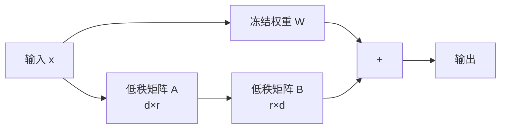

**核心特性**：

| 特性 | 说明 |
| :--- | :--- |
| **参数效率** | 仅更新 0.5%-5% 参数（vs 全量微调 100%） |
| **显存节省** | 减少 70% 显存使用，不存储优化器状态 |
| **零推理延迟** | $BA$ 可合并回 $W_0$，无额外推理成本 |
| **多任务支持** | 不同任务加载不同 LoRA 适配器 |
| **低过拟合风险** | 训练参数少，尤其适合小数据集 |


*全量微调、Adapter 和 LoRA 参数量对比*

**性能对比**：LoRA 在文本分类、摘要、问答等任务上达到接近全量微调的效果（GLUE 分数差距 < 1%），但在数学、编程等复杂领域全量微调仍有优势。

### 4.2 QLoRA

> 参考：[GeeksforGeeks LoRA/QLoRA](https://www.geeksforgeeks.org/deep-learning/fine-tuning-using-lora-and-qlora/)

将 LoRA 与 4-bit 量化结合，进一步降低微调门槛。

**工作原理**：
1. 基座模型以 4-bit 量化格式加载，大幅减少显存占用
2. LoRA 适配器保持高精度（16-bit）训练
3. 仅更新适配器参数，补偿量化误差

| 技术 | 作用 |
| :--- | :--- |
| **NF4 量化** | 4-bit 加载预训练模型，专为正态分布权重设计 |
| **双重量化** | 量化量化常数（scale/offset），进一步压缩存储 |
| **分页优化器** | 显存不足时自动卸载到 CPU |
| **适配器位置** | 建议应用到所有线性 Transformer 层 |

**效果**：
- 单张 48GB 显卡可微调 65B 模型
- 消费级 GPU 可微调数十亿参数模型
- 性能损失可忽略不计，与标准 LoRA 和全量微调精度相当

::: warning 权衡
QLoRA 由于量化/反量化步骤，训练速度略慢于 LoRA，但显存节省极为显著。
:::

### 4.3 微调方法对比

| 方法 | 参数更新 | 资源需求 | 适用场景 |
| :--- | :--- | :--- | :--- |
| **全量微调** | 100% | 极高 | 资源充足，追求最佳 |
| **LoRA/QLoRA** | <1% | 低 | 消费级硬件 |
| **Adapter** | <5% | 中 | 多任务适配 |
| **Prefix Tuning** | <1% | 低 | 特定任务优化 |

---

## 5. 对齐技术：赋予模型价值观

> 参考：[RLHF之PPO、DPO详解](https://www.zhihu.com/tardis/zm/art/717010380) | [DPO原理深度解析](https://zhuanlan.zhihu.com/p/11913305485) | [RLHF技术问答](https://www.zhihu.com/question/658316700)

预训练赋予模型"知识"，对齐赋予模型"指令遵循"能力和安全价值观。

### 5.1 强化学习基础

强化学习（RL）研究智能体（Agent）与环境（Environment）交互的问题，目标是最大化奖励（Reward）。


*图1：强化学习基本框架：智能体与环境交互*

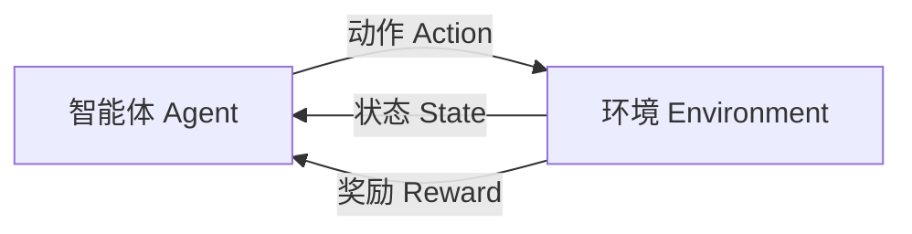

**核心概念**：

| 概念 | 说明 |
| :--- | :--- |
| **状态（State）** | 环境的当前状况，用 $s$ 表示 |
| **动作（Action）** | 智能体采取的行为，用 $a$ 表示 |
| **奖励（Reward）** | 环境对动作的反馈，用 $r$ 表示 |
| **策略（Policy）** | 从状态到动作的映射函数 $\pi(a|s)$ |
| **价值函数（Value）** | 对未来累积奖励的预测 $V(s)$ 或 $Q(s,a)$ |
| **轨迹（Trajectory）** | 状态-动作序列 $\tau = (s_0, a_0, s_1, a_1, ...)$ |

**策略类型**：
- **随机性策略**：$\pi(a|s) = p(a_t = a | s_t = s)$ 输出动作概率分布，采样得到动作
- **确定性策略**：$a^* = \arg\max_a \pi(a|s)$ 直接输出最优动作

**价值函数定义**：

$$V_\pi(s) = \mathbb{E}_\pi \left[ \sum_{k=0}^{\infty} \gamma^k r_{t+k+1} | s_t = s \right]$$

$$Q_\pi(s, a) = \mathbb{E}_\pi \left[ \sum_{k=0}^{\infty} \gamma^k r_{t+k+1} | s_t = s, a_t = a \right]$$

其中 $\gamma$ 为折扣因子，权衡短期与长期奖励。

#### 5.1.1 强化学习 vs SFT

| 对比维度 | SFT（监督微调） | 强化学习 |
| :--- | :--- | :--- |
| **反馈粒度** | 针对单个 Token | 针对整个输出文本 |
| **表达多样性** | 要求确切答案 | 兼顾多样性 |
| **幻觉问题** | 易导致模型强行回答 | 可通过奖励设计让模型学会"拒绝回答" |
| **多轮对话** | 难以考虑整体对话目标 | 可建模多轮交互的累积奖励 |

### 5.2 RLHF（人类反馈强化学习）

ChatGPT 背后的核心技术，分为**奖励模型训练**和**近端策略优化**两个步骤。

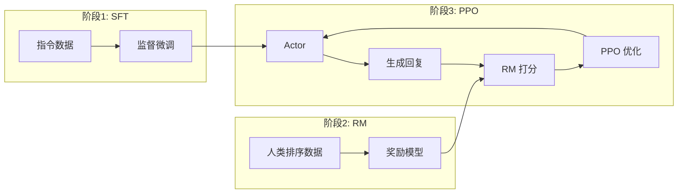

**三阶段流程**：

1. **SFT（监督微调）**：高质量指令数据上监督微调，获得初始策略模型
2. **Reward Modeling**：收集人类偏好排序数据，训练奖励模型
3. **PPO**：用 RM 作为环境反馈，最大化奖励同时 KL 约束防止偏离

#### 5.2.1 奖励模型（Reward Model）

奖励模型模拟人类偏好，为模型训练提供持续的奖励信号。

**输入格式**：包含 chosen（好回答）和 rejected（差回答）的 pair 对

**模型结构**：基于 Transformer 架构，移除最后一个非嵌入层，叠加线性层输出标量奖励值

**损失函数**：
$$\mathcal{L}_{RM} = -\log \sigma(r_\theta(x, y_w) - r_\theta(x, y_l))$$

其中 $r_\theta$ 是奖励模型，$y_w$ 是好回答，$y_l$ 是差回答。目标是让好回答的得分尽可能高于差回答。

#### 5.2.2 PPO（近端策略优化）

PPO 是 OpenAI 广泛使用的强化学习算法，解决了传统策略梯度方法的高方差、低效率、易发散问题。


*图2：PPO 算法实施流程*


*图3：PPO 训练流程详解*

**PPO 涉及 4 个模型**：

| 模型 | 作用 | 是否更新 |
| :--- | :--- | :--- |
| **Policy Model（策略模型）** | 生成模型回复，即 Actor | ✅ 更新 |
| **Reward Model（奖励模型）** | 评估回复质量，输出奖励分数 | ❌ 冻结 |
| **Critic Model（评论模型）** | 预测回复的未来累积收益 | ✅ 更新 |
| **Reference Model（参考模型）** | SFT 模型备份，计算 KL 散度 | ❌ 冻结 |

**PPO 实施流程**：

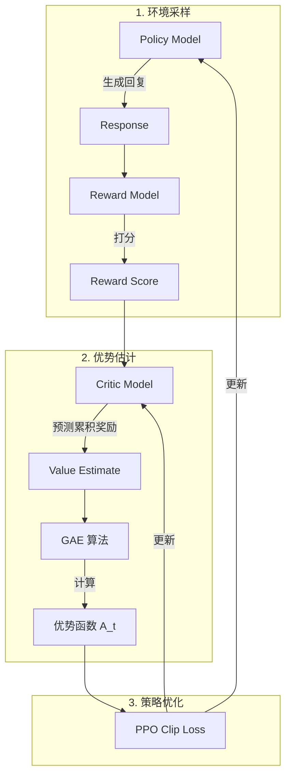

**策略梯度核心公式**：

$$\nabla_\theta J(\theta) = \mathbb{E}_{\tau \sim \pi_\theta} \left[ \sum_{t=0}^{T} \nabla_\theta \log \pi_\theta(a_t|s_t) \cdot A_t \right]$$

其中 $A_t$ 是优势函数，衡量特定动作相比平均动作的优势。

**PPO Clip 目标函数**：

$$L^{CLIP}(\theta) = \mathbb{E}_t \left[ \min \left( r_t(\theta) A_t, \text{clip}(r_t(\theta), 1-\epsilon, 1+\epsilon) A_t \right) \right]$$

其中 $r_t(\theta) = \frac{\pi_\theta(a_t|s_t)}{\pi_{\theta_{old}}(a_t|s_t)}$ 是重要性采样比率，$\epsilon$ 通常取 0.1-0.2。

**RLHF 中的 PPO 优化目标**（带 KL 约束）：

$$\max_{\pi_\theta} \left\{ \mathbb{E}_{x \sim D, y \sim \pi_\theta(y|x)} [r_\phi(x,y)] - \beta \cdot D_{KL}[\pi_\theta(y|x) || \pi_{ref}(y|x)] \right\}$$

**On-Policy vs Off-Policy**：
- **On-Policy**：采样和学习使用同一策略，数据不可复用
- **Off-Policy（PPO）**：分离采样和学习策略，可重复利用历史数据，提升训练效率

**局限**：涉及 4 个模型协同训练，超参敏感，极不稳定，对计算资源要求极高。

### 5.3 DPO（直接偏好优化）

> 2023年斯坦福提出，PPO 的简化版，极大节省训练开销


*图7：PPO 和 DPO 的区别*

DPO 只需加载 2 个模型（Actor + Reference），不需要在线采样数据。

**核心洞察**：RLHF 的优化目标存在显式解，可以将奖励函数与最优策略建立解析映射。

#### 5.3.1 从 PPO 到 DPO 的数学推导

**Step 1：PPO 的最优策略形式**

在 KL 正则化约束下，PPO 的最优策略可以写为：

$$\pi^*(y|x) = \frac{1}{Z(x)} \pi_{ref}(y|x) \exp\left(\frac{1}{\beta} r(x,y)\right)$$

其中 $Z(x) = \sum_y \pi_{ref}(y|x) \exp\left(\frac{1}{\beta} r(x,y)\right)$ 是归一化的分区函数。

**Step 2：重参数化奖励函数**

将上式对数化并重排，可以得到奖励函数的形式：

$$r(x,y) = \beta \log \frac{\pi^*(y|x)}{\pi_{ref}(y|x)} + \beta \log Z(x)$$

注意 $Z(x)$ 只与 $x$ 有关，在计算偏好概率时会被消去。

**Step 3：代入 Bradley-Terry 偏好模型**

偏好数据遵循 Bradley-Terry 模型，其偏好概率为：

$$p(y_1 \succ y_2 | x) = \frac{\exp(r(x, y_1))}{\exp(r(x, y_1)) + \exp(r(x, y_2))}$$

代入重参数化后的 $r(x,y)$，并消去 $Z(x)$，得到：

$$p(y_w \succ y_l | x) = \sigma \left( \beta \log \frac{\pi_\theta(y_w|x)}{\pi_{ref}(y_w|x)} - \beta \log \frac{\pi_\theta(y_l|x)}{\pi_{ref}(y_l|x)} \right)$$

**Step 4：最终 DPO 损失函数**

$$\mathcal{L}_{DPO}(\pi_\theta; \pi_{ref}) = -\mathbb{E}_{(x, y_w, y_l) \sim D}\left[\log \sigma \left(\beta \log \frac{\pi_\theta(y_w|x)}{\pi_{ref}(y_w|x)} - \beta \log \frac{\pi_\theta(y_l|x)}{\pi_{ref}(y_l|x)}\right)\right]$$

**DPO 本质**：将 RLHF 巧妙转化为类似 SFT 的监督学习，隐式学习奖励函数。训练时只需 Actor 和 Reference 两个模型，无需 Reward Model 和 Critic Model。

#### 5.3.2 DPO vs PPO 深度对比

| 维度 | PPO | DPO |
| :--- | :--- | :--- |
| **模型数量** | 4 个（Actor, Critic, RM, Ref） | 2 个（Actor, Ref） |
| **在线采样** | 需要 | 不需要 |
| **奖励模型** | 显式训练 | 隐式包含在策略中 |
| **训练稳定性** | 低（超参敏感） | 高（类似 SFT） |
| **数据效率** | 低（需大量在线数据） | 高（复用偏好数据） |
| **理论完备性** | 原始强化学习框架 | 基于 PPO 等价推导 |
| **实际效果** | 工业界首选（OpenAI、Anthropic） | 开源社区首选 |

::: warning DPO 的局限性
- **离线数据瓶颈**：DPO 依赖预先收集的偏好数据，无法在线探索新策略
- **分布偏移**：当策略偏离参考模型过远时，偏好数据可能不再准确
- **长度偏差**：DPO 可能倾向于生成更长的回复以获得更高分数
:::


<div class="compare-box">
  <div class="compare-item">
    <div class="compare-title">RLHF (PPO)</div>
    <p class="compare-desc">4 个模型协同训练<br>需要在线采样<br>超参敏感，训练不稳定<br>显存需求极高</p>
  </div>
  <div class="compare-vs">VS</div>
  <div class="compare-item highlight">
    <div class="compare-title">DPO</div>
    <p class="compare-desc">仅需 2 个模型<br>离线训练，无需采样<br>类似 SFT 的简单流程<br>开源社区首选</p>
  </div>
</div>

### 5.4 DPO 变种

DPO 因其简单易用迅速成为大模型训练标配，衍生出多种变种：

| 变种 | 特点 | 解决问题 |
| :--- | :--- | :--- |
| **SimPO** | 简化参考模型依赖，使用长度归一化 | 减少计算开销，解决长度偏差 |
| **Step-DPO** | 分步骤优化，每步单独打分 | 提升推理任务表现 |
| **MCTS-DPO** | 结合蒙特卡洛树搜索 | 增强探索能力 |
| **SPO** | 自我对弈优化 | 减少人类标注依赖 |
| **Iterative-DPO** | 迭代式在线采样 | 解决分布偏移问题 |
| **IPO** | 添加正则项防止过拟合 | 提升泛化能力 |
| **KTO** | 仅需二元反馈（好/坏） | 简化数据收集 |

#### Iterative-DPO（迭代式DPO）

2024年 Meta 提出的改进版（[Iterative Reasoning Preference Optimization](https://arxiv.org/pdf/2404.19733)），介于 Online 和 Offline 之间。


*图8：Iterative-DPO 流程*


*图9：Iterative-DPO 两阶段流程*

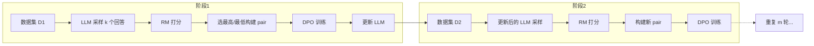

**流程**：
1. 训练 Reward Model
2. 将数据分成 m 份
3. 对每份数据：用当前 LLM 采样 k 个回答 → RM 打分 → 选最高/最低构建 pair 对 → 训练一轮 DPO → 更新 LLM
4. 重复直到所有数据训练完成

**优势**：
- 每轮训练后基于最新模型重新采样，数据质量持续提升
- 介于 Online-Policy 和 Offline-Policy 之间，平衡效率与效果
- 缓解 DPO 的分布偏移问题

#### 对齐技术发展趋势

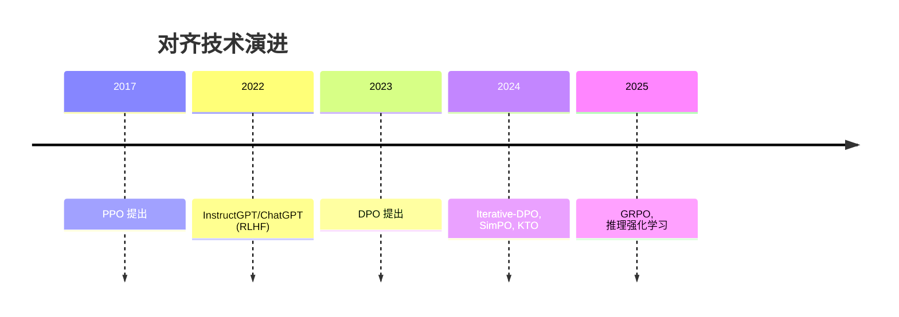

---

## 6. 推理优化：极致速度与吞吐

> 参考：[FlashAttention 详解](https://zhuanlan.zhihu.com/p/676655352) | [Hopsworks FlashAttention](https://www.hopsworks.ai/dictionary/flash-attention) | [FlashAttention GitHub](https://github.com/Dao-AILab/flash-attention) | [vLLM 官方博客](https://blog.vllm.ai/2023/06/20/vllm.html) | [PagedAttention 论文](https://arxiv.org/pdf/2309.06180) | [KV Cache 详解](https://zhuanlan.zhihu.com/p/691067658) | [推理优化综述](https://zhuanlan.zhihu.com/p/638468472)

推理核心目标：降低延迟（Latency）+ 提升吞吐量（Throughput）。

### 6.1 GPU 内存层次

理解推理优化需要先了解 GPU 内存层次：

| 内存类型 | 容量 | 速度 | 说明 |
| :--- | :--- | :--- | :--- |
| **HBM（高带宽内存）** | 大（40-80GB） | 慢 | 存储模型权重、KV Cache |
| **SRAM（片上内存）** | 小（~20MB） | 极快 | 计算时的临时存储 |

**瓶颈本质**：Attention 计算是**内存带宽受限**（Memory-bound）而非算力受限（Compute-bound）。频繁的 HBM ↔ SRAM 数据传输成为性能瓶颈。

### 6.2 FlashAttention

> 由 Tri Dao 等人提出，已成为 LLM 训练和推理的标配技术
> 论文：[FlashAttention: Fast and Memory-Efficient Exact Attention with IO-Awareness](https://arxiv.org/abs/2205.14135)

FlashAttention 已广泛应用于 GPT-3、GPT-4、Llama2、Falcon2、Megatron-LM 等知名 LLM，并集成到 PyTorch 2.0 中。


*FlashAttention 分块计算原理*


*GPU 内存层次：HBM vs SRAM*

#### 6.2.1 为什么需要 FlashAttention

**问题根源**：Transformer 中 Self-Attention 的时间和内存复杂度是序列长度的**二次方** $O(N^2)$，序列过长时算法速度变慢且消耗大量内存。

**标准 Attention 计算**：
$$\mathbf{S} = \mathbf{Q}\mathbf{K}^{\top} \in \mathbb{R}^{N \times N}, \quad \mathbf{P} = \text{softmax}(\mathbf{S}), \quad \mathbf{O} = \mathbf{P}\mathbf{V}$$

标准实现需要将中间矩阵 $\mathbf{S}$、$\mathbf{P}$ 存储在 HBM 中，需要 $O(N^2)$ 内存。

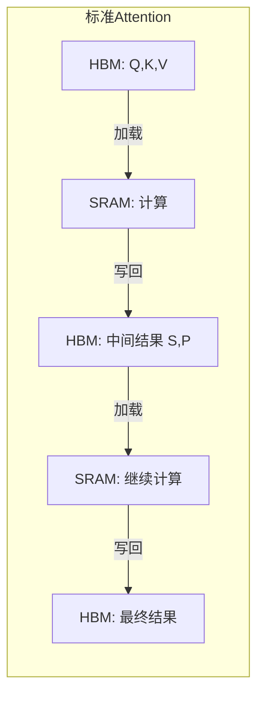

#### 6.2.2 核心技术

| 技术 | 说明 |
| :--- | :--- |
| **Tiling（分块）** | 将 Q、K、V 分成小块，每块可完全放入 SRAM |
| **Kernel Fusion（算子融合）** | 将多个计算步骤合并为单一 CUDA kernel，减少数据传输 |
| **Recomputation（重算）** | 反向传播时重新计算中间结果，用计算换存储 |
| **Online Softmax（在线 Softmax）** | 分块计算 Softmax，无需完整注意力矩阵 |

**分块 Softmax 的数学原理**：

传统 Softmax 需要完整向量，但可以通过引入统计量 $(m, \ell)$ 实现分块计算：

$$m(x) = \max_i x_i, \quad f(x) = [e^{x_1 - m(x)}, \ldots, e^{x_B - m(x)}], \quad \ell(x) = \sum_i f(x)_i$$

对于分块向量 $x = [x^{(1)}, x^{(2)}]$：
$$m(x) = \max(m(x^{(1)}), m(x^{(2)})), \quad \ell(x) = e^{m(x^{(1)}) - m(x)} \ell(x^{(1)}) + e^{m(x^{(2)}) - m(x)} \ell(x^{(2)})$$

#### 6.2.3 FlashAttention 前向过程

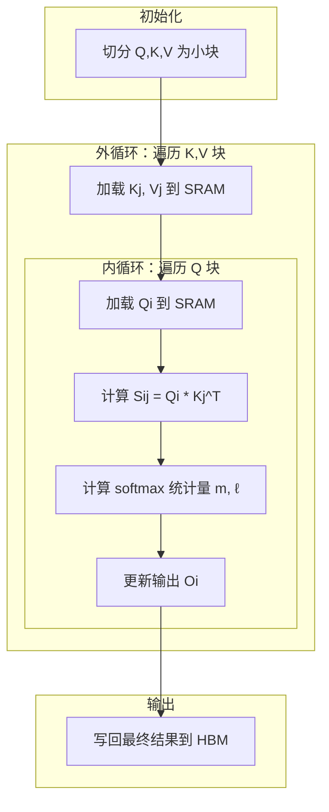

**效果**：
- HBM 读写量从 $O(N^2)$ 降到 $O(N)$
- 训练速度提升 **2-4×**
- 推理延迟降低 **2-4×**
- 支持更长序列（内存效率提升）

::: tip FlashAttention 版本演进
- **FlashAttention-1**：基础分块和融合，2022年发布
- **FlashAttention-2**：优化并行性（交换内外循环），减少 SRAM 读写，速度提升 2×
- **FlashAttention-3**：支持 Hopper 架构（H100），利用 Tensor Core 异步执行
:::

### 6.3 KV Cache

LLM 推理采用自回归解码，每生成一个 Token 都需要之前所有 Token 的 Key 和 Value。


*KV Cache 工作原理*


*FlashAttention V2 并行计算优化*

#### 6.3.1 为什么需要 KV Cache

**问题**：自回归生成时，每生成一个新 Token 都需要对所有历史 Token 计算 Attention。如果每次都重新计算所有 K、V，计算量随序列长度**线性增长**，导致推理效率极低。

**解决方案**：缓存已计算的 K、V 值（KV Cache），避免重复计算。

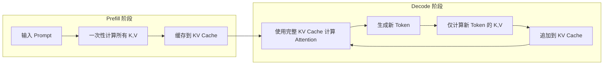

#### 6.3.2 推理两阶段

| 阶段 | 说明 | 特点 |
| :--- | :--- | :--- |
| **Prefill（预填充）** | 处理输入 Prompt，计算并缓存所有 K、V | 计算密集，可并行 |
| **Decode（解码）** | 每步仅计算新 Token 的 K、V，追加到缓存 | 内存密集，顺序执行 |

#### 6.3.3 KV Cache 大小估算

$$\text{KV Cache} = 2 \times L \times H \times D \times S \times \text{dtype\_size}$$

其中：L=层数，H=注意力头数，D=头维度，S=序列长度

**示例**：LLaMA-13B（L=40, H=40, D=128）在序列长度 2048 时：
$$\text{KV Cache} = 2 \times 40 \times 40 \times 128 \times 2048 \times 2 \text{bytes} \approx 1.7 \text{GB}$$

#### 6.3.4 传统 KV Cache 的问题

1. **内存碎片**：序列长度动态变化，难以预分配连续内存
2. **过度预留**：为支持最大序列长度，预留大量未使用内存
3. **显存浪费**：传统方案导致 **60%-80%** 显存浪费
4. **批处理受限**：无法高效处理多个并发请求

### 6.4 PagedAttention 与 vLLM

> UC Berkeley 开发，已成为 LLM 推理服务的事实标准
> 论文：[Efficient Memory Management for Large Language Model Serving with PagedAttention](https://arxiv.org/pdf/2309.06180)

vLLM 是一个开源的高性能 LLM 推理和服务库，已部署在 LMSYS Chatbot Arena 和 Vicuna Demo，每天处理数万请求。


*vLLM 吞吐量对比：A100 GPU*


*PagedAttention：KV Cache 分块存储*


*PagedAttention 请求生成过程*

#### 6.4.1 PagedAttention 核心思想

借鉴操作系统虚拟内存分页机制，解决 KV Cache 的内存管理问题：

- **传统方式**：为每个序列预分配连续内存，导致碎片和浪费
- **PagedAttention**：将 KV Cache 分成固定大小的块，按需分配非连续物理内存

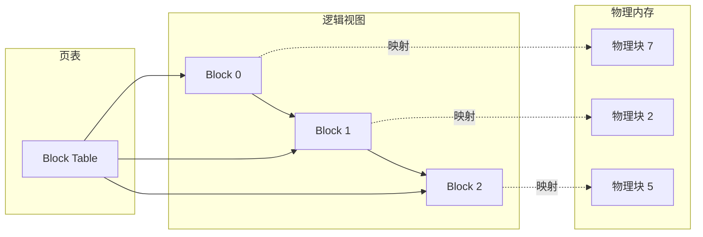

**PagedAttention 机制**：

| 概念 | 类比 | 说明 |
| :--- | :--- | :--- |
| **Block（块）** | 内存页 | 固定大小，存储若干 Token 的 K、V |
| **Token** | 字节 | 最小存储单位 |
| **Sequence（序列）** | 进程 | 拥有自己的逻辑地址空间 |
| **Block Table（页表）** | 页表 | 逻辑块到物理块的映射 |

#### 6.4.2 关键优势

1. **近乎零浪费**：仅最后一个块可能有碎片，浪费 < 4%
2. **动态分配**：按需分配物理块，无需预留
3. **内存共享**：并行采样时共享 Prompt 的 KV Cache（Copy-on-Write）
4. **高效批处理**：可同时处理更多请求

#### 6.4.3 内存共享机制

在并行采样（Parallel Sampling）场景中，多个输出序列共享同一个 Prompt：

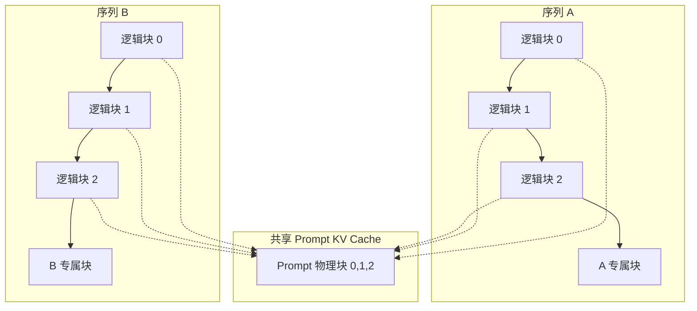

**Copy-on-Write**：当某序列需要修改共享块时，才复制一份新块，最大化内存复用。

#### 6.4.4 vLLM 性能

| 对比 | 吞吐量提升 |
| :--- | :--- |
| vs HuggingFace Transformers | **14-24×** |
| vs HuggingFace TGI | **2.2-3.5×** |

**内存共享效果**：并行采样和 Beam Search 内存占用降低 **55%**，吞吐提升 **2.2×**

**实际部署数据**（LMSYS）：
- 日均处理 **3万+** 请求，峰值 **6万**
- GPU 使用量减少 **50%**
- 支持 Vicuna、LLaMA、Dolly、StableLM 等多种模型

### 6.5 投机采样（Speculative Decoding）

**原理**：利用 LLM 推理是"访存密集型"特点，用小模型加速大模型。

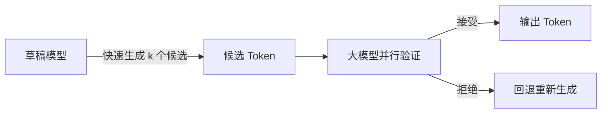

**工作流程**：
1. **草稿阶段**：小模型（如 7B）快速自回归生成 k 个候选 Token
2. **验证阶段**：大模型（如 70B）一次前向传播并行验证所有候选
3. **接受/拒绝**：根据概率分布决定接受多少候选

**效果**：
- 延迟降低 **2-3×**
- 数学上保证与大模型输出**完全一致**
- 草稿越准确，加速比越高

### 6.6 推理引擎对比

| 特性 | vLLM | TensorRT-LLM | TGI | SGLang |
| :--- | :--- | :--- | :--- | :--- |
| **核心技术** | PagedAttention | Kernel Fusion, FP8 | Router 架构 | RadixAttention |
| **优势** | 高并发、易用 | 极致低延迟、N卡优化 | 生态兼容 | 结构化生成 |
| **部署难度** | 低 | 高 | 中 | 低 |
| **吞吐量** | 极高 | 高 | 中 | 极高 |
| **开源** | ✅ | ✅ | ✅ | ✅ |

::: tip vLLM 快速开始
```bash
# 安装
pip install vllm

# 启动 OpenAI 兼容服务
python -m vllm.entrypoints.openai.api_server --model lmsys/vicuna-7b-v1.3
```
:::

---

## 7. 模型压缩与部署

### 7.1 量化技术

| 方法 | 精度 | 速度提升 | 质量损失 |
| :--- | :--- | :--- | :--- |
| **FP16** | 16-bit | 2 | 几乎无 |
| **INT8** | 8-bit | 4 | 轻微 |
| **INT4/NF4** | 4-bit | 8 | 可接受 |
| **GPTQ/AWQ** | 4-bit | 8 | 优化后极小 |

### 7.2 知识蒸馏

大模型（Teacher）指导小模型（Student）学习，保留核心能力同时大幅减少参数量。

---

##  学习路线与资源

<div class="learning-path">
  <div class="path-step step-1">
    <div class="step-num">1</div>
    <div class="step-title">基础入门</div>
    <ul>
      <li><a href="/llms/training/data">数据处理</a></li>
      <li><a href="/llms/training/sft">SFT 监督微调</a></li>
      <li><a href="/llms/training/lora">LoRA 高效微调</a></li>
    </ul>
  </div>
  <div class="path-arrow"></div>
  <div class="path-step step-2">
    <div class="step-num">2</div>
    <div class="step-title">对齐技术</div>
    <ul>
      <li><a href="/llms/training/rlhf">RLHF 对齐</a></li>
      <li><a href="/llms/training/dpo">DPO 直接偏好</a></li>
      <li><a href="/llms/training/eval">模型评估</a></li>
    </ul>
  </div>
  <div class="path-arrow"></div>
  <div class="path-step step-3">
    <div class="step-num">3</div>
    <div class="step-title">生产部署</div>
    <ul>
      <li><a href="/llms/training/serving">推理优化</a></li>
      <li>量化与蒸馏</li>
      <li>分布式推理</li>
    </ul>
  </div>
</div>

###  深度系列文章

| 模块 | 文章 | 简介 |
| :--- | :--- | :--- |
| **全流程** | [一个大模型落地的技术详解](https://dd-ff.blog.csdn.net/article/details/150265751) | 预训练微调蒸馏强化学习 |
| **数据** | [垃圾进垃圾出：高质量微调数据集](https://dd-ff.blog.csdn.net/article/details/152254276) | 数据清洗、格式、质量评估 |
| **PEFT** | [大模型微调的省钱秘笈](https://dd-ff.blog.csdn.net/article/details/153965724) | LoRA/Adapter/Prefix 对比 |
| **对齐** | [从 PPO 到 DPO](https://dd-ff.blog.csdn.net/article/details/153269912) | RLHF 三阶段流程详解 |
| **部署** | [压缩巨兽：模型压缩底层科学](https://dd-ff.blog.csdn.net/article/details/150932519) | 量化/剪枝/蒸馏技术 |
| **词表** | [词表构建技术深度剖析](https://dd-ff.blog.csdn.net/article/details/155357751) | BPE/Unigram、词表扩充 |

###  开源框架

| 框架 | 说明 |
| :--- | :--- |
| [Hugging Face TRL](https://huggingface.co/docs/trl) | RLHF/DPO 训练库 |
| [LLaMA-Factory](https://github.com/hiyouga/LLaMA-Factory) | 一站式微调框架 |
| [DeepSpeed](https://github.com/microsoft/DeepSpeed) | 分布式训练优化 |
| [Megatron-LM](https://github.com/NVIDIA/Megatron-LM) | NVIDIA 大规模训练框架 |
| [vLLM](https://github.com/vllm-project/vllm) | 高性能推理引擎 |

###  重要论文

| 论文 | 说明 |
| :--- | :--- |
| [Attention Is All You Need](https://arxiv.org/abs/1706.03762) | Transformer 原始论文 |
| [RoPE](https://arxiv.org/abs/2104.09864) | 旋转位置编码 |
| [LoRA](https://arxiv.org/abs/2106.09685) | 低秩适配 |
| [InstructGPT](https://arxiv.org/abs/2203.02155) | RLHF 经典论文 |
| [DPO](https://arxiv.org/abs/2305.18290) | 直接偏好优化 |
| [FlashAttention](https://arxiv.org/abs/2205.14135) | 高效注意力计算 |
| [Mamba](https://arxiv.org/abs/2312.00752) | 状态空间模型 |

---

> **注**：本文基于 2024-2025 年行业前沿研究整理。LLM 技术栈仍在快速演进中。
