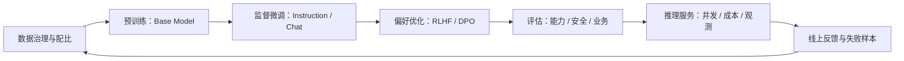

# LLM 训练全景

<LearningObjectives :items="[
  '能够把一个模型从预训练、监督微调、偏好优化、评估到推理服务拆成可观察、可回滚的工程阶段。',
  '能够判断什么时候需要全量训练、SFT、LoRA/PEFT、RLHF、DPO 或只做数据与提示优化。',
  '能够设计训练数据、偏好数据、评估集与 serving 指标，让模型质量改进不只停留在主观“感觉更好”。'
]" />

## 这个模块解决什么问题

LLM 训练不是“把更多数据喂给更大的模型”这么单一。理解模型时可参考 Base、Instruct、Chat 等命名，但这些名称不是强制的训练阶段：Base 模型从大规模语料中学习语言与世界统计规律；Instruct 模型通过监督微调学习按指令输出；面向聊天的模型可通过多轮 SFT、偏好优化和安全数据改善交互，不一定都经过同一种 RLHF 流程。今天的训练工程通常还会把推理服务、评估和反馈回流纳入同一条闭环，因为模型上线后暴露的失败样本会反过来决定下一轮数据、微调和防护策略。

最容易混淆的是“预训练能力”和“后训练行为”。预训练决定了模型的语言、知识、推理和迁移底座；SFT 让模型知道“用户问我时应该怎么答”；RLHF、DPO 等偏好优化让模型在多个可行回答之间选择更符合人类偏好的那个；serving 则决定同样的模型在真实延迟、并发、成本和上下文长度下能否稳定提供服务。一个模型如果知识不足，单靠偏好优化补不回来；一个模型如果基础能力够用但总是不按格式输出，可能只需要高质量 SFT 数据；一个模型如果答案正确但风格冒犯或风险边界差，就要引入偏好数据、安全评估和拒答策略。

“alignment tax”提醒我们：对齐并不是免费午餐。偏好优化可能改善有帮助性、真实性和安全性，也可能让模型在某些开放任务上变得保守、冗长或回避。InstructGPT 论文展示了人类反馈微调的价值，但它同时说明评估必须覆盖帮助性、真实性、无害性和任务能力，而不是只看一个总分。DPO 论文把偏好优化改写成一个更直接的分类式目标，减少显式训练奖励模型和在线 RL 的复杂度；但它仍依赖成对偏好数据、参考模型和良好的评估闭环，并不意味着“有 chosen/rejected 就能自动变强”。

因此，本模块把训练看成一套工程控制系统：数据决定上限，训练目标决定行为，评估决定方向，serving 决定能否落地。你学完后应该能回答四个问题：要改的是能力还是行为？数据格式和标注是否支撑这个目标？偏好优化是否真的优于更便宜的 SFT 或提示改造？上线后如何确认模型没有在安全、事实性、延迟和成本上退化？

## 核心工作流


```mermaid
flowchart LR
  Data[数据治理与配比] --> Pretrain[预训练：Base Model]
  Pretrain --> SFT[监督微调：Instruction / Chat]
  SFT --> Preference[偏好优化：RLHF / DPO]
  Preference --> Eval[评估：能力 / 安全 / 业务]
  Eval --> Serving[推理服务：并发 / 成本 / 观测]
  Serving --> Feedback[线上反馈与失败样本]
  Feedback --> Data
```

这条链路里的每个节点都要有可追踪产物。数据阶段需要记录来源、授权、去重、质量规则、采样配比和过滤策略；预训练阶段需要记录 tokenizer、上下文长度、训练目标、checkpoint、训练曲线和恢复策略；SFT 阶段需要记录指令模板、messages 格式、系统提示、人工或合成数据来源；偏好优化阶段需要记录 chosen/rejected 构造方式、标注指南、一致性检查、参考模型和 KL/保守性约束；评估阶段需要把通用能力、业务任务、安全红队、格式遵循和回归样本分开；serving 阶段则关注吞吐、延迟、KV cache、batching、量化、拒答与监控。

一个最小但有用的训练样本不应该只存“问题和答案”。为了让后续 SFT、DPO 和评估能复用，建议把数据从一开始就组织成带来源、目标和风险标签的结构：

```json
{
  "messages": [
    { "role": "system", "content": "你是面向内部知识库的严谨助手。" },
    { "role": "user", "content": "这份模型评估报告应该怎么看？" }
  ],
  "chosen": "先确认评估目标，再看数据集覆盖、指标、失败样本和线上回归风险。",
  "rejected": "只要总分高就说明模型更好，可以直接上线。",
  "metadata": {
    "source": "human_reviewed_eval_playbook",
    "task": "evaluation_reasoning",
    "risk": ["overclaiming", "deployment"]
  }
}
```

这份样本可以用于 SFT 的目标回答，也可以转成 DPO/RLHF 的偏好对；`metadata` 又能帮助你按任务、风险和来源做切分。对既定基座的适配实验，数据清洗与采样是应优先检查的变量：脏数据会让模型学会错误风格，重复数据会放大偏见，未隔离的评估样本会制造虚假的进步，线上日志如果直接回流训练还可能把模型自己的错误再训练进去。

## 关键概念

| 概念 | 它解决什么 | 使用时要警惕 |
| --- | --- | --- |
| 预训练 | 通过大规模自监督学习建立通用语言与知识底座。 | 成本最高，数据授权、去重、污染和训练稳定性是核心风险。 |
| SFT | 用高质量指令-回答样本让模型学会任务格式、语气和工作流。 | 数量不等于质量；低质合成数据会把坏格式固化进模型。 |
| LoRA / PEFT | 冻结底座参数，只训练低秩适配器或少量增量参数，降低显存与实验成本。 | 适合领域适配和快速迭代，不自动解决基础能力不足。 |
| RLHF | 用人类偏好训练奖励模型，再用强化学习优化策略模型。 | 流程复杂，奖励黑客、标注一致性和能力回退都要评估。 |
| DPO | 直接用偏好对优化模型相对参考模型更偏向 chosen 的概率。 | 仍依赖偏好数据质量；不是省掉评估和安全审查的捷径。 |
| 评估 | 把能力、事实性、安全、格式、业务成功率和回归风险量化。 | 单一榜单或主观体验容易误导；要保留失败样本和人类校准。 |
| Serving | 让模型在真实流量下满足延迟、吞吐、成本和可靠性要求。 | 推理优化会改变上下文、采样、量化和并发行为，需要回归测试。 |

## 从失败样本选择训练目标

| 失败证据 | 优先实验 | 暂不升级的条件 |
| --- | --- | --- |
| 事实变更或证据缺失 | RAG / 数据更新 | 证据未进入上下文前，训练无法验证根因 |
| 规则明确但格式反复失误 | Prompt 基线 → SFT | 没有一致示范与可自动验收的格式规范 |
| 多个答案都可用但偏好不同 | SFT 基线 → DPO | 标注者不能稳定解释偏好 |
| 当前策略需要探索，结果可评分 | 在线 RL 与离线偏好对照 | 奖励模型未校准或 rollout 预算不足 |
| 质量合格但服务太慢 | Serving 压测与优化 | 没拆开排队、prefill、decode 就更换模型 |

LoRA 是参数更新方式，能用于 SFT 或偏好训练，不能与 SFT/DPO 作为同一层级的互斥方法比较。每次实验只变动一个主要因素，先固定基线和发布门槛，再增加复杂度。

## 推荐学习顺序

1. 先读 [训练数据](/llms/training/data)，理解数据来源、清洗、去重、混合比例、合成数据和评估隔离。
2. 再读 [监督微调](/llms/training/sft)，把 messages 格式、指令模板、loss mask、训练曲线和失败样本分析跑通。
3. 接着读 [DPO](/llms/training/dpo) 与 [RLHF](/llms/training/rlhf)，比较直接偏好优化和奖励模型 + 强化学习的成本、收益和风险。
4. 然后读 [LoRA 与高效微调](/llms/training/lora)，学习如何用 PEFT 降低实验门槛，并判断 adapter 合并、量化和部署边界。
5. 最后读 [模型评估](/llms/training/eval) 与 [推理服务](/llms/training/serving)，把离线指标、线上监控、回归测试、vLLM/PagedAttention 这类 serving 优化放进同一套发布流程。

一条实用路线是先做小规模 SFT baseline：选 200 到 1000 条高置信样本，保留严格验证集，用固定 prompts 和人工 rubric 对比未微调、全量 SFT（预算允许时）、LoRA-SFT 三组结果。只有当失败样本显示“答案之间存在稳定偏好，但 SFT 难以学到”时，再引入 DPO 或 RLHF。不要为了追技术名词而跳过数据审查；训练系统最昂贵的 bug 往往不是代码崩了，而是你在几天后才发现评估集被训练数据污染。

## 实践检查点

- 是否为每个数据集记录来源、授权、清洗规则、采样比例、版本和可删除路径？
- 是否把训练集、验证集、偏好集、红队集和线上回归集分开，并检查过语义重复或模板泄漏？
- SFT 失败时，是否能区分是格式不遵循、知识不足、推理错误、拒答策略过度，还是样本标签本身不一致？
- 偏好优化前，是否做过标注者一致性检查、chosen/rejected 长度偏差检查和安全失败样本抽样？
- serving 上线前，是否用真实上下文长度、批量大小、采样参数和量化配置跑过回归，而不是只测单条 demo？
- 是否把线上低分回答、用户纠错、拒答争议和工具调用失败纳入下一轮 eval，而不是直接纳入训练？

一个推荐的训练实验记录表至少包含：模型版本、数据版本、训练目标、超参数、评估集版本、关键指标、失败样本链接、人工评审结论、serving 配置和回滚策略。这样做看起来笨，却能避免“某次训练变好了，但没人知道为什么”的黑盒状态。OpenAI 的评估最佳实践也强调 scoped tests、真实分布、日志、自动化和人类校准；这些原则同样适用于开源模型微调与私有模型训练。

## 场景自测

先说出你的诊断与验收方法，再展开答案。

<details>
<summary>QLoRA 显存仍不足，继续减小 r 是最佳办法吗？</summary>

先拆显存占用。r 主要影响适配器参数与其优化器状态；长序列激活、微批量、底座存储和训练工作区也可能主导峰值。固定有效 batch，分别试序列长度、微批量与 checkpointing，并观察峰值和任务质量，不能从参数占比推导总显存。参见[LoRA](/llms/training/lora)。

</details>

<details>
<summary>有稳定偏好对、没有可靠自动判题器，应该直接转 GRPO 吗？</summary>

先比较 SFT 基线与 DPO。GRPO 需要当前策略的多次采样及可信奖励；把一个不稳定的 LLM 评分器接上并不会自动得到可验证奖励。若引入在线 RL，应独立校准奖励并核算 rollout 成本。参见[RLHF 与可验证奖励](/llms/training/rlhf)。

</details>

<details>
<summary>代码任务的训练奖励上涨，隐藏测试通过率下降，下一步是什么？</summary>

先暂停扩大训练并审查奖励捷径：测试是否泄漏、是否只检查格式、超时与异常是否算对、是否允许危险执行。用隔离的判题环境、独立留出题和固定生成预算核验，再决定改 verifier、数据或训练配置。训练奖励不是发布指标。参见[模型评估](/llms/training/eval)。

</details>

## 版本与边界

截至 2026-10-08，本轮按链接的一手资料复核工程边界；外部 API、GPU 训练与部署示例未实跑。训练与后训练的主线比较清晰：Transformer 仍是语言模型底座的核心结构；SFT、偏好优化与可验证奖励 RL 对应不同训练信号；PEFT/LoRA 则是参数更新方式，能与这些目标组合；vLLM/PagedAttention 等 serving 技术让高并发推理更可控；评估正在从“看榜单”转向“任务级持续评估”。但模型训练生态变化极快，尤其是合成数据、偏好优化算法、多机训练框架、推理引擎和量化方法。本文避免给出“当前最强模型”或“唯一最佳训练 recipe”这样的结论，所有具体选择都应以日期、数据、模型规模、成本和评估证据限定。

训练也不是所有问题的答案。如果问题来自 RAG 召回失败、Prompt 约束不清、产品流程缺少权限校验，微调只会把错误埋得更深。一个健康的决策顺序是：先确认任务和失败样本；能用数据清洗、检索、提示、工具或产品规则解决的，不急着训练；确实需要模型行为改变时，再选择 SFT、LoRA、DPO 或 RLHF，并把评估和回滚作为训练任务的一部分。

<SourceList :items="[
  { title: 'Attention Is All You Need', href: 'https://arxiv.org/abs/1706.03762', note: 'Transformer 原始论文，理解现代语言模型训练底座。' },
  { title: 'Training language models to follow instructions with human feedback', href: 'https://arxiv.org/abs/2203.02155', note: 'InstructGPT 论文，覆盖 SFT、奖励模型和 RLHF 对齐流程。' },
  { title: 'LoRA: Low-Rank Adaptation of Large Language Models', href: 'https://arxiv.org/abs/2106.09685', note: 'LoRA 原始论文，说明冻结底座并注入低秩可训练矩阵。' },
  { title: 'Hugging Face PEFT documentation', href: 'https://huggingface.co/docs/peft/en/index', note: 'PEFT 官方文档，覆盖高效微调方法、配置和集成。' },
  { title: 'Direct Preference Optimization', href: 'https://arxiv.org/abs/2305.18290', note: 'DPO 论文，说明直接从偏好对优化语言模型。' },
  { title: 'Hugging Face TRL documentation', href: 'https://huggingface.co/docs/trl/en/index', note: 'TRL 官方文档，包含 SFT、DPO、Reward、RLOO 等 trainer。' },
  { title: 'Efficient Memory Management for Large Language Model Serving with PagedAttention', href: 'https://arxiv.org/abs/2309.06180', note: 'vLLM/PagedAttention 论文，理解推理服务中的 KV cache 管理。' },
  { title: 'vLLM documentation', href: 'https://docs.vllm.ai/en/latest/', note: 'vLLM 官方文档，覆盖 serving、OpenAI-compatible API、优化和集成。' },
  { title: 'OpenAI evaluation best practices', href: 'https://developers.openai.com/api/docs/guides/evaluation-best-practices', note: '官方评估实践，强调任务级评估、日志、自动化和人类校准。' }
]" />
