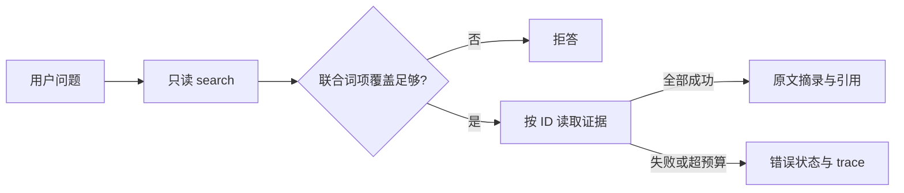

# 可运行案例：从 RAG 到工具工作流与 MCP

先跑一个能解释每一步的知识助手，再考虑接入模型。这个案例提供 10 份虚构中文文档、20 个带标准证据的问题、只读工具、完整 trace 和离线评估；核心仅用 Python 标准库，不需要 API key。

配套源码和固定样本位于仓库的 `examples/knowledge-assistant/`，其中 README 包含完整依赖与运行说明。从仓库根目录执行：

```bash
python3 examples/knowledge-assistant/main.py demo
```

需要 Python 3.10+。本次在 macOS ARM64 的 Python 3.12.12、3.14.3 上运行核心检查，并在 Python 3.12.12 上运行可选 MCP 集成。

::: warning 先明确演示边界
本例实现的是**词法检索 + 原文摘录 + 确定性工具工作流**。它没有 embedding、向量数据库或 LLM，也不会让模型自主规划。MCP 适配器使用真实协议和独立进程，但接入协议不会让固定工作流自动成为智能体。
:::

## 学习目标与验收

完成这个案例后，你应该能定位“找不到证据”“证据被门槛丢弃”“工具调用失败”和“回答缺条件”分别发生在哪一步，并能用相同样本比较改动前后的结果。

| 学习目标 | 实际验收方式 |
| --- | --- |
| 理解检索与回答的证据边界 | 回答中的片段 ID 能还原到文档、段落和分片；原文没有答案时观察拒答 |
| 理解 Agent 运行时的职责 | 参数白名单、只读工具、调用预算、失败状态与 trace 都由程序执行 |
| 理解 MCP 的作用 | 启动独立 server，用客户端发现和调用工具，验证非法参数被拒绝 |
| 理解离线评估的分层 | 分别观察候选召回、最终证据召回、引用精确率和任务成功率 |

## 第一步：观察数据、切分与检索

`data/documents/` 中的 10 份文档描述虚构的「星河公共学习中心」：开放时间、办卡、借阅、续借、归还、研讨室、打印、访客网络、无障碍服务和活动报名。数据不包含真实身份或凭证。`data/queries.json` 中有 16 个有答案问题与 4 个无答案问题；有答案问题包含 `gold_evidence` 和必须出现的事实字符串。

原文按空行分段，长段每 180 个字符分片，得到本版本的 20 个片段。比如：

```text
loan#p001s001
借阅期限为 21 天，从借出次日开始计算。
```

其中 `p001` 是段落编号，`s001` 是段内分片。代码还保留段内字符范围。ID 只在固定语料版本内稳定；新增段落后应重新标注证据，并记录评估输出的语料 SHA-256。

检索提取中文相邻双字词项和小写英数词，再使用 IDF 加权的查询词项覆盖排序。它既不是 BM25，也没有语义嵌入；分数不代表正确概率。阅读 [检索策略](/llms/rag/retrieval) 时，可以把这个实现当作能够逐词核对的起点。

## 第二步：运行可追溯的回答与拒答

```bash
python3 examples/knowledge-assistant/main.py ask '借阅期限是多久？'
python3 examples/knowledge-assistant/main.py ask '借阅押金是多少？'
```

第一条命令的主要输出：

```text
状态：answered / 词项覆盖率：1.000
检索到的原文摘录（未作推断）：
[loan#p001s001] 借阅期限为 21 天，从借出次日开始计算。
工具 trace：
  1. search ... → ok
  2. read_evidence ... → ok
```

第二条命令会返回 `refused`，原因是资料没有借阅押金信息，联合词项覆盖率只有 0.333。实现先检索前 3 个候选，再选择能新增词项覆盖的片段；覆盖率不足 0.60 时拒答，满足门槛时才重新读取证据并逐字摘录。

这个拒答门槛只是启发式。同样关键词可以出现在不相关语境里，正确证据也可能因同义改写被误拒绝。不能把“程序返回 answered”解释为经过语义核验的答案；下方评估保留了两个误拒答案例。

## 第三步：检查工具工作流的边界



`ToolRunner` 的白名单只有 `search` 和 `read_evidence`。前者拒绝空查询、超长查询、非法 limit 和额外字段；后者只能读取内置索引中的片段 ID，没有任意文件路径、网络请求、命令执行或 `eval` 能力。

每次调用尝试都计入预算，包括失败调用。默认最多 4 次，恰好覆盖一次检索与最多三次证据读取；如果读取未完成，工作流返回错误，避免把半份结果当完整答案。trace 保留步骤、工具名、参数、状态、结果和错误代码。预算只约束一次 `ask` 工作流，可选 MCP 的独立工具调用尚无会话级配额。

```bash
python3 examples/knowledge-assistant/main.py ask '借阅期限是多久？' --json
python3 -m unittest discover -s examples/knowledge-assistant/tests -v
```

当前 25 项测试覆盖切分位置、正常问答、近似关键词无答案、未知工具、非法参数、路径穿越式 ID、失败调用预算、空样本分母、重复证据 ID，以及 CLI 跨工作目录和不同 hash seed 的复现。

这部分对应 [工具调用](/llms/agent/tool-calling) 和 [Agent 评估](/llms/agent/evaluation-monitoring) 中的运行时约束。后续若换成 LLM 决策工具，仍要保留这些程序边界；文档中的指令应当是待处理数据，不能借模型决策绕过工具权限。

## 第四步：运行并解释离线评估

```bash
python3 examples/knowledge-assistant/main.py evaluate
python3 examples/knowledge-assistant/main.py evaluate --json
```

JSON 报告包含配置、语料 hash、逐题候选、最终引用、回答、trace 和失败分类。本次结果还保存在源码目录的 `baseline-report.json`，不是编造的性能目标。

| 项目 | 2026-10-08 实测 |
| --- | --- |
| 有答案 / 无答案问题数 | 16 / 4 |
| Recall@3 / MRR@3 / NDCG@3 | 1.0000 / 1.0000 / 1.0000 |
| 最终证据召回率 | 0.8750 |
| 引用精确率 | 1.0000，分母为 14 个有引用的问题 |
| 有答案任务成功率 | 14/16 = 0.8750 |
| 无答案拒答准确率 | 4/4 = 1.0000 |
| 总任务成功率 | 18/20 = 0.9000 |

`q11：无障碍入口在哪里？` 和 `q14：周一能去看书吗？` 都检索到了正确证据，却没有通过词项覆盖门槛。于是候选召回率为 1.0，问答仍然失败。这两个失败用来展示：调整检索器未必能解决所有错误，可能需要改进可回答性判断或查询处理。

检索指标按片段 ID 保序去重，仅对有答案问题取宏平均；无答案相关集为空，返回 `null` 并另评拒答。有答案却没检索到证据记 0。无最终引用时，引用精确率为 `null`，同时报告其有效样本数，避免用大量拒答抬高表观质量。公式与边界详见 [评估指标口径](/reference/metrics) 和 [RAG 评估](/llms/rag/evaluation)。

“任务通过”在本例中指：有答案时完整引用 gold evidence 且包含规定事实字符串；无答案时返回拒答。这不衡量语言生成质量，也不等于模型事实正确性。20 条数据与实现共同设计，是开发回归集；更换模型或准备上线时，应增加独立测试集、近似无答案、矛盾证据、权限变化和恶意内容等场景。

## 第五步：通过真实 MCP stdio 访问同一能力

可选适配器固定 FastMCP **2.12.5**，依赖清单固定了 Python 3.12 环境解析到的传递版本。这个版本是可复现教学基线，在线 FastMCP 文档可能已介绍不同版本；本次依据 [v2.12.5 源码](https://github.com/jlowin/fastmcp/tree/v2.12.5) 并通过真实调用验证。[官方传输文档](https://gofastmcp.com/clients/transports) 解释了 stdio 子进程通信方式。

安装可选依赖需要网络；运行示例时使用本地管道，不调用模型或外部业务服务。已安装 uv 时，从仓库根运行：

```bash
uv run --no-project --python 3.12 \
  --with-requirements examples/knowledge-assistant/requirements-mcp.txt \
  python examples/knowledge-assistant/mcp_client.py
```

`--no-project` 避免把案例依赖加入仓库原有 Python 环境。不使用 uv 的独立虚拟环境命令见源码 README。

客户端用当前解释器启动固定 server 文件，调用 `tools/list` 发现 `search`、`read_evidence`、`ask`。前两个展示检索和证据读取；`ask` 则在 server 内运行前面相同的固定工作流。所有工具使用严格 `request` 对象，例如：

```json
{"request": {"query": "借阅期限是多久？", "limit": 3}}
```

客户端会验证正常检索、引用回答、无答案拒答，以及 7 类非法调用。预期最后一行为：

```text
MCP stdio check passed: discovery, search, read, answer, refusal, 7 rejected calls.
```

这里只改变了能力的访问方式。真正让模型充当 Agent，还需要提供模型决策回路、工具选择、观察处理与终止条件，并测量新增的不确定性。MCP 的 `readOnlyHint` 也只是说明性提示；实际只读边界由函数实现保证。继续阅读 [MCP 核心概念](/llms/mcp/concepts) 时，注意区分 Host、Client、Server 与工作流本身。

## 失败排查与下一轮实验

| 现象 | 如何定位 |
| --- | --- |
| 原文有答案但被拒绝 | 查看候选是否包含 gold；若包含，再检查 coverage 与最终 evidence |
| 改文档后出现未知 gold ID | 对照新段落与分片重新标注，不要悄悄把未知 ID 当成未命中 |
| 返回 `invalid_arguments` | 检查参数名、类型和范围；布尔值不能当整数 limit |
| 返回 `budget_exceeded` | 阅读 trace 确认调用次数，检查是否出现无意义重试 |
| MCP 找不到模块 | 在可选依赖环境运行客户端；核心命令不需要 FastMCP |
| MCP stderr 出现校验错误 | 集成脚本故意发送非法调用；以最后的 passed 和退出码 0 判断是否为预期拒绝 |
| Authlib 弃用提示 | 固定旧版依赖的已知提示；本次不影响 stdio 验收，升级后需重测 |
| server 启动后一直等待 | stdio 在等待客户端初始化；运行客户端，不要往 server stdout 输出普通日志 |

下一轮只改一个因素：例如更换检索器、改进切分或替换可回答性判断，再比较这份报告。若接入真实 LLM，需要另外评估回答对证据的支持关系、提示注入、费用与延迟。本例没有身份认证、ACL、持久记忆和远程部署配置，这些能力不能从当前 25 个测试或 20 条回归数据中推断出来。
